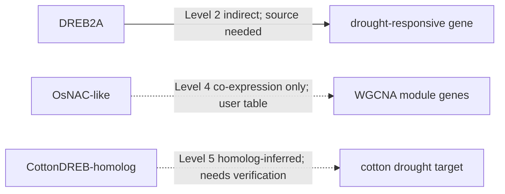

# Plant Functional Gene Network Curation Example

This example shows the expected structure, not a complete biological database. All entries are illustrative and must be replaced with source-verified evidence when used.

## Example Request

```text
Run Plant Trait and Stress Functional Gene Network Curation Workflow.
Topic: drought stress.
Species priority: Arabidopsis, rice, maize, cotton.
Evidence scope: include functional validation, candidate genes, omics associations, homolog-inferred genes, and regulatory network edges.
Input sources: papers/, literature-notes/, and a user-provided DEG/WGCNA table.
Save outputs to literature-notes/plant-gene-network-curation/.
```

## topic_scope.md

- Topic: drought stress
- Species priority: Arabidopsis, rice, maize, cotton
- Evidence scope: include functional validation, candidate genes, omics associations, homolog-inferred genes, regulatory network edges
- Input sources: papers/, literature-notes/, user-provided DEG/WGCNA table
- Source basis: mixed; full text and omics table status must be recorded per entry
- Inclusion criteria: plant genes connected to drought response, water status, ABA response, root architecture, ROS response, stomatal regulation, or yield under drought
- Exclusion criteria: genes without source; unsupported edges; review-only claims not marked as literature-inferred

## plant_functional_gene_inventory.md

| Gene symbol | Gene ID | Species | Ortholog / homolog | Topic | Trait / stress type | Functional category | Evidence level | Evidence type | Experiment | Phenotype | Mechanism | Source paper | PMID/DOI | Figure/Table/Page | Citation status | Notes |
|---|---|---|---|---|---|---|---|---|---|---|---|---|---|---|---|---|
| DREB2A | unknown | Arabidopsis | unknown | drought stress | drought / dehydration | transcription factor | Level 2 | transgenic / expression | [需要核实] | [需要核实] | drought-responsive transcriptional regulation [需要核实] | [source needed] | unknown | [需要核实] | needs verification | Example only; verify primary source before use. |
| OsNAC-like | unknown | rice | unknown | drought stress | drought | transcription factor | Level 4 | RNA-seq DEG / WGCNA | DEG and co-expression from user table | expression association only | unknown | user-provided DEG/WGCNA table | unknown | [需要核实] | user-provided source | Cannot be written as functional validation. |
| CottonDREB-homolog | unknown | cotton | Arabidopsis DREB-like [需要核实] | drought stress | drought | transcription factor | Level 5 | homolog inference | database note | unknown | unknown | public database note [需要核实] | unknown | [需要核实] | needs verification | Target-species function not validated. |

## plant_regulatory_edge_table.md

| Edge ID | Source gene | Source gene ID | Target gene | Target gene ID | Species | Topic | Relationship | Direction | Directness | Condition | Tissue/stage | Evidence level | Evidence type | Experimental support | Source paper | PMID/DOI | Figure/Table/Page | Exact evidence snippet | Confidence | Need verification |
|---|---|---|---|---|---|---|---|---|---|---|---|---|---|---|---|---|---|---|---|---|
| EDGE-001 | DREB2A | unknown | downstream drought-responsive gene | unknown | Arabidopsis | drought stress | regulates | unknown | indirect | drought/dehydration [需要核实] | unknown | Level 2 | perturbation plus expression [需要核实] | [需要核实] | [source needed] | unknown | [需要核实] | [需要核实] | medium | yes |
| EDGE-002 | OsNAC-like | unknown | WGCNA module genes | unknown | rice | drought stress | co-expressed with | unknown | co-expression only | drought | unknown | Level 4 | WGCNA | user table only | user-provided DEG/WGCNA table | unknown | [需要核实] | [需要核实] | low | yes |
| EDGE-003 | CottonDREB-homolog | unknown | drought-responsive target | unknown | cotton | drought stress | homolog-inferred relation | unknown | homolog-inferred | unknown | unknown | Level 5 | homolog inference | none in target species | public database note [需要核实] | unknown | [需要核实] | [需要核实] | low | yes |

## Gene Evidence Card Example

# Gene Evidence Card: OsNAC-like

## 1. Gene Identity

- Gene symbol: OsNAC-like
- Gene ID: unknown
- Species: rice
- Orthologs: unknown
- Gene family: NAC transcription factor [需要核实]

## 2. Topic Context

- Topic: drought stress
- Trait / stress: drought
- Treatment / condition: drought treatment in user-provided table
- Tissue / stage: unknown
- Phenotype: not reported

## 3. Source-Reported Function

The user-provided table reports expression association and WGCNA membership only. It does not report functional validation.

## 4. Experimental Evidence

- mutant: not reported
- overexpression: not reported
- CRISPR: not reported
- complementation: not reported
- transgenic validation: not reported
- qRT-PCR: [需要核实]
- RNA-seq: reported by user table
- GWAS/QTL: not reported
- ChIP/EMSA/Y1H/dual-luc: not reported
- protein interaction: not reported
- physiological assay: not reported

## 5. Evidence Level

- Assigned level: Level 4
- Reason: RNA-seq/WGCNA association can prioritize candidates but cannot prove function or direct regulation.

## 6. Regulatory Relationships

| Source | Target | Relationship | Directness | Evidence | Source |
|---|---|---|---|---|---|
| OsNAC-like | WGCNA module genes | co-expressed with | co-expression only | WGCNA | user-provided table |

## 7. Mechanism

No source-supported mechanism is available.

## 8. What This Gene Can Support in a Review

- It can be cited as a drought-associated candidate gene if the user table is an acceptable source.

## 9. What This Gene Cannot Support

- It cannot support a claim that the gene improves drought tolerance.
- It cannot support direct regulation of downstream genes.

## 10. Need Verification

- Gene ID.
- Original source paper.
- Tissue, treatment, and time point.
- qRT-PCR or functional validation status.

## network_model.md

### Source-reported content

The curated inputs contain expression-associated and homolog-inferred candidate genes. Any direct functional or regulatory claims require primary-source verification before use.

### Reasonable inference

Genes repeatedly associated with drought stress across expression, WGCNA, and validated functional evidence can be prioritized as candidates, but evidence level must remain separate for each gene and edge.

### Model synthesis

初步模型可将候选基因分为 ABA/转录调控、ROS 胁迫响应、根系结构和产量相关模块。该模型只能作为待验证的调控框架，不能替代原始实验结论。



## Cytoscape Exports

### network_nodes_for_cytoscape.csv

```csv
id,gene_symbol,gene_id,species,functional_category,evidence_level,topic,description
DREB2A,DREB2A,unknown,Arabidopsis,transcription factor,Level 2,drought stress,Example entry requiring primary-source verification
OsNAC-like,OsNAC-like,unknown,rice,transcription factor,Level 4,drought stress,Expression-associated candidate from user table
CottonDREB-homolog,CottonDREB-homolog,unknown,cotton,transcription factor,Level 5,drought stress,Homolog-inferred candidate requiring target-species validation
```

### network_edges_for_cytoscape.csv

```csv
source,target,interaction,directness,evidence_level,evidence_type,species,topic,condition,source_paper,doi_pmid,figure_table_page,confidence
DREB2A,drought-responsive gene,regulates,indirect,Level 2,perturbation plus expression [needs verification],Arabidopsis,drought stress,drought/dehydration [needs verification],[source needed],unknown,[needs verification],medium
OsNAC-like,WGCNA module genes,co-expressed with,co-expression only,Level 4,WGCNA,rice,drought stress,drought,user-provided DEG/WGCNA table,unknown,[needs verification],low
CottonDREB-homolog,cotton drought target,homolog-inferred relation,homolog-inferred,Level 5,homolog inference,cotton,drought stress,unknown,public database note [needs verification],unknown,[needs verification],low
```

## need_verification.md

- Verify all illustrative gene IDs before use.
- Verify whether DREB2A direct targets are supported by ChIP, EMSA, Y1H, dual-luc, or only perturbation/expression evidence.
- Verify whether OsNAC-like has any mutant, overexpression, CRISPR, or complementation evidence.
- Verify cotton orthology and target-species evidence before making cotton-specific functional claims.
