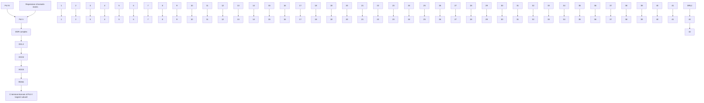
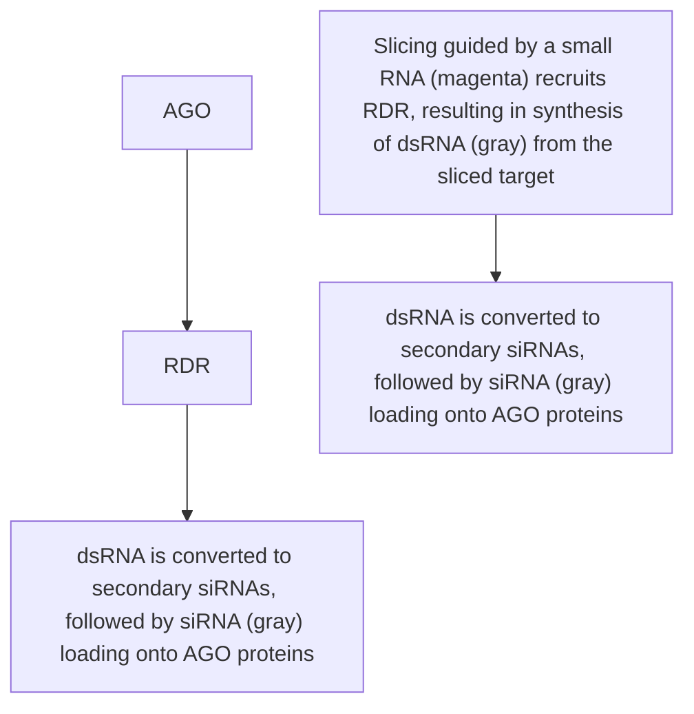
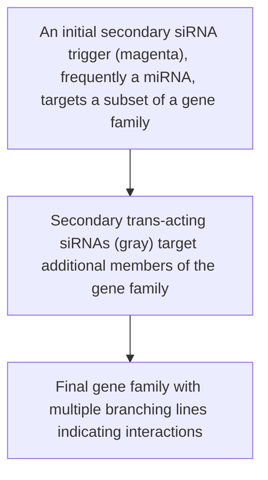

text_image

REVIEWS
IN ADVANCE

Review in Advance first posted online on January 16, 2013. (Changes may still occur before final publication online and in print.)

# Classification and Comparison of Small RNAs from Plants

Michael J. Axtell

Department of Biology and Huck Institutes of the Life Sciences, Pennsylvania State University, University Park, Pennsylvania 16802; email: mja18@psu.edu

Annu. Rev. Plant Biol. 2013. 64:5.1–5.23

The Annual Review of Plant Biology is online at plant.annualreviews.org

This article’s doi:

10.1146/annurev-arplant-050312-120043

Copyright -c 2013 by Annual Reviews. All rights reserved

# Keywords

microRNA, siRNA, Arabidopsis

# Abstract

Regulatory small RNAs, which range in size from 20 to 24 nucleotides, are ubiquitous components of endogenous plant transcriptomes, as well as common responses to exogenous viral infections and introduced double-stranded RNA (dsRNA). Endogenous small RNAs derive from the processing of helical RNA precursors and can be categorized into several groups based on differences in biogenesis and function. A major distinction can be observed between small RNAs derived from singlestranded precursors with a hairpin structure [referred to here as hairpin RNAs (hpRNAs)] and those derived from dsRNA precursors [small interfering RNAs (siRNAs)]. hpRNAs in plants can be divided into two secondary groups: microRNAs and those that are not microRNAs. The currently known siRNAs fall mostly into one of three secondary groups: heterochromatic siRNAs, secondary siRNAs, and natural antisense transcript siRNAs. Tertiary subdivisions can be identified within many of the secondary classifications as well. Comparisons between the different classes of plant small RNAs help to illuminate key goals for future research.

# Contents

INTRODUCTION 5.2

A HIERARCHICAL

CLASSIFICATION SYSTEM

FOR PLANT SMALL RNAs . . . . . . 5.2

miRNAs . 5.5

Conservation Patterns of miRNAs

and Their Targets . . . . . . . . . 5.5

Lineage-Specific miRNAs . . . . . . . . . . 5.6

Long miRNAs . 5.6

Complementarity Thresholds for

miRNA-Mediated Target

Repression 5.6

Mechanisms of miRNA-Mediated

Target Repression . 5.7

Connections Between

miRNA/Target

Complementarity and

Mechanism of Repression . . . . . . . 5.8

OTHER hpRNAs 5.9

HETEROCHROMATIC siRNAs. . . . . 5.9

Conservation of Heterochromatic

siRN IA s 5.10

Tissue- and Parent-Specific

Expression of Heterochromatic

siRN IA s 5.10

Unresolved Mechanisms of

Heterochromatic siRNA

Biogenesis and Function . . . . . . . . 5.11

SECONDARY siRNAs . . . . . . . 5.13

Phased and Trans-Acting siRNAs . . . 5.13

Many Factors Cause Secondary

siRNA Biogenesis . 5.14

Functions of Secondary siRNAs . . . . 5.15

NAT-sIRNAs . 5.15

CONCLUDING REMARKS . . . . . . . . . 5.16

# INTRODUCTION

Plant small RNAs are initially produced as double-stranded duplexes from the helical regions of larger RNA precursors by the endonuclease activities of Dicer-like (DCL) proteins. One strand from the initial duplex then becomes associated with an Argonaute (AGO) protein. The AGO-bound small RNA Axtell

is available to hybridize with target RNAs; upon satisfactory Watson-Crick pairing, the AGO protein directly catalyzes and/or indirectly orchestrates repressive activities on the target. AGO-organized target repression can occur at the levels of repressive chromatin modifications, decreased RNA stability, and lowered translational efficiency. The AGObound small-RNA ensemble in any given plant is therefore essentially a reservoir of sequence-specific negative regulators that can be deployed for a wide variety of functions.

In this review, I describe a hierarchical classification scheme that can be used to annotate the diversity of plant DCL/AGO small RNAs based primarily on their distinct modes of biogenesis. I then compare the evolution, mechanisms, and functions of these various classes of small RNAs both between plant species and between the different classes. I focus specifically on the endogenously expressed DCL/AGO small RNAs in plants, which are hereafter referred to simply as small RNAs. Readers interested in other classes of plant regulatory small RNAs, such as the longer 30– 40-nucleotide (nt) RNAs produced upon bacterial infections (59), virus-derived and pathogenassociated small RNAs (97), and synthetic small RNAs (31, 36, 87), are directed to the above works and the references therein. Finally, for brevity, I for the most part omit in-depth discussion of the many specific genes and proteins required for small-RNA biogenesis, function, and turnover beyond the core RNA-dependent RNA polymerase (RDR), DCL, and AGO families (see sidebar, RDRs, DCLs, and AGOs: Core Enzymes for Plant Small-RNA Biogenesis and Function). Interested readers are directed toward several excellent reviews that together cover these other factors in much more detail (23, 64, 109, 111, 114).

# A HIERARCHICAL

# CLASSIFICATION SYSTEM

# FOR PLANT SMALL RNAs

Small RNAs in plants derive from the processing of helical regions of RNA precursors.

text_image

DCL: Dicer-like
AGO: Argonaute
RDR:
RNA-dependent RNA
polymerase
5.2

When considering the details of the precursors of small RNAs, a fundamental dichotomy emerges between those derived from doublestranded precursors formed by the intermolecular hybridization of two complementary RNA strands and those derived from single-stranded precursors that possess an intramolecular, selfcomplementary “hairpin” structure (Figure 1). Small RNAs derived from double-stranded RNA (dsRNA) precursors are known as small interfering RNAs (siRNAs). I refer to all small RNAs derived from single-stranded hairpins as hairpin RNAs (hpRNAs), and propose that the distinction between siRNAs and hpRNAs is a primary distinction when classifying small RNAs (Figure 1). It is important to note that other modes of small-RNA biogenesis are possible: Piwi-associated RNAs (piRNAs) in animals derive from the fragmentation of singlestranded, likely nonhelical precursors (57), and the 22G RNAs of Caenorhabditis elegans are the direct products of transcription by an endogenous RDR (88). However, neither of these alternative modes of small-RNA biogenesis has been described in plants to date.

hpRNAs and siRNAs can be subdivided into two and three secondary classifications, respectively, based on distinct modes of biogenesis and/or function (Figure 1): hpRNAs can be divided into microRNAs (miRNAs) and everything else (other hpRNAs), and the currently known siRNAs can be divided into heterochromatic siRNAs, secondary siRNAs, and natural antisense transcript siRNAs (NAT-siRNAs). Some of the secondary categories can be further subdivided into tertiary categories: miRNAs can be lineage specific or long, secondary siRNAs can be phased or trans-acting, and NAT-siRNAs can be cis or trans. It is important to note that child categories do not necessarily constitute the entirety of the parent category; for instance, not all miRNAs are either lineage specific or long (Figure 1). Each of these secondary classifications and their child tertiary classes (where present) are discussed in detail in the sections below.

It is important to keep in mind that any small-RNA classification system is by defini-

# RDRs, DCLs, AND AGOs: CORE ENZYMES FOR PLANT SMALL-RNA BIOGENESIS AND FUNCTION

RDR, DCL, and AGO proteins are three enzyme families central to plant small-RNA biogenesis and function. RDRs synthesize second-strand RNA using an RNA template, resulting in the production of dsRNA. DCL endonucleases process helical RNA precursors (either dsRNA or the helical regions of stemloop single-stranded RNAs) to release short double-stranded duplexes, 20–24 nt long, with 2-nt 3- overhangs. AGOs then engage these duplexes, retaining only one of the two possible strands and discarding the other. AGO-loaded small RNAs serve as specificity determinants to select RNA targets based on small-RNA/target complementarity. Successful target identification is followed by repressive activities orchestrated by the associated AGO protein. Many plant AGO proteins are endonucleases that catalyze the “slicing” of target RNAs—hence the colloquial term for AGOs, “slicers.” In addition, AGO proteins can direct translational repression, chromatin modifications, and slicer-independent destabilization of target mRNAs. RDRs, DCLs, and AGOs are all encoded by multigene families in plants with conserved clades (73, 109, 124). Each clade is often specialized for the production or use of a certain class of small RNA.

tion an intellectual construct and unlikely to be a perfect reflection of nature. The utility of the classifications should be judged both by the degree to which the groupings reflect an underlying biological reality and the degree to which they facilitate discussion of the subject. The primary classification—the distinction between hpRNAs and siRNAs—seems quite straightforward, as a given small RNA comes from either one or the other precursor in plants. Some, but not all, of the secondary classifications also appear quite robust: miRNAs, heterochromatic siRNAs, and secondary siRNAs all have consistent and unique sets of RDR, DCL, and AGO family members (see sidebar) required for their biogenesis, distinct mechanisms of action that have been extensively demonstrated experimentally, and unique small-RNA size distributions. Furthermore, the defining features and biogenesis requirements for these Double-stranded RNA (dsRNA): RNA formed by the intermolecular hybridization of two separate, complementary polynucleotides

Small interfering RNA (siRNA): small RNA derived from DCL-catalyzed processing of dsRNA

Hairpin RNA (hpRNA): small RNA derived from DCL-catalyzed processing of the helical region of a self-complementary single-stranded RNA

www.annualreviews.org • Categories of Plant Small RNAs

5.3

```mermaid
graph TD
    A["Primary classifications"] --> B["Primary classifications"]
    B --> C["Tertiary classifications"]
    A --> D["Secondary classifications"]
    D --> E["Tertiary classifications"]
    A --> F["Secondary classifications"]
    F --> G["Tertiary classifications"]
    A --> H["Secondary classifications"]
    H --> I["Tertiary classifications"]
    A --> J["Tertiary classifications"]
    J --> K["Tertiary classifications"]
    A --> L["Tertiary classifications"]
    L --> M["Tertiary classifications"]
    A --> N["Tertiary classifications"]
    N --> O["Tertiary classifications"]
    A --> P["Tertiary classifications"]
    P --> Q["Tertiary classifications"]
    A --> R["Tertiary classifications"]
    R --> S["Tertiary classifications"]
    A --> T["Tertiary classifications"]
    T --> U["Tertiary classifications"]
    A --> V["Tertiary classifications"]
    V --> W["Tertiary classifications"]
    A --> X["Tertiary classifications"]
    X --> Y["Tertiary classifications"]
    A --> Z["Tertiary classifications"]
    Z --> AA["Tertiary classifications"]
    A --> AB["Tertiary classifications"]
    AB --> AC["Tertiary classifications"]
    A --> AD["Tertiary classifications"]
    AD --> AE["Tertiary classifications"]
    A --> AF["Tertiary classifications"]
    AF --> AG["Tertiary classifications"]
    A --> AH["Tertiary classifications"]
    AH --> AI["Tertiary classifications"]
```

flowchart

Figure 1

Hierarchical classification system for endogenous plant small RNAs. Thick black lines indicate hierarchical relationships.

Abbreviations: dsRNA, double-stranded RNA; hpRNA, hairpin RNA; miRNA, microRNA; NAT-siRNA, natural antisense transcript ring RNA; siRNA, small interfering RNA.

5.4

Axtell

three groups are known to be conserved and to remain distinct from one another in multiple plant species. Non-miRNA hpRNAs and NAT-siRNAs, in contrast, may not be biologically cohesive groupings: Both have variable RDR and DCL requirements for biogenesis and variable small-RNA size distributions that are inconsistent between members within the categories. Additionally, the conservation of non-miRNA hpRNAs and NAT-siRNAs has not been as extensively documented as for the other three secondary classifications. Finally, emerging data suggest functional overlaps between heterochromatic siRNAs and secondary siRNAs. Therefore, the classification scheme I present here should be regarded as a work in progress and subject to change as more knowledge accumulates in the coming years.

# miRNAs

miRNAs are a well-studied subset of hpRNAs defined by the highly precise excision of one or sometimes a few functional products, which are the mature miRNAs (Figure 1) (3, 77). miRNAs often have a defined set of mRNA targets (54), and individual miRNA families can be conserved over long evolutionary distances (29). Most plant miRNAs are 21 nt long, require a DCL1-clade DCL for their biogenesis, and require an AGO1-clade AGO for function, although exceptions have been described for each of these general trends (19, 28, 72, 79, 93, 116).

# Conservation Patterns of miRNAs and Their Targets

Several miRNA families are conserved between multiple plant species, and some are conserved across the huge evolutionary distances between mosses and flowering plants (29). Conserved miRNAs have homologous target mRNAs in multiple species (54), demonstrating that miRNA/target relationships have often been stable for long periods of plant evolution. However, recent work has demonstrated that the relationships between conserved plant miRNAs and their targets are somewhat malleable. miR159 is a highly conserved miRNA that targets a subset of MYB mRNAs in multiple plant species. Buxdorf et al. (16) found that tomato miR159 also targets a non-MYB mRNA, SGN-U567133. Expression of a miR159-resistant version of SGN-U567133 causes developmental defects, implying that miR159-mediated regulation of this noncanonical target is of functional consequence. miR396 regulates GRF transcription factor mRNAs in multiple plant species. Debernardi et al. (30) discovered that, besides GRFs, Arabidopsis miR396 also targets the bHLH74 mRNA, and this regulatory interaction affects leaf development. The miR396-bHLH74 interaction is limited to the Brassicaceae and Cleomaceae eudicot families, whereas the canonical miR396-GRF interactions extend throughout all flowering plants. Both of these cases demonstrate that conserved miRNAs can sometimes “pick up” functional interactions with extra targets while maintaining the regulation of their canonical target gene families.

The strength of repression conferred on target mRNAs by a conserved miRNA can also be variable. Todesco et al. (107) demonstrated that polymorphisms within the hairpin precursors of Arabidopsis miRNAs affect the efficiency of miRNA biogenesis. In the case of miR164, such precursor polymorphisms have a functional impact on phenotype, as evidenced by the finding that a major quantitative trait locus affecting the transgressive segregation of leaf morphology in crosses between the Col-0 and C24 Arabidopsis ecotypes is based on a MIR164A precursor polymorphism. Similar polymorphisms are common in Arabidopsis ecotypes, suggesting that such variations are a common modulator of miRNA function.

The extent of miRNA/target complementarity can also contribute to differences in the strength of miRNA-mediated repression. In a comparison of eudicots and monocots, Debernardi et al. (30) showed that sequence polymorphisms in the mature miR396 miRNA exist and that these miRNA variants have differing strengths of target mRNA regulation. Thus, even conserved miRNA/target interactions

# MicroRNA

(miRNA): hpRNA

defined by precise processing of a hairpin

# Other hpRNA:

hairpin-derived small RNA that is not miRNA

# Heterochromatic

siRNA: siRNA that is typically 23–24 nt long and that arises from intergenic and repetitive genomic regions

# Secondary siRNA:

siRNA whose dsRNA precursor is made in response to the activity of an upstream small RNA

# Natural antisense transcript siRNA

# (NAT-siRNA):

siRNA whose dsRNA precursor was formed by the hybridization of two independently transcribed RNAs

text_image

REVIEWS
IN ADVANCE

www.annualreviews.org • Categories of Plant Small RNAs

Seed pairing: pattern of miRNA/target complementarity where pairing involving nucleotides 2–7 of the miRNA (along with optional pairing at nucleotides 1 and 8) is sufficient for repression

are not static; the strength of their regulatory power over their conserved targets can rise or fall based both on variations in precursor processing efficiency and on small changes in the mature miRNA sequence itself.

# Lineage-Specific miRNAs

Not all plant miRNAs are conserved. Indeed, the majority of miRNAs present in any given plant species appear to be unique to that species, and many more are present only within a few closely related species, implying that there is a great deal of birth and death among miRNA genes. The lineage-specific miRNAs are, as a class, distinct in many ways from the more conserved miRNAs. Lineage-specific miRNAs tend to either lack targets or identify their targets based on currently unknown criteria (38, 39, 70). They also tend to have more heterogeneous processing from their hairpin precursors, have low overall abundance, and be encoded by single genes instead of by multiple paralogs (38, 39, 70). These qualitative differences indicate that many lineage-specific miRNAs may be transient, nonfunctional entities, and justify categorizing them as a distinct subset of miRNAs (Figure 1). Previous reviews have covered lineage-specific miRNAs in much greater detail (5, 29).

# Long miRNAs

Most plant miRNAs are 21 nt long, with some also being 20 or 22 nt. However, some miRNAs in both Arabidopsis and rice are 24 nt long and, after their biogenesis, enter into the heterochromatic siRNA effector pathway and direct chromatin modifications at their target genes (Figure 1). Interestingly, most of the long miRNAs described to date in both Arabidopsis and rice (19, 110, 116) are also lineage-specific miRNAs. This suggests that newly evolving “proto-miRNAs” may sometimes transition through a phase where they produce 24-nt species and may also imply that long miRNAs are not favorable for long-term selection, as they do not seem to make the transition from the proto-miRNA stage to canonical, conserved miRNA. The biological or phenotypic relevance of chromatin modifications directed by long miRNAs has not yet been described.

# Complementarity Thresholds for miRNA-Mediated Target Repression

All experimentally verified plant miRNA targets described to date have extensive complementarity to their cognate miRNAs (Figure 2). Perfect complementarity is rare, but so are examples with more than five mismatches between miRNA and target. Mismatches tend to occur at either the first nucleotide of complementarity (relative to the 5- end of the miRNA) or toward the 3- end of the alignment (71, 98). A subset of functional sites have an alternative arrangement, with very high complementarity at both the 5- and 3- regions, with central mismatches and/or bulged nucleotides (Figure 2) (6, 40). Assuming that all functional sites are similar to those already known, computational identification of potentially functional miRNA/target alignments is a straightforward exercise in identifying regions of mRNAs with high complementarity to known miRNAs; several successful and largely similar methods to accomplish miRNA target predictions in plants have been described for this purpose (2, 26, 37, 55, 98).

Are there additional patterns of miRNA/ target complementarity that are functional in plants? One potential alternative paradigm comes from animal miRNA/target pairs, where the majority of targets depend solely on base pairing between nucleotides 2–7 of the miRNA, with additional, optional pairing between nucleotides 1 and 8 (Figure 2) (10). Despite the knowledge of such “seed” pairing in animals for over a decade, there have been no documented examples of functional seed pairing for a plant miRNA/target interaction. Extrapolating from negative data is perilous, of course. However, given the intensity with which plant miRNAs have been investigated over the past decade,

text_image

REVIEWS
IN ADVANCE 5.6

Axtell

<table><tr><td>miRNA/target pairing pattern</td><td>Prevalence</td><td>Mechanisms of target repression</td></tr><tr><td>Canonical plant pairing</td><td>Common in plants; very rare in animals</td><td>Slicing-dependent (and perhaps slicing-independent) reduction in mRNA accumulation, and/or translational repression</td></tr><tr><td>miRNA target-mimic pairing</td><td>A few examples in plants; in animals, seed pairing is used instead</td><td>Competition for and sequestration of active AGO-miRNA complexes</td></tr><tr><td>Seed pairing (canonical animal pairing)</td><td>No evidence in plants to date; common in animals</td><td>Translational repression followed by slicing-independent reduction in mRNA accumulation</td></tr></table>

Figure 2

Patterns of functional microRNA (miRNA)/target complementarity in plants and animals. Note that a few additional marginal or atypical patterns of complementarity (10) that function in animals are not shown; none of these are known to function in plants.

the fact that functional seed pairing has not been reported makes it seem likely that miRNA seed pairing does not occur, is rarely used, or has subtle effects in plants.

# Mechanisms of miRNA-Mediated Target Repression

After a plant miRNA target is identified, it is commonly observed that the steady-state level of the intact target mRNA decreases and that some of the target mRNA is cleaved, between positions 10 and 11 of the alignment, by the endonucleolytic activity of the associated AGO protein. A reasonable interpretation of these observations is that miRNA-directed regulation is chiefly accomplished at the level of mRNA stability via AGO-catalyzed “slicing.” However, this view is clearly oversimplified. In animal systems, slicing-independent miRNA targeting events typically lead to a decrease in the steady-state accumulation of the target mRNA (44); thus, increased turnover orchestrated by AGO association but independent of slicing may also contribute to the regulation of plant miRNA targets. Additionally, many specific cases have long been known where a plant miRNA has much stronger effects on the target’s steady-state protein level compared with the effects on the steady-state target mRNA level, suggesting that translational repression contributes to miRNA-directed target repression (4, 22, 42). Further analyses have clearly demonstrated that translational repression is a common contributor to miRNA-mediated repression in plants, and genetic studies have

www.annualreviews.org • Categories of Plant Small RNAs begun to uncover specific effectors of this mechanism (15, 118). Nonetheless, AGOcatalyzed slicing plays a key role in miRNA function, as evidenced by the recent observation that slicer-defective mutants in Arabidopsis AGO1 (the primary miRNA-associated slicer) cannot complement ago1 mutants (18). Taken together, the available data indicate that most plant miRNAs repress their targets via some combination of RNA destabilization (either slicing dependent or not) and translational repression, and that slicing often plays a key role.

text_image

Slicing:
AGO-catalyzed
cleavage of targeted
RNAs

5.7
ADVANCE

Mechanisms other than mRNA destabilization and translational repression have also been reported. Some instances of miRNA-directed chromatin modifications and subsequent transcriptional repression of target loci have been documented (8, 61), but whether this is a general phenomenon for canonical miRNAs is not yet settled. The existence of long miRNAs, which after their production enter the heterochromatic siRNA pathway (19, 116), may explain these observations. Another mechanism by which some miRNAs direct repression of their targets is the triggering of secondary siRNA production (secondary siRNAs are discussed in detail in the Secondary siRNAs section, below). Finally, at least one family of plant miRNA targets (the IPS1/At4 family of nonprotein-coding RNAs, targeted by miR399) serve as “mimics” that compete with more typical targets for miRNA association, and in doing so modulate the activity of the miRNA. The base-pairing pattern of target-mimic sites is distinct from that of canonical plant miRNA targets (Figure 2) and serves to prevent slicing (40). So far, the IPS1/At4 family of nonprotein-coding RNAs is the only documented example of natural miRNA target mimics in plants; whether this is a more widespread mechanism in plants awaits further research. Animals also use miRNA target mimics, but these use seed-pairing patterns of complementarity similar to “real” targets (106). Artificial miRNA target mimics in plants are easily designed and are useful tools for analyzing reductions in function phenotypes caused by sequestration and subsequent turnover of miRNAs (108, 117).

# Connections Between miRNA/Target Complementarity and Mechanism of Repression

Does the pattern of base pairing between a miRNA and a target dictate the mechanism of the subsequent repression? In some cases it clearly does. miRNA target mimics require central mismatches/bulges to function; without these central mismatches, the transcripts are sliced by AGO and fail to function as effective competitors for miRNA activity (40). AGO-catalyzed slicing also requires extensive miRNA/target complementarity (71, 104). Similarly, triggering of secondary siRNA production sometimes requires specific patterns of miRNA/target complementarity (6, 78, 79, 89). Finally, the strength of miRNA-mediated repression in vivo is affected by the extent of the complementarity (30).

But what about the balance between translational repression and mRNA destabilization? Older models suggested that animal miRNAs, most of whose targets were identified through seed pairing, chiefly directed translational repression of their targets (9). In contrast, the activity of plant miRNAs, which identify targets with more extensive complementarity, was previously suggested to be chiefly directed toward mRNA destabilization (95). However, current results have eroded the supposed mechanistic differences between the kingdoms. In animals, time-resolved experiments have shown that translational repression precedes subsequent mRNA deadenylation and accelerated mRNA turnover (11, 32). Similarly, in plants, both translational repression and mRNA destabilization are now known to co-occur for many targets (111). However, it is critical not to confuse mechanism with complementarity requirements: The mechanisms of plant and animal miRNA-mediated repression are now known to be more similar than previously thought, but the complementarity requirements to trigger

text_image

REVIEWS
IN ADVANCE 5.8

Axtell

repression still appear quite distinct. Only a few animal miRNAs have plant-like extensive complementarity to their targets (99), and no currently known plant miRNA targets have animal-like seed-only pairing to their targets. In particular, the common occurrence of translational repression initiated by plant miRNAs cannot by itself be used to conclude that animallike miRNA/target complementarity patterns are widespread or even functional at all in plants.

One example that has been used to argue for the functionality of less complementary target sites in plants, and for a relationship between complementarity pattern and repression mechanism, deserves close scrutiny. Dugas & Bartel (34) observed that miR398 is induced by sucrose in the growth media, and that this induction is correlated with decreases in both the mRNA and protein accumulation levels of the CSD1 and CSD2 copper-zinc superoxide dismutase targets. Extensively mutagenized variants of CSD1 and CSD2 in which the miR398 target sites were severely disrupted (lacking both plant-like pairing and animal-like seed pairing) lost responsiveness to miR398 induction at the mRNA level, but the steady-state levels of the two proteins were still strongly repressed. Taken at face value, these results suggest that miR398 mediates translational repression of CSD1 and CSD2 with a very limited and novel requirement for miRNA/target complementarity. However, the CCS1 mRNA, which encodes a chaperone required for the posttranslational stability of the CSD1 and CSD2 proteins (27), is also a miR398 target (12). Therefore, the decline in CSD1 and CSD2 protein levels in response to miR398 induction is likely to be an indirect, posttranslational effect of the miR398-triggered loss of the CCS1 chaperone and cannot be attributed to the highly mutagenized miR398 target sites on the engineered CSD1 and CSD2 mRNAs. This case highlights a more general complication when inferring miRNA-mediated translational repression solely based on steady-state analysis of the native protein accumulation: Possible changes in posttranslational stability indirectly mediated by other targets of the miRNA in question must be taken into account.

# OTHER hpRNAs

Some plant small-RNA loci produce small RNAs from apparent single-stranded hairpin precursors but do not meet the criteria for annotation as a miRNA (Figure 1). Some of these are similar to miRNAs in terms of hairpin structure and locus size. However, endogenous hairpins that are much larger than typical miRNAs can also produce small RNAs (46). Dunoyer et al. (35) conducted a detailed study of two such inverted-repeat-derived derived hairpins, IR71 and IR2039, with small RNAs generating regions of approximately 6.5 and 3.0 kb, respectively. Both of these long hairpins produced small-RNA populations with sizes distributed from 21 to 24 nt, and both used three of the four DCL proteins (DCL2, -3, and -4) for their biogenesis. Interestingly, small RNAs from the IR71 locus were found to be mobile within the plant. Both IR71 and IR2039 have limited conservation even between Arabidopsis thaliana ecotypes, demonstrating that they are not strongly conserved. Overall, the characteristics of IR71 and IR2039 are very similar to exogenously introduced long-hairpin RNAinterference (RNAi) constructs that have been used to engineer gene knockdowns in plants for many years (41, 112). Whether these features are typical of a larger class of endogenous inverted-repeat-derived hairpin RNAs and whether they are shared by the potentially numerous shorter-hairpin RNAs await further exploration. In particular, efforts directed at comprehensive genome-wide annotation of non-miRNA hpRNA loci are urgently needed.

# HETEROCHROMATIC siRNAs

Heterochromatic siRNAs are derived from intergenic and/or repetitive genomic regions and are associated with the de novo deposition of repressive chromatin modifications (5-methyl cytosine, particularly at asymmetric CHH sites,

www.annualreviews.org • Categories of Plant Small RNAs and H3K9 histone methylation) at target DNA loci (Figure 1) (64, 74). Most heterochromatic siRNAs are 23–24 nt long, which easily distinguishes them from the other classes of endogenous plant small RNAs, which are mostly 20–22 nt long. Heterochromatic siRNAs have very consistent requirements for specific members of the RDR, DCL, and AGO gene families: Most depend specifically on RDR2 and DCL3 for their biogenesis (58, 68) and on members of the AGO4 clade of AGOs (AGO4, -6, and -9 in Arabidopsis) for their function (45). Most heterochromatic siRNAs also depend on an alternative DNA-dependent RNA polymerase, Pol IV, for their biogenesis (83).

text_image

REVIEWS
IN ADVANCE
5.9

# Conservation of Heterochromatic siRNAs

Like miRNAs, heterochromatic siRNAs as a distinct class of endogenous plant small RNAs are clearly conserved in multiple species. For instance, most small RNAs in immature maize ears are 24 nt long and are dependent on mop1, a maize RDR2 homolog, for their accumulation (85). Similarly, 24-nt small RNAs dependent on OsDCL3a and OsRDR2 dominate the small-RNA profile of wild-type rice (116). In numerous other flowering plant species, 24-nt small RNAs are the most abundant size in small-RNA sequencing experiments. However, the conservation of heterochromatic siRNAs is nonetheless quite distinct from that of miRNAs: In the case of miRNAs, individual miRNAs themselves can be conserved across multiple species. In contrast, individual heterochromatic siRNA loci do not appear to be conserved even between closely related species (70), even though the pathway itself is conserved. Many heterochromatic siRNA loci overlap with transposons or transposon fossils, and there are likely to be rapid birth and death of individual heterochromatic siRNA loci in response to the rapid changes in transposon position and copy number that occur during plant evolution.

Beyond flowering plants, the conservation pattern of the heterochromatic siRNA pathway becomes more interesting. Young leaves and meristematic shoot tissues from several conifers conspicuously lack a 24-nt small-RNA population (33, 80). In addition, no DCL3 homolog has yet been identified from a conifer species (33, 80), although the analysis is limited by the current lack of any fully assembled genome sequence from conifer species. These data suggest that in conifers, the heterochromatic siRNAs have been either lost or functionally replaced by shorter RNAs. Similarly, in the deeper-branching Selaginella lineage, aboveground tissues lack a large population of 24-nt small RNAs (7). However, the Selaginella genome encodes clear RDR2, DCL3, and AGO4 homologs (7), suggesting that a Selaginella heterochromatic siRNA pathway could be deployed in a tissue-specific manner. In the even deeper-branching bryophyte lineage represented by the moss Physcomitrella patens, the heterochromatic siRNA pathway is clearly active: PpDCL3 is required for the accumulation of 23–24-nt siRNAs from repetitive, intergenic genomic regions (25). Synthesizing the available data, it appears that the heterochromatic siRNA pathway is ancestral within the land plants, may be selectively deployed in specific tissues in some lineages (e.g., Selaginella), and may have been lost entirely in the conifers.

# Tissue- and Parent-Specific Expression of Heterochromatic siRNAs

Certain tissues and cell types associated with sexual reproduction have striking patterns of heterochromatic siRNA expression. Many transposons are derepressed specifically within the vegetative nucleus of mature Arabidopsis pollen grains (101). This derepression correlates with the accumulation of 21–22-nt, not 24- nt, heterochromatic siRNAs corresponding to the elements specifically in the sperm cells, and a general decrease of 24-nt heterochromatic siRNA accumulation from the entire pollen grain. Slotkin et al. (101) suggested a model in which the genome of the vegetative nucleus is sacrificed by allowing rampant transposon expression: Expression of transposon RNAs

text_image

REVIEWS
IN ADVANCE
5.10

Axtell

specifically in the vegetative nucleus is used to create transposon-derived 21–22-nt siRNAs that are specifically imported into the sperm cells to direct repressive chromatin modifications, thus reinforcing silencing at potentially expressible elements specifically in the germ cells. In support of this hypothesis, two recent studies have documented extensive active DNA demethylation specifically in the vegetative nucleus that is linked with heterochromatic siRNA production (17, 51).

The apparent deployment of 21–22-nt siRNAs for a task normally associated with 24-nt siRNAs in pollen is especially intriguing, and could be a general feature of a small-RNA response that ensues when repressive chromatin marks are removed from an otherwise expressible transposon; similar patterns of transposon-derived 21–22-nt siRNA accumulation are apparent in ddm1 mutants (75, 101), which globally eliminate repressive chromatin marks, as well as in certain transposons that lose silencing chromatin marks and become transcribed in Arabidopsis cell suspension cultures (105). These 21–22-nt siRNAs resemble secondary siRNAs (see Secondary siRNAs, below) in their requirement for RDR6, DCL2, and DCL4 for their accumulation (75), perhaps blurring the lines between heterochromatic siRNAs and secondary siRNAs. Indeed, two classic secondary siRNA loci that produce 21–22-nt siRNAs in all tissue types, Arabidopsis TAS3a and TAS1c, possess DNA methylation patterns typical of those specified by the heterochromatic siRNA pathway (115). Heterochromatic siRNA loci might also occasionally evolve into novel miRNA genes, as evidenced by miRNA-like patterns of small-RNA production from some siRNAgenerating transposons (91). Indeed, it has been suggested that heterochromatic siRNAs might have provided the ancestral raw material from which the current miRNA and secondary siRNA pathways derived (66). Future studies may continue to find connections between secondary siRNAs, miRNAs, and the canonical 23–24-nt heterochromatic siRNAs.

Developing Arabidopsis seeds, including the triploid endosperm and the young embryo, limit heterochromatic siRNA production to the maternally derived genome (82). Uniparental small-RNA production is confined to heterochromatic siRNAs during endosperm and seed development and does not extend past germination or occur for other small-RNA classes, such as miRNAs. Interestingly, methylated DNA is essentially entirely removed from the Arabidopsis endosperm genome by the DEMETER (DME) and DME-like DNA glycosylases (43, 50, 51). This global DNA demethylation is likely specific to the maternal chromosomes, with occasional hypermethylated hot spots occurring at small-RNA hot spots. However, dme mutants retain uniparental expression of heterochromatic siRNAs, demonstrating that the uniparental expression is not a direct function of global DNA demethylation in the endosperm (84). An interesting hypothesis to account for these observations states that maternal-specific demethylation-based activation of subsequent transposon expression in the endosperm, coupled with the production of heterochromatic siRNAs, acts in trans to reinforce transposon silencing in the young embryo (81). The parallels to the above-mentioned pollen hypothesis of Slotkin et al. (101) are intriguing.

# Unresolved Mechanisms of Heterochromatic siRNA Biogenesis and Function

The current model for the biogenesis of heterochromatic siRNA begins with transcription by RNA Pol IV, which is then followed by RDR2-catalyzed synthesis of dsRNA, processing of the dsRNA by DCL3, and assembly of the resulting siRNA duplexes in AGO4-clade AGOs (Figure 3) (64, 113). The function of the AGO-assembled heterochromatic siRNAs involves the production of a scaffold transcript by yet another alternative DNA-dependent RNA polymerase, Pol V, and many other associated factors. AGO4-bound heterochromatic

text_image

REVIEWS
5.11
2
R
ADVANCE

www.annualreviews.org • Categories of Plant Small RNAs

flowchart

What are the Pol IV and Pol V core promoters? How is transcription initiation by Pol IV and Pol V regulated?   
2 Is there a role for AGO4-catalyzed slicing of target scaffold transcripts?   
What are the complementarity requirements between siRNAs and scaffold transcripts?

Figure 3

Model for the biogenesis and function of heterochromatic small interfering RNAs (siRNAs) in plants. Red dots show repressive chromatin marks such as 5-methyl cytosine and histone H3K9 methylation. Three outstanding questions are indicated with red stars. Adapted from Reference 113.

siRNAs then pair with the nascent transcript during the act of transcription, and successful targeting recruits chromatin modifiers to the genomic vicinity being transcribed by Pol V. The Domains Rearranged 2 (DRM2) de novo cytosine methyltransferase, which catalyzes cytosine methylation in the asymmetric CHH context, is an especially well studied modifier thought to be recruited by heterochromatic siRNAs. Several fundamental questions about heterochromatic siRNA biogenesis and function remain open and are discussed below.

According to the current model, the sites of Pol IV transcription dictate the heterochromatic siRNA population, but how the Pol IV machinery selects these sites is unknown. Similarly, the sites of Pol V transcription can be assumed to dictate the full inventory of scaffolding transcripts that can serve as targets for heterochromatic siRNAs. Wierzbicki et al. (113) and Zhong et al. (123) independently used chromatin immunoprecipitation against the largest Pol V subunit to discover highconfidence Pol V–occupied genomic loci in Arabidopsis. Consistent with the general model for heterochromatic siRNA function, many of these Pol V–occupied sites are correlated with both asymmetric DNA methylation and heterochromatic siRNA biogenesis, and loss of Pol V function is correlated with increased mRNA production from the Pol V–occupied regions. A subset of the Pol V–occupied regions, however, do not correlate with either 24-nt siRNA accumulation or DNA methylation (113), indicating that Pol V occupancy per se is independent of small-RNA production. Motif analysis of Pol V–occupied regions found a short nucleotide motif present in approximately half of the identified sites (113), but it is not clear whether this motif is sufficient to explain Pol V positioning. The wild-type pattern of Pol V genomic occupancy depends critically on the DDR complex (123), which comprises a putative chromatin-interacting ATPase (DRD1), a hinge-domain protein (DMS3), and a singlestranded DNA-binding protein (RDM1) (63). These data suggest that chromatin remodeling by the DDR complex is required for proper Pol V positioning. Zhong et al. (123) also observed that Pol V–occupied sites tend to be in the immediate 5- proximal region next to known Pol II promoters, suggesting that Pol V and Pol II have similar core-promoter assembly mechanisms. Curiously, Pol V occupancy is especially enriched at the promoters near transposons, especially “younger” transposons (123). Elucidating how Pol IV, Pol V, and DDR complexes select their occupancy and initiation sites is an important goal for future research.

Arabidopsis AGO4—probably along with the other members of this clade that are specific to heterochromatic siRNAs—is a small-RNAguided endonuclease capable of cleaving target RNAs in vitro (92). The scaffolding model implies that stable association of AGO4-siRNA complexes with nascent transcripts is required to initiate chromatin modifications. What, then, is the role of AGO4-catalyzed slicing? In vivo, slicing-defective AGO4 only partially complements the ago4 null mutant, and a subset of heterochromatic siRNAs require AGO4’s slicer activity for their accumulation (92). This suggests that AGO4-catalyzed slicing triggers the production of 24-nt secondary siRNAs

text_image

REVIEWS
IN ADVANCE
5.12

Axtell

from a subset of scaffold transcripts. However, heterochromatic siRNAs are loaded onto AGO4 in the cytoplasm, and their loading requires the AGO4 slicer activity to cleave the passenger strand of the initial siRNA duplex (119). Therefore, an alternative hypothesis is that AGO4 slicer activity exists for siRNA loading but not necessarily for the target recognition stage. Whether AGO4 actually slices scaffold transcripts in vivo is an open question. In contrast to the heterochromatic siRNA-associated AGO4, miRNA-associated AGOs (Arabidopsis AGO1, AGO2, and AGO7) do not require slicing to load miRNAs, as slicing-defective versions can still form ternary complexes with target RNAs in vivo (18).

Another interesting mechanistic question surrounding heterochromatic siRNA function is their base-pairing requirements. Heterochromatic siRNAs are not tethered to the genomic regions from which they are initially transcribed: Both the cytoplasmic assembly of AGO4/siRNA duplexes (119) and the non-cellautonomous functions of these siRNAs (35, 76) clearly indicate that, like miRNAs, they select targets in trans. Perfect matches between heterochromatic siRNAs and targets are of course functional, but whether other pairing patterns are also functional has not been experimentally addressed. Determining the base-pairing requirements for heterochromatic siRNA function is a key goal for future research.

# SECONDARY siRNAs

Secondary siRNAs derive from doublestranded precursors whose production is stimulated by one or more upstream small RNAs; small-RNA targeting of an initial primary transcript leads to recruitment of an RDR, synthesis of the complementary RNA strand, and processing of the resulting dsRNA into secondary siRNAs (Figures 1 and 4a) (1, 120). Most secondary siRNAs described to date require a distinct set of biogenesis factors, including RDR6 and DCL4. In addition, the initiating small RNAs for most known examples are either miRNAs or other secondary siRNAs. As a category of small RNAs, endogenous secondary siRNAs are well conserved, present in flowering plants as well as more diverged lineages (6, 103). In addition, as described below, some individual secondary siRNA genes themselves are conserved between different plant species to varying degrees. Taken together, these consistent traits indicate that secondary siRNAs are a robust, distinct, and biologically meaningful class of small-RNA genes.

# Phased and Trans-Acting siRNAs

Many secondary siRNAs are phased in that they derive from successive DCL-catalyzed processing from a consistent dsRNA terminus (Figure 1). The consistency of the dsRNA terminus is defined by a discrete initial small-RNA-directed cleavage event on the primary transcript. Some secondary siRNAs are also capable of acting in trans to direct repression of distinct mRNA targets—hence the term trans-acting siRNAs. The two tertiary classifications, phased siRNAs and trans-acting siRNAs, often both apply to the same locus: Many of the known trans-acting siRNAs are also phased (Figure 1).

Computational identification of phased small-RNA patterns is a powerful method to identify secondary siRNAs (21, 49, 121), as no other mechanism is known to produce this distinct pattern of small-RNA accumulation. However, it is important to realize that neither phasing nor trans targets are essential for classification as a secondary siRNA. For example, a sequence-diverse population of initiating small RNAs would stimulate a dsRNA population with heterogeneous ends, and the overall resulting secondary siRNA population would not be phased. Thus, phased siRNAs likely represent only a subset, albeit a much more easily recognizable subset, of all secondary siRNAs. Similarly, secondary siRNAs need not necessarily have trans targets. Indeed, only a handful of the large number of distinct secondary siRNAs observed to date have been experimentally shown to have trans targets.

www.annualreviews.org • Categories of Plant Small RNAs

text_image

REVIEWS
5.13
ADVANCE

a   

flowchart

b

flowchart

Figure 4

Cascades of secondary small interfering RNAs (siRNAs) can coordinately regulate a gene family. (a) Detailed schematic of secondary siRNA production. (b) Schematic cascade of secondary siRNA synthesis and targeting. An initial small RNA (magenta) targets a subset of a gene family, producing secondary siRNAs (small gray bars). Some of these are trans-acting siRNAs that can downregulate additional members of the gene family based on sequence complementarity. The process depicted in panel a occurs at each arrowhead in panel b. Additional abbreviations: dsRNA, double-stranded RNA; miRNA, microRNA.

# Many Factors Cause Secondary siRNA Biogenesis

Only a subset of small-RNA/target interactions result in secondary siRNA biogenesis. Features of the initial small RNA, the specific AGO protein upon which it is loaded, and the target itself dictate the existence and extent of the subsequent secondary siRNA production. Target transcripts with aberrant 5- or 3- ends (48) and those with more than one small-RNA target site (6, 49) are especially suscepti-

ble to secondary siRNA synthesis. Highly complementary small-RNA target sites, especially when combined with overexpression of either the small-RNA trigger or the target mRNA, also promote secondary siRNA biogenesis (78, 89). The AGO protein to which a small RNA is loaded can also determine whether sliced targets enter the secondary siRNA biogenesis pathway: Both AGO7-loaded (79) and AGO2- loaded (72) small RNAs are prone to trigger secondary siRNA biosynthesis.

text_image

REVIEWS
IN ADVANCE
5.14

Axtell

Slicing directed by 22-nt miRNAs also causes initiation of secondary siRNA biogenesis from the sliced target (20, 28), suggesting that AGO1, which mostly binds 21-nt small RNAs, can be reprogrammed into a state where it recruits RDR6 to targets by perceiving a loaded 22-nt species. However, Manavella et al. (72) found that a 22-nt miRNA size per se does not cause secondary siRNA biogenesis; rather, it results from the existence of an initial asymmetric miRNA/miRNA∗ duplex where the two strands are of different lengths. This suggests that the AGO1 reprogramming occurs when such miRNA/miRNA∗ duplexes are processed during loading onto AGO1. Many factors required for secondary siRNA biogenesis colocalize in discrete cytoplasmic foci (56, 62). It will be interesting to determine how the various molecular features associated with secondary siRNA biogenesis relate to the subcellular compartmentalization of their precursor RNAs and the proteins required for secondary siRNA production.

# Functions of Secondary siRNAs

The extensively studied miR390-triggered TAS3 family of secondary siRNA loci produce two nearly identical trans-acting siRNAs that target Auxin Response Factor 3 (ARF3) and ARF4 (1). This regulatory interaction plays a key role in the regulation of organ polarity, meristem identity, and developmental timing (reviewed in 24) and is widely conserved (6). The less conserved TAS4 secondary siRNA locus, which is targeted by miR828, produces a trans-acting siRNA that targets MYB transcription factor mRNAs (93) and affects anthocyanin production in Arabidopsis (69).

Secondary siRNAs, some of which act in trans, can also be produced as a mechanism to coordinate the repression of a large gene family (Figure 4b), as in the case of miR161-mediated repression of numerous Pentatricopeptide Repeat (PPR) genes through a cascade of secondary small RNAs in Arabidopsis (21, 49). Diseaseresistance genes in the nucleotide-binding site–leucine-rich repeat (NBS-LRR) superfamily are subject to extensive secondary siRNA biogenesis triggered by the miR428/miR2118 superfamily of miRNAs in multiple plant species (65, 100, 121). Because many bacterial and viral infections involve pathogen-triggered suppression of various small-RNA pathways in the host, infections might often cause reductions in the accumulation and/or function of miR428/miR2118, thus leading to a reduction in secondary siRNA synthesis and corresponding increases in the accumulation of intact NBS-LRR disease-resistance mRNAs. Shivaprasad et al. (100) showed that, consistent with this hypothesis, both viral and bacterial infections of tomato correlate with reductions in miR482 accumulation and increases in NBS-LRR mRNA accumulation. Curiously, miR2118 family members in rice trigger extensive secondary siRNA synthesis specifically in panicles from targets that have not been reported to encode NBS-LRR proteins (53, 102), suggesting that secondary siRNAs triggered by miR2118 might have functions beyond NBS-LRR regulation.

# NAT-sIRNAs

NAT-siRNAs are a third subset of siRNAs. In contrast to the other types of siRNAs, which rely on an RDR to synthesize the precursor dsRNA, the dsRNA precursors of NAT-siRNAs are thought to arise from the hybridization of separately transcribed, complementary RNAs (Figure 1). The separate RNAs can be complementary because they were transcribed from opposite strands of the same locus; these are the cis-NAT-siRNAs. Alternatively, the hybridizing RNAs can arise from genes that possess no overlap; these are the trans-NAT-siRNAs. Only cis-NAT-siRNAs have been described in plants; trans-NATsiRNAs remain only a hypothetical possibility.

Three Arabidopsis cis-NAT-siRNAs have been functionally analyzed. Borsani et al. (13) described a salt-stress-induced, RDR2- dependent 24-nt cis-NAT-siRNA arising from the region overlapping the At5g62530 (P5CDH) and At5g62520 (SRO5) genes. This

www.annualreviews.org • Categories of Plant Small RNAs cis-NAT-siRNA initiated phased 21-nt siRNA synthesis from the P5CDH transcript and a subsequent decrease in P5CDH accumulation. Katiyar-Agarwal et al. (60) described an RDR6- dependent 22-nt cis-NAT-siRNA deriving from the At4g35860 (ATGB2)–At4g35850 (PPRL) gene pair that is induced upon infection with avirulent bacteria. Induction of this cis-NAT-siRNA is correlated with reduced accumulation of the PPRL transcript. Ron et al. (96) demonstrated that the mRNAs from the antisense-overlapping At5g63720 (KPL)–At5g63730 (ARI4) gene pair accumulate reciprocally during pollen development, and the ARI4 accumulation increased in several small-RNA biogenesis mutants, including RDR2. Co-overexpression of KPL and ARI4 resulted in the production of 21-nt small RNAs.

text_image

REVIEWS
5.15
ADVANCE

Genome-wide analyses of cis-NAT gene pairs in Arabidopsis have shown that such gene pairs are slightly, but significantly, enriched for negatively correlated accumulation patterns (47, 52). Henz et al. (47) observed that cis-NAT genes were not strong sources of small-RNA production; compared with nonoverlapping gene pairs, cis-NAT pairs generally had lower, not higher, small-RNA densities. More recent work from Zhang et al. (122) painted a similar picture in both Arabidopsis and rice: Only 6% and 16% of Arabidopsis and rice cis-NAT pairs, respectively, were associated with appreciable amounts of small-RNA accumulation. Accumulation of cis-NAT mRNAs is not globally affected by small-RNA biogenesis mutants (47). However, several studies have shown a significant enrichment of small-RNA accumulation within the overlapped regions of cis-NAT gene pairs, relative to nonoverlapping positions in the two genes (47, 52, 122). Together, these data indicate that a cis-NAT gene configuration by itself is not generally predictive of cis-NAT-siRNA formation, and suggest that cis-NAT-siRNAs may not play a major role in the regulation of most of the cis-NAT genes observed in plants. Exploring the reasons that only a subset of cis-NAT genes appear to trigger the production of cis-NAT-siRNAs is an important goal for further research.

The biogenesis pathways responsible for cis-NAT-siRNA production are strikingly heterogeneous; many of those investigated to date (13, 60, 96, 122) require individualized subsets of RDRs, DCLs, and other factors for their accumulation. The heterogeneity of cis-NATsiRNA biogenesis pathways raises the question of whether this group is a biologically meaningful classification that describes a small-RNA population with any unifying characteristics beyond origins from the overlapped regions of cis-NAT gene pairs. Many of the cis-NAT-siRNAs investigated to date depend on an RDR for their accumulation (13, 60, 96, 122). This RDR dependency suggests that the precursor dsRNA did not actually derive from the hybridization of two separately transcribed, complementary mRNAs. As Zhang et al. (122) pointed out, cis-NAT-siRNA RDR dependency could reflect a secondary siRNA amplification process that is triggered by initial hybridization of cis-NAT mRNAs. However, this has not been experimentally demonstrated, and it therefore remains possible that many RDR-dependent small RNAs that map to the regions of overlap between cis-NAT gene pairs may simply be correlated with, but not caused by, the overlapping transcripts. That the cis-NAT gene configuration itself is not highly predictive of small-RNA production in plants only adds to this question. Further work exploring the triggers for cis-NAT-siRNA production is clearly needed.

# CONCLUDING REMARKS

Genetic, biochemical, and genomic studies over the past decade have revealed a diverse array of endogenous small RNAs in plants and resulted in the identification of several distinct small-RNA classes. To date, Arabidopsis thaliana endogenous small RNAs have been most intensively studied, and the insights gained from Arabidopsis small-RNA populations have to a large extent shaped the thinking on those found in all other plants. On this, however, some caution is warranted: The Arabidopsis genome is unusually small and nearly devoid of functional transposable elements. In addition, there is

text_image

REVIEWS
IN ADVANCE
5.16

Axtell

very little heterozygosity in Arabidopsis owing to its primarily self-fertilizing lifestyle. These atypical features do, of course, represent some of the key advantages of using Arabidopsis as a subject of genetic and genomic studies. However, as researchers continue to extend in-depth annotations of small RNAs to more and more “typical” plant species, it will be important to be open to the discovery of novel small-RNA types, or novel functions for already established types, that were not obvious in Arabidopsis. The recent discovery of the coordinate downregulation of NBS-LRR disease-resistance mRNAs by miR428/miR2118-triggered secondary siRNAs in numerous non-Arabidopsis species (65, 100, 121) underscores this point.

Similarly, the majority of plant small-RNA discovery to date has been performed on tissues easily harvested in the lab—most prominently leaves and floral tissues. These tissues comprise mixtures of multiple distinct cell types, most of which are terminally differentiated. New small-RNA classes may be lurking within individual cell types and harder-to-sample tissues; this seems especially likely in pollen (101), ovules (86), and developing seeds (82). Besides reproduction-associated cells and tissues, stem-cell niches within apical meristems are especially interesting targets for future small-RNA discovery and annotation efforts. Further development and implementation of cell-specific small-RNA profiling methods (14) seem likely to drive further discovery of celland tissue-specific types of endogenous small RNAs.

When endogenous plant small RNAs were first isolated a decade ago (67, 90, 94), it would have been hard to imagine the full diversity and complexity of the many small-RNA classes that are now known to exist in plants. As the second decade of study of these small RNAs begins, it will be exciting to witness the further evolution of our knowledge of these gene regulatory elements.

# SUMMARY POINTS

1. Endogenous plant small RNAs can be classified into several distinct, hierarchically organized groups based on unique aspects of biogenesis and/or function. One possible classification system makes a primary distinction between hairpin-derived small RNAs (hpRNAs) and dsRNA-derived small RNAs (siRNAs).   
2. The typical patterns of functional miRNA/target complementarity differ between plants and animals, whereas the molecular mechanisms of miRNA-directed target repression are more similar.   
3. There are many hpRNA genes that are not miRNAs.   
4. Heterochromatic siRNAs are widely conserved in land plants but may be deployed in tissue-specific domains in some lineages, and have perhaps been lost in the conifers.   
5. Secondary siRNAs are used in silencing cascades that coordinately downregulate large families of highly similar mRNAs, such as NBS-LRR disease-resistance mRNAs.   
6. NAT-siRNAs derive from the hybridization of two independently transcribed RNAs instead of from dsRNA produced by RDRs.

# FUTURE ISSUES

1. Are there additional patterns of miRNA/target complementarity that are functional in plants?

www.annualreviews.org • Categories of Plant Small RNAs

text_image

REVIEWS
5.17
ADVANCE

2. What are the functions of the non-miRNA hpRNAs?   
3. How are Pol IV and Pol V promoters identified and regulated?   
4. Is there a role for AGO-catalyzed slicing during target recognition in the heterochromatic siRNA pathway?   
5. What are the siRNA/scaffold transcript complementarity requirements for the heterochromatic siRNA pathway?   
6. What additional triggers allow some cis-NAT gene pairs to produce cis-NAT-siRNAs?   
7. Are there more classes of endogenous plant small RNAs awaiting discovery?

# DISCLOSURE STATEMENT

The author is not aware of any affiliations, memberships, funding, or financial holdings that might be perceived as affecting the objectivity of this review.

# ACKNOWLEDGMENTS

Research in my lab is currently supported by grants from the US National Science Foundation (award 1121438) and the US National Institutes of Health National Institute of General Medical Sciences (award R01 GM084051). I apologize to colleagues whose works were not cited owing to space constraints.

# LITERATURE CITED

1. Allen E, Xie Z, Gustafson AM, Carrington JC. 2005. MicroRNA-directed phasing during trans-acting siRNA biogenesis in plants. Cell 121:207–21   
2. Alves L Jr, Niemeier S, Hauenschild A, Rehmsmeier M, Merkle T. 2009. Comprehensive prediction of novel microRNA targets in Arabidopsis thaliana. Nucleic Acids Res. 37:4010–21   
3. Ambros V, Bartel B, Bartel DP, Burge CB, Carrington JC, et al. 2003. A uniform system for microRNA annotation. RNA 9:277–79   
4. Aukerman MJ, Sakai H. 2003. Regulation of flowering time and floral organ identity by a microRNA and its APETALA2-like target genes. Plant Cell 15:2730–41   
5. Axtell MJ. 2008. Evolution of microRNAs and their targets: Are all microRNAs biologically relevant? Biochim. Biophys. Acta 1779:725–34   
6. Axtell MJ, Jan C, Rajagopalan R, Bartel DP. 2006. A two-hit trigger for siRNA biogenesis in plants. Cell 127:565–77   
7. Banks JA, Nishiyama T, Hasebe M, Bowman JL, Gribskov M, et al. 2011. The Selaginella genome identifies genetic changes associated with the evolution of vascular plants. Science 332:960–63   
8. Bao N, Lye K-W, Barton MK. 2004. MicroRNA binding sites in Arabidopsis class III HD-ZIP mRNAs are required for methylation of the template chromosome. Dev. Cell 7:653–62   
9. Bartel DP. 2004. MicroRNAs: genomics, biogenesis, mechanism, and function. Cell 116:281–97   
10. Bartel DP. 2009. MicroRNAs: target recognition and regulatory functions. Cell 136:215–33   
11. Bazzini AA, Lee MT, Giraldez AJ. 2012. Ribosome profiling shows that miR-430 reduces translation before causing mRNA decay in zebrafish. Science 336:233–37   
12. Beauclair L, Yu A, Bouche N. 2010. MicroRNA-directed cleavage and translational repression of the ´ copper chaperone for superoxide dismutase mRNA in Arabidopsis. Plant J. 62:454–62   
13. Borsani O, Zhu J, Verslues PE, Sunkar R, Zhu J-K. 2005. Endogenous siRNAs derived from a pair of natural cis-antisense transcripts regulate salt tolerance in Arabidopsis. Cell 123:1279–91

text_image

REVIEWS
IN ADVANCE
5.18

Axtell

14. Breakfield NW, Corcoran DL, Petricka JJ, Shen J, Sae-Seaw J, et al. 2012. High-resolution experimental and computational profiling of tissue-specific known and novel miRNAs in Arabidopsis. Genome Res. 22:163–76   
15. Brodersen P, Sakvarelidze-Achard L, Bruun-Rasmussen M, Dunoyer P, Yamamoto YY, et al. 2008. Widespread translational inhibition by plant miRNAs and siRNAs. Science 320:1185–90   
16. Buxdorf K, Hendelman A, Stav R, Lapidot M, Ori N, Arazi T. 2010. Identification and characterization of a novel miR159 target not related to MYB in tomato. Planta 232:1009–22   
17. Calarco JP, Borges F, Donoghue MTA, Ex FV, Jullien PE, et al. 2012. Reprogramming of DNA methylation in pollen guides epigenetic inheritance via small RNA. Cell 151:194–205   
18. Carbonell A, Fahlgren N, Garcia-Ruiz H, Gilbert KB, Montgomery TA, et al. 2012. Functional analysis of three Arabidopsis ARGONAUTES using slicer-defective mutants. Plant Cell 24:3613–29   
19. Chellappan P, Xia J, Zhou X, Gao S, Zhang X, et al. 2010. siRNAs from miRNA sites mediate DNA methylation of target genes. Nucleic Acids Res. 38:6883–94   
20. Chen H-M, Chen L-T, Patel K, Li Y-H, Baulcombe DC, Wu S-H. 2010. 22-nucleotide RNAs trigger secondary siRNA biogenesis in plants. Proc. Natl. Acad. Sci. USA 107:15269–74   
21. Chen H-M, Li Y-H, Wu S-H. 2007. Bioinformatic prediction and experimental validation of a microRNA-directed tandem trans-acting siRNA cascade in Arabidopsis. Proc. Natl. Acad. Sci. USA 104:3318–23   
22. Chen X. 2004. A microRNA as a translational repressor of APETALA2 in Arabidopsis flower development. Science 303:2022–25   
23. Chen X. 2009. Small RNAs and their roles in plant development. Annu. Rev. Cell Dev. Biol. 25:21–44   
24. Chitwood DH, Guo M, Nogueira FTS, Timmermans MCP. 2007. Establishing leaf polarity: the role of small RNAs and positional signals in the shoot apex. Development 134:813–23   
25. Cho SH, Addo-Quaye C, Coruh C, Arif MA, Ma Z, et al. 2008. Physcomitrella patens DCL3 is required for 22–24 nt siRNA accumulation, suppression of retrotransposon-derived transcripts, and normal development. PLoS Genet. 4:e1000314   
26. Chorostecki U, Crosa VA, Lodeyro AF, Bologna NG, Martin AP, et al. 2012. Identification of new microRNA-regulated genes by conserved targeting in plant species. Nucleic Acids Res. 40:8893–904   
27. Chu C-C, Lee W-C, Guo W-Y, Pan S-M, Chen L-J, et al. 2005. A copper chaperone for superoxide dismutase that confers three types of copper/zinc superoxide dismutase activity in Arabidopsis. Plant Physiol. 139:425–36   
28. Cuperus JT, Carbonell A, Fahlgren N, Garcia-Ruiz H, Burke RT, et al. 2010. Unique functionality of 22 nt miRNAs in triggering RDR6-dependent siRNA biogenesis from target transcripts in Arabidopsis. Nat. Struct. Mol. Biol. 17:997–1003   
29. Cuperus JT, Fahlgren N, Carrington JC. 2011. Evolution and functional diversification of MIRNA genes. Plant Cell 23:431–42   
30. Debernardi JM, Rodriguez RE, Mecchia MA, Palatnik JF. 2012. Functional specialization of the plant miR396 regulatory network through distinct microRNA-target interactions. PLoS Genet. 8:e1002419   
31. de Felippes FF, Wang J, Weigel D. 2012. MIGS: miRNA-induced gene silencing. Plant J. 70:541–47   
32. Djuranovic S, Nahvi A, Green R. 2012. miRNA-mediated gene silencing by translational repression followed by mRNA deadenylation and decay. Science 336:237–40   
33. Dolgosheina EV, Morin RD, Aksay G, Sahinalp SC, Magrini V, et al. 2008. Conifers have a unique small RNA silencing signature. RNA 14:1508–15   
34. Dugas DV, Bartel B. 2008. Sucrose induction of Arabidopsis miR398 represses two Cu/Zn superoxide dismutases. Plant Mol. Biol. 67:403–17   
35. Dunoyer P, Brosnan CA, Schott G, Wang Y, Jay F, et al. 2010. An endogenous, systemic RNAi pathway in plants. EMBO J. 29:1699–712   
36. Eamens AL, Waterhouse PM. 2011. Vectors and methods for hairpin RNA and artificial microRNAmediated gene silencing in plants. Methods Mol. Biol. 701:179–97   
37. Fahlgren N, Carrington JC. 2010. miRNA target prediction in plants. Methods Mol. Biol. 592:51–57   
38. Fahlgren N, Jogdeo S, Kasschau KD, Sullivan CM, Chapman EJ, et al. 2010. MicroRNA gene evolution in Arabidopsis lyrata and Arabidopsis thaliana. Plant Cell 22:1074–89

www.annualreviews.org • Categories of Plant Small RNAs

30. Shows that ancient miRNAs can pick up lineage-specific targets and that changes in target site pairing affect the strength of miRNA-mediated regulation.

35. One of the only detailed studies to date that focuses specifically on endogenous

non-miRNA hpRNA loci.

5.19

text_image

REVIEWS
IN ADVANCE
5.20

39. Fahlgren N, Montgomery TA, Howell MD, Allen E, Dvorak SK, et al. 2006. Regulation of AUXIN RESPONSE FACTOR3 by TAS3 ta-siRNA affects developmental timing and patterning in Arabidopsis. Curr. Biol. 16:939–44   
40. Franco-Zorrilla JM, Valli A, Todesco M, Mateos I, Puga MI, et al. 2007. Target mimicry provides a new mechanism for regulation of microRNA activity. Nat. Genet. 39:1033–37   
41. Fusaro AF, Matthew L, Smith NA, Curtin SJ, Dedic-Hagan J, et al. 2006. RNA interference-inducing hairpin RNAs in plants act through the viral defence pathway. EMBO Rep. 7:1168–75   
42. Gandikota M, Birkenbihl RP, Hohmann S, Cardon GH, Saedler H, Huijser P. 2007. The ¨ miRNA156/157 recognition element in the 3- UTR of the Arabidopsis SBP box gene SPL3 prevents early flowering by translational inhibition in seedlings. Plant J. 49:683–93   
43. Gehring M, Bubb KL, Henikoff S. 2009. Extensive demethylation of repetitive elements during seed development underlies gene imprinting. Science 324:1447–51   
44. Guo H, Ingolia NT, Weissman JS, Bartel DP. 2010. Mammalian microRNAs predominantly act to decrease target mRNA levels. Nature 466:835–40   
45. Havecker ER, Wallbridge LM, Hardcastle TJ, Bush MS, Kelly KA, et al. 2010. The Arabidopsis RNAdirected DNA methylation Argonautes functionally diverge based on their expression and interaction with target loci. Plant Cell 22:321–34   
46. Henderson IR, Zhang X, Lu C, Johnson L, Meyers BC, et al. 2006. Dissecting Arabidopsis thaliana DICER function in small RNA processing, gene silencing and DNA methylation patterning. Nat. Genet. 38:721–25   
47. Henz SR, Cumbie JS, Kasschau KD, Lohmann JU, Carrington JC, et al. 2007. Distinct expression patterns of natural antisense transcripts in Arabidopsis. Plant Physiol. 144:1247–55   
48. Herr AJ, Molnar A, Jones A, Baulcombe DC. 2006. Defective RNA processing enhances RNA silencing \` and influences flowering of Arabidopsis. Proc. Natl. Acad. Sci. USA 103:14994–5001   
49. Howell MD, Fahlgren N, Chapman EJ, Cumbie JS, Sullivan CM, et al. 2007. Genome-wide analysis of the RNA-DEPENDENT RNA POLYMERASE6/DICER-LIKE4 pathway in Arabidopsis reveals dependency on miRNA- and tasiRNA-directed targeting. Plant Cell 19:926–42   
50. Hsieh T-F, Ibarra CA, Silva P, Zemach A, Eshed-Williams L, et al. 2009. Genome-wide demethylation of Arabidopsis endosperm. Science 324:1451–54   
51. Ibarra CA, Feng X, Schoft VK, Hsieh T-F, Uzawa R, et al. 2012. Active DNA demethylation in plant companion cells reinforces transposon methylation in gametes. Science 337:1360–64   
52. Jin H, Vacic V, Girke T, Lonardi S, Zhu J-K. 2008. Small RNAs and the regulation of cis-natural antisense transcripts in Arabidopsis. BMC Mol. Biol. 9:6   
53. Johnson C, Kasprzewska A, Tennessen K, Fernandes J, Nan G-L, et al. 2009. Clusters and superclusters of phased small RNAs in the developing inflorescence of rice. Genome Res. 19:1429–40   
54. Jones-Rhoades MW. 2012. Conservation and divergence in plant microRNAs. Plant Mol. Biol. 80:3–16   
55. Jones-Rhoades MW, Bartel DP. 2004. Computational identification of plant microRNAs and their targets, including a stress-induced miRNA. Mol. Cell 14:787–99   
56. Jouannet V, Moreno AB, Elmayan T, Vaucheret H, Crespi MD, Maizel A. 2012. Cytoplasmic Arabidopsis AGO7 accumulates in membrane-associated siRNA bodies and is required for ta-siRNA biogenesis. EMBO J. 31:1704–13   
57. Juliano C, Wang J, Lin H. 2011. Uniting germline and stem cells: the function of Piwi proteins and the piRNA pathway in diverse organisms. Annu. Rev. Genet. 45:447–69   
58. Kasschau KD, Fahlgren N, Chapman EJ, Sullivan CM, Cumbie JS, et al. 2007. Genome-wide profiling and analysis of Arabidopsis siRNAs. PLoS Biol. 5:e57   
59. Katiyar-Agarwal S, Gao S, Vivian-Smith A, Jin H. 2007. A novel class of bacteria-induced small RNAs in Arabidopsis. Genes Dev. 21:3123–34   
60. Katiyar-Agarwal S, Morgan R, Dahlbeck D, Borsani O, Villegas A Jr, et al. 2006. A pathogen-inducible endogenous siRNA in plant immunity. Proc. Natl. Acad. Sci. USA 103:18002–7   
61. Khraiwesh B, Arif MA, Seumel GI, Ossowski S, Weigel D, et al. 2010. Transcriptional control of gene expression by microRNAs. Cell 140:111–22   
62. Kumakura N, Takeda A, Fujioka Y, Motose H, Takano R, Watanabe Y. 2009. SGS3 and RDR6 interact and colocalize in cytoplasmic SGS3/RDR6-bodies. FEBS Lett. 583:1261–66

Axtell

63. Law JA, Ausin I, Johnson LM, Vashisht AA, Zhu J-K, et al. 2010. A protein complex required for polymerase V transcripts and RNA-directed DNA methylation in Arabidopsis. Curr. Biol. 20: 951–56   
64. Law JA, Jacobsen SE. 2010. Establishing, maintaining and modifying DNA methylation patterns in plants and animals. Nat. Rev. Genet. 11:204–20   
65. Li F, Pignatta D, Bendix C, Brunkard JO, Cohn MM, et al. 2012. MicroRNA regulation of plant innate immune receptors. Proc. Natl. Acad. Sci. USA 109:1790–95   
66. Lisch D, Bennetzen JL. 2011. Transposable element origins of epigenetic gene regulation. Curr. Opin. Plant Biol. 14:156–61   
67. Llave C, Kasschau KD, Rector MA, Carrington JC. 2002. Endogenous and silencing-associated small RNAs in plants. Plant Cell 14:1605–19   
68. Lu C, Kulkarni K, Souret FF, MuthuValliappan R, Tej SS, et al. 2006. MicroRNAs and other small RNAs enriched in the Arabidopsis RNA-dependent RNA polymerase-2 mutant. Genome Res. 16:1276–88   
69. Luo Q-J, Mittal A, Jia F, Rock CD. 2012. An autoregulatory feedback loop involving PAP1 and TAS4 in response to sugars in Arabidopsis. Plant Mol. Biol. 80:117–29   
70. Ma Z, Coruh C, Axtell MJ. 2010. Arabidopsis lyrata small RNAs: transient MIRNA and small interfering RNA loci within the Arabidopsis genus. Plant Cell 22:1090–103   
71. Mallory AC, Reinhart BJ, Jones-Rhoades MW, Tang G, Zamore PD, et al. 2004. MicroRNA control of PHABULOSA in leaf development: importance of pairing to the microRNA 5- region. EMBO J. 23:3356–64   
72. Manavella PA, Koenig D, Weigel D. 2012. Plant secondary siRNA production determined by microRNA-duplex structure. Proc. Natl. Acad. Sci. USA 109:2461–66   
73. Margis R, Fusaro AF, Smith NA, Curtin SJ, Watson JM, et al. 2006. The evolution and diversification of Dicers in plants. FEBS Lett. 580:2442–50   
74. Matzke M, Kanno T, Daxinger L, Huettel B, Matzke AJ. 2009. RNA-mediated chromatin-based silencing in plants. Curr. Opin. Cell Biol. 21:367–76   
75. McCue AD, Nuthikattu S, Reeder SH, Slotkin RK. 2012. Gene expression and stress response mediated by the epigenetic regulation of a transposable element small RNA. PLoS Genet. 8:e1002474   
76. Melnyk CW, Molnar A, Bassett A, Baulcombe DC. 2011. Mobile 24 nt small RNAs direct transcriptional gene silencing in the root meristems of Arabidopsis thaliana. Curr. Biol. 21:1678–83   
77. Meyers BC, Axtell MJ, Bartel B, Bartel DP, Baulcombe D, et al. 2008. Criteria for annotation of plant microRNAs. Plant Cell 20:3186–90   
78. Moissiard G, Parizotto EA, Himber C, Voinnet O. 2007. Transitivity in Arabidopsis can be primed, requires the redundant action of the antiviral Dicer-like 4 and Dicer-like 2, and is compromised by viral-encoded suppressor proteins. RNA 13:1268–78   
79. Montgomery TA, Howell MD, Cuperus JT, Li D, Hansen JE, et al. 2008. Specificity of ARGONAUTE7-miR390 interaction and dual functionality in TAS3 trans-acting siRNA formation. Cell 133:128–41   
80. Morin RD, Aksay G, Dolgosheina E, Ebhardt HA, Magrini V, et al. 2008. Comparative analysis of the small RNA transcriptomes of Pinus contorta and Oryza sativa. Genome Res. 18:571–84   
81. Mosher RA, Melnyk CW. 2010. siRNAs and DNA methylation: seedy epigenetics. Trends Plant Sci. 15:204–10   
82. Mosher RA, Melnyk CW, Kelly KA, Dunn RM, Studholme DJ, Baulcombe DC. 2009. Uniparental expression of PolIV-dependent siRNAs in developing endosperm of Arabidopsis. Nature 460: 283–86   
83. Mosher RA, Schwach F, Studholme D, Baulcombe DC. 2008. PolIVb influences RNA-directed DNA methylation independently of its role in siRNA biogenesis. Proc. Natl. Acad. Sci. USA 105:3145–50   
84. Mosher RA, Tan EH, Shin J, Fischer RL, Pikaard CS, Baulcombe DC. 2011. An atypical epigenetic mechanism affects uniparental expression of Pol IV-dependent siRNAs. PLoS ONE 6:e25756   
85. Nobuta K, Lu C, Shrivastava R, Pillay M, De Paoli E, et al. 2008. Distinct size distribution of endogeneous siRNAs in maize: evidence from deep sequencing in the mop1-1 mutant. Proc. Natl. Acad. Sci. USA 105:14958–63

www.annualreviews.org • Categories of Plant Small RNAs

65. Demonstrates the coordinate regulation of NBS-LRR disease-resistance genes by miR482/miR2118- triggered secondary siRNAs in tobacco (see also Refs. 100 and 121).

72. Shows that asymmetric miRNA/miRNA∗ duplexes trigger subsequent secondary siRNA biogenesis.

text_image

REVIEWS
5.21
ADVANCE

100. Demonstrates the coordinate regulation of NBS-LRR disease-resistance genes by miR482/miR2118- triggered secondary siRNAs in tomato (see also Refs. 65 and 121).

107. Demonstrates that polymorphisms in miRNA hairpin structures affecting processing efficiency are common and can 7

86. Olmedo-Monfil V, Duran-Figueroa N, Arteaga-V ´ azquez M, Demesa-Ar ´ evalo E, Autran D, et al. 2010. ´ Control of female gamete formation by a small RNA pathway in Arabidopsis. Nature 464:628–32   
87. Ossowski S, Schwab R, Weigel D. 2008. Gene silencing in plants using artificial microRNAs and other small RNAs. Plant J. 53:674–90   
88. Pak J, Fire A. 2007. Distinct populations of primary and secondary effectors during RNAi in C. elegans. Science 315:241–44   
89. Parizotto EA, Dunoyer P, Rahm N, Himber C, Voinnet O. 2004. In vivo investigation of the transcription, processing, endonucleolytic activity, and functional relevance of the spatial distribution of a plant miRNA. Genes Dev. 18:2237–42   
90. Park W, Li J, Song R, Messing J, Chen X. 2002. CARPEL FACTORY, a Dicer homolog, and HEN1, a novel protein, act in microRNA metabolism in Arabidopsis thaliana. Curr. Biol. 12:1484–95   
91. Piriyapongsa J, Jordan IK. 2008. Dual coding of siRNAs and miRNAs by plant transposable elements. RNA 14:814–21   
92. Qi Y, He X, Wang X-J, Kohany O, Jurka J, Hannon GJ. 2006. Distinct catalytic and non-catalytic roles of ARGONAUTE4 in RNA-directed DNA methylation. Nature 443:1008–12   
93. Rajagopalan R, Vaucheret H, Trejo J, Bartel DP. 2006. A diverse and evolutionarily fluid set of microRNAs in Arabidopsis thaliana. Genes Dev. 20:3407–25   
94. Reinhart BJ, Weinstein EG, Rhoades MW, Bartel B, Bartel DP. 2002. MicroRNAs in plants. Genes Dev. 16:1616–26   
95. Rhoades MW, Reinhart BJ, Lim LP, Burge CB, Bartel B, Bartel DP. 2002. Prediction of plant microRNA targets. Cell 110:513–20   
96. Ron M, Alandete Saez M, Eshed Williams L, Fletcher JC, McCormick S. 2010. Proper regulation of a sperm-specific cis-nat-siRNA is essential for double fertilization in Arabidopsis. Genes Dev. 24:1010–21   
97. Ruiz-Ferrer V, Voinnet O. 2009. Roles of plant small RNAs in biotic stress responses. Annu. Rev. Plant Biol. 60:485–510   
98. Schwab R, Palatnik JF, Riester M, Schommer C, Schmid M, Weigel D. 2005. Specific effects of microRNAs on the plant transcriptome. Dev. Cell 8:517–27   
99. Shin C, Nam J-W, Farh KK-H, Chiang HR, Shkumatava A, Bartel DP. 2010. Expanding the microRNA targeting code: functional sites with centered pairing. Mol. Cell 38:789–802   
100. Shivaprasad PV, Chen H-M, Patel K, Bond DM, Santos BACM, Baulcombe DC. 2012. A microRNA superfamily regulates nucleotide binding site-leucine-rich repeats and other mRNAs. Plant Cell 24:859–74   
101. Slotkin RK, Vaughn M, Borges F, Tanurdzic M, Becker JD, et al. 2009. Epigenetic reprogramming and ´ small RNA silencing of transposable elements in pollen. Cell 136:461–72   
102. Song X, Li P, Zhai J, Zhou M, Ma L, et al. 2012. Roles of DCL4 and DCL3b in rice phased small RNA biogenesis. Plant J. 69:462–74   
103. Talmor-Neiman M, Stav R, Klipcan L, Buxdorf K, Baulcombe DC, Arazi T. 2006. Identification of trans-acting siRNAs in moss and an RNA-dependent RNA polymerase required for their biogenesis. Plant J. 48:511–21   
104. Tang G, Reinhart BJ, Bartel DP, Zamore PD. 2003. A biochemical framework for RNA silencing in plants. Genes Dev. 17:49–63   
105. Tanurdzic M, Vaughn MW, Jiang H, Lee T-J, Slotkin RK, et al. 2008. Epigenomic consequences of immortalized plant cell suspension culture. PLoS Biol. 6:2880–95   
106. Tay Y, Kats L, Salmena L, Weiss D, Tan SM, et al. 2011. Coding-independent regulation of the tumor suppressor PTEN by competing endogenous mRNAs. Cell 147:344–57   
107. Todesco M, Balasubramanian S, Cao J, Ott F, Sureshkumar S, et al. 2012. Natural variation in biogenesis efficiency of individual Arabidopsis thaliana microRNAs. Curr. Biol. 22:166–70   
108. Todesco M, Rubio-Somoza I, Paz-Ares J, Weigel D. 2010. A collection of target mimics for comprehensive analysis of microRNA function in Arabidopsis thaliana. PLoS Genet. 6:e1001031   
109. Vaucheret H. 2008. Plant ARGONAUTES. Trends Plant Sci. 13:350–58   
110. Vazquez F, Blevins T, Ailhas J, Boller T, Meins F Jr. 2008. Evolution of Arabidopsis MIR genes generates novel microRNA classes. Nucleic Acids Res. 36:6429–38

Axtell

text_image

RE
CONTO
PHENOTYPIC VARIATION
between Arabidopsis
ECOTYPES.
5.22
ADVANCE

111. Voinnet O. 2009. Origin, biogenesis, and activity of plant microRNAs. Cell 136:669–87   
112. Wesley SV, Helliwell CA, Smith NA, Wang M, Rouse DT, et al. 2001. Construct design for efficient, effective and high-throughput gene silencing in plants. Plant J. 27:581–90   
113. Wierzbicki AT, Cocklin R, Mayampurath A, Lister R, Rowley MJ, et al. 2012. Spatial and functional relationships among Pol V-associated loci, Pol IV-dependent siRNAs, and cytosine methylation in the Arabidopsis epigenome. Genes Dev. 26:1825–36   
114. Willmann MR, Endres MW, Cook RT, Gregory BD. 2011. The functions of RNA-dependent RNA polymerases in Arabidopsis. Arabidopsis Book 9:e0146   
115. Wu L, Mao L, Qi Y. 2012. Roles of DICER-LIKE and ARGONAUTE proteins in TAS-derived siRNAs triggered DNA methylation. Plant Physiol. 160:990–99   
116. Wu L, Zhou H, Zhang Q, Zhang J, Ni F, et al. 2010. DNA methylation mediated by a microRNA pathway. Mol. Cell 38:465–75   
117. Yan J, Gu Y, Jia X, Kang W, Pan S, et al. 2012. Effective small RNA destruction by the expression of a short tandem target mimic in Arabidopsis. Plant Cell 24:415–27   
118. Yang L, Wu G, Poethig RS. 2012. Mutations in the GW-repeat protein SUO reveal a developmental function for microRNA-mediated translational repression in Arabidopsis. Proc. Natl. Acad. Sci. USA 109:315–20   
119. Ye R, Wang W, Iki T, Liu C, Wu Y, et al. 2012. Cytoplasmic assembly and selective nuclear import of Arabidopsis ARGONAUTE4/siRNA complexes. Mol. Cell 46:859–70   
120. Yoshikawa M, Peragine A, Park MY, Poethig RS. 2005. A pathway for the biogenesis of trans-acting siRNAs in Arabidopsis. Genes Dev. 19:2164–75   
121. Zhai J, Jeong D-H, De Paoli E, Park S, Rosen BD, et al. 2011. MicroRNAs as master regulators of the plant NB-LRR defense gene family via the production of phased, trans-acting siRNAs. Genes Dev. 25:2540–53   
122. Zhang X, Xia J, Lii YE, Barrera-Figueroa BE, Zhou X, et al. 2012. Genome-wide analysis of plant nat-siRNAs reveals insights into their distribution, biogenesis and function. Genome Biol. 13:R20   
123. Zhong X, Hale CJ, Law JA, Johnson LM, Feng S, et al. 2012. DDR complex facilitates global association of RNA polymerase V to promoters and evolutionarily young transposons. Nat. Struct. Mol. Biol. 19:870–75   
124. Zong J, Yao X, Yin J, Zhang D, Ma H. 2009. Evolution of the RNA-dependent RNA polymerase (RdRP) genes: duplications and possible losses before and after the divergence of major eukaryotic groups. Gene 447:29–39

113. Describes the genome-wide occupancy patterns of Pol V in Arabidopsis (see also Ref. 113).

121. Demonstrates the coordinate regulation of NBS-LRR disease-resistance genes by miR482/miR2118- triggered secondary siRNAs in legumes (see also Refs. 65 and 100).

123. Describes the genome-wide occupancy patterns of Pol V in Arabidopsis (see also Ref. 113).

www.annualreviews.org • Categories of Plant Small RNAs

text_image

REVIEWS
5.23
ADVANCE

