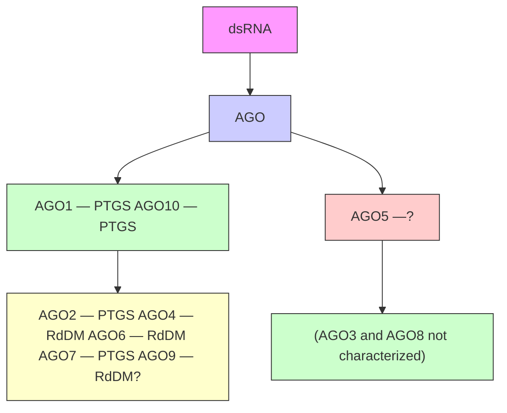
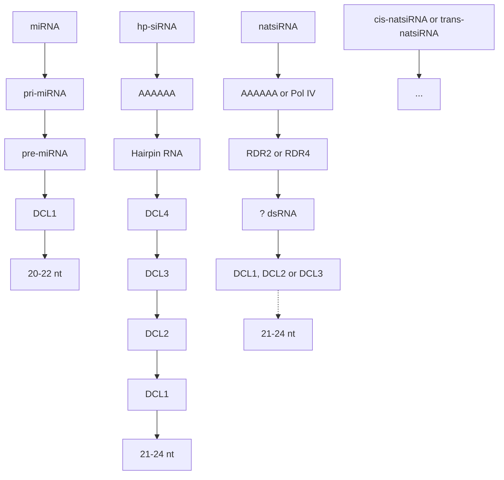
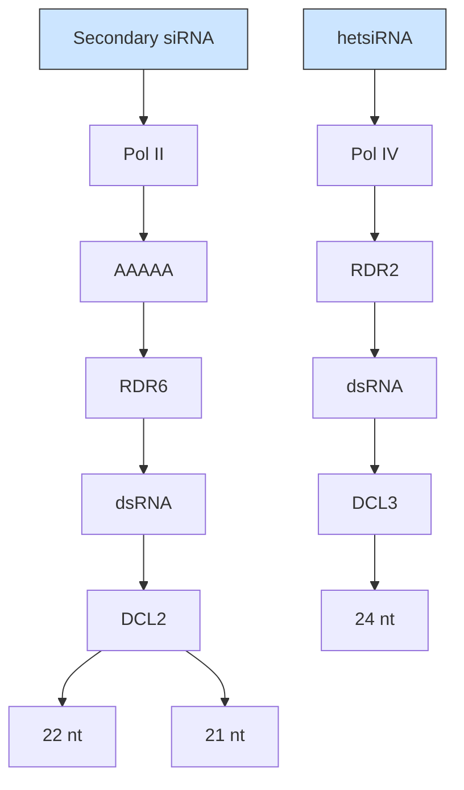
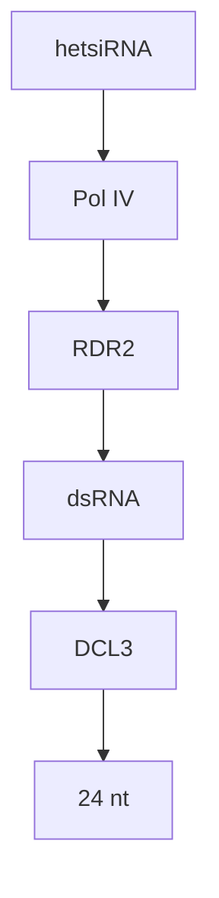
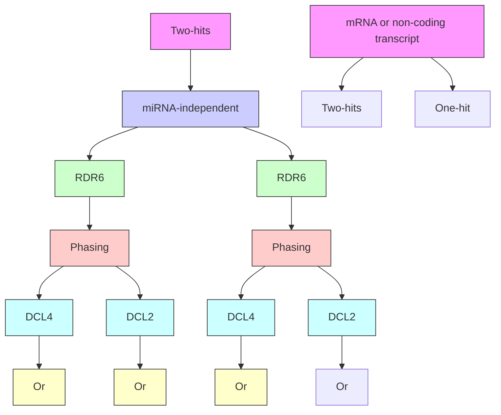
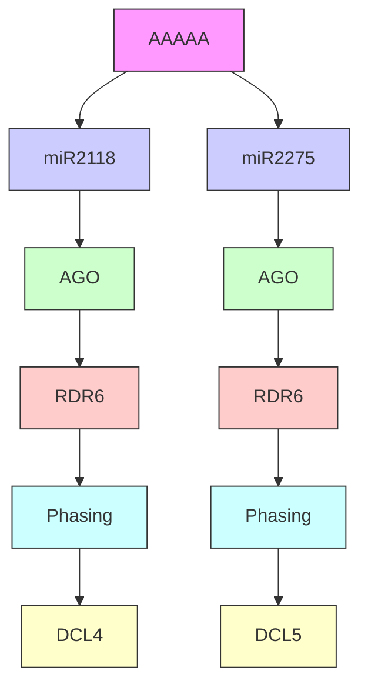
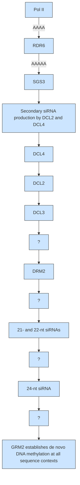
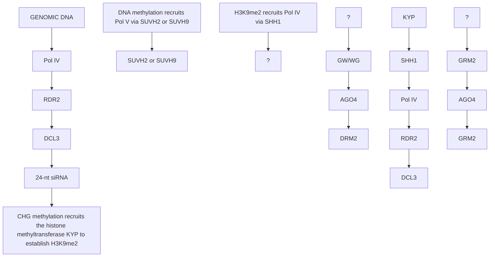

# The expanding world of small RNAs in plants

Filipe Borges and Robert A. Martienssen

Abstract | Plant genomes encode various small RNAs that function in distinct, yet overlapping, genetic and epigenetic silencing pathways. However, the abundance and diversity of small‑RNA classes varies among plant species, suggesting coevolution between environmental adaptations and gene‑silencing mechanisms. Biogenesis of small RNAs in plants is well understood, but we are just beginning to uncover their intricate regulation and activity. Here, we discuss the biogenesis of plant small RNAs, such as microRNAs, secondary siRNAs and heterochromatic siRNAs, and their diverse cellular and developmental functions, including in reproductive transitions, genomic imprinting and paramutation. We also discuss the diversification of small‑RNA-directed silencing pathways through the expansion of RNA-dependent RNA polymerases, DICER proteins and ARGONAUTE proteins.

# DICER-LIKE proteins

(DCLs). Plant orthologues of other eukaryotic ribonuclease III Dicer enzymes; required for small-RNA processing.

# ARGONAUTE proteins

(AGOs). The main effector proteins of gene silencing, which bind to small-RNA duplexes and promote small-RNA-mediated target recognition and cleavage.

# Paramutation

An inter-chromosomal sensing mechanism that initiates heritable epigenetic changes in trans. Small RNAs are often involved in this process by mediating RNA-directed DNA methylation.

# Howard Hughes Medical

Institute and Gordon and Betty Moore Foundation, Cold Spring Harbor Laboratory, 1 Bungtown Road, Cold Spring Harbor, New York 11724, USA.

Correspondence to R.A.M e‑mail: martiens@cshl.edu doi:10.1038/nrm4085 Published online 4 November 2015

Small RNAs are involved in plant development, reproduction and genome reprogramming, and the large variety of small‑RNA pathways in plants is likely to contribute to their phenotypic plasticity. It is generally accepted that these pathways evolved as a cellular defence mechanism against RNA viruses and transposable elements, and that they were later adapted to regulate the expression of endogenous genes. This is consistent with the fact that most small‑RNA classes have a recognized role in defence responses as well as in epigenetic regulation, but their relative importance and overlap varies among plant species1 . Most plant small RNAs are produced as 21–24‑nucleotide RNA molecules as a result of the activity of DICER-LIKE proteins (DCLs)2,3 , a process that relies on the formation of double-stranded RNA (dsRNA) intermediates from either hairpin precursors, which are derived from overlapping sense and antisense transcripts, or from the synthesis of dsRNA from single-stranded RNA (ssRNA) by RNA-DEPENDENT RNA POLYMERASEs (RDRs). Processed small‑RNA duplexes are loaded onto ARGONAUTE proteins (AGOs) to target coding RNAs or non-coding RNAs (ncRNAs) by sequence complementarity. Depending on the nature of the target transcript and the AGO involved, this process might lead to target cleavage and degradation, translational repression or recruitment of additional cofactors.

In this Review, we discuss recent findings and the current understanding of the origin and biogenesis of small RNAs in plants, and the molecular pathways contributing to their diversification and function. The duplication of genes encoding DCLs and RDRs resulted in the diversification of small RNAs4,5 , whereas the diversification of AGOs resulted in the development of distinct gene-silencing processes based on differential AGO affinities to small‑RNA duplexes6 (BOX 1). Endogenous small RNAs in plants can be divided into several major classes: microRNAs (miRNAs), hairpinderived siRNAs (hp‑siRNAs), natural antisense siRNAs (natsiRNAs), secondary siRNAs and heterochromatic siRNAs (hetsiRNAs). All small RNAs in plants are modified at the 3ʹ‑end by 2ʹ‑O‑methylation, including miRNAs, which lack this modification in animals. 2ʹ‑O‑methylation is essential to confer stability and protection from 3ʹ‑uridylation and degradation. In plants, miRNAs are involved in post-transcriptional gene silencing (PTGS) by transcript cleavage or translational repression and might trigger secondary siRNA production from RNA polymerase II (Pol II)‑derived cleaved transcripts. Although many small RNAs are involved in PTGS, the majority of siRNAs in plants are associated with RNA-directed DNA methylation (RdDM) and TGS. When established, TGS is maintained by 24‑nucleotidelong hetsiRNAs, which regulate important epigenetic mechanisms, such as imprinting and paramutation. Many small‑RNA biogenesis pathways have been genetically characterized in Arabidopsis thaliana, as these mutations are viable. In plants with larger genomes, hetsiRNAs have essential roles during reproductive transitions such as meiosis, gametogenesis and embryogenesis, and they are probably associated with the more repetitive nature of the genome.

Box 1 | Sorting small RNAs onto AGOs   
a 5′-terminal nucleotide preference by AGOs   


<details>
<summary>flowchart</summary>


</details>

b Structural determinants of miRNA sorting and function   


  
Mismatch at position 12 and base pairing at positions 10 and 11   
Mismatch at position 11 and passenger strand


  
Mismatch at position 15   
Base pairing at positions 11 and 15

The ARGONAUTE (AGO) family in plants has diversified extensively, giving rise to plant-specific AGOs154. The identity of the 5ʹ-terminal nucleotide of plant small RNAs has a strong effect on the loading of small RNAs onto specific AGOs, Nature Reviews | Molecular Celwhich determines their activity. This bias might be intrinsic to all AGOs, as in organisms with only one AGO (such as Schizosaccharomyces pombe), the protein has a strong bias towards small RNAs with a 5ʹ-uracil (see the figure, part a). In Arabidopsis thaliana, AGO1 and AGO10 also bind to small RNAs with a 5ʹ-uracil, whereas AGO2, AGO4, AGO6, AGO7 and AGO9 prefer adenine and AGO5 has a bias for cytosine111,155,156 (see the figure, part a). This 5ʹ-nucleotide specificity is determined by a structural loop lining the small-RNA-binding pocket in the MID domain of AGOs157. An additional layer of complexity is particularly obvious for microRNA (miRNA) loading, which is also affected by the imperfect complementarity and bulges that characterize miRNA‑duplex structures. For example, AGO10 is a crucial regulator of shoot apical meristem (SAM) specification because of its preferential interaction with miR166, which is mediated by one internal base mismatch flanked by two paired bases within the mature duplex158–160 (see the figure, part b). This prevents the loading of miR166 onto AGO1 and silencing of the class III homeodomain Leu zipper (HD‑ZIP) transcription factors in the SAM158,159. Another example is miR390, which is preferentially loaded onto AGO7 (see the figure, part b), leading to the production of trans-acting siRNAs (tasiRNAs) from tasiRNA PRECURSOR 3 (TAS3) transcripts67,161. AGO7 association with miR390 involves not only a preference for a 5ʹ‑adenine but also a mismatch at position 11 of the miRNA duplex162. Importantly, during the AGO7–miR390 interaction, AGO7‑mediated cleavage of the complementary strand is required to establish a functional silencing complex162 (see the figure, part b).

The miR393b duplex provides another interesting example of miRNA sorting in plants, as its guide strand is loaded onto AGO1, whereas the other strand, miR393b\*, is loaded onto AGO2 and plays an essential part in mediating antibacterial defence163. Mechanistic insight into this type of small‑RNA sorting was recently reported, showing that the 15th nucleotide of a miR165 duplex directs miRNA loading onto both AGO1 and AGO2 through their PIWI domain (see the figure, part b). By contrast, AGO2 preferential binding to miR396\* requires base pairing at positions 11 and 15 of the duplex, whereas AGO1 tolerates mismatches at these central positions164 (see the figure, part b). The importance of this mechanism was illustrated using the miR165–miR165\* duplex, for which removing the 15th nucleotide mismatch in artificial miR165 stem–loops led to loading onto AGO2 instead of AGO1, downregulation of miR165 target genes and partial suppression of the adaxialized phenotype, which is characteristic of ago1-mutant alleles164. dsRNA, double-stranded RNA; PTGS, post-transcriptional gene silencing; RdDM, RNA-directed DNA methylation.

# The biogenesis of small RNAs in plants

Processing of dsRNA into small RNAs requires the activity of Dicer enzymes. The smallest functioning Dicer is found in budding yeasts (although not in Saccharomyces cerevisiae) and is composed of a ribonuclease III domain and a dsRNA-binding domain (dsRBD), but it lacks the DExD box helicase and PIWI–AGO–ZWILLE (PAZ) domains that are found in higher eukaryotes4,7 . The PAZ domain binds the 2‑nucleotide-long 3ʹ‑overhang of dsRNAs and is connected to the catalytic domain through an α‑helical structure that acts as a ruler to determine small‑RNA size. The four DCL proteins in A. thaliana have been well characterized2,3 , indicating that the duplication of DCL genes occurred early in plant evolution.

The synthesis of dsRNAs by RDRs contributed significantly to the expansion, diversification and evolution

a PTGS   


<details>
<summary>flowchart</summary>


</details>

mRNA cleavage and translational repression

b PTGS and TGS   


<details>
<summary>flowchart</summary>


</details>

mRNA cleavage, translational repression and DNA methylation

c TGS   


<details>
<summary>flowchart</summary>


</details>

DNA methylation

Figure 1 | Main pathways for biogenesis of endogenous small RNAs in plants. a | Genes encoding microRNAs (mi­RNAs; left) are transcribed by RNA polymerase II (Pol II) and fold into hairpin-like structures called primary mi­RNAs (pri-miRNAs), which are processed by DICER-LIKE 1 (DCL1) into shorter stem–loop structures called precursor miRNAs (pre-miRNAs). Pre-miRNAs are processed again by DCL1 into the mature miRNA duplex. During miRNA processing, DCL1 is assisted by several proteins (reviewed in REF. 8). miRNAs are involved in post-transcriptional gene silencing (PTGS) by mediating mRNA cleavage or translational repression. Longer Pol II‑derived hairpins, termed hairpin-derived siRNAs (hp‑siRNAs; middle), might originate from inverted repeats and are originally processed by all DCLs. These hairpins might evolve into miRNAs and are often designated proto-miRNAs. Natural antisense siRNAs (natsiRNAs; right) are produced from double-stranded RNAs (dsRNAs) originating from overlapping transcription (cis-natsiRNAs), or from highly complementary transcripts originating from different loci (trans-natsiRNAs)174–176. The biogenesis and function of natsiRNAs is still largely unclear. b | The precursors of secondary siRNAs are transcribed by Pol II and may originate from non-coding loci, protein-coding genes and transposable elements. These transcripts are converted into dsRNA by RNA-DEPENDENT RNA POLYMERASE 6 (RDR6) and processed by DCL2 and DCL4 to produce siRNAs of 22 or 21 nucleotides (nt) in length, respectively. Secondary siRNAs are mostly involved in PTGS, but they can also initiate RNA-directed DNA methylation (RdDM) at specific loci. They are subdivided into trans-acting siRNAs (tasiRNAs)34,66,161,177, phased siRNA (phasiRNAs)65 and epigenetically activated siRNAs (easiRNAs)77,178. c | Heterochromatic siRNAs (hetsiRNAs) are derived from transposable elements and repeats that are preferentially located at pericentromeric chromatin. Their biogenesis requires Pol IV transcription and the synthesis of dsRNA by RDR2, which is subsequently processed into 24‑nt‑long siRNAs by DCL3. These small RNAs are involved in maintaining RdDM-mediated TGS (reviewed in REF. 31).

of small‑RNA functions. RDR genes are found in RNA viruses, plants, fungi, protists and some animals, but are absent in flies, mice and humans. Compared to the DCL family, the RDR family seems to be more complex, and many RDR genes remain uncharacterized5 . Generally, there are three main pathways that are responsible for the biogenesis of the vast majority of small RNAs in plants: one for the biogenesis of miRNAs; one for the biogenesis of 21‑ and 22‑nucleotide secondary siRNAs; and another for the biogenesis of 24‑nucleotide hetsiRNAs (FIG. 1).

The origin and biogenesis of miRNAs. Plant miRNAs, which are typically 20–22 nucleotides in length, are endogenous genes transcribed by Pol  II into long primary miRNAs (pri-miRNAs), which are singlestranded and polyadenylated RNA molecules that fold into hairpin-like structures (FIG.  1a). The primiRNAs are cleaved by DCL1 into smaller stem–loop structures, called precursor miRNAs (pre-miRNAs), which are subsequently processed again by DCL1 to produce the mature miRNA duplexes consisting of the active miRNA strand and its complementary miRNA strand. miRNA biogenesis pathways are particularly well described in A. thaliana, from which several DCL1 partners have been characterized as required for pri-miRNA processing (reviewed in REF. 8).

miRNAs mediate PTGS through mRNA cleavage or translation repression, and they play essential parts in plant development. Null dcl1 alleles in A. thaliana are embryonic lethal9 , whereas different hypomorphic alleles give rise to variable defects in integument, ovule and floral development, and also have maternal effects10.

DCL1 knockdown in rice also results in defects in plant growth and in shoot, root and leaf development, and ultimately leads to developmental arrest11. fuzzy tassel (fzt) mutants are hypomorphic dcl1 alleles and in maize have a broad range of vegetative and reproductive defects, as in these plants the abundance of some miRNAs is more dramatically reduced than that of others12. The vast majority of miRNA genes are species- or family-specific, suggesting rapid evolution and a high turnover rate13,14.

A subtype of miRNAs in A. thaliana and rice consists of relatively rare longer miRNAs that are 23–25 nucleotides in length, are processed by DCL3 and function in TGS15–17. Furthermore, in A. thaliana, DCL4 was found to process a class of newly evolved miRNAs14,18,19. These observations have led to the idea that pre-miRNA recognition by different DCLs might reflect the evolution of miRNA genes: some of these newer, DCL4‑processed pre-miRNAs are long and have complementarity with their targets that extends beyond that of the mature miRNA, suggesting that the miRNA genes arose from inverted duplications of their target genes14,20,21 and that DCL2, DCL3 and DCL4 processed these longer hairpins (or proto-miRNAs) into small RNAs of different sizes (hp‑siRNAs) (FIG. 1a). During evolution, the near-perfect sequence complementarity in proto-miRNA hairpins has decreased and has consequently been refined into smaller transcripts that are now processed by DCL1 as a single miRNA duplex22. It has also been proposed that miRNAs could have originated in a similar fashion from miniature inverted-repeat transposable elements (MITEs), because MITEs create hairpin RNAs resembling proto-miRNAs when they are transcribed23,24.

The origin and biogenesis of siRNAs. Long dsRNAs that are the precursors of siRNAs can arise from the hybridization of sense and antisense transcripts, from the folding back of an inverted-repeat sequence, from the hybridization of unrelated RNA molecules with sequence complementarity or, most commonly, following synthesis by RDRs (reviewed in REF. 1). Long dsRNA molecules can be synthesized by RDRs with or without initial priming25,26, resulting in the amplification of a primary, small‑RNA-mediated silencing-triggering signal. The three major clades of eukaryotic RDRs are RDRα, RDRβ and RDRγ; the RDRα clade is present in the fungal, plant and animal kingdoms, whereas RDRβ has been found in only animals and fungi and RDRγ in only plants and fungi5,27. In A. thaliana, the RDRα clade comprises RDR1, RDR2 and RDR6, and the RDRγ clade comprises RDR3, RDR4 and RDR5. The RDRγ clade remains functionally uncharacterized in plants, but the presence and expression of at least one of its members in several other plant genomes and in many fungi suggests functional significance5,27. Interestingly, efficient antiviral defence and viral siRNA biogenesis were detected in A. thaliana plants with mutations in the three RDRα genes, rdr1, rdr2 and rdr628, indicating that RDR3, RDR4 and RDR5 might represent alternative pathways for antiviral defence. In addition, in the fission yeast Schizosaccharomyces pombe, RDRγ is involved in TGS29.

Endogenous siRNAs in plants are primarily processed by DCL2, DCL3 and DCL4, and have been categorized into secondary siRNAs (FIG. 1b) and hetsiRNAs (FIG. 1c). Secondary siRNAs include different subclasses, such as trans-acting siRNAs (tasiRNAs), phased siRNAs (phasiRNAs), epigenetically activated siRNAs (easiRNAs) and natsiRNAs. The most abundant small RNAs are the 24‑nucleotide hetsiRNAs, which mediate transcriptional silencing of transposons and pericentromeric repeats through RdDM (reviewed in REFS 30,31). The biogenesis of hetsiRNAs requires transcription by Pol IV, followed by dsRNA synthesis by RDR2 and processing by DCL3 (FIG. 1c). By contrast, 21‑ and 22‑nucleotide secondary siRNAs (such as tasiRNAs, phasiRNAs and easiRNAs) are produced by DCL4 and DCL2, respectively, following Pol II transcription and dsRNA synthesis by RDR6 (FIG. 1b). DCL2 is often regarded as a backup for DCL4, as DCL2 is recruited to dsRNA following the deletion of DCL4 (REF. 32). RDR1 activity is mostly associated with the amplification of exogenous, virus-derived small RNAs, being part of the main plant antiviral RNAi system together with DCL2 and DCL4 (REFS 28,33). Additional processing of siRNA requires SUPPRESSOR OF GENE SILENCING 3 (SGS3), which functions together with RDR6 (REF. 34), and dsRNA‑BINDING 4 (DRB4), which interacts with DCL4 in the production of endogenous and exogenous 21‑nucleotide siRNAs35.

# Small‑RNA modifications

Small‑RNA modifications can regulate their abundance and function, thus contributing to the regulation of gene silencing. In plants, these modifications have been observed primarily at the 3ʹ‑end and are essential to confer stability and to prevent small‑RNA degradation. Further mechanistic insight into these pathways in A. thaliana has suggested that protective RNA modifications are bypassed in certain tissues and cell types or under certain growth conditions, thereby promoting small‑RNA diversity.

2ʹ‑O‑methylation and uridylation. After processing, eukaryotic small‑RNA duplexes such as siR‑NAs, miRNAs and PIWI-interacting RNAs (piRNAs) can be modified by 2ʹ‑O‑methylation, 3ʹ‑uridylation or 3ʹ‑adenylation, and adenosine deamination36. 2ʹ‑O‑methylation of the terminal 3ʹ‑nucleotide is important for miRNA and siRNA stability, because unmethylated small RNAs are signalled for degradation by 3ʹ‑uridylation37,38. Plant small RNAs are 2ʹ‑O‑methylated at the 3ʹ‑terminal by HUA ENHANCER 1 (HEN1)37–39 to prevent uridylation by the nucleotidyl transferase HEN1 SUPPRESSOR  1 (HESO1)40,41; uridylation is usually a signal for degradation by SMALL RNA DEGRADING NUCLEASE 1 (SDN1)42 (FIG. 2). Loss of 2ʹ‑O‑methylation activity in A. thaliana results in severe developmental defects, probably because essential miRNAs are depleted39,43. Small‑RNA 3ʹ‑uridylation has also been observed in the algae Chlamydomonas reinhardtii and requires the nucleotidyl transferase MUT68 (REF.  44), whereas in humans and Caenorhabditis elegans, many enzymes have been shown to uridylate

# PIWI-interacting RNAs

(piRNAs). Members of a large class of small RNAs produced in animal cells that form functional silencing complexes by loading onto PIWI proteins. piRNA complexes are mainly involved in the posttranscriptional gene silencing of retrotransposons in the germ line.


<details>
<summary>flowchart</summary>

```mermaid
graph TD
    A["miRNA duplex"] --> B["21-nt miRNA"]
    B --> C["HESO1"]
    C --> D["SDN1"]
    D --> E["Degradation"]
    E --> F["Monouridylation"]
    F --> G["22-nt miRNA"]
    G --> H["Secondary siRNA"]
    H --> I["Uridylated miRNAs can trigger PTGS"]
    
    subgraph HEN1-mediated 2'-O-methylation protects small RNAs from AGO1-dependent uridylation and degradation
        J["Me"] --> K["AGO1"]
        L["Me"] --> K
        M["Me"] --> K
        N["Me"] --> K
        O["Me"] --> K
        P["Me"] --> Q["AGO1"]
        R["Me"] --> Q
        S["Me"] --> T["AGO1"]
        U["Me"] --> T
        V["Me"] --> W["AGO1"]
        X["Me"] --> W
        Y["Me"] --> Z["AGO1"]
        AA["Me"] --> Z
        AB["Me"] --> AC["AGO1"]
        AD["Me"] --> AC
        AE["Me"] --> AF["AGO1"]
        AG["Me"] --> AF
        AH["Me"] --> AI["AGO1"]
        AJ["Me"] --> AI
        AK["Me"] --> AL["AGO1"]
        AM["Me"] --> AL
        AN["Me"] --> AO["AGO1"]
        AP["Me"] --> AO
        AQ["Me"] --> AR["AGO1"]
        AS["Me"] --> AR
        AT["Me"] --> AU["AGO1"]
        AV["Me"] --> AU
        AW["Me"] --> AX["AGO1"]
        AY["ME"] --> AX
        AZ["ME"] --> BA["AGO1"]
        BB["ME"] --> BA
        BC["ME"] --> BD["AGO1"]
        BE["ME"] --> BD
        BF["ME"] --> BG["AGO1"]
        BH["ME"] --> BG
        BI["ME"] --> BJ["AGO1"]
        BK["ME"] --> BJ
        BL["ME"] --> BM["AGO1"]
        BN["ME"] --> BM
        BO["ME"] --> BP["AGO1"]
        BQ["ME"] --> BP
        BR["ME"] --> BS["AGO1"]
        BT["ME"] --> BS
        BU["ME"] --> BV["AGO1"]
        BW["ME"] --> BV
        BX["ME"] --> BY["AGO1"]
        BZ["ME"] --> BY
        BZB["ME"] --> BY
        BZC["ME"] --> BY
    end
    
    style HEN1-mediated_2'0_methylation fill:#f9f,stroke:#333
    style HEN1-mediated_2'0_methylation fill:#ccf,stroke:#333
    style HEN1-mediated_2'0_methylation fill:#cfc,stroke:#333
    style HEN1-mediated_2'0_methylation fill:#fcc,stroke:#333
    style HEN1-mediated_2'0_methylation fill:#ffc,stroke:#333
    style HEN1-mediated_2'0_methylation fill:#cfc,stroke:#333
    style HEN1-mediated_2'0_methylation fill:#fcc,stroke:#333
    style HEN1-mediated_2'0_methylation fill:#ffc,stroke:#333
    style HEN1-mediated_2'0_methylation fill:#cfc,stroke:#334
    style HEN1-mediated_2'0_methylation fill:#fcc,stroke:#334
    style HEN1-mediated_2'0_methylation fill:#ffc,stroke:#334
    style HEN1-mediated_2'0_methylation fill:#cfc,stroke:#334
    style HEN1-mediated_2'0_methylation fill:#fcc,stroke:#334
    style HEN1-mediated_2'0_methylation fill:#ffc,stroke:#334
    style HEN1-mediated_2'0_methylation fill:#cfc,stroke:#334
    style HENI-mediated_2'0_methylation fill:#f9f,stroke:#333
    style HENI-mediated_2'0_methylation fill:#ccf,stroke:#333
    style HENI-mediated_2'0_methylation fill:#cfc,stroke:#334
    style HENI-mediated_2'0_methylation fill:#fcc,stroke:#334
    style HENI-mediated_2'0_methylation fill:#ffc,stroke:#334
    style HENI-mediated_2'0_methylation fill:#cfc,stroke:#334
    style HENI-mediated_2'0_methylation fill:#fcc,stroke:#334
    style HENI-mediated_2'0_methylation fill:#ffc,stroke:#334
    style HENI-mediated_2'0_methylation fill:#cfc,stroke:#334
    style HEN1-mediated_2'0_methylation fill:#f9f,stroke:#333
    style HENI-mediated_2'0_methylation fill:#ccf,stroke:#333
    style HENI-mediated_2'0_methylation fill:#cfc,stroke:#334
    style HENI-mediated_2'0_methylation fill:#fcc,stroke:#334
    style HENI-mediated_2'
```
</details>

Figure 2 | 2ʹ‑O‑methylation, uridylation and degradation of microRNAs (miRNAs) in Arabidopsis thaliana.   
Nature Reviews | Molecular Cell BioMicroRNA (miRNA) duplexes are 2ʹ-O‑methylated at both 3ʹ-ends by HUA ENHANCER 1 (HEN1), which protects them from uridylation and degradation (left). HEN SUPPRESSOR 1 (HESO1) and UTP:RNA URIDYLYLTRANSFERASE 1 (URT1) are nucleotidyl transferases that uridylate unprotected 3ʹ-ends of small RNAs, triggering their degradation by the 3ʹ–5ʹ exonucleases of the family SMALL RNA DEGRADING NUCLEASEs (SDNs; middle). ARGONAUTE 1 (AGO1) recruits HESO1 during mRNA‑target recognition and cleavage to polyuridylate and degrade the 3ʹ-end of cleaved target transcripts52. Thus, the 3ʹ-methylation of miRNAs loaded onto AGO1 protects them from HESO1 activity. Recent studies have shown that URT1 also interacts with AGO1 to establish monouridylation of particular miRNAs53,54 (right), and this process may produce 22‑nucleotide miRNA variants that are able to form functional RNA-induced silencing complexes and trigger posttranscriptional gene silencing (PTGS)54 (FIG. 3a). HESO1 and URT1 have been shown to act both independently and synergistically, perhaps reflecting their different affinities for 3ʹ-terminal nucleotides in vitro. HESO1 has a preference for tailing 3ʹ-uracil, whereas URT1 prefers 3ʹ-adenine54. Although these features explain how these enzymes act synergistically at non‑3ʹ-uracil miRNA targets (URT1 forms substrates for HESO1), it does not fully account for their substrate preferences in vivo53,54.

miRNAs in a sequence-specific manner45. In human cells, polyuridylation of pre-miRNAs is performed by terminal uridylyltransferase 4 (TUT4; also known as ZCCHC11). The recruitment of TUT4 to pre-miRNAs by the RNA‑binding protein LIN28 destabilizes the premiRNAs and reduces the levels of mature miRNAs46,47. In contrast to LIN28‑dependent polyuridylation, LIN28‑independent monouridylation by TUTs is required for the processing of certain pre-miRNAs in human cells48. In C. elegans, the uridylation of some siRNAs restricts them to binding only to the AGO protein chromosome-segregation and RNAi‑deficient 1 (CSR‑1), thus reducing their abundance. The lower abundance of these siRNAs is necessary for proper chromosome segregation49 and facilitates the recognition of self from non‑self mRNA in the germ line50,51.

Although it is clear that these modifications have an essential role in regulating small‑RNA biogenesis and function, it remains poorly understood how these factors are recruited to miRNA‑processing complexes in plants. In A. thaliana, polyuridylation and degradation of the guide strand of miRNA duplexes requires loading onto AGO1, which has been shown to interact directly with HESO1 (REF. 38). This suggests that the primary role of 2ʹ‑O‑methylation is to protect miRNAs from the AGO1‑associated HESO1 activity that also uridylates 3ʹ‑ends of cleaved target transcripts and leads to their degradation52 (FIG. 2). Recent studies have shown that HESO1 acts on most miRNAs, whereas the monouridylation of certain miRNAs requires another nucleotidyl transferase, UTP:RNA URIDYLYLTRANSFERASE 1 (URT1)53,54. HESO1 seems to be more processive than URT1, perhaps because of their different substrate preferences, which depend on the 3ʹ‑terminal nucleotide of the small RNAs: URT1 prefers 3ʹ‑adenine, whereas HESO1 has a strong preference for 3ʹ‑uridine, thus explaining why it polyuridylates its substrates. These enzymes also act synergistically to uridylate some miRNAs, as HESO1 acts on some monouridylated small RNAs derived from URT1 activity54 (FIG. 2). Uridylation of miRNAs by URT1 and HESO1 is generally associated with reduced efficiency of target gene cleavage. An exception to this is the monouridylation of miR170 and miR171a by URT1; the resulting 22‑nucleotide miRNA variants lead to the production of secondary siRNAs from their target transcripts and to efficient gene silencing38,54 (see below). This indicates that tailed miRNAs loaded onto AGO complexes could be non-canonically functional.

# RNA-induced silencing complexes

Protein complexes that include Argonaute proteins and small RNAs. The small RNAs hybridize to complementary arget RNAs, which then undergo cleavage or translational repression, or recruit other factors such as chromatin modifiers.

Other types of miRNA tailing were found in mutants lacking both HESO1 and URT1 activities, including nonuridine nucleotides53, suggesting that other small‑RNA modification pathways might exist in plants. There are eight nucleotidyl transferases that remain uncharacterized in A. thaliana, and these could have a role in miRNA modification or in processes using secondary siRNAs or hetsiRNAs.

Novel small‑RNA modifications in plants. Recent efforts to discover novel small‑RNA modifications have identified base modifications by comparing mismatches between genomic sequences and sequencing reads of small RNAs, as some modifications result in preferential nucleotide misincorporation by reverse transcriptases during cDNA synthesis55. Such analyses revealed frequent A‑to‑G, G‑to‑A and U‑to‑C substitutions in A. thaliana and rice small‑RNA data56,57. U‑to‑C substitutions were also detected in small RNAs from rice anthers58 and are probably the result of reverse transcriptase misincorporation at modified uracil, as editing enzymes responsible for U‑to‑C conversion have not been found in plants. Such U‑to‑C mismatches in small‑RNA reads could be caused by pseudouridine, which is abundant in structured RNAs and is required for the stabilization and function of tRNAs and ribosomal RNAs59. Pseudouridylation in eukaryotic small RNAs has not been directly observed but was recently reported in mRNAs in yeast and humans60,61. Putative functions for pseudouridine might be the stabilization and transport of small‑RNA duplexes, as pseudouridylation is essential for tRNA biogenesis and nuclear export in yeast62,63.

# Secondary siRNA biogenesis and control

PTGS in plants can be amplified when miRNA-mediated cleavage or aberrant processing of particular transcripts leads to the formation of dsRNAs by RDR proteins, which are subsequently processed by DCLs into secondary siRNAs. This powerful silencing machinery is conserved within the plant kingdom but, notably, it has widely differing targets in different plant species (such as A. thaliana, rice, maize and soybean), including mRNAs, ncRNAs and repeat-derived RNAs. Depending on their precursor mRNAs, secondary siRNAs have been classified into different subclasses, such as tasiRNAs and phasiRNAs. Although tasiRNAs have been demonstrated to act in trans, phasiRNAs are phased secondary siRNAs of unknown function, which could include coding and non-coding transcripts64.

The biogenesis of tasiRNAs and phasiRNAs. The production of secondary, RDR-dependent small RNAs, such as tasiRNAs and phasiRNAs, requires transcript targeting by miRNAs65 (FIG. 3). Targeting by two 21‑nucleotide miRNAs at independent target sites along the transcript (‘two hits’) or by a single 22‑nucleotide miRNA (‘one hit’) can trigger the production of secondary RNA from transcripts34,66,67 (FIG. 3a). In addition, the structure of particular miRNA duplexes may also influence siRNA biogenesis regardless of miRNA length68. Cleaved transcripts function as templates for dsRNA synthesis by RDR6 and for the production of 21- and 22‑nucleotide siRNAs by DCL4 and DCL2, respectively, which can function in trans to target other transcripts. Secondary siRNAs are often phased so that their first nucleotide occurs every 21 or 22 nucleotides from the miRNA‑cleavage site65,66,69. This is because DCL2 and DCL4 digest the dsRNA processively (FIG. 3) and might even interact directly with RDR6. However, phasing can be difficult to detect when there are multiple miRNA‑cleavage sites or multiple related template RNAs.

Secondary siRNAs are relatively rare in somatic cells of wild-type A. thaliana, even though many mRNA targets generate secondary siRNAs in this species69. By contrast, other plant genomes, such as those of rice and maize, contain thousands of tasiRNA- and phasiRNAgenerating loci that encode large families of ncRNAs65. The biogenesis and functions of tasiRNAs have been well studied in A. thaliana, which has only four families of tasiRNA PRECURSOR (TAS) genes. The TAS1a, TAS1b, TAS1c and TAS2 loci are targeted by miR173, whereas the TAS3a, TAS3b and TAS3c loci are targeted by miR390 and the production of TAS4‑derived tasiRNAs is triggered by miR828 (REFS 18,34,66). TAS3 is the best‑conserved TAS locus, as it is also present in moss, rice, maize and gymnosperms65. TAS3‑derived siRNAs are designated tasiRNA AUXIN RESPONSE FACTORs (tasi‑ARFs), and their production requires a two-hit system with miR390, which is exclusively loaded to a specialized AGO (AGO7) to regulate auxin-related developmental responses (BOXES 1,2).

In maize anthers, phasiRNAs are produced from ncRNA precursors designated PHAS ncRNAs (FIG. 3b). There are thousands of PHAS loci in grass genomes, and they are transcribed by Pol II, capped and polyadenylated, resembling protein-coding and TAS genes in this respect. In both rice and maize, internal cleavage directed by miR2118 triggers the production of 21‑nucleotide phasiRNAs, whereas miR2275‑directed cleavage triggers the production of 24‑nucleotide phasiRNAs70–72. It is hypothesized that a complex containing homologues of RDR6 and SGS3 recognizes the 3ʹ‑end of cleaved PHAS transcripts and synthesizes dsRNA from the poly(A) tail to the cleavage site73. The dsRNAs are subsequently processed by DCL4 and DCL5 to generate 21- and 24‑nucleotide phasiRNAs, respectively74. Both DCL4 and DCL5 in grasses have phased activity, generating populations of regularly spaced siRNAs from each PHAS precursor65. Although the expression of non-coding PHAS loci is anther-specific in grasses, the miR2118‑482 superfamily is conserved in dicots and triggers phasiRNA production from genes coding for proteins that contain nucleotide‑binding domain and Leu‑rich repeat (NB‑LRR) motifs in legumes and solanaceous species64,75,76, as well as in some gymnosperms64. NB‑LRR‑containing disease‑resistance genes encode innate immunity receptors, and these phasiRNAs in legumes and Solanaceae seem to be beneficial for plant– microorganism interactions and plant immunity. It is likely that this elaborate defence mechanism was lost in grasses, to be replaced by various non-coding PHAS loci producing different types of anther-specific phasiRNAs65.

a Triggers of secondary siRNA production in plants   


<details>
<summary>flowchart</summary>


</details>

b PhasiRNA biogenesis pathway in grasses   


<details>
<summary>flowchart</summary>


</details>

Figure 3 | Triggers of secondary siRNA biogenesis. a | Plant microRNAs (miRNAs) target transcripts for cleavage or translational repression and also trigger the production of secondary siRNAs from mRNAs, non-coding RNAs and Nature Reviews | Molecular Cell Biologtransposable elements. The most accepted mechanism for the biogenesis of trans-acting siRNA (tasiRNA), phased siRNA (phasiRNA) and epigenetically activated siRNA (easiRNA) relies on two distinct pathways. One consists of a ‘two-hit’ system, which uses two 21‑nucleotide (nt) mi­RNAs per transcript and requires the activity of an RNA-induced silencing complex containing ARGONAUTE 7 (AGO7). The second pathway consists of a ‘one-hit’ system that usually involves a 22‑nt miRNA loaded on AGO1, or 22‑nt miRNA variants that are produced from monouridylation of 21‑nt miRNAs (see FIG. 2). Both pathways are routed towards RNA-DEPENDENT RNA POLYMERASE 6 (RDR6)-mediated double-stranded RNA (dsRNA) synthesis, aided by SUPPRESSOR OF GENE SILENCING 3 (SGS3), and processing of 21‑nt and 22‑nt siRNAs by DICER-LIKE 4 (DCL4) and DCL2, respectively. RNA polymerase II (Pol II)-derived transcripts might also produce miRNA-independent secondary siRNA through interactions with other RNA‑processing machineries, such as the spliceosome85, or during RNA decay100,101, but these pathways are not fully understood. b | An additional phasiRNA biogenesis pathway was found in monocot plants, such as maize and rice, and involves the transcription of non-coding PHAS transcripts from intergenic loci. Two miRNAs (miR2118 and miR2275) were found to be involved in cleavage of PHAS transcripts by an unknown AGO. These cleavage products are converted into dsRNA by RDR6 and SGS3, and processed into 21- and 24‑nt phasiRNAs by DCL4 and DCL5, respectively (reviewed in REF. 65).

easiRNAs are produced from active retrotransposons. miRNAs are also able to trigger secondary siRNA biogenesis from transcriptionally reactivated transposable elements, using a genetic pathway similar to that used by tasiRNAs77. Reactivation of some transposons and easiRNA biogenesis occur in wild-type A. thaliana pollen during epigenetic reprogramming78, in cell cultures79 or under stress conditions80. In DNA‑methylation mutants, such as decreased dna methylation 1 (ddm1) and dna methyltransferase 1 (met1; also known as dmt1)78,81, as many as 2,500 transposons are activated and subsequently targeted by more than 50 miRNAs77. These miRNAs have well-known functions in plant development and are highly conserved, although targeting does not always result in easiRNA production77. It is therefore possible that miRNAs originally evolved to target transposons and only subsequently adopted other functions, such as gene regulation and triggering the processing of tasiRNA and phasiRNA from noncoding precursors. This hypothesis is consistent with pre‑miRNAs having a transposon origin82 (see above), as transposable element-derived proto-miRNA could target related transposons.

RNAi and splicing. Secondary‑siRNA biogenesis pathways may also interact with additional cellular pathways that silence transposable elements and transgenes, such as RNA splicing. Recent work in yeast and flies has shown that stalled spliceosomes at weak splice sites and suboptimal introns could function as a signal to trigger RNAi, thus representing a way to discriminate between transposons or precursors of small RNAs and

# Box 2 | Intercellular movement and transgenerational inheritance of small RNAs

Different small‑RNA classes have been associated with non-cell‑autonomous signalling involving short‑distance (cell‑to‑cell) and long‑distance (between organs) movement of small RNAs165,166. Intercellular movement has broad implications for cell-to-cell communication and transgenerational inheritance of epigenetic signals78,149. Spatiotemporal coordination of cell fate decisions and tissue patterning in multicellular organisms also depend on intercellular communication by small RNAs. For example, adaxial–abaxial (upper–lower) patterning of lateral organs in plants requires two types of mobile small RNA with opposing functions: the microRNAs (miRNAs) miR165 and miR166 (produced in the lower side of the leaf) restrict the accumulation of class III homeodomain Leu zipper (HD‑ZIP) transcription factors to the upper ventral domain, whereas the trans-acting siRNA (tasiRNA)-AUXIN RESPONSE FACTORs (tasi-ARFs; produced in the upper side of the leaf) are able to diffuse and create a gradient to restrict their targets (ARF3 and ARF4) to the lower ventral domain (reviewed in REF. 167). Non-cell-autonomous small RNAs are also required for radial patterning of root tissues, which is regulated in part by the transcription factors SHORT-ROOT (SHR) and SCARECROW (SCR), which act together to induce the expression of miR165 and miR166 (REF. 168). Following induction in the endodermal cell layer, miR165 and miR166 move into the central vascular cylinder and target the class III HD‑ZIP transcripts, creating a radial gradient that is important for the differentiation of the central vascular tissues168.

Considering the primary evolutionary role of small RNAs as a genome defence mechanism against viruses and transposons, several studies have attempted to define the molecular requirements for biogenesis and systemic transmission of silencing signals in several organisms. In plants, siRNAs from reporter transgenes, as well as endogenous sequences, are able to spread systemically and induce gene silencing in recipient cells, but several questions remain regarding the biogenesis of small RNAs in response to environmental cues and the transgenerational inheritance of newly acquired epigenetic states (reviewed in REF. 169). In the Arabidopsis thaliana male and female gametophytes, small-RNA movement has been proposed to follow epigenome reprogramming, which results in transcriptional reactivation of transposable elements in germline companion cells78,149. These small-RNA-directed mechanisms could provide surveillance of, and protection against, transposon activity during meiosis and epigenomic reprogramming in the germ line78,149, or in the seed after fertilization170. Additional sources of transposon-derived siRNAs during reprogramming in the gametophytes were also associated with genomic imprinting through targeted DNA demethylation and RNA-directed DNA methylation (RdDM)171–173. From these studies, it is clear that the high degree of reprogramming observed during plant gametogenesis provides many possibilities for establishing novel and beneficial epigenetic states by mobile small RNAs.

# Exosome

A multi-protein complex involved in 3ʹ–5ʹ degradation of RNA molecules such as mRNAs or ribosomal RNAs.

# Processing bodies

(P-bodies). Cytoplasmic foci that have essential roles in most mRNA-decay mechanisms, including decapping and nonsense-mediated decay, as well as in storing processed mRNAs to postpone their translation.

# siRNA-bodies

Cytoplasmic foci in plant cells, at which RNA-DEPENDENT RNA POLYMERASE 6 (RDR6) and SUPPRESSOR OF GENE SILENCING 3 (SGS3) synthesize double-stranded RNA from single-stranded RNA.

protein-coding transcripts83,84. In fact, previous studies in A. thaliana have shown that intron splicing is a potent suppressor of RDR6‑dependent PTGS85 and, notably, this requires SERRATE and the nuclear cap-binding complex ABA HYPERSENSITIVE 1 (ABH1), which are components of the miRNA biogenesis pathway86–88. However, SERRATE function during intron splicing seems to be miRNA-independent, and it is unclear whether ABH1 and miRNAs are directly involved in splicing or in the expression of specific splicing factors. It is possible that splicing suppresses PTGS by removing potential miRNA‑target sites located within introns, but this hypothesis awaits further investigation. Interestingly, splicing factors have also been associated with TGS, including SER/ARG-RICH 45 (SR45), which is required to establish RdDM and 24‑nucleotide siRNA processing at FLOWERING WAGENINGEN (FWA) transgenes89. However, Pol IV‑dependent transcripts involved in RdDM activity seem to be unspliced90, supporting the idea that SR45 participates in RdDM indirectly, perhaps by regulating the splicing of RdDM components, as has been proposed in S. pombe91–94.

RNAi and RNA decay. RNA decay and PTGS are functionally linked, as RDR6‑mediated PTGS of transgenes and endogenous genes is enhanced in mutants of nonsense‑mediated decay (NMD), decapping (which triggers RNA decay) and exosome factors in A. thaliana95–101. The interplay between RNAi and RNA decay was also observed in fission yeast and fruit flies, in which heterochromatic silencing of transgenes and transposons is promoted in the absence of the exosome102,103.

In A.  thaliana, loss of the NMD factor 5ʹ–3ʹ EXORIBONUCLEASE 4 (XRN4; also known as EIN5) enhances PTGS of thousands of endogenous genes upon viral infection104. This is mediated by the production of certain secondary siRNAs, which were designated virusactivated siRNAs (vasiRNAs); interestingly, their biogenesis relies on RDR1, DCL4 and AGO2, which is identical to the genetic pathway responsible for the production and activity of viral siRNAs28,33,105. Given that vasiRNAs are only observed upon infection with viruses lacking RNAi suppressors, vasiRNAs could represent an additional layer of antiviral defence104, but this interesting idea needs further experimental evidence.

The decapping complex, comprising DCP1, DCP2 and VARICOSE (VCS), which colocalize in processing bodies (P‑bodies), is also associated with PTGS101. The link between P‑bodies and PTGS remains unclear, as RDR6‑mediated PTGS occurs in distinct cytoplasmic siRNA-bodies106. However, a possible interaction between P‑bodies and siRNA-bodies was recently proposed101, providing a direct subcellular connection between RNA decay and secondary siRNA biogenesis.

# The switch to transcriptional silencing

Barbara McClintock coined the term ‘changes of phase’ to describe how transposons switched between active and inactive forms107, and recently there has been a lot of interest in finding distinctive features of transposon transcripts that trigger an epigenetically heritable state of TGS through RdDM. As discussed above, many retrotransposons in A. thaliana give rise to abundant 21–22‑nucleotide easiRNAs when transcriptionally active, and recent evidence indicates that this could represent the entry point for TGS108 through establishment of RDR6- and AGO6‑mediated DNA methylation109 (FIG. 4a). A PTGS‑to‑TGS transition occurs when Pol II transcription is replaced by the plant-specific RNA polymerases Pol IV and Pol V, switching from 21‑ or 22‑nucleotide to 24‑nucleotide siRNA production and epigenetic silencing by RdDM108,110 (FIG. 4b). Instead of using RDR6 and DCL2 or DCL4, Pol IV transcripts are processed by RDR2 and DCL3 into 24‑nucleotide siRNAs, which are loaded onto AGO4, AGO6 or AGO9 to reinforce DNA methylation31,111,112 (FIG. 4b). Transcriptional silencing is achieved only when RdDM is able to spread into the promoter of the retrotransposon, which is found in the upstream long terminal repeat (LTR). This switch occurs immediately in rdr6 and dcl4 mutants, indicating that 21‑nucleotide siRNA might actually inhibit the production of 24‑nucleotide siRNA77,110. An example is provided by the retrotransposon ÉVADÉ (EVD)110, which generates increasing levels of RDR6‑dependent dsRNA during multiple transposition events, which could eventually saturate the 21‑ and 22‑nucleotide siRNA biogenesis enzymes DCL2 and DCL4, instead leading to DCL3 generating


<details>
<summary>flowchart</summary>


</details>


<details>
<summary>flowchart</summary>


</details>

Figure 4 | The transition from post-transcriptional gene silencing (PTGS) to TGS in transgenes, epialleles and active transposons. a | PTGS by microRNAs (miRNAs) is probably the major pathway triggering the biogenesis of secondary 21‑ and 22‑nucleotide (nt) siRNAs, in a process involving RNA-DEPENDENT RNA POLYMERASE 6 (RDR6), SUPPRESSOR OF GENE SILENCING 3 (SGS3), DICER-LIKE 4 (DCL4) and DCL2 (FIG. 3). These 21- and 22‑nt siRNAs are required for the establishment of RNA-directed DNA methylation (RdDM) at particular transposable elements and epialleles, which (at least at some loci) requires the activity of ARGONAUTE 6 (AGO6)109. This pathway is able to target nascent RNA polymerase II (Pol II) transcripts and recruit the DNA methyltransferase DOMAINS REARRANGED METHYLTRANSFERASE 2 (DRM2) to establish DNA methylation in all sequence contexts (step 1), but this interplay is not fully understood. An  alternative pathway was proposed for transgenes and active retrotransposons, perhaps depending on their variable copy number and transcription levels. The accumulation of long double-stranded RNA (dsRNA) molecules might saturate both the DCL2‑ and DCL4‑processing pathways, resulting in functional compensation by DCL3, which instead produces 24‑nt siRNAs for the establishment of RdDM via AGO4 (REF. 110). b | CHG (where H denotes A, C or T) methylation, previously established by DRM2, is recognized by the histone methyltransferase KRYPTONITE (KYP), which reinforces the repressed chromatin state of methylated DNA by establishing the dimethylation of histone H3at Lys9 (H3K9me2)121 (step 2). A complete PTGS‑to‑TGS switch occurs when SAWADEE HOMEODOMAIN HOMOLOGUE 1 (SHH1) binds to H3K9me2 and recruits Pol IV to initiate the biogenesis of 24‑nt siRNAs through RDR2 and DCL3 (REF. 122) (step 3). RdDM consolidation is achieved by the recruitment of Pol V to methylated DNA by SU(VAR)3‑9 HOMOLOGUE 2 (SUVH2) or SUVH9 (REF. 123) (step 4). This is followed by the recruitment of AGO4, mediated by sequence complementarity between the 24‑nt siRNAs and the nascent Pol V transcripts, and by the conserved GW/WG motif (also known as the AGO hook) present in the carboxy-terminal region of the Pol V subunit NRPE1. AGO4 is then able to recruit DRM2 to establish additional DNA methylation de novo (reviewed in REFS 31,112).

# Epiallele

A genetic locus at which transcriptional activity is regulated by epigenetic silencing marks, such as DNA methylation and histone modification.

# Interspecific allopolyploids

Polyploid organisms with two or more sets of genetically distinct chromosomes, resulting from crosses between different species.

# Intraspecific hybrids

Genetically divergent plants from the same species.

# Introgression lines

Populations containing genetic material derived from similar species or wild relatives, generally produced through successive backcrossing and selection of single introgressed genomic segments from one of the parental lines.

# Transgressive phenotypes

Phenotypes in a hybrid progeny that are either superior or inferior to both parents. Transgressive phenotypes might facilitate hybrid specialization and are particularly important in crops when hybrid yields are higher than those of each parent.

24‑nucleotide siRNAs from transcribed regions of the retrotransposon (FIG. 4a). In contrast to EVD, other retrotransposons are able to switch production from 21‑nucleotide siRNAs to 24‑nucleotide siRNAs following transient somatic reactivation by heat stress, and independently of transposition80. The mechanisms responsible for these switches in siRNA biogenesis require further investigation.

# Nuclear functions of small RNAs

RdDM is an important RNAi-mediated epigenetic pathway in plants. It is involved in transcriptional silencing of transposons and repetitive sequences31,112, and relies on specialized transcriptional machinery that includes the plant-specific RNA polymerases Pol IV and Pol V113. Pol IV transcripts are rapidly processed into dsRNAs by RDR2, and subsequently processed into 24‑nucleotide siRNAs by DCL3 and exported to the cytoplasm. In the cytoplasm, they are incorporated into AGO4 (and other AGO)‑containing complexes and imported back to the nucleus to target nascent transcripts transcribed by Pol V at the same loci (FIG. 4b). Although AGO4 is the most abundant AGO involved in RdDM, the related proteins AGO6 and AGO9 are also loaded with 24‑nucleotide siRNAs and seem to be only partially redundant with AGO4, having specific functions (see below)109,111,114. According to a plausible model, AGO4 is thought to recruit (in part) the DNA methyltransferase DOMAINS REARRANGED METHYLTRANSFERASE 2 (DRM2) to establish de novo DNA methylation at cytosines in all sequence contexts (CG, CHG and CHH, where H is A, C or T) (reviewed in REFS 31,112) (FIG. 4b).

Paramutation. When established, DNA methylation can be passed on to other alleles in repulsion by a mechanism known as paramutation. Discovered in maize during the 1950s and 1960s, paramutation has more recently been found in many other organisms115,116. During paramutation in maize, trans-homologue interactions between otherwise identical alleles can lead to heritable epigenetic changes mediated by small RNAs115,116. Similarly, the PHOSPHORIBOSYLANTHRANILATE ISOMERASE 2 (PAI2) gene in A. thaliana is epigenetically silenced in trans by siRNAs derived from an inverted duplication of PAI genes at another genomic locus, although silencing is not maintained in its absence117,118. In maize, mutants in one of several components of the RdDM pathway are defective in paramutation, including RDR2, Pol IV and Pol V and chromatin remodellers related to the A. thaliana proteins DEFECTIVE IN RNA-DIRECTED DNA METHYLATION 1 (DRD1) and CLASSY 1 (CLSY1), which are also required for TGS119. Recent work also clarified that small‑RNA production is essential but not sufficient for paramutation, as DNA methylation also contributes to the strength of paramutation120. In A. thaliana, CHG methylation recruits the histone methyltransferase KRYPTONITE (KYP; also known as SUVH4), which is responsible for the dimethylation of histone H3 at Lys9 (H3K9me2)121. This mark recruits the CHG chromomethylase CMT3, and both are required to initiate and maintain PAI2 silencing117,118. Although a role in maize has yet to emerge, H3K9me2 in A. thaliana is recognized by the SAWADEE HOMEODOMAIN HOMOLOGUE 1 (SHH1), which recruits Pol IV and initiates siRNA biogenesis for the maintenance of gene silencing122 (FIG. 4b). Thus, higher levels of DNA methylation and H3K9me2 might result in stronger siRNAmediated paramutation through Pol IV recruitment to paramutagenic alleles. As for paramutable alleles, it is still unclear how DNA methylation is established de novo in the presence of siRNAs because, in A. thaliana, Pol V recruitment also seems to require pre-methylated DNA123. One possibility is that the establishment of retrotransposon silencing in A. thaliana requires another RdDM pathway that involves 21–22‑nucleotide siRNAs — the precursors of which are transcribed by Pol II from transposon LTRs — that are targeted to the chromatin by AGO6 (REFS 109,110) (FIG. 4a). A similar model was proposed to explain stepwise TGS of the hypomethylated FWA epiallele by virus-induced gene silencing (VIGS), which also involves 21‑ and 22‑nucleotide siRNAs, Pol V and DRM2 (REF. 124). This progressive silencing of transposable elements and epialleles by RdDM is reminiscent of paramutation.

Heterosis, polyploidy and hybrid incompatibility. Hybridization between different species (interbreeding) and the resulting interspecific allopolyploids are particularly common in plants125. Crops such as wheat, cotton and canola are interspecific allopolyploids, whereas maize and sorghum are maintained as intraspecific hybrids. In both cases, maintaining heterozygosity is a key factor contributing to enhanced growth phenotypes, also known as hybrid vigour or heterosis126. The role of small RNAs during hybridization has been extensively studied in many plant species (reviewed in REFS 127,128), including stable cultivated Arabidopsis spp. allopolyploids generated by crossing tetraploid A. thaliana with Arabidopsis arenosa, which resembles the natural allotetraploid Arabidopsis suecica. Small RNAs, particularly miRNAs and tasiRNAs, were recognized as being important genetic regulators of Arabidopsis spp. allopolyploids129. Also, in introgression lines derived from cultivated and wild relatives of tomato, miR395 was associated with beneficial transgressive phenotypes associated with salt tolerance130. Paramutation is probably involved in this process as well, but previous studies in maize, rice, tomato and A. thaliana have reported contradictory evidence in this respect. In maize, loss of hetsiRNAs in mutants of mop1 (the orthologue of RDR2 in A. thaliana) does not influence hybrid vigour in reciprocal intraspecific crosses131. In fact, downregulation of 24‑nucleotide siRNAs in F1 hybrids seems to be a common observation at loci at which both parents show differential accumulation of small RNAs128. These loci include genes and promoter regions that are often occupied by transposable elements, thus the loss of 24‑nucleotide siRNAs could result in lower levels of DNA methylation and upregulation of genes responsible for heterosis phenotypes. Intraspecific hybridization between ecotypes of A. thaliana had strikingly contrasting results, as increased levels of DNA methylation were observed in reciprocal crosses, whereas 24‑nucleotide siRNAs levels were unchanged132. In tomatoes, small RNAs are more abundant in introgression lines than in each parent and are associated with suppression of target genes and DNA hypermethylation130, reminiscent of paramutation. Although these reports suggest a role for small RNAs during hybridization of genetically and epigenetically distinct genomes, their importance for growth and vigour remains largely unknown.

Epigenetic variation, polyploidy and small‑RNA diversity can ultimately lead to strong hybridization barriers in wide crosses, in which transposon activity and genomic imprinting seem to respond in a parentand dosage-dependent manner133. A simple illustration of small‑RNA-derived hybrid incompatibility in A. thaliana is the truncated duplication of the essential gene FOLATE TRANSPORTER 1 (FOLT1), which segregated within natural strains134. This truncated copy is able to produce siRNAs and trigger heritable silencing of active full-length copies elsewhere in the genome in trans, resulting in allelic incompatibilities in hybrid lines134. Similar observations in maize135,136 suggest that segregation of epialleles and duplicate alleles may also be relevant in hybrid crops.

DNA‑damage repair. RNAi-mediated DNA‑damage repair occurs in plants137, which is consistent with previous studies in the fungus Neurospora crassa138 and in S. pombe139, in which ribosomal DNA-derived small RNAs and centromeric small RNAs, respectively, are induced upon DNA damage. Furthermore, both Dicer and AGO mutants in S. pombe are synthetic lethal with the key homologous repair protein Rad51 and have DNA‑damage response phenotypes140. Both AGO2 and AGO9 have a detectable effect on DNA‑repair efficiency in A. thaliana137,141, in which 21- and 24‑nucleotide double-strand break (DSB)-induced siRNAs (diRNAs) are induced in the vicinity of DSBs and are produced by DCL2, DCL3 and DCL4 (REF. 137). The additional requirement of RDRs and Pol IV for diRNA biogenesis also suggests that de novo transcription and dsRNA amplification mechanisms are involved in DSB repair, although small amounts of diRNAs provide sufficient repair capacity in the absence of RDRs137. Notably, a role for small RNAs and AGO in DSB repair and specifically in homologous recombination was also found in human cells, Drosophila melanogaster and S. pombe140,142–144, suggesting an important and conserved role for small RNAs in DSB repair, possibly in recruiting other protein complexes to DSB sites137,145.

# Small RNAs in meiosis and gametogenesis

Some AGOs are preferentially expressed in reproductive tissues and enriched in germline cells146–149, with specialized functions in chromosome segregation and cell fate specification. Small‑RNA sorting into different AGOs also contributes to functional diversity (BOX 1), as (unlike miRNAs) secondary siRNA duplexes have perfect complementarity between guide and passenger strands, so that sorting into different AGOs must rely exclusively on their 5ʹ-terminal nucleotides. In rice and maize, phasiRNAs derived from thousands of non-coding precursors accumulate in meiotic and pre-meiotic cells. In A. thaliana, loss of heterochromatin in the vegetative nucleus is accompanied by accumulation of retrotransposon and other transposon easiRNAs in sperm cells78. In each case, intercellular transport is implicated in germline accumulation of small RNAs78 (BOX 2). The potential functions of these small RNAs in meiosis and gametogenesis remain enigmatic but are now being explored.

A recent study showed that 21‑nucleotide phasiRNAs in maize anthers are expressed in meiocytes and decline during gametophytic development, whereas 24‑nucleotide phasiRNAs accumulate throughout meiosis and remain abundant in mature pollen72 (FIG. 5a). A subset of 21‑nucleotide phasiRNAs is loaded onto the MEIOSIS ARRESTED AT LEPTOTENE 1 (MEL1) in rice150, and the closest orthologue of MEL1 in maize, AGO5c, seems to be expressed in a coordinated fashion with 21‑nucleotide phasiRNAs in anthers72. By contrast, a binding partner of 24‑nucleotide phasiRNAs has not yet been characterized, but transcriptional profiling suggests that AGO18b is the most promising candidate in maize, as it seems to be a recently evolved AGO that is found only in monocot species72. Similarly in A. thaliana sperm cells, AGO1 (which binds to most miRNAs and some secondary siRNAs) is largely replaced by its close homologue AGO5 (REF. 148). Null ago5 mutants are fertile in A. thaliana151, but mutations in MEL1 in rice lead to early meiotic arrest and male sterility152. MEL1 localizes to the cytoplasm of pre-meiotic cells152 and, like AGO5 in A. thaliana, shows selective binding of 5ʹ‑cytosine of small RNAs150. mel1 mutants have abnormal tapetums and aberrant pollen mother cells (PMCs) that arrest in early meiosis152, suggesting that the subset of 21‑nucleotide phasiRNAs bound to MEL1 (REF. 150) are crucial for male fertility. The function of phasiRNAs in monocot plant species remains a mystery, as they have no obvious targets in the genomes72, but their peculiar accumulation dynamics observed in maize anthers is reminiscent of mammalian pachytene piRNAs and might indicate possible convergent evolution of small RNAs in male gametogenesis153.

Although phasiRNA and easiRNA biogenesis have been reported only in anthers and pollen, AGO5 and MEL1 are also expressed in ovules, where other small‑RNA pathways have crucial roles in reproduction. In maize, AGO104 (the orthologue of AGO9 in A. thaliana) accumulates specifically in ovule somatic cells surrounding female meiocytes and is involved in non‑CG DNA methylation in heterochromatin147. In ago104 mutants, chromosome segregation is blocked during meiosis I and diploid female gametes arise at high frequencies147 (FIG. 5b), whereas the formation of triads and microspores with multiple nuclei was also observed during male meiosis147. In A. thaliana, AGO9 binds 24‑nucleotide siRNAs111 and silences transposable elements in the egg cell149. AGO104 and AGO9 are active in somatic cells and regulate cell fate specification in a non‑cell‑autonomous manner. AGO104 represses somatic cell fate in germ cells147; conversely,

# Wide crosses

Crosses of related species or genera that naturally do not sexually reproduce with each other.

# Apomixis

The natural ability of certain plant species to reproduce asexually through seed, producing offspring that are genetically identical to the parent plant

AGO9 prevents sub-epidermal cells from adopting a megaspore-like identity149 (FIG. 5b). These findings demonstrate a crucial role for small RNAs and epigenetic regulation during sexual reproduction in higher plants and highlight an important link to apomictic development. Thus, understanding these mechanisms might provide an excellent opportunity to use apomixis as a fast and efficient way to fix hybrid genotypes in crop species.

a Meiosis and gametogenesis in maize anthers   


<details>
<summary>other</summary>

| Cell Type | miR2118 | miR2275 | 21-nt phasiRNAs and MEL1 in rice (AGO5c in maize?) | 24-nt phasiRNAs (AGO18b in maize?) |
|-----------|---------|---------|--------------------------------------------------|----------------------------------|
| Pre-meiosis cell specification | Low | Low | Low | Low |
| PMC | High | High | Medium | Low |
| Meiosis | High | High | Medium | Low |
| Uninucleate pollen | Low | Low | Low | Low |
| Binucleate pollen | Low | Low | Low | Low |
| Mature pollen | Low | Low | Low | Low |
</details>

b Meiosis, cell specification and chromosome segregation   


<details>
<summary>text_image</summary>

AGO104 in maize and AGO9 in A. thaliana are involved in MMC specification in the female gametophyte
AGO104 maize
AGO104
AGO9
AGO9 A. thaliana
TE silencing and repression of somatic fate in germ cells
TE silencing and repression of germline fate in somatic cells
MMC
Companion cells where AGO104 and AGO9 are expressed
</details>

AGO104­in­maize­is­involved­in­chromosome­segregation   


<details>
<summary>natural_image</summary>

Fluorescence microscopy images of biological cells under different genetic conditions (WT and ago104), each with 25 μm scale bar, showing green and red staining patterns.
</details>

Figure 5 | Small‑RNA functions in meiosis and cell fate specification. a | In grass anthers, two distinct small‑RNA Nature Reviews | Molecular Cell Biologclasses are produced from non-coding PHAS transcripts: 21‑nucleotide (nt) phased siRNAs (phasiRNAs) are produced on cleavage of PHAS transcripts by miR2118, whereas 24‑nt phasiRNAs are produced from a different subset of PHAS loci after triggering by miR2275 (reviewed in REF. 65). The spatiotemporal dynamics of phasiRNA biogenesis was recently described throughout anther development in maize72, showing distinct and mostly non-overlapping accumulation patterns for both phasiRNA classes, which coincide with the expression of their respective microRNA (miRNA) triggers. 21‑nt phasiRNAs are essentially pre-meiotic, whereas 24‑nt phasiRNAs peak during meiosis and decrease during pollen development. The function of these male-specific small RNAs remains unknown, but their different size and accumulation patterns suggest distinct biological activities. A subset of 21‑nt phasiRNAs in rice is loaded onto MEIOSIS ARRESTED AT LEPTONENE 1 (MEL1)150, which is the orthologue of ARGONAUTE 5 (AGO5) in Arabidopsis thaliana. mel1 mutants arrest during early meiotic stages and produce dysfunctional pollen mother cells (PMCs) that appear frequently in developing anthers. b | AGO functions in meiosis, cell specification and chromosome segregation. In the female gametophyte (left), AGO104 in maize and AGO9 in A. thaliana are associated with non-cell-autonomous regulation of meiosis and germline specification, but the molecular pathways responsible are still unclear147,149. Despite both being expressed in companion cells, AGO104 and AGO9 are involved in epigenetic silencing of transposable elements (TEs) in the megaspore mother cells (MMCs), perhaps through RNA-directed DNA methylation (RdDM) activity and mobile small RNAs147,149. Importantly, ago104 mutants also produce viable unreduced diploid gametes (right; arrowheads indicate micronuclei in abnormal tetrads), indicating that AGO104 has a role in meiotic chromosome segregation and in establishing a direct link between small‑RNA regulation and apomixis147. WT, wild type. Top image in part a adapted with permission from REF. 72, National Academy of Sciences. Right image in part b from REF. 147. The plant cell by American Society of Plant Physiologists. Reproduced with permission of AMERICAN SOCIETY OF PLANT PHYSIOLOGISTS in the format Republish in a journal/magazine via Copyright Clearance Center.

# Conclusions and future perspectives

The diversification and specialization of gene‑silencing networks in plants probably reflects an important role for small RNAs in adaptation to a sessile lifestyle. However, the contribution of most small‑RNA classes to biotic and abiotic stress, as well as the transgenerational inheritance and stability of acquired small‑RNA-based responses, remain unclear. Most of our current understating of small‑RNA activity in plants comes from their prominent functions in plant development, starting from an essential role during the first embryonic divisions up to the regulation of meiosis and gametogenesis. Despite the extensive functional diversity in different plant species, the several pathways for small‑RNA biogenesis and function are evolutionarily related, relying on tissue-specific expression patterns and sophisticated mechanisms to sort small‑RNA duplexes onto specific AGOs. We have been able to depict the complex molecular mechanisms involved in small‑RNA biogenesis and function in plants, but a complete understanding of the specificities and interplay between the different gene silencing machineries operating in plant cells will remain difficult until we are able to profile small RNAs in isolated cell types and single cells. Studies to address these challenges are well underway and will provide important new insights into small‑RNA-based gene regulation in various cellular, developmental and transgenerational contexts.

1. Axtell, M. J. Classification and comparison of small RNAs from plants. Annu. Rev. Plant Biol. 64, 137–159 (2013).   
2. Henderson, I. R. et al. Dissecting Arabidopsis thaliana DICER function in small RNA processing, gene silencing and DNA methylation patterning. Nat. Genet. 38, 721–725 (2006).   
3. Gasciolli, V., Mallory, A. C., Bartel, D. P. & Vaucheret, H. Partially redundant functions of Arabidopsis DICER-like enzymes and a role for DCL4 in producing trans-acting siRNAs. Curr. Biol. 15, 1494–1500 (2005).   
4. Mukherjee, K., Campos, H. & Kolaczkowski, B. Evolution of animal and plant Dicers: early parallel duplications and recurrent adaptation of antiviral RNA binding in plants. Mol. Biol. Evol. 30, 627–641 (2013).   
5. Willmann, M. R., Endres, M. W., Cook, R. T. & Gregory, B. D. The functions of RNA-dependent RNA polymerases in Arabidopsis. Arabidopsis Book 9, e0146 (2011).   
6. Czech, B. & Hannon, G. J. Small RNA sorting: matchmaking for Argonautes. Nat. Rev. Genet. 12, 19–31 (2010).   
7. Weinberg, D. E., Nakanishi, K., Patel, D. J. & Bartel, D. P. The inside-out mechanism of Dicers from budding yeasts. Cell 146, 262–276 (2011).   
8. Bologna, N. G. & Voinnet, O. The diversity, biogenesis, and activities of endogenous silencing small RNAs in Arabidopsis. Annu. Rev. Plant Biol. 65, 473–503 (2014).   
9. Nodine, M. D. & Bartel, D. P. MicroRNAs prevent precocious gene expression and enable pattern formation during plant embryogenesis. Genes Dev. 24, 2678–2692 (2010). Demonstrates that the miRNA miR156 plays an essential part in the early development of A. thaliana embryos.   
10. Schauer, S. E., Jacobsen, S. E., Meinke, D. W. & Ray, A. DICER-LIKE1: blind men and elephants in Arabidopsis development. Trends Plant Sci. 7, 487–491 (2002).   
11. Liu, B. et al. Loss of function of OsDCL1 affects microRNA accumulation and causes developmental defects in rice. Plant Physiol. 139, 296–305 (2005).   
12. Thompson, B. E. et al. The dicer‑like1 homolog fuzzy tassel is required for the regulation of meristem determinacy in the inflorescence and vegetative growth in maize. Plant Cell 26, 4702–4717 (2014).   
13. Cuperus, J. T., Fahlgren, N. & Carrington, J. C. Evolution and functional diversification of MIRNA genes. Plant Cell 23, 431–442 (2011).   
14. Fahlgren, N. et al. High-throughput sequencing of Arabidopsis microRNAs: evidence for frequent birth and death of MIRNA genes. PLoS ONE 2, e219 (2007).   
15. Chellappan, P. et al. siRNAs from miRNA sites mediate DNA methylation of target genes. Nucleic Acids Res. 38, 6883–6894 (2010).   
16. Vazquez, F., Blevins, T., Ailhas, J., Boller, T. & Meins, F. Evolution of Arabidopsis MIR genes generates novel microRNA classes. Nucleic Acids Res. 36, 6429–6438 (2008).   
17. Wu, L. et al. DNA methylation mediated by a microRNA pathway. Mol. Cell 38, 465–475 (2010).   
18. Rajagopalan, R., Vaucheret, H., Trejo, J. & Bartel, D. P. A diverse and evolutionarily fluid set of microRNAs in Arabidopsis thaliana. Genes Dev. 20, 3407–3425 (2006).

19. Ben Amor, B. et al. Novel long non-protein coding RNAs involved in Arabidopsis differentiation and stress responses. Genome Res. 19, 57–69 (2009).   
20. Allen, E. et al. Evolution of microRNA genes by inverted duplication of target gene sequences in Arabidopsis thaliana. Nat. Genet. 36, 1282–1290 (2004).   
21. Fahlgren, N. et al. MicroRNA gene evolution in Arabidopsis lyrata and Arabidopsis thaliana. Plant Cell 22, 1074–1089 (2010).   
22. Axtell, M. J., Westholm, J. O. & Lai, E. C. Vive la différence: biogenesis and evolution of microRNAs in plants and animals. Genome Biol. 12, 221 (2011).   
23. Piriyapongsa, J. & Jordan, I. K. Dual coding of siRNAs and miRNAs by plant transposable elements. RNA 14, 814–821 (2008).   
24. Zhang, Y., Jiang, W.-K. & Gao, L.-Z. Evolution of microRNA genes in Oryza sativa and Arabidopsis thaliana: an update of the inverted duplication model. PLoS ONE 6, e28073 (2011).   
25. Tang, G., Reinhart, B. J., Bartel, D. P. & Zamore, P. D. A biochemical framework for RNA silencing in plants. Genes Dev. 17, 49–63 (2003).   
26. Moissiard, G., Parizotto, E. A., Himber, C. & Voinnet, O. Transitivity in Arabidopsis can be primed, requires the redundant action of the antiviral Dicerlike 4 and Dicer-like 2, and is compromised by viralencoded suppressor proteins. RNA 13, 1268–1278 (2007).   
27. Zong, J., Yao, X., Yin, J., Zhang, D. & Ma, H. Evolution of the RNA-dependent RNA polymerase (RdRP) genes: duplications and possible losses before and after the divergence of major eukaryotic groups. Gene 447, 29–39 (2009).   
28. Garcia-Ruiz, H. et al. Arabidopsis RNA-dependent RNA polymerases and dicer-like proteins in antiviral defense and small interfering RNA biogenesis during Turnip Mosaic Virus infection. Plant Cell 22, 481–496 (2010).   
29. Castel, S. E. & Martienssen, R. A. RNA interference in the nucleus: roles for small RNAs in transcription, epigenetics and beyond. Nat. Rev. Genet. 14, 100–112 (2013).   
30. Slotkin, R. K. & Martienssen, R. Transposable elements and the epigenetic regulation of the genome. Nat. Rev. Genet. 8, 272–285 (2007).   
31. Matzke, M. A. & Mosher, R. A. RNA-directed DNA methylation: an epigenetic pathway of increasing complexity. Nat. Rev. Genet. 15, 394–408 (2014).   
32. Parent, J.-S., Bouteiller, N., Elmayan, T. & Vaucheret, H. Respective contributions of Arabidopsis DCL2 and DCL4 to RNA silencing. Plant J. 81, 223–232 (2015).   
33. Wang, X.-B. et al. RNAi-mediated viral immunity requires amplification of virus-derived siRNAs in Arabidopsis thaliana. Proc. Natl Acad. Sci. USA 107, 484–489 (2010).   
34. Yoshikawa, M., Peragine, A., Park, M.-Y. & Poethig, R. S. A pathway for the biogenesis of transacting siRNAs in Arabidopsis. Genes Dev. 19, 2164–2175 (2005).   
35. Hiraguri, A. et al. Specific interactions between Dicerlike proteins and HYL1/DRB-family dsRNA-binding proteins in Arabidopsis thaliana. Plant Mol. Biol. 57, 173–188 (2005).

36. Kim, Y.-K., Heo, I. & Kim, V. N. Modifications of small RNAs and their associated proteins. Cell 143, 703–709 (2010).   
37. Li, J., Yang, Z., Yu, B., Liu, J. & Chen, X. Methylation protects miRNAs and siRNAs from a 3ʹ-end uridylation activity in Arabidopsis. Curr. Biol. 15, 1501–1507 (2005).   
38. Zhai, J. et al. Plant microRNAs display differential 3ʹ truncation and tailing modifications that are ARGONAUTE1 dependent and conserved across species. Plant Cell 25, 2417–2428 (2013). Addresses the prevalence, conservation and biological significance of truncated and uridylated miRNA variants in plants.   
39. Yu, B. et al. Methylation as a crucial step in plant microRNA biogenesis. Science 307, 932–935 (2005).   
40. Zhao, Y. et al. The Arabidopsis nucleotidyl transferase HESO1 uridylates unmethylated small RNAs to trigger their degradation. Curr. Biol. 22, 689–694 (2012).   
41. Ren, G., Chen, X. & Yu, B. Uridylation of miRNAs by HEN1 SUPPRESSOR1 in Arabidopsis. Curr. Biol. 22, 695–700 (2012).   
42. Ramachandran, V. & Chen, X. Degradation of microRNAs by a family of exoribonucleases in Arabidopsis. Science 321, 1490–1492 (2008).   
43. Chen, X., Liu, J., Cheng, Y. & Jia, D. HEN1 functions pleiotropically in Arabidopsis development and acts in C function in the flower. Development 129, 1085–1094 (2002).   
44. Ibrahim, F. et al. Uridylation of mature miRNAs and siRNAs by the MUT68 nucleotidyltransferase promotes their degradation in Chlamydomonas. Proc. Natl Acad. Sci. USA 107, 3906–3911 (2010).   
45. Wyman, S. K. et al. Post-transcriptional generation of miRNA variants by multiple nucleotidyl transferases contributes to miRNA transcriptome complexity. Genome Res. 21, 1450–1461 (2011).   
46. Hagan, J. P., Piskounova, E. & Gregory, R. I. Lin28 recruits the TUTase Zcchc11 to inhibit let-7 maturation in mouse embryonic stem cells. Nat. Struct. Mol. Biol. 16, 1021–1025 (2009).   
47. Heo, I. et al. TUT4 in concert with Lin28 suppresses microRNA biogenesis through pre-microRNA uridylation. Cell 138, 696–708 (2009).   
48. Heo, I. et al. Mono-uridylation of pre-microRNA as a key step in the biogenesis of group II let-7 microRNAs. Cell 151, 521–532 (2012).   
49. van Wolfswinkel, J. C. et al. CDE-1 affects chromosome segregation through uridylation of CSR-1-bound siRNAs. Cell 139, 135–148 (2009).   
50. Shirayama, M. et al. piRNAs initiate an epigenetic memory of nonself RNA in the C. elegans germline. Cell 150, 65–77 (2012).   
51. Wedeles, C. J., Wu, M. Z. & Claycomb, J. M. Protection of germline gene expression by the C. elegans Argonaute CSR-1. Dev. Cell 27, 664–671 (2013).   
52. Ren, G. et al. Methylation protects microRNAs from an AGO1-associated activity that uridylates 5ʹ RNA fragments generated by AGO1 cleavage. Proc. Natl Acad. Sci. USA 111, 6365–6370 (2014).   
53. Wang, X. et al. Synergistic and independent actions of multiple terminal nucleotidyl transferases in the 3 tailing of small RNAs in Arabidopsis. PLoS Genet. 11, e1005091 (2015).

54. Tu, B. et al. Distinct and cooperative activities of HESO1 and URT1 nucleotidyl transferases in microRNA turnover in Arabidopsis. PLoS Genet. 11, e1005119 (2015).   
55. Ryvkin, P. et al. HAMR: high-throughput annotation of modified ribonucleotides. RNA 19, 1684–1692 (2013).   
56. Ebhardt, H. A. et al. Meta-analysis of small RNAsequencing errors reveals ubiquitous posttranscriptional RNA modifications. Nucleic Acids Res. 37, 2461–2470 (2009).   
57. Iida, K., Jin, H. & Zhu, J.-K. Bioinformatics analysis suggests base modifications of tRNAs and miRNAs in Arabidopsis thaliana. BMC Genomics 10, 155 (2009).   
58. Yan, J., Zhang, H., Zheng, Y. & Ding, Y. Comparative expression profiling of miRNAs between the cytoplasmic male sterile line MeixiangA and its maintainer line MeixiangB during rice anther development. Planta 241, 109–123 (2015).   
59. Kierzek, E. et al. The contribution of pseudouridine to stabilities and structure of RNAs. Nucleic Acids Res. 42, 3492–3501 (2014).   
60. Carlile, T. M. et al. Pseudouridine profiling reveals regulated mRNA pseudouridylation in yeast and human cells. Nature 515, 143–146 (2014).   
61. Schwartz, S. et al. Transcriptome-wide mapping reveals widespread dynamic-regulated pseudouridylation of ncRNA and mRNA. Cell 159, 148–162 (2014).   
62. Simos, G. et al. The yeast protein Arc1p binds to tRNA and functions as a cofactor for the methionyl- and glutamyl-tRNA synthetases. EMBO J. 15, 5437–5448 (1996).   
63. Hellmuth, K. et al. Cloning and characterization of the Schizosaccharomyces pombe tRNA:pseudouridine synthase Pus1p. Nucleic Acids Res. 28, 4604–4610 (2000).   
64. Zhai, J. et al. MicroRNAs as master regulators of the plant NB‑LRR defense gene family via the production of phased, trans-acting siRNAs. Genes Dev. 25, 2540–2553 (2011).   
65. Fei, Q., Xia, R. & Meyers, B. C. Phased, secondary, small interfering RNAs in posttranscriptional regulatory networks. Plant Cell 25, 2400–2415 (2013).   
66. Allen, E., Xie, Z., Gustafson, A. M. & Carrington, J. C. microRNA-directed phasing during trans-acting siRNA biogenesis in plants. Cell 121, 207–221 (2005).   
67. Axtell, M. J., Jan, C., Rajagopalan, R. & Bartel, D. P. A. Two-hit trigger for siRNA biogenesis in plants. Cell 127, 565–577 (2006).   
68. Manavella, P. A., Koenig, D. & Weigel, D. Plant secondary siRNA production determined by microRNA-duplex structure. Proc. Natl Acad. Sci. USA 109, 2461–2466 (2012).   
69. Ronemus, M., Vaughn, M. W. & Martienssen, R. A. MicroRNA-targeted and small interfering RNAmediated mRNA degradation is regulated by argonaute, dicer, and RNA-dependent RNA polymerase in Arabidopsis. Plant Cell 18, 1559–1574 (2006).   
70. Johnson, C. et al. Clusters and superclusters of phased small RNAs in the developing inflorescence of rice. Genome Res. 19, 1429–1440 (2009).   
71. Arikit, S., Zhai, J. & Meyers, B. C. Biogenesis and function of rice small RNAs from non-coding RNA precursors. Curr. Opin. Plant Biol. 16, 170–179 (2013).   
72. Zhai, J. et al. Spatiotemporally dynamic, cell-typedependent premeiotic and meiotic phasiRNAs in maize anthers. Proc. Natl Acad. Sci. USA 112, 3146–3151 (2015). Provides comprehensive spatiotemporal characterization of the biogenesis pathways and dynamics of two functionally uncharacterized, male-specific phasiRNA clusters in maize.   
73. Song, X. et al. Rice RNA-dependent RNA polymerase 6 acts in small RNA biogenesis and spikelet development. Plant J. 71, 378–389 (2012).   
74. Song, X. et al. Roles of DCL4 and DCL3b in rice phased small RNA biogenesis. Plant J. 69, 462–474 (2012).   
75. Shivaprasad, P. V. et al. A microRNA superfamily regulates nucleotide binding site-leucine-rich repeats and other mRNAs. Plant Cell 24, 859–874 (2012).   
76. Arikit, S. et al. An atlas of soybean small RNAs identifies phased siRNAs from hundreds of coding genes. Plant Cell 26, 4584–4601 (2014).   
77. Creasey, K. M. et al. miRNAs trigger widespread epigenetically activated siRNAs from transposons in Arabidopsis. Nature 508, 411–415 (2014).

Shows that secondary siRNAs are produced from epigenetically activated transposable elements and that miRNAs are involved in this process.   
78. Slotkin, R. K. et al. Epigenetic reprogramming and small RNA silencing of transposable elements in pollen. Cell 136, 461–472 (2009). Demonstrates that transposons are expressed and active in the vegetative nuclei of pollen, producing secondary siRNAs that accumulate in the neighbouring gametes and potentially reinforcing transgenerational epigenetic silencing of transposons.   
79. Tanurdzic, M. et al. Epigenomic consequences of immortalized plant cell suspension culture. PLoS Biol. 6, e302 (2008).   
80. Ito, H. et al. An siRNA pathway prevents transgenerational retrotransposition in plants subjected to stress. Nature 472, 115–119 (2011).   
81. May, B. P., Lippman, Z. B., Fang, Y., Spector, D. L. & Martienssen, R. A. Differential regulation of strandspecific transcripts from Arabidopsis centromeric satellite repeats. PLoS Genet. 1, e79 (2005).   
82. Roberts, J. T., Cardin, S. E. & Borchert, G. M. Burgeoning evidence indicates that microRNAs were initially formed from transposable element sequences. Mob. Genet. Elements 4, e29255 (2014).   
83. Dumesic, P. A. et al. Stalled spliceosomes are a signal for RNAi-mediated genome defense. Cell 152, 957– 968 (2013).   
84. Zhang, Z. et al. The HP1 homolog rhino anchors a nuclear complex that suppresses piRNA precursor splicing. Cell 157, 1353–1363 (2014).   
85. Christie, M., Croft, L. J. & Carroll, B. J. Intron splicing suppresses RNA silencing in Arabidopsis. Plant J. 68, 159–167 (2011).   
86. Laubinger, S. et al. Dual roles of the nuclear capbinding complex and SERRATE in pre-mRNA splicing and microRNA processing in Arabidopsis thaliana. Proc. Natl Acad. Sci. USA 105, 8795–8800 (2008).   
87. Christie, M. & Carroll, B. J. SERRATE is required for intron suppression of RNA silencing in Arabidopsis. Plant Signal. Behav. 6, 2035–2037 (2011).   
88. Raczynska, K. D. et al. The SERRATE protein is involved in alternative splicing in Arabidopsis thaliana. Nucleic Acids Res. 42, 1224–1244 (2014).   
89. Ausin, I., Greenberg, M. V., Li, C. F. & Jacobsen, S. E. The splicing factor SR45 affects the RNA-directed DNA methylation pathway in Arabidopsis. Epigenetics 7, 29–33 (2012).   
90. Li, S. et al. Detection of Pol IV/RDR2-dependent transcripts at the genomic scale in Arabidopsis reveals features and regulation of siRNA biogenesis. Genome Res. 25, 235–245 (2015).   
91. Bayne, E. H. et al. Splicing factors facilitate RNAidirected silencing in fission yeast. Science 322, 602–606 (2008).   
92. Bernard, P., Drogat, J., Dheur, S., Genier, S. & Javerzat, J.-P. Splicing factor Spf30 assists exosomemediated gene silencing in fission yeast. Mol. Cell. Biol. 30, 1145–1157 (2010).   
93. Chinen, M., Morita, M., Fukumura, K. & Tani, T. Involvement of the spliceosomal U4 small nuclear RNA in heterochromatic gene silencing at fission yeast centromeres. J. Biol. Chem. 285, 5630–5638 (2010).   
94. Kallgren, S. P. et al. The proper splicing of RNAi factors is critical for pericentric heterochromatin assembly in fission yeast. PLoS Genet. 10, e1004334 (2014).   
95. Gy, I. et al. Arabidopsis FIERY1, XRN2, and XRN3 are endogenous RNA silencing suppressors. Plant Cell 19, 3451–3461 (2007).   
96. Gazzani, S., Lawrenson, T., Woodward, C., Headon, D. & Sablowski, R. A link between mRNA turnover and RNA interference in Arabidopsis. Science 306, 1046–1048 (2004).   
97. Moreno, A. B. et al. Cytoplasmic and nuclear quality control and turnover of single-stranded RNA modulate post-transcriptional gene silencing in plants. Nucleic Acids Res. 41, 4699–4708 (2013).   
98. Thran, M., Link, K. & Sonnewald, U. The Arabidopsis DCP2 gene is required for proper mRNA turnover and prevents transgene silencing in Arabidopsis. Plant J. 72, 368–377 (2012).   
99. Gregory, B. D. et al. A link between RNA metabolism and silencing affecting Arabidopsis development. Dev. Cell 14, 854–866 (2008).   
100. Zhang, X. et al. Suppression of endogenous gene silencing by bidirectional cytoplasmic RNA decay in Arabidopsis. Science 348, 120–123 (2015).   
101. Martínez de Alba, A. E. et al. In plants, decapping prevents RDR6-dependent production of small

interfering RNAs from endogenous mRNAs. Nucleic Acids Res. 43, 2902–2913 (2015).   
102. Bühler, M., Haas, W., Gygi, S. P. & Moazed, D. RNAidependent and -independent RNA turnover mechanisms contribute to heterochromatic gene silencing. Cell 129, 707–721 (2007).   
103. Yamanaka, S. et al. RNAi triggered by specialized machinery silences developmental genes and retrotransposons. Nature 493, 557–560 (2013).   
104. Cao, M. et al. Virus infection triggers widespread silencing of host genes by a distinct class of endogenous siRNAs in Arabidopsis. Proc. Natl Acad. Sci. USA 111, 14613–14618 (2014).   
105. Wang, X. B. et al. The 21-nucleotide, but not 22-nucleotide, viral secondary small interfering RNAs direct potent antiviral defense by two cooperative Argonautes in Arabidopsis thaliana. Plant Cell 23, 1625–1638 (2011).   
106. Kumakura, N. et al. SGS3 and RDR6 interact and colocalize in cytoplasmic SGS3/RDR6-bodies. FEBS Lett. 583, 1261–1266 (2009).   
107. McClintock, B. The suppressor-mutator system of control of gene action in maize. Carnegie Inst. Washington Year Book 57, 415–429 (1958).   
108. Nuthikattu, S. et al. The initiation of epigenetic silencing of active transposable elements is triggered by RDR6 and 21–22 nucleotide small interfering RNAs. Plant Physiol. 162, 116–131 (2013).   
109. McCue, A. D. et al. ARGONAUTE 6 bridges transposable element mRNA-derived siRNAs to the establishment of DNA methylation. EMBO J. 34, 20–35 (2015).   
110. Mari-Ordonez, A. et al. Reconstructing de novo silencing of an active plant retrotransposon. Nat. Genet. 45, 1029–1039 (2013). Describes a study of proliferation dynamics and molecular pathways involved in restoring transcriptional silencing of a functionally active retrotransposon in A. thaliana.   
111. Havecker, E. R. et al. The Arabidopsis RNA-directed DNA methylation Argonautes functionally diverge based on their expression and interaction with target loci. Plant Cell 22, 321–334 (2010). Shows that the functional diversification of AGO4, AGO6 and AGO9 and their preference for certain RdDM-mediating siRNAs relies on cell- and tissue-specific gene expression patterns.   
112. Law, J. A. & Jacobsen, S. E. Establishing, maintaining and modifying DNA methylation patterns in plants and animals. Nat. Rev. Genet. 11, 204–220 (2010).   
113. Haag, J. R. & Pikaard, C. S. Multisubunit RNA polymerases IV and V: purveyors of non-coding RNA for plant gene silencing. Nat. Rev. Mol. Cell Biol. 12, 483–492 (2011).   
114. Zheng, X., Zhu, J., Kapoor, A. & Zhu, J.-K. Role of Arabidopsis AGO6 in siRNA accumulation, DNA methylation and transcriptional gene silencing. EMBO J. 26, 1691–1701 (2007).   
115. Chandler, V. L. & Stam, M. Chromatin conversations: mechanisms and implications of paramutation. Nat. Rev. Genet. 5, 532–544 (2004).   
116. Hollick, J. B. Paramutation: a trans-homolog interaction affecting heritable gene regulation. Curr. Opin. Plant Biol. 15, 536–543 (2012).   
117. Luff, B., Pawlowski, L. & Bender, J. An inverted repeat triggers cytosine methylation of identical sequences in Arabidopsis. Mol. Cell 3, 505–511 (1999).   
118. Melquist, S., Luff, B. & Bender, J. Arabidopsis PAI gene arrangements, cytosine methylation and expression. Genetics 153, 401–413 (1999).   
119. Erhard, K. F. & Hollick, J. B. Paramutation: a process for acquiring trans-generational regulatory states. Curr. Opin. Plant Biol. 14, 210–216 (2011).   
120. Belele, C. L. et al. Specific tandem repeats are sufficient for paramutation-induced trans-generational silencing. PLoS Genet. 9, e1003773 (2013).   
121. Du, J. et al. Dual binding of chromomethylase domains to H3K9me2-containing nucleosomes directs DNA methylation in plants. Cell 151, 167–180 (2012).   
122. Law, J. A. et al. Polymerase IV occupancy at RNA directed DNA methylation sites requires SHH1. Nature 498, 385–389 (2013). Establishes the first direct link between H3K9me2 and Pol IV recruitment to methylated DNA via SHH1, as an essential step to initiate and/or maintain RdDM.   
123. Johnson, L. M. et al. SRA- and SET-domain-containing proteins link RNA polymerase V occupancy to DNA methylation. Nature 507, 124–128 (2014).

124. Bond, D. M. & Baulcombe, D. C. Epigenetic transitions leading to heritable, RNA-mediated de novo silencing in Arabidopsis thaliana. Proc. Natl Acad. Sci. USA 112, 917–922 (2015).   
125. Washburn, J. D. & Birchler, J. A. Polyploids as a ‘model system’ for the study of heterosis. Plant Reprod. 27, 1–5 (2014).   
126. Chen, Z. J. Genomic and epigenetic insights into the molecular bases of heterosis. Nat. Rev. Genet. 14, 471–482 (2013).   
127. Ng, D. W.-K., Lu, J. & Chen, Z. J. Big roles for small RNAs in polyploidy, hybrid vigor, and hybrid incompatibility. Curr. Opin. Plant Biol. 15, 154–161 (2012).   
128. Groszmann, M., Greaves, I. K., Fujimoto, R., Peacock, W. J. & Dennis, E. S. The role of epigenetics in hybrid vigour. Trends Genet. 29, 684–690 (2013).   
129. Ha, M. et al. Small RNAs serve as a genetic buffer against genomic shock in Arabidopsis interspecific hybrids and allopolyploids. Proc. Natl Acad. Sci. USA 106, 17835–17840 (2009).   
130. Shivaprasad, P. V., Dunn, R. M., Santos, B. A., Bassett, A. & Baulcombe, D. C. Extraordinary transgressive phenotypes of hybrid tomato are influenced by epigenetics and small silencing RNAs. EMBO J. 31, 257–266 (2011).   
131. Barber, W. T. et al. Repeat associated small RNAs vary among parents and following hybridization in maize. Proc. Natl Acad. Sci. USA 109, 10444–10449 (2012).   
132. Shen, H. et al. Genome-wide analysis of DNA methylation and gene expression changes in two Arabidopsis ecotypes and their reciprocal hybrids. Plant Cell 24, 875–892 (2012).   
133. Josefsson, C., Dilkes, B. & Comai, L. Parent-dependent loss of gene silencing during interspecies hybridization. Curr. Biol. 16, 1322–1328 (2006).   
134. Durand, S., Bouché, N., Perez Strand, E., Loudet, O. & Camilleri, C. Rapid establishment of genetic incompatibility through natural epigenetic variation. Curr. Biol. 22, 326–331 (2012).   
135. Settles, A. M., Baron, A., Barkan, A. & Martienssen, R. A. Duplication and suppression of chloroplast protein translocation genes in maize. Genetics 157, 349–360 (2001).   
136. Slotkin, R. K., Freeling, M. & Lisch, D. Heritable transposon silencing initiated by a naturally occurring transposon inverted duplication. Nat. Genet. 37, 641–644 (2005). Provides the first example of a transposon-derived inverted repeat that is able to establish heritable epigenetic silencing of active transposons in the maize genome.   
137. Wei, W. et al. A role for small RNAs in DNA doublestrand break repair. Cell 149, 101–112 (2012). Demonstrates the involvement of small RNAs and AGO2 in DSB repair in A. thaliana.   
138. Lee, H.-C. et al. qiRNA is a new type of small interfering RNA induced by DNA damage. Nature 459, 274–277 (2009).   
139. Kloc, A., Zaratiegui, M., Nora, E. & Martienssen, R. RNA interference guides histone modification during the S phase of chromosomal replication. Curr. Biol. 18, 490–495 (2008).   
140. Zaratiegui, M. et al. RNAi promotes heterochromatic silencing through replication-coupled release of RNA Pol II. Nature 479, 135–138 (2011).   
141. Oliver, C., Santos, J. L. & Pradillo, M. On the role of some ARGONAUTE proteins in meiosis and DNA repair in Arabidopsis thaliana. Front. Plant Sci. 5, 177 (2014).   
142. Michalik, K. M., Böttcher, R. & Förstemann, K. A small RNA response at DNA ends in Drosophila. Nucleic Acids Res. 40, 9596–9603 (2012).   
143. Francia, S. et al. Site-specific DICER and DROSHA RNA products control the DNA-damage response. Nature 488, 231–235 (2012).   
144. Chiolo, I. et al. Double-strand breaks in heterochromatin move outside of a dynamic HP1a domain to complete recombinational repair. Cell 144, 732–744 (2011).

145. Gao, M. et al. Ago2 facilitates Rad51 recruitment and DNA double-strand break repair by homologous recombination. Cell Res. 24, 532–541 (2014).   
146. Kapoor, M. et al. Genome-wide identification, organization and phylogenetic analysis of Dicer-like, Argonaute and RNA-dependent RNA polymerase gene families and their expression analysis during reproductive development and stress in rice. BMC Genomics 9, 451 (2008).   
147. Singh, M. et al. Production of viable gametes without meiosis in maize deficient for an ARGONAUTE protein. Plant Cell 23, 443–458 (2011). Details a genetic screen in maize that uncovered ago104 mutants that mimic apomixis by forming viable unreduced gametes.   
148. Borges, F., Pereira, P. A., Slotkin, R. K., Martienssen, R. A. & Becker, J. D. MicroRNA activity in the Arabidopsis male germline. J. Exp. Bot. 62, 1611–1620 (2011).   
149. Olmedo-Monfil, V. et al. Control of female gamete formation by a small RNA pathway in Arabidopsis. Nature 464, 628–632 (2010). Describes a non-cell-autonomous function of small RNAs and AGO9 during differentiation and specification of female gametes in A. thaliana.   
150. Komiya, R. et al. Rice germline-specific Argonaute MEL1 protein binds to phasiRNAs generated from more than 700 lincRNAs. Plant J. 78, 385–397 (2014).   
151. Tucker, M. R. et al. Somatic small RNA pathways promote the mitotic events of megagametogenesis during female reproductive development in Arabidopsis. Development 139, 1399–1404 (2012).   
152. Nonomura, K. I. et al. A germ cell specific gene of the ARGONAUTE family is essential for the progression of premeiotic mitosis and meiosis during sporogenesis in rice. Plant Cell 19, 2583–2594 (2007).   
153. Fu, Q. & Wang, P. J. Mammalian piRNAs: biogenesis, function, and mysteries. Spermatogenesis 4, e27889 (2014).   
154. Poulsen, C., Vaucheret, H. & Brodersen, P. Lessons on RNA silencing mechanisms in plants from eukaryotic argonaute structures. Plant Cell 25, 22–37 (2013).   
155. Mi, S. et al. Sorting of small RNAs into Arabidopsis Argonaute complexes is directed by the 5ʹ terminal nucleotide. Cell 133, 116–127 (2008). Describes the first study showing that biased small-RNA sorting into AGOs in A. thaliana is regulated by the 5 -terminal nucleotides of small-RNA duplexes.   
156. Takeda, A., Iwasaki, S., Watanabe, T., Utsumi, M. & Watanabe, Y. The mechanism selecting the guide strand from small RNA duplexes is different among argonaute proteins. Plant Cell Physiol. 49, 493–500 (2008).   
157. Frank, F., Hauver, J., Sonenberg, N. & Nagar, B. Arabidopsis Argonaute MID domains use their nucleotide specificity loop to sort small RNAs. EMBO J. 31, 3588–3595 (2012).   
158. Zhu, H. et al. Arabidopsis Argonaute10 specifically sequesters miR166/165 to regulate shoot apical meristem development. Cell 145, 242–256 (2011). Demonstrates that the preference of AGO10 for miR165 and miR166 relies on the structure of the mature small-RNA duplex and is essential to promote shoot apical meristem development.   
159. Liu, Q. et al. The ARGONAUTE10 gene modulates shoot apical meristem maintenance and establishment of leaf polarity by repressing miR165/166 in Arabidopsis. Plant J. 58, 27–40 (2009).   
160. Ji, L. et al. ARGONAUTE10 and ARGONAUTE1 regulate the termination of floral stem cells through two microRNAs in Arabidopsis. PLoS Genet. 7, e1001358 (2011).   
161. Montgomery, T. A. et al. Specificity of ARGONAUTE7– miR390 interaction and dual functionality in TAS3 trans-acting siRNA formation. Cell 133, 128–141 (2008).   
162. Endo, Y., Iwakawa, H.-O. & Tomari, Y. Arabidopsis ARGONAUTE7 selects miR390 through multiple checkpoints during RISC assembly. EMBO Rep. 14, 652–658 (2013).

Reports the extensive characterization of structural determinants in the conserved miR390 mature duplex and their importance for preferential loading onto AGO7 and the formation of a functional RNA-induced silencing complex.

163. Zhang, X. et al. Arabidopsis Argonaute 2 regulates innate immunity via miRNA393\*-mediated silencing of a Golgi-localized SNARE gene, MEMB12. Mol. Cell 42, 356–366 (2011).

164. Zhang, X. et al. ARGONAUTE PIWI domain and microRNA duplex structure regulate small RNA sorting in Arabidopsis. Nat. Commun. 5, 5468 (2014).

Provides further mechanistic insight and functional significance for sorting guide and passenger strands of miRNA duplexes into AGO1 and AGO2, respectively.

165. Chitwood, D. H. et al. Pattern formation via small RNA mobility. Genes Dev. 23, 549–554 (2009).

166. Molnar, A. et al. Small silencing RNAs in plants are mobile and direct epigenetic modification in recipient cells. Science 328, 872–875 (2010).

167. Skopelitis, D. S., Husbands, A. Y. & Timmermans, M. C. P. Plant small RNAs as morphogens. Curr. Opin. Cell Biol. 24, 217–224 (2012).

168. Carlsbecker, A. et al. Cell signalling by microRNA165/6 directs gene dose-dependent root cell fate. Nature 465, 316–321 (2010).

169. Sarkies, P. & Miska, E. A. Small RNAs break out: the molecular cell biology of mobile small RNAs. Nat. Rev. Mol. Cell Biol. 15, 525–535 (2014).

170. Mosher, R. A. et al. Uniparental expression of PolIV-dependent siRNAs in developing endosperm of Arabidopsis. Nature 460, 283–286 (2009).

171. Calarco, J. P. et al. Reprogramming of DNA methylation in pollen guides epigenetic inheritance via small RNA. Cell 151, 194–205 (2012).

172. Ibarra, C. A. et al. Active DNA demethylation in plant companion cells reinforces transposon methylation in gametes. Science 337, 1360–1364 (2012).

173. Vu, T. M. et al. RNA-directed DNA methylation regulates parental genomic imprinting at several loci in Arabidopsis. Development 140, 2953–2960 (2013).

174. Borsani, O., Zhu, J., Verslues, P. E., Sunkar, R. & Zhu, J.-K. Endogenous siRNAs derived from a pair of natural cis-antisense transcripts regulate salt tolerance in Arabidopsis. Cell 123, 1279–1291 (2005).

175. Katiyar-Agarwal, S., Gao, S., Vivian-Smith, A. & Jin, H. A novel class of bacteria-induced small RNAs in Arabidopsis. Genes Dev. 21, 3123–3134 (2007).

176. Ron, M., Alandete Saez, M., Eshed Williams, L., Fletcher, J. C. & McCormick, S. Proper regulation of a sperm-specific cis-nat-siRNA is essential for double fertilization in Arabidopsis. Genes Dev. 24, 1010–1021 (2010).

177. Felippes, F. F. & Weigel, D. Triggering the formation of tasiRNAs in Arabidopsis thaliana: the role of microRNA miR173. EMBO Rep. 10, 264–270 (2009).

178. McCue, A. D., Nuthikattu, S., Reeder, S. H. & Slotkin, R. K. Gene expression and stress response mediated by the epigenetic regulation of a transposable element small RNA. PLoS Genet. 8, e1002474 (2012).

# Acknowledgements

The authors thank J.-S. Parent for critically reading the manuscript, and all the members of the Martienssen laboratory for discussions. Research in the Martienssen laboratory is supported by the US National Institutes of Health (NIH) grant R01 GM067014 and by the Howard Hughes Medical Institute and Gordon and Betty Moore Foundation Plant Biology Investigator Program.

# Competing interests statement

The authors declare no competing interests.