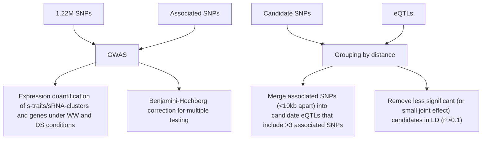

# The role of transposon inverted repeats in balancing drought tolerance and yieldrelated traits in maize

In the format provided by the authors and unedited

# Supplementary Results

# Generating a dynamic sRNAome and transcriptome map of a global maize diversity panel

RNA silencing is a conserved gene regulatory mechanism operating in most eukaryotes, and is mediated by small (18- to 26-nt) non-coding RNAs complementary to their target RNAs. In plants, these small RNAs (sRNAs) can be divided into microRNAs (miRNAs, derived from hairpin RNAs) and short interfering RNAs (siRNAs, generated from double-stranded RNAs) 40 . To gain more information on the maize pan-sRNAome landscape, we performed a large-scale sRNA sequencing (sRNA-seq) experiment on a maize association panel consisting of 338 natural accessions, which are the major materials of a previously published group of maize lines collected worldwide and exhibiting broad genetic diversity 31 . In total, we constructed 676 libraries for sRNA-seq from total RNAs extracted from all 338 accessions grown under well-watered (WW) and drought-stressed (DS) conditions. Sequencing generated \~20 million (M) reads per library on average. We then implemented a series of bioinformatics steps for quality-control and sRNA identification (Methods), resulting in \~6.62 billion reads of 18\~26-nt sRNAs and \~9.8 M reads per accession on average that could be mapped to the B73 V4 reference genome (Supplementary Results Table 1) 17 . Among these sRNAs, 21-, 22- and 24- nt sRNAs had the highest expression levels (according to the number of redundant sRNA reads), while 24-nt sRNAs had the largest numbers of sRNA species (according to the distinct sRNA reads) and the highest ratios of uniquely mapped sRNAs. Of these distinct sRNAs, 258 (\~0.0001%) were expressed at more than $1 0 ^ { 6 }$ reads across the 676 libraries and contributed 37.24% of total expression, while most sRNAs in the remaining 62.76% were expressed at less than $1 0 ^ { 6 }$ reads. Based on the analyses of maize accession CIMBL55, we determined that the distinct sRNAs were highly reproducibly identified in three different biological samples under both WW and DS conditions (Supplementary Results Fig. 1), indicating the reproducibility and robustness of our experiments and analyses.

Supplementary Results Table 1. Summary of sRNA reads obtained from 676 sRNA-seq libraries. 

<table><tr><td></td><td>Quality filteringa</td><td>Size filteringb</td><td>rRNA etc. filteringc</td><td>Genome mappingd</td><td>Totale</td></tr><tr><td>Redundant</td><td>20,578,605</td><td>18,488,387</td><td>13,698,627</td><td>9,799,798</td><td>6,624,663,247</td></tr><tr><td>Distinct</td><td>4,269,850</td><td>4,015,113</td><td>3,815,845</td><td>2,142,183</td><td>245,993,170</td></tr></table>

a Reads after quality control.

b Reads 18-26 nt in length.   
c Reads after eliminating those matching tRNAs, rRNAs, snRNAs, and snoRNAs.   
d Reads mapped to the B73 reference genome with no mismatch allowed.   
e The total reads of 676 libraries used to identify s- and sc-traits.

scatter

| Group | CIMBL55 WW rep1 | CIMBL55 WW rep2 | CIMBL55 WW rep3 | CIMBL55 DS rep1 | CIMBL55 DS rep2 | CIMBL55 DS rep3 |
| :--- | :--- | :--- | :--- | :--- | :--- | :--- |
| Row 1 | 0.97 | 0.97 | 0.93 | 0.89 | 0.93 | 0.95 |
| Row 2 | 0.97 | 0.98 | 0.98 | 0.89 | 0.93 | 0.95 |
| Row 3 | 0.97 | 0.98 | 0.93 | 0.89 | 0.93 | 0.95 |
The data is presented in a grid format with rows and columns labeled 'CIMBL55' and 'DS'. The scatter points are represented as dots connected by lines, and the numerical values above each dot indicate the correlation coefficient.

Supplementary Results Fig. 1 | Correlations between distinct sRNA species detected in three biological repeats (rep1-3) for accession CIMBL55 grown under WW or DS conditions. High correlations (R>=0.89) among the repeats for each growth condition highlight the reproducibility of the treatments and sRNA-seq of this study.

line

| Reads cover | Genome coverage (%) | Gap number (x10⁷) |
| ----------- | ------------------- | ----------------- |
| 0           | 100                 | 8                 |
| 10          | 75                  | 14                |
| 20          | 70                  | 15                |
| 30          | 68                  | 15.5              |
| 40          | 66                  | 15.5              |
| 50          | 65                  | 15.5              |
| 60          | 64                  | 15.5              |
| 70          | 63                  | 15.5              |
| 80          | 62                  | 15.5              |
| 90          | 61                  | 15.5              |
| 100         | 60                  | 15.5              |

bar_line

| Gap length threshold (bp) | Genome coverage (%) | Cluster number (bp) |
| ------------------------- | ------------------- | ------------------- |
| 0                         | 75                  | 10^4                |
| 100                       | 85                  | 10^6                |
| 200                       | 90                  | 10^7                |
| 300                       | 92                  | 10^6                |
| 400                       | 93                  | 10^5                |
| 500                       | 94                  | 10^4                |

Supplementary Results Fig. 2 | a. The genomic coverage by sRNAs with different cutoffs (upper panel), and the genomic gaps not covered by sRNAs with different cutoffs (lower panel). b. The amounts of genomic gaps with different length cutoff (upper panel), and the amount and average size of sRNA clusters with different gap length cutoff (lower panel). The vertical dashed gray lines in (a) and (b) indicate the various cutoffs.

Given that many sRNAs may be derived from the same transcript, and that their expression levels will thus be highly correlated 34 , sRNA clusters were generated to evaluate sRNA expression. We defined that a genomic region expressed an sRNA cluster if this region was covered by at least 10 sRNA reads and the gap length between two adjacent sRNAs was no larger than 200 bp (Methods, Supplementary Results Fig. 2a, b, vertical dashed lines). Bioinformatics analyses with stringent filters identified 192,852 sRNAs across the 676 libraries (7.77% of total sRNAs) and 359,533 sRNA clusters with an average length of 5,392 bp, which were treated as sRNA traits (s-traits) and sRNA cluster traits (sc-traits), respectively (Methods, Supplementary Results Table 1).

We also performed transcriptome deep sequencing (mRNA-seq) of 394 libraries generated from RNAs extracted from 197 maize accessions (a core germplasm of the populations used for sRNA-seq) grown under WW and DS conditions. In total, 1323.95 Gb and 1340.47 Gb clean data were generated by mRNA-seq under WW and DS conditions, respectively (Supplementary Results Table 2). For each library, an average of 44.8 M (WW) and 45.4 M (DS) clean reads mapped to the maize B73 V4 genome for gene expression calculation. Expression of 12,554 genes showed significant differences $( \mathsf { p } < 2 . 2 5 \times 1 0 ^ { - 7 }$ , 0.01 / n, paired t-test) between WW and DS conditions, among which 2,914 genes had a change in expression over 2-fold $( \mathsf { I o g } 2 \mathsf { I F C } | \geq 1 )$ between WW and DS conditions. Based on the expression of sRNAs and genes, we explored the synergistic regulatory networks involving sRNAs and protein-coding genes associated with maize drought responses.

Supplementary Results Table 2. Summary of RNA reads obtained from 394 mRNA-seq libraries. 

<table><tr><td></td><td>Total raw data (Gb)</td><td>Total clean data (Gb)</td><td>Q30 bases rate (%)</td><td>Clean reads rate (%)</td><td>Average clean reads number</td></tr><tr><td>W</td><td>1351.38</td><td>1323.95</td><td> $92.29 \pm 1.52$ </td><td> $97.97 \pm 0.62$ </td><td>44,803,760</td></tr><tr><td>DS</td><td>1364.31</td><td>1340.47</td><td> $92.26 \pm 0.75$ </td><td> $98.25 \pm 0.25$ </td><td>45,362,676</td></tr></table>

# eGWAS of the sRNAome and transcriptome

Previously, 1.25 M SNP markers (B73 V2 genome) of the maize accessions used in this study were identified 31 . eGWAS on drought-related environment-specific straits, sc-traits, and mRNAs using these SNPs (\~1.23 M remaining after conversion to their B73 V4 genome coordinates) were implemented to map eQTLs that controlled environmental adaptation (Supplementary Results Fig. 3a). We thus identified a large number of environment-specific eQTLs, with an average eQTL size of \~7.6 kb. Most drought-responsive s-traits (1,695, 99.6%) and sc-traits (4,147, 99.9%) had only one associated seQTL (Supplementary Results Fig. 3b, c). In this study, an eQTL was defined as a cis eQTL when the distance between the eQTL and the location of its target expression trait was less than 20 kb. All other cases (> 20 kb) were considered trans eQTLs. According to this criterion, the majority of seQTLs (86.8%) regulating sc-traits were trans seQTLs (Supplementary Results Fig. 3d). To investigate the cis- and trans-seQTLs for sRNAs, we classified the seQTLs thus: if the distance between an seQTL and its closest sRNA is no more than 20 kb (<=20 kb), then this seQTL is a cis-seQTL; otherwise it is a trans-seQTL. Based on this standard, we determined that 34% of the total seQTLs under WW condition and 52.5% of total seQTLs under DS condition were cis-seQTLs, and the remaining were trans-seQTLs. In addition, most seQTLs (73.7% of s-trait seQTLs and 83.3% of sc-trait seQTLs) were environment-specific (detected under either WW or DS conditions), and only a small proportion of seQTLs were shared (detected under both WW and DS conditions). For example, a unique seQTL regulating miR167c expression was detected only under WW conditions, while the seQTL associated with sRNA158798 (derived from the miR827 locus) expression was only detected under DS conditions (Supplementary Results Fig. 3e-i).

flowchart

bar

| Genotype | 1seQTLs | 2seQTLs | >2seQTLs |
|---|---|---|---|
| WW (1/n) | 3526 | 1577 | 1071 |
| WW (Bonferroni<0.05) | 1150 | 24 | 0 |
| DS (1/n) | 4045 | 1801 | 199 |
| DS (Bonferroni<0.05) | 1278 | 10 | 3 |

bar

| Genotype | 1seQTLs | 2seQTLs | >2seQTLs |
|---|---|---|---|
| WW (1/n) (Bonferroni<0.05) | 5849 | 2449 | 2345 |
| WW (Bonferroni<0.05) | 3060 | 28 | 0 |
| DS (1/n) (Bonferroni<0.05) | 6697 | 2246 | 1099 |
| DS (Bonferroni<0.05) | 3212 | 6 | 0 |

line

| Distance | WW (1/n) | WW (Bonferroni<0.05) | DS (1/n) | DS (Bonferroni<0.05) |
| -------- | -------- | --------------------- | -------- | --------------------- |
| Within   | 0.02     | 0.06                  | 0.03     | 0.04                  |
| 10KB     | 0.03     | 0.10                  | 0.04     | 0.05                  |
| 100KB    | 0.04     | 0.08                  | 0.05     | 0.06                  |
| 1M       | 0.03     | 0.06                  | 0.04     | 0.05                  |
| 10M      | 0.02     | 0.04                  | 0.03     | 0.04                  |
| 10M+     | 0.01     | 0.02                  | 0.02     | 0.03                  |
| Diff     | 0.80     | 0.65                  | 0.78     | 0.79                  |

other

| Category | Count |
|---|---|
| WW only | 660 |
| DS only | 514 |
| WW ∩ DS | 777 |
| WW ∩ SE QTLs of sRNA Clusters | 2187 |
| DS ∩ WW | 904 |
| WW ∩ DS | 2314 |

scatter

| Region | -logP |
|--------|-------|
| WW     | 16    |
| Chr.1  | 2     |
| 2      | 4     |
| 3      | 4     |
| 4      | 4     |
| 5      | 16    |
| 6      | 4     |
| 7      | 4     |
| 8      | 4     |
| 9      | 4     |
| 10     | 4     |

boxplot

| Group | Condition | Expression of miR167c (RPM) |
|-------|-----------|-----------------------------|
| WW    | A         | ~1000                       |
| WW    | G         | ~500                        |
| DS    | A         | ~200                        |
| DS    | G         | ~100                        |

scatter

| Position | -logP |
| -------- | ----- |
| Chr.1    | 4     |
| 2        | 6     |
| 3        | 6     |
| 4        | 6     |
| 5        | 6     |
| 6        | 6     |
| 7        | 6     |
| 8        | 6     |
| 9        | 6     |
| 10       | 6     |

boxplot

| Group | Condition | Expression of sR158798 (RPM) |
|-------|-----------|------------------------------|
| WW    | A         | 0.5                          |
| WW    | G         | 1.0                          |
| DS    | A         | 2.0                          |
| DS    | G         | 3.0                          |

Supplementary Results Fig. 3 | a. Workflow of eQTL analysis. Three steps with multiple analyses are shown for the detection of eQTLs based on the expression of drought-responsive sRNAs / drought-responsive sRNA clusters and genes. b and c. The number of drought-

responsive sRNAs (b) and drought-responsive sRNA clusters (c) associated with one seQTL (1 seQTL), two seQTLs (2 seQTLs), or more than 2 seQTLs (>2 seQTLs) with different thresholds of significance (indicated below the panels) under WW and DS conditions. d. Distribution of the distance between lead SNPs and their associated sRNA clusters, “Diff” on the right side of the graph indicates the lead SNP and sRNA cluster located on different chromosome. e. Numbers of seQTLs associated with the expression of drought-responsive sRNAs (s-traits, upper panel) and drought-responsive sRNA clusters (sc-traits, lower panel) under WW and DS conditions. f. The seQTL located on chromosome 5 is significantly associated with the expression of miR167c under WW but not DS conditions. g. The expression of miR167c is significantly higher in inbred lines with the A allele (N=21) than those carrying the G allele (N=313) at the lead SNP in the seQTL under WW but not DS conditions. The P values were calculated by two-sided Student’s t-test. h. The seQTL located on chromosome 5 is significantly associated with the expression of sRNA158798 under DS but not WW conditions. i. The expression of sRNA158798 is significantly higher in inbred lines with the A allele (N=225) than in those carrying the G allele (N=103) at the lead SNP in the seQTL under WW and DS conditions. The P values were calculated by Student’s t-test. For g and i, box middle line: median; box edges: 25th and 75th percentiles; whiskers: values that do not exceed ± IQR (interquartile range) × 1.5; further outliers are marked individually.

line

| R²    | trans | cis  |
|-------|-------|------|
| 0.0   | 0.0   | 0.0  |
| 0.2   | 4.0   | 1.0  |
| 0.4   | 2.0   | 3.0  |
| 0.6   | 1.0   | 2.0  |
| 0.8   | 0.0   | 1.0  |

line

| R²    | trans | cis  |
|-------|-------|------|
| 0.0   | 0.0   | 0.0  |
| 0.2   | 4.0   | 1.0  |
| 0.4   | 2.0   | 3.0  |
| 0.6   | 1.0   | 2.0  |
| 0.8   | 0.0   | 0.0  |

pie

C
| Category | Count | Percentage (%) |
| :--- | :--- | :--- |
| Shared | 3311 | 23.4 |
| Environment-specific | 10862 | 76.6 |
Total eQTLs

pie

Cis eQTLs
| Category | Count | Percentage (%) |
| :--- | :--- | :--- |
| Shared | 1851 | 45.9 |
| Environment-specific | 2184 | 54.1 |

pie

Trans eQTLs
| Category | Count | Percentage (%) |
|---|---|---|
| Shared | 1460 | 14.4 |
| Environment-specific | 8678 | 85.6 |

Supplementary Results Fig. 4 | a. Genome-wide distribution of meQTLs associated with

mRNA expression in 197 maize inbred lines grown under WW and DS conditions. The x-axis indicates the locations of meQTLs and the y-axis indicates the locations of genes in the order of their genomic coordinates. b. cis meQTLs show higher joint effects than trans meQTLs under both WW and DS conditions. c. Proportion of shared (detected under both WW and DS conditions) and environment-specific (detected under either WW or DS conditions) meQTLs for all meQTLs, cis mQTLs and trans meQTLs.

Next, we mapped the eQTLs that controlled gene expression (mQTLs) via GWAS, based on the transcriptomes of the 197 accessions grown under WW and DS conditions (Supplementary Results Fig. 4a). We detected 14,173 meQTLs (MLM, $P { < } 5 . 1 5 \times 1 0 ^ { - 9 } )$ as being associated with 11,038 genes under WW or DS conditions. Of these, 4,035 (28.5%) were cis meQTLs and 10,138 (71.5%) were trans meQTLs (Supplementary Results Fig. 4a). On average, cis meQTLs had a larger effect on gene expression than trans meQTLs (Supplementary Results Fig. 4b). We also detected more environment-specific meQTLs (76.6%) than shared meQTLs (23.4%), indicating that complex networks regulate gene expression during maize drought responses (Supplementary Results Fig. 4c).

# Cleavage of mRNAs by DRESH8-derived siRNAs

siRNAs 21 nt to 24 nt in size are known to induce mRNA cleavage of their target genes 52 . Because DRESH8-derived sRNAs did not affect the expression of local genes, we hypothesized that they might function as siRNAs to mediate mRNA cleavage in trans. Based on a siRNA-target prediction pipeline 5 , and the negative correlations between sRNAs and gene expression profiles, we identified 150 putative targets for DRESH8-derived sRNAs. Of those, 34 (22.7%) had predicted roles in responses to abiotic stress and stimulus, and 57 (38%) potentially regulate plant development including seed development, indicating the broad roles of DRESH8 in regulating maize stress responses and development. We randomly selected 35 genes (out of the 150 mentioned above) for degradome analysis (5’ RACE-sequencing, Methods) in plant cells. Ten transcripts (28.6%) showed cleavage by their corresponding siRNAs, and their expression levels were significantly lower in maize plants with DRESH8 relative to those without DRESH8 under either WW or DS or both conditions (Supplementary Results Fig. 5a, b), indicating that DRESH8-derived siRNAs negatively regulate their putative target genes by mediating mRNA cleavage.

  
Supplementary Results Fig. 5 | a. mRNA degradome assays showing the cleavage of the mRNAs for nine target genes by DRESH8-derived sRNAs. b. The expression of the nine target genes is significantly lower in inbred lines with DRESH8 (+, N=37) relative to those without DRESH8 (-, N=160) under WW or DS or both conditions. n.s., not significant. The P values were calculated by two-sided Student’s t test. Box middle line: median; box edges: 25th and 75th percentiles; whiskers: values that do not exceed ± IQR (interquartile range) × 1.5; further outliers are marked individually.

# Biogenesis of sRNAs in maize IR loci

In Arabidopsis, four DICER-like enzymes (DCLs) have been identified that are responsible for the biogenesis of most sRNAs: DCL1 generates most miRNAs, whereas DCL4, DCL2, and DCL3 generate 21-, 22-, and 24-nt siRNAs, respectively 40 . Mature sRNAs are loaded into various ARGONAUTE (AGO) proteins to regulate gene expression 53 . In plants, transposon loci are transcribed by RNA polymerase IV (Pol IV) and the resulting transcripts serve as templates for dsRNA synthesis by RNA-Dependent RNA Polymerase 2 (RDR2). The resulting dsRNAs are further processed by DCL3 to produce 24-nt siRNAs to direct transcriptional silencing of homologous transposon loci through the RNA-dependent DNA methylation (RdDM) mechanism 54 .

To investigate the mechanisms of maize IR sRNA biogenesis, we isolated dcl2 (Zm00001d013796) mutant carrying a premature stop codon from a previously reported maize mutant library generated by EMS-induced mutagenesis (Supplementary Results Fig. 6a) 55 , and sequenced sRNAs from the dcl2 mutant and wild-type B73. sRNAs from dcl1 (Zm00001d027412), dcl4 (Zm00001d025830), pol iv (Zm00001d031459), rdr2 (Zm00001d003378), and the double mutant dcl1 dcl4 were collected from public databases (Methods). Overall sRNA accumulation levels of different size classes were compared among IRs of different lengths. In the dcl2 mutant, 22-nt sRNA levels clearly decreased for all size class IRs to around 30% of wild-type levels, and the degree of reduction increased as the IR length increased from <1 kb to >10 kb. 24-nt sRNA levels increased moderately in the dcl2 mutant among IRs of different lengths, relative to those measured in B73 plants; however, 21-nt sRNAs levels moderately increased in the dcl2 mutant among shorter IRs (<1 kb and 1-5 kb), but moderately decreased for longer IRs (5-10 kb and >10 kb, Supplementary Results Fig. 6b). These data confirmed that DCL2 is responsible for producing the majority of 22-nt IR-derived sRNAs and that it prefers long dsRNA substrates. The results also suggested that DCL2 competes with DCL3 for IR substrates of all lengths, while the mode of DCL2 interaction with DCL1/DCL4 on IR loci may vary according to the length of the IR in question.

Analysis of sRNAs from pol iv and rdr2 mutants showed that levels of IR-derived 24-nt sRNAs were significantly reduced in both mutants, with a stronger reduction in pol iv (about 4\~17% of wild-type levels) than in rdr2 (about 41\~80% of wild-type levels), and both mutations had a greater influence on sRNA production from shorter IRs (<1 kb and 1-5 kb) than from longer IRs (5-10 kb and >10 kb) (Supplementary

Results Fig. 6c, d). In contrast to its strong effect on 24-nt sRNA accumulation, the pol iv mutation only moderately affected 21-nt and 22-nt sRNA accumulation, while the rdr2 mutation clearly increased both 21-nt and 22-nt sRNA levels from IRs of all sizes (Supplementary Results Fig. 6c, d). These data indicated that POL IV and RDR2 both contribute to the accumulation of 24-nt sRNAs derived from IR loci, and that RDR2-mediated transcriptional repression of IR expression is antagonistic to 21-nt and 22-nt sRNA production from IRs. These results also supported the notion that these shorter sRNAs are processed from the hairpins formed by IR transcripts generated by POL II. Analysis of sRNAs from the dcl1 and dcl4 single mutants and the dcl1 dcl4 double mutant showed that the production of 21-nt sRNAs derived from short IRs mainly depends on DCL1 activity, while DCL4 only has a minor role in the production of 21-nt sRNAs derived from IRs (Supplementary Results Fig. 6e-g).

  
Supplementary Results Fig. 6 | a. dcl2 mutant. A premature stop codon at W793 is shown. b to g. Effects of dcl2 (b), pol iv (c), rdr2 (d), dcl1(e), dcl4 (f), and dcl1 dcl4 (g) mutations on IRsRNA biogenesis. Top panels, comparison of the expression levels of 21-nt, 22-nt, and 24-nt IRsRNAs in dcl2 (b), pol iv (c), rdr2 (d), dcl1(e), dcl4 (f), and dcl1 dcl4 (g) mutants and B73 (wildtype) plants, respectively. Bottom panels, average IR-sRNA expression levels in dcl2 (b), pol iv (c), rdr2 (d), dcl1(e), dcl4 (f), dcl1 dcl4 (g), and B73 plants, respectively. Colored dots (top panels) and colored columns (bottom panels) indicate IR-sRNAs generated from IRs of different sizes, with N=3669, 2774, 607, 1211 for IRs <1kb, 1-5kb, 5-10kb or >10kb, respectively. For b-g, Box middle line: median; box edges: 25th and 75th percentiles; whiskers: values that do not exceed ± IQR (interquartile range) × 1.5; further outliers are marked individually.

# Reference

52. Borges, F. & Martienssen, R.A. The expanding world of small RNAs in plants.

223 16, 727-741 (2015).   
224 53. Song, X., Li, Y., Cao, X. & Qi, Y. MicroRNAs and Their Regulatory Roles in Plant-Environment 225 Interactions.  70, 489-525 (2019).   
226 54. Henderson, I.R. & Jacobsen, S.E. Epigenetic inheritance in plants.  447, 418-424 (2007).   
227 55. Lu, X. et al. Gene-Indexed Mutations in Maize.  11, 496-504 (2018).