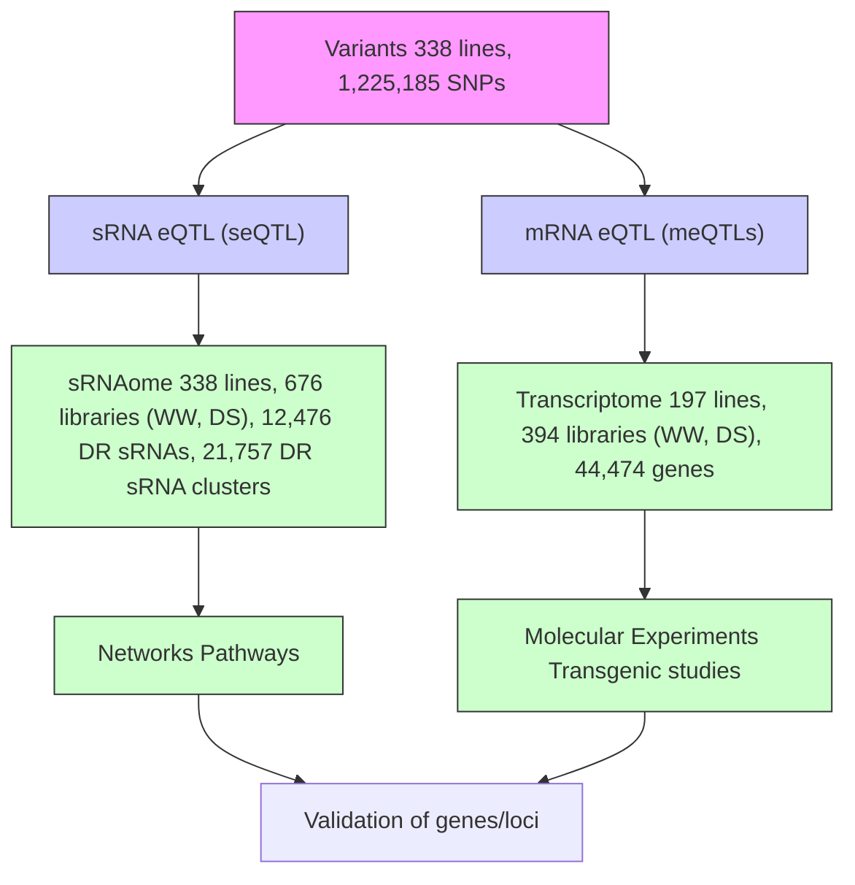
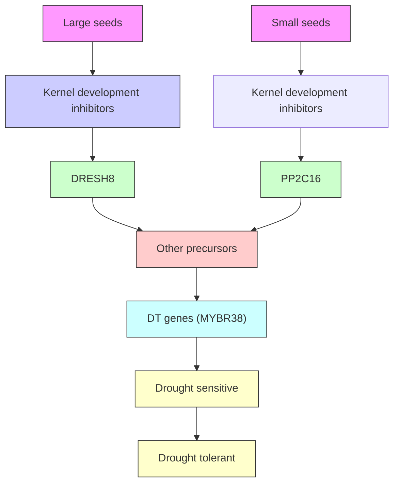

# The role of transposon inverted repeats in balancing drought tolerance and yield-related traits in maize

Received: 3 February 2021

Accepted: 2 July 2022

Published online: 13 October 2022

Check for updates

Xiaopeng Sun1,2,9, Yanli Xiang  1,9, Nannan Dou1,2,9, Hui Zhang3,9, Surui Pei4 , Arcadio Valdes Franco  5 , Mitra Menon6 , Brandon Monier5 , Taylor Ferebee  5 , Tao Liu4 , Sanyang Liu4 , Yuchi Gao4 , Jubin Wang3 , William Terzaghi  7 , Jianbing Yan  1,2, Sarah Hearne  8 , Lin Li  1,2 , Feng Li  2,3 and Mingqiu Dai  1,2

The genomic basis underlying the selection for environmental adaptation and yield-related traits in maize remains poorly understood. Here we carried out genome-wide profling of the small RNA (sRNA) transcriptome (sRNAome) and transcriptome landscapes of a global maize diversity panel under dry and wet conditions and uncover dozens of environment-specifc regulatory hotspots. Transgenic and molecular studies of Drought-Related Environment-specifc Super eQTL Hotspot on chromosome 8 (DRESH8) and ZmMYBR38, a target of DRESH8-derived small interfering RNAs, revealed a transposable element-mediated inverted repeats (TE-IR)-derived sRNAand gene-regulatory network that balances plant drought tolerance with yield-related traits. A genome-wide scan revealed that TE-IRs associate with drought response and yield-related traits that were positively selected and expanded during maize domestication. These results indicate that TE-IR-mediated posttranscriptional regulation is a key molecular mechanism underlying the tradeof between crop environmental adaptation and yield-related traits, providing potential genomic targets for the breeding of crops with greater stress tolerance but uncompromised yield.

Maize (Zea mays L. ssp. mays) is a major staple food crop worldwide, contributing about 37% of yearly global cereal production1 . During its domestication and spread, maize yield has greatly increased, but this was accompanied by increased susceptibility to drought2,3 . The genomic mechanisms underlying such selection of plant environmental adaptation and yield remain elusive. Moreover, the genetic control of plant environmental stress tolerance remains largely unknown, and therefore, breeding programs lack useful genetic targets for precision breeding of stress-tolerant crops. To help address these questions, we provide a large dataset covering hundreds of small RNA transcriptomes (sRNAomes) and transcriptomes under well-watered (WW) and drought-stressed (DS; a key environmental stress) conditions from a diverse population of maize accessions.

1 National Key Laboratory of Crop Genetic Improvement, Huazhong Agricultural University, Wuhan, China. 2 Hubei Hongshan Laboratory, Wuhan, China. 3 Key Laboratory of Horticultural Plant Biology (Ministry of Education), Huazhong Agricultural University, Wuhan, China. 4 Annoroad Gene Tech (Beijing) Co., Ltd, Beijing, China. 5 School of Integrative Plant Sciences, Section of Plant Breeding and Genetics, Cornell University, Ithaca, NY, USA. 6 Department of Evolution and Ecology, Center for Population Biology, and Genome Center, University of California, Davis, Davis, CA, USA. 7 Department of Biology, Wilkes University, Wilkes-Barre, PA, USA. 8 CIMMYT, KM 45 Carretera Mexico-Veracruz, El Batan, Texcoco, Mexico. 9 These authors contributed equally: Xiaopeng Sun, Yanli Xiang, Nannan Dou, Hui Zhang.  e-mail: hzaulilin@mail.hzau.edu.cn; chdlifeng@mail.hzau.edu.cn; mingqiudai@mail.hzau.edu.cn

# Results

# Expression variation and genetic control of sRNAs in maize drought response

Our dataset comprises 338 sRNAomes and 197 transcriptomes from inbred maize accessions (Fig. 1a,b, Extended Data Fig. 1a–c, Supplementary Tables 1 and 2, Supplementary Results and Methods). We detected a total of 12,476 drought-responsive sRNA traits (s-traits) and 21,757 drought-responsive sRNA cluster traits (sc-traits) (Extended Data Fig. 1d–g, Supplementary Tables 3 and 4, Supplementary Results and Methods). Population-level regression analyses of the expression variations between drought-responsive s-traits or sc-traits and genes uncovered 6,158 significant sRNA–gene coexpression pairs $( P { \le } 0 . 0 1$ , with an absolute correlation coefficient $[ R ] \geq 0 . 2$ , Supplementary Tables 5–8). The genes involved in these coexpression pairs were significantly enriched in Gene Ontology (GO) terms such as response to different stresses or stimuli (false discovery rate $( \mathrm { F D R } ) < 1 . 1 \times 1 0 ^ { - 8 } )$ ) and Kyoto Encyclopedia of Genes and Genomes (KEGG) pathways such as metabolic pathways or biosynthesis of second metabolites (corrected $P { < } 1 . 3 9 \times 1 0 ^ { - 3 1 } )$ (Extended Data Fig. 2a).

As would be expected for sRNA-mediated regulation, 1,317 sRNA– gene pairs showed negative coexpression, indicating critical roles for sRNAs in downregulating gene expression in DS maize. Indeed, we detected pairs with negative coexpression between many known microRNAs (miRNAs) and their targets, such as miR168 and ARGO-NAUTE1c (AGO1c), miR169 and Nuclear Transcription Factor Y Subunit Alpha8 (NF-YA8), and miR167-ARF6 and miR156 and Squamosa-Promoter binding protein-Like2 (SPL2) (Extended Data Fig. 2b–e and Supplementary Tables 5–8). We also identified novel negative coexpression pairs between sRNAs and genes. Among those, we noticed an enrichment for genes involved in steroid biosynthesis (KEGG: zma00100, corrected ${ P / = } 0 . 0 1 3 )$ . For example, ZmSQE1 (encoding a squalene epoxidase that plays positive roles in plant drought tolerance4 ) was significantly and negatively correlated with sRNA cluster343503 across the 338 maize accessions under both WW $( P = 1 . 8 3 \times 1 0 ^ { - 9 } , R = - 0 . 4 1 )$ and DS $( P = 2 . 2 2 \times 1 0 ^ { - 7 } , R = - 0 . 3 6 )$ conditions (Extended Data Fig. 2f), suggesting possible inhibition of ZmSQE1 expression by sRNA cluster343503. Together, these results indicated genome-wide orchestrated regulation of gene expression by small interfering RNAs (siRNAs) in DS maize.

To dissect the genetic mechanisms underlying the dynamic variation of sRNA expression during maize drought responses, we performed an expression genome-wide association study (eGWAS) (Methods), which detected 1,174 and 1,291 expression quantitative trait loci (seQTLs) for 1,702 (13.6% of 12,476) drought-responsive s-traits (mixed linear model (MLM), Bonferroni-adjusted $P < 3 . 2 7 \times 1 0 ^ { - 1 2 } )$ and 3,091 and 3,218 seQTLs for 4,152 (19.1% o $^ { 2 1 , 7 5 7 ) }$ ) drought-responsive sc-traits (MLM, Bonferroni-adjusted $P { < } 1 . 8 8 \times 1 0 ^ { - 1 2 } )$ under WW and DS conditions, respectively (Fig. 1c, Supplementary Tables 9–12 and Supplementary Results). We further detected 18 seQTL hotspots under WW conditions and 19 seQTL hotspots under DS conditions, of which 9 seQTL hotspots were shared under WW conditions (Fig. 1c and Methods). In a complementary approach, we also performed eGWAS on the dynamic variation of mRNA levels (Supplementary Tables 13 and 14 and Supplementary Results). Among the seQTLs regulating sRNA accumulation and eQTLs regulating gene expression (meQTLs), we identified 4,722 eQTLs that controlled both sRNA and mRNA levels (sm-eQTLs) (Fig. 1d, Supplementary Table 15 and Methods). Notably, 56.1% (6,188/11,038) of all meQTL-regulated genes, including those involved in abscisic acid signaling, osmotic stress responses, water deprivation and abiotic stress responses, were controlled by sm-eQTLs (Fig. 1e), suggesting massive genome-wide coregulatory relationships between sRNAs and mRNAs.

# Role and mechanism of DRESH8 in maize drought tolerance

Based on prediction by the web-based tool psRobot5 , we identified 2,764 genes as putative targets for sRNAs regulated by seQTL hotspots. Of those, 530 genes (19.2%) were involved in plant reproduction, and another 891 genes (32.2%) were involved in stress responses, suggesting essential roles for these seQTL hotspots in regulating maize yield and environmental adaptation. To further decipher the molecular mechanisms associated with plant yield regulation and environmental adaptation, we cloned Drought-Related Environment-specific Super eQTL Hotspot on chromosome 8 (DRESH8) (chromosome 8, between 139,987,478 bp and 140,009,528 bp), which was only detected under DS conditions (Fig. 2a). The seQTL region contained three genes: ZmPP2C16 (encoding a type-A PP2C phosphatase), ZmWRKY51 (encoding a WRKY transcription factor on the reverse strand and very close to ZmPP2C16) and ZmEREB117 (encoding an AP2/EREBP-type transcription factor) (Fig. 2b). A presence or absence variation (PAV) polymorphism of \~21.4 kb, located within the third intron of ZmPP2C16 was the most significant marker associated with the expression of s-traits and sc-traits, such as sRNA cluster309580 (MLM, $P { = } 2 \times 1 0 ^ { - 2 8 } )$ (Fig. 2b). Sequence analyses revealed that the inserted fragments were large Gypsy transposable elements (TEs) with two arms (\~8 kb per arm) that formed an inverted-repeat (IR) structure (Extended Data Fig. 3a). Significant single-nucleotide polymorphism (SNP) markers within this seQTL region showed high linkage disequilibrium (LD) with the IR PAV (Fig. 2c), which was the most significant variation (MLM, $P { < } 5 . 2 3 { \times } 1 0 ^ { - 1 9 } )$ ) associated with the expression of 542 drought-responsive sc-traits and 283 drought-responsive s-traits under DS conditions (Fig. 2d and Supplementary Tables 9–12). In addition, most drought-responsive s-traits within this seQTL region mapped to the arms of the IR and were largely associated with 22-nt sRNAs (Extended Data Fig. 3a). We will refer to the transposon insertion at this seQTL as DRESH8, as the observed variation might be causative. Further analyses indicated that the expression of DRESH8 was under the control of the drought-inducible ZmPP2C16 promoter and that DRESH8 may not regulate gene expression in a cis manner but rather via derived sRNAs (Extended Data Fig. 3a–f).

In the GWAS population, genotypes lacking DRESH8 exhibited lower expression of sc-traits but higher survival rates after drought stress relative to genotypes that carried DRESH8 (Fig. 2e,f and Supplementary Table 16)6 . Drought experiments with two segregating F2 populations demonstrated that maize plants lacking DRESH8 were more tolerant to drought than plants with DRESH8 (Fig. 2g,h), indicating that the absence of the transposon insertion near ZmPP2C16 might be favorable for maize drought tolerance. In agreement with this hypothesis, drought experiments with maize inbred line B104 and dDRESH8, a DRESH8 deletion mutant of B104 that was generated by gene editing with clustered regularly interspaced short palindromic repeats (CRISPR) and the CRISPR-associated nuclease Cas9 established that dDRESH8 lines had higher survival rates (34.62% ± 12.66%) than the wild-type B104 $( 1 6 . 6 7 \% \pm 1 0 . 7 6 \% )$ after exposure to drought stress (Fig. 2i–k). Further sRNA deep sequencing (sRNA-seq) showed that the expression of DRESH8-derived sRNAs was significantly reduced in dDRESH8 plants when compared to nontransgenic B104 plants (Fig. 2l). Together, these data demonstrated that DRESH8 was the causative locus underlying the observed variation in sRNA expression and drought tolerance in the maize population. Through mRNA cleavage assays, we identified targets of DRESH8-derived sRNAs, including ZmMYBR38 (Zm00001d016784), which encodes a MYB transcription factor (Fig. 2m–o, Supplementary Table 17 and Supplementary Results). We tested the role of ZmMYBR38 in plant responses to drought by overexpressing the gene in maize and Arabidopsis (Arabidopsis thaliana); both sets of transgenic plants overexpressing ZmMYBR38 were more tolerant to drought than their corresponding wild-type, nontransgenic lines (Fig. 2p,q and Extended Data Fig. 3g–i), demonstrating that ZmMYBR38 plays conserved and positive roles in the regulation of plant drought tolerance. These data thus indicate that DRESH8-derived siRNAs mediate mRNA cleavage of their downstream targets to regulate plant drought tolerance.

flowchart

other

| Category | Value |
| -------- | ----- |
| RNA-seq  | 0.80  |
| Unknown  | 0.64  |
| Mixed    | 0.56  |
| SS       | 0.48  |
| NSS      | 0.40  |
| TST      | 0.32  |
| Other    | 0.24  |

other

| Region | Value |
|--------|-------|
| I. meQTLs | 1.0 |
| II. seQTLs | 2.5 |
| III. sm-eQTLs | 3.0 |

radar

| Region | Value |
|--------|-------|
| DRESH8 | 21 nt |
| DRESH8 | 22 nt |
| DRESH8 | 24 nt |
| DRESH8 | Other |
| WW     | -     |
| DS     | -     |
| Both   | -     |

scatter

| Gene Set | Category |
|---|---|
| sm-eQTLs | Sm-eQTLs |
| sm-eQTL-regulated genes | Sm-eQTL-regulated genes |

Fig. 1 | The landscapes of sRNAomes and transcriptomes in a global maize diversity panel demonstrate genome-wide molecular perturbations between WW and DS conditions. a, Workflow of this study. b, Summary of the relative expression levels of three main classes of sRNAs (21, 22 and 24 nt) and drought-tolerance phenotypes (survival rates (SR)) of 338 maize inbred lines. The relative expression levels are shown as ratios of a given sRNA to the total sRNAs in each inbred line. The inbred lines were from tropical/subtropical (TST), temperate (SS/NSS, or stiff stalk/non-stiff stalk), mixed or of unknown origin and showed vast genetic divergence, as indicated by the phylogenetic tree. The inbred lines used for sRNA sequencing and RNA sequencing (RNAseq) are indicated by a red circle. The color bar represents the value of survival rate of sRNA proportion. c, Distribution of seQTLs and sRNA-seQTL networks.   
Track I, sRNA-seQTL networks, the seQTL hotspot DRESH8 is indicated; tracks II and III, distribution of seQTLs along maize chromosomes under WW (III) and DS (II) conditions; track IV, candidate genes involved in RNA processing; track V, candidate genes involved in stress and stimulus responses. d, Distribution of eQTLs associated with mRNA (track I, meQTLs) and sRNA (track II, seQTLs) expression. Some eQTLs were associated with the expression of both genes (blue line) and sRNAs (red lines) (track III, sm-eQTLs). e, Network highlighting the drought-responsive sRNAs and genes that are co-regulated by sm-eQTLs. Genes responsive to water deprivation (red), abscisic acid (ABA; orange), osmotic stress (green) and abiotic stress (light blue) are indicated in the network. DR, drought responsive.

# DRESH8 could regulate the trade-off between maize yield and drought tolerance

Given the impact of DRESH8 on maize drought tolerance, we next analyzed the history of this transposon-mediated IR over the course of maize evolution and selection. Based on a panel consisting of teosinte (Zea mays ssp. parviglumis) and maize accessions7 , we determined that maize lines with DRESH8 had less than one-third (29%) of the nucleotide diversity seen in teosinte accessions across the B region of ZmPP2C16 that flanks the insertion site of DRESH8 (Fig. 3a). Importantly, we detected no significant difference in nucleotide diversity between teosinte and maize across regions A and C (Fig. 3a). Previous studies showed that maize has on average only 57.1% as much nucleotide diversity as teosinte8,9 . These data suggested a selective sweep at the DRESH8 locus during maize domestication. Moreover, comparison of the sequences at the DRESH8 locus with $\boldsymbol { F } _ { \mathrm { s t } }$ and XP-CLR methods10,11 between maize and teosinte, or between tropical/subtropical (TST) maize and temperate maize also indicated a selective sweep at the DRESH8 locus (Extended Data Fig. 4). To understand the origin and spread of DRESH8, we investigated the distribution of the DRESH8 allele in 121 teosinte accessions (CIMMYT resources), 751 landraces12 and 338 modern maize inbred lines (Supplementary Tables 16, 18 and 19). We

failed to detect DRESH8 in any of the teosinte accessions we tested; by contrast, we positively identified DRESH8 in landraces. Moreover, the frequency of lines that carry DRESH8 increased in modern maize lines in TST regions and rose further in temperate regions (Fig. 3b). Intriguingly, analyses to determine the history of DRESH8 indicated that the estimated insertion time of its associated Gypsy transposons was 51,800 years ago (Methods). It is thus likely that the absence of DRESH8 was naturally selected for in more recent teosintes during their adaptation to changing conditions in their natural environment, whereas the presence of the DRESH8 allele was selected for during maize domestication and spread. The landraces used in this study represent most maize races native to the Americas13–15 and are thus suitable materials to study the pre-Columbian spread of DRESH8. We observed that the frequency of the DRESH8 allele was highest in southern Mexico, decreased in northern Mexico and diminished further in the United States and South America (Fig. 3c,d). These data strongly suggested that the DRESH8 allele originated in southern Mexico and spread to northern Mexico, the United States and further south in the Americas.

We next investigated the potential driver of DRESH8 selection. We obtained precipitation data from 1970 to 2000 for the locations where the landraces had been collected (Supplementary Table 19; CIMMYT data, https://hdl.handle.net/11529/10548079). The average monthly precipitation was tabulated as a function of the DRESH8 genotype. During the maize growing season from June to September, the areas where maize genotypes with DRESH8 had been collected received more rain than areas from which maize genotypes without DRESH8 had been collected (Fig. 3e). We then determined kernel lengths for the 338 maize inbred lines and compared the results to their DRESH8 genotype. Maize accessions with DRESH8 had kernels that were on average \~4% longer

bar

| SNP number | eQTL number |
| ---------- | ----------- |
| ≤10        | 36          |
| ~10–50     | 23.5        |
| ~50–100    | 11          |
| >100       | 1           |
| WW         | -           |
| DS         | -           |

boxplot

| Group    | Condition | Expression (cluster 309,850/RPKM) |
| -------- | --------- | --------------------------------- |
| DRESH8⁻  | WW        | ~200                              |
| DRESH8⁻  | DS        | ~200                              |
| DRESH8⁺  | WW        | ~500                              |
| DRESH8⁺  | DS        | ~1,500                            |

flowchart

text_image

Before DS
DS, rewatered
B104 dDRESH8
B104 dDRESH8

bar

| Group        | Survival Rate (%) |
| ------------ | ----------------- |
| Before DS    | 100               |
| DS, Rewatered| 336               |

scatter

| Gene       | SNP  | PAV  |
|------------|------|------|
| ZmPP2C16   | 0    | 0    |
| ZmWRKY51   | 0    | 0    |
| ZmEREB117  | 0    | 0    |

boxplot

| Group    | Survival Rate (%) |
| -------- | ----------------- |
| DRESH8⁻  | 15                |
| DRESH8⁻  | 20                |
| DRESH8⁻  | 30                |
| DRESH8⁻  | 60                |
| DRESH8⁺  | 10                |
| DRESH8⁺  | 15                |
| DRESH8⁺  | 30                |

bar

| Group | sRNA expression levels (RPM) |
|-------|-------------------------------|
| WW    | 7.4 × 10⁻⁴                    |
| DS    | 1.3 × 10⁻⁴                    |

bar

| Gene | Read counts |
| ---- | ----------- |
| cDNA | 0 |
| CTCTGACTTGAAGTCGACGGTG | 0 |
| tTAAGTCGACGGTG | 0 |
| AAGACUGGACUUUCAGCUG - CAC | 0 |
| tTAAGTCGACGGTG | 0 |

heatmap

| Position | Value |
|---|---|
| 0 | 0 |
| 1 | 1 |
| 2 | 2 |
| 3 | 3 |
| 4 | 4 |
| 5 | 5 |
| 6 | 6 |
| 7 | 7 |
| 8 | 8 |
| 9 | 9 |
| 10 | 10 |
| 11 | 11 |
| 12 | 12 |
R² = 1.0
0.8
0.6
0.4
0.2
0
Chr10 165 8899.9 Chr1

bar

| DRESH8 | Survival rate (%) |
| ------ | ----------------- |
| -/-    | 50                |
| +/-    | 45                |
| +/+    | 30                |

boxplot

| Group | DRESH8 Expression (TPM) |
|-------|--------------------------|
| WW    | 25                       |
| DS    | 15                       |

bar

| Group | B104 | dDRESH8 |
|-------|------|---------|
| WW    | 1.0  | 1.2     |
| DS    | 1.1  | 1.6     |

polar_bar

| Gene  | Value |
|-------|-------|
| Chr1  | 240   |
| Chr2  | 230   |
| Chr3  | 220   |
| Chr4  | 210   |
| Chr5  | 200   |
| Chr6  | 190   |
| Chr7  | 180   |
| Chr8  | 170   |
| Chr9  | 160   |
| Chr10 | 150   |

bar

| DRESH8 | Survival rate (%) |
| ------ | ----------------- |
| -/-    | 50                |
| -/+    | 45                |
| +/+    | 35                |

text_image

Before DS
DS, rewatered
WT OX15 WT OX29

bar

| Group | Survival Rate (%) |
|-------|-------------------|
| WT (N=104) | 20 |
| OX15 | 65 |
| WT (N=108) | 35 |
| OX29 | 70 |

Fig. 2 | DRESH8-derived sRNAs regulate maize drought tolerance via posttranscriptional gene silencing mechanisms. a, Chromosome location of DRESH8. Significant PAV/SNPs at this hotspot are shown in red (P < 8.17 × 10−7). M, million-base. b, Local view of DRESH8 locus. c, LD values among significant PAV and SNPs. d, Chromosomal distribution of drought-responsive s-traits and sctraits whose expression levels are significantly associated with DRESH8 PAV. Red and blue dots indicate Helitron and long terminal repeat (LTR) TEs, respectively. e, Effects of DRESH8 PAV on the expression of sc-traits (exampled by sRNA cluster 309,850). f, Effects of DRESH8 PAV on drought tolerance (survival rate (SR) after drought) of 338 inbred lines. g, Effect of DRESH8 PAV on drought tolerance of F population derived from crosses between CIMBL144 and CIMBL55. h, Effect of DRESH8 PAV on drought tolerance of F population derived from crosses between CIMBL144 and CIMBL17. i, Deletion of DRESH8 in dDRESH8 plants. j, dDRESH8 plants were more tolerant to drought stress than B104 plants (wild-type (WT)). k, dDRESH8 plants had a higher survival rate after drought than B104 plants. l, Expression of DRESH8-derived sRNAs is significantly reduced in dDRESH8 plants   
relative to B104 plants. m, Cleavage of ZmMYBR38 mRNAs by DRESH8-derived sRNA017561 in plant cells. n, ZmMYBR38 expression is significantly lower in inbred lines with DRESH8 than in those without DRESH8 under WW and DS conditions. TPM, transcripts per million. o, Expression of ZmMYBR38 is significantly higher in dDRESH8 plants than in B104 plants. p, ZmMYBR38-OE lines (OX15 and OX29) are more tolerant to drought after drought stress than WT plants. q, ZmMYBR38- OE lines (OX15 and OX29) have a higher survival rate after drought stress than WT plants. Values in g, h, k, l, o and q indicate mean ± standard deviation. Dots in g, h, k and q indicate the data collected in each independent experiment (N indicates total plants examined). Dots in l and o indicate the data collected in each biological repeat. The P values in e–h, k, l, n, o and q were calculated by two-sided Student’s t-test based on all experiments or repeats. For e, f and n, box middle line represents the median, box edges are the 25th and 75th percentiles, whiskers represent values that do not exceed ± IQR (interquartile range) × 1.5 and further outliers are marked individually; N indicates total inbreds examined.

a   

line

| Phase | Value |
|-------|-------|
| A     | 0.86  |
| B     | 0.29  |
| C     | 1.29  |

b   

bar

| Category   | DRESH8 allele frequency |
| ---------- | ------------------------ |
| Teosinte   | 0.00                     |
| Landrace   | 0.06                     |
| TST        | 0.10                     |
| Temperate  | 0.22                     |

d   

scatter

| Longitude (°) | Latitude (°) | Category   |
| ------------- | ------------ | ---------- |
| -100          | 0            | DRESH8+    |
| -95           | 10           | DRESH8+    |
| -90           | 20           | DRESH8+    |
| -85           | 30           | DRESH8+    |
| -80           | 40           | DRESH8+    |
| -75           | 50           | DRESH8+    |
| -70           | 40           | DRESH8+    |
| -65           | 30           | DRESH8+    |
| -60           | 20           | DRESH8+    |
| -55           | 10           | DRESH8+    |
| -50           | 0            | DRESH8+    |
| -45           | -10          | DRESH8+    |
| -40           | -20          | DRESH8+    |
| -100          | 0            | DRESH8-    |
| -95           | 10           | DRESH8-    |
| -90           | 20           | DRESH8-    |
| -85           | 30           | DRESH8-    |
| -80           | 40           | DRESH8-    |
| -75           | 50           | DRESH8-    |
| -70           | 40           | DRESH8-    |
| -65           | 30           | DRESH8-    |
| -60           | 20           | DRESH8-    |
| -55           | 10           | DRESH8-    |
| -50           | 0            | DRESH8-    |
| -45           | -10          | DRESH8-    |
| -40           | -20          | DRESH8-    |
| -100          | 0            | DRESH8-    |
| -95           | 10           | DRESH8-    |
| -90           | 20           | DRESH8-    |
| -85           | 30           | DRESH8-    |
| -80           | 40           | DRESH8-    |
| -75           | 50           | DESH8-     |
| -70           | 40           | DESH8-     |
| -65           | 30           | DESH8-     |
| -60           | 20           | DESH8-     |
| -55           | 10           | DESH8-     |
| -50           | 0            | DESH8-     |
| -45           | -10          | DESH8-     |
| -40           | -20          | DESH8-     |
| -100          | 0            | DRESH8-    |
| -95           | 10           | DRESH8-    |
| -90           | 20           | DRESH8-    |
| -85           | 30           | DRESH8-    |
| -80           | 40           | DRESH8-    |
| -75           | 50           | DRESHB+    |
| -70           | 40           | DRESHB+    |
| -65           | 30           | DRESHB+    |
| -60           | 20           | DRESHB+    |
| -55           | 10           | DRESHB+    |
| -50           | 0            | DRESHB+    |
| -45           | -10          | DRESHB+    |
| -40           | -20          | DRESHB+    |
| -100          | 0            | DRESHB+    |
| -95           | 10           | DRESHB+    |
| -90           | 20           | DRESHB+    |
| -85           | 30           | DRESHB+    |
| -80           | 40           | DRESHB+    |
| -75           | 50           | DRESHB+    |
| -70           | 40           | DRESHB+    |
| -65           | 30           | DRESHB+    |
| -60           | 20           | DRESHB+    |
| -55           | 10           | DRESHB+    |
| -50           | 0            | DRESH B+   |
| -45           | -10          | DRESH B+   |
| -40           | -20          | DRESH B+   |
| -100          | 0            | DRESH B+   |
| -95           | 10           | DRESH B+   |
| -90           | 20           | DRESH B+   |
| -85           | 30           | DRESH B+   |
| -80           | 40           | DRESH B+   |
| -75           | 50           | DRESH B+   |
| -70           | 40           | DRESH B+   |
| -65           | 30           | DRESH B+   |
| -60           | 20           | DRESH B+   |
| -55           | 10           | DRESH B+   |
| -50           | 0            | DRESH B+   |
| -45           | -10          | DRESH B+   |
| -40           | -20          | DRESH B+   |
| -100          | 0            | DRESH B-   |
| -95           | 10           | DRESH B-   |
| -90           | 20           | DRESH B-   |
| -85           | 30           | DRESH B-   |
| -80           | 40           | DRESH B-   |
| -75           | 50           | DRESH B-   |
| -70           | 40           | DRESH B-   |
| -65           | 30           | DRESH B-   |
| -60           | 20           | DRESH B-   |
| -55           | 10           | DRESH B-   |
| -50           | 0            | DRESH B-   |
| -45           | -10          | DRESH B-   |
| -40           | -20          | DRESH B-   |
| -100          | 0            | Other      |
| -95           | 10           | Other      |
| -90           | 20           | Other      |
| -85           | 30           | Other      |
| -80           | 40           | Other      |
| -75           | 50           | Other      |
| -70           | 40           | Other      |
| -65           | 30           | Other      |
| -60           | 20           | Other      |
| -55           | 10           | Other      |
| -50           | 0            | Other      |
| -45           | -10          | Other      |
| -40           | -20          | Other      |
| -100          | 0            | Other      |
| -95           | 10           | Other      |
| -90           | 20           | Other      |
| -85           | 30           | Other      |
| -80           | 40           | Other      |
| -75           | 50           | Other      |
| -70           | 40           | Other      |
|
| -65           | 30           | Other      |
| -60           | 20           | Other      |
| -55           | 10           | Other      |
| -50           | 0            for Other: Other: Other; Other: Other: Other: Other: Other: Other: Other: Other: Other: Other: Other: Other: Other: Other: Other: Other: Other: Other: Other: Other: Other: Other: Other: Other: Other: Other: Other: Other: Other: Other: Other: Other: Other: Other: Other: Other: Other: Other: Other: Other: Other: Other: Other: Other: Other: Other: Other: Other: Other: Other: Other : Other: Other: Other: Other: Other: Other: Other: Other: Other: Other: Other: Other: Other: Other: Other: Other: Other: Other: Other: Other: Other: Other: Other: Other: Other: Other: Other: Other: Other: Other: Other: Other: Other: Other: Other: Other: Other: Other: Other: Other or Others (Continuing from origin).

e   

line

| Month | DRESH8+ Density (×10⁻²) | DRESH8- Density (×10⁻²) |
|-------|--------------------------|--------------------------|
| Jan   | ~3.5                     | ~1.0                     |
| Feb   | ~4.0                     | ~0.5                     |
| Mar   | ~3.5                     | ~0.2                     |
| Apr   | ~2.0                     | ~0.5                     |
| May   | ~0.8                     | ~0.4                     |
| Jun   | ~0.5                     | ~0.3                     |
| Jul   | ~0.6                     | ~0.4                     |
| Aug   | ~0.6                     | ~0.5                     |
| Sep   | ~0.4                     | ~0.3                     |
| Oct   | ~1.5                     | ~0.5                     |
| Nov   | ~1.5                     | ~0.3                     |
| Dec   | ~3.0                     | ~0.2                     |

c   

bar

| Region               | DRESH8 allele frequency |
| -------------------- | ------------------------ |
| United States        | 0.09                     |
| Northern Mexico      | 0.25                     |
| Southern Mexico      | 0.34                     |
| Northern South America | 0.06                     |
| Western South America | 0.01                     |

f   

scatter

| Group    | EL (cm) |
| -------- | ------- |
| B104     | 12      |
| dDRESH8  | 12      |

bar

| Group    | ED (cm) |
| -------- | ------- |
| B104     | 4.5     |
| dDRESH8  | 4.2     |

bar

| Group   | KL (mm) |
|---------|---------|
| B104    | 11.5    |
| dDRESH8 | 11.0    |

scatter

| Group    | KW (mm) |
| -------- | ------- |
| B104     | 8.5     |
| dDRESH8  | 8.2     |

scatter

| Group   | KT (mm) |
|---------|---------|
| B104    | 5.0     |
| dDRESH8 | 4.5     |

scatter

| Group   | HKW (g) |
|---------|---------|
| B104    | 35      |
| dDRESH8 | 28      |

Fig. 3 | Evolution and selection of DRESH8 during maize domestication and spread. a, Nucleotide diversity (π) of ZmPP2C16 in maize and teosinte. π was calculated as a sliding window for regions A, B, and C with a 50-bp step. P values were calculated by two-sided Student’s t-test. b, DRESH8 allele frequency in teosinte, landraces and maize inbred lines from TST (tropical and subtropical areas) and temperate areas. c, DRESH8 allele frequency c, in landraces from parts of the Americas. DRESH8+ , with DRESH8; DRESH8− , without DRESH8. d, DRESH8 allele distribution in landraces from parts of the Americas. e, Average monthly precipitation in the areas from which the DRESH8+ (N = 89) and DRESH8− (N = 662) landraces were collected. P values were calculated by two-sided Student’s t-test.

g   

flowchart

f, Comparison of ear length (EL), ear diameter (ED), kernel length (KL), kernel width (KW), kernel thickness (KT) and hundred-kernel weight (HKW) between wild-type B104 (with DRESH8) and dDRESH8 (without DRESH8) plants under WW conditions. Values indicate means ± standard deviation, and P values were calculated by two-sided Student’s t-test (n = 29 for B104 ears and n = 32 for dDRESH8 ears; more than 20 kernels from the middle of each ear were measured, and the average length was calculated to represent the KW, KL and KT of the corresponding ear). g, Proposed working model of DRESH8 regulation of the drought stress response and yield-related traits. Short red lines represent sRNAs; dashed red lines indicate indirect effects from sRNAs.

other

| Category             | Count  |
| -------------------- | ------ |
| IR-sRNA species      | 10,565 |
| TE-sRNA species      | 78,934 |
| Intersection         | 9,232  |
| Both IR-sRNA and TE-sRNA | 60,556 |

bar

| Group        | 18 nt | 19 nt | 20 nt | 21 nt | 22 nt | 23 nt | 24 nt | 25 nt | 26 nt |
| ------------ | ----- | ----- | ----- | ----- | ----- | ----- | ----- | ----- | ----- |
| Non-TE-IRs   | ~1    | ~1    | ~2    | ~22   | ~53   | ~5    | ~18   | ~1    | ~1    |
| TE-IRs       | ~1    | ~1    | ~17   | ~17   | ~55   | ~3    | ~24   | ~1    | ~1    |
| Non-IR-TEs   | ~3    | ~4    | ~4    | ~9    | ~18   | ~6    | ~46   | ~4    | ~4    |

heatmap

| Gene | TE-IRs (kb) - v1 | TE-IRs (kb) - 1-5 | TE-IRs (kb) - 5-10 | TE-IRs (kb) - >10 |
|---|---|---|---|---|
| DHH | 0.8 | 0.4 | 0.6 | 0.2 |
| DTA | 0.8 | 0.4 | 0.6 | 0.2 |
| DTC | 0.8 | 0.4 | 0.6 | 0.2 |
| DTH | 0.8 | 0.4 | 0.6 | 0.2 |
| DTM | 0.8 | 0.4 | 0.6 | 0.2 |
| DTT | 0.8 | 0.4 | 0.6 | 0.2 |
| RLC | 0.8 | 0.4 | 0.6 | 0.2 |
| RLG | 0.8 | 0.4 | 0.6 | 0.2 |
| RLX | 0.8 | 0.4 | 0.6 | 0.2 |
| RST | 0.8 | 0.4 | 0.6 | 0.2 |

bar_stacked

| Time Point | IR sRNA traits | Others |
| :--- | :--- | :--- |
| 18 nt | 100 | 350 |
| 19 nt | 120 | 400 |
| 20 nt | 160 | 470 |
| 21 nt | 950 | 750 |
| 22 nt | 1350 | 850 |
| 23 nt | 140 | 450 |
| 24 nt | 300 | 450 |
| 25 nt | 50 | 300 |
| 26 nt | 20 | 150 |

bar_stacked

| Category   | ≤1 kb | 1-5 kb | 5-10 kb | >10 kb |
| ---------- | ----- | ------ | ------- | ------ |
| Mexicana   | 2000  | 2000   | 500     | 500    |
| B73        | 3500  | 3000   | 1000    | 1500   |
| HZS        | 3200  | 3500   | 800     | 1500   |
| Mo17       | 3400  | 4500   | 1200    | 1500   |
| SK         | 4000  | 3500   | 1000    | 1500   |
| W22        | 3000  | 3500   | 800     | 1500   |

boxplot

| Group    | Median | Upper Quartile | Lower Quartile |
| -------- | ------ | -------------- | -------------- |
| Mexicana | 1.0    | 2.0            | 0.5            |
| B73      | 2.5    | 3.0            | 1.0            |
| HZS      | 2.0    | 2.5            | 0.5            |
| Mo17     | 2.5    | 3.0            | 1.0            |
| SK       | 2.5    | 3.0            | 1.0            |
| W22      | 2.5    | 3.0            | 1.0            |

bar

| Group | Observed | Random simulation |
|-------|----------|-------------------|
| KL    | 18       | 6                 |
| PH    | 6        | 7                 |

bar

| Group     | IR number |
| --------- | --------- |
| Expected  | 1210      |
| Observed  | 1290      |

bubble

| Category   | IR        | Ratio  |
| ---------- | --------- | ------ |
| DR sRNA    | IR0104    | 0.5    |
| DR sRNA    | IR0243    | 0.5    |
| DR sRNA    | IR0969    | 0.5    |
| DR sRNA    | IR1221    | 0.5    |
| DR sRNA    | IR1253    | 0.5    |
| DR sRNA    | IR2074    | 0.5    |
| DR sRNA    | IR2196    | 0.5    |
| DR sRNA    | IR2488    | 0.5    |
| DR sRNA    | IR2806    | 0.5    |
| DR sRNA    | IR2904    | 0.5    |
| DR sRNA    | IR2976    | 0.5    |
| DR sRNA    | IR3205    | 0.5    |
| DR sRNA    | IR3718    | 0.5    |
| DR sRNA    | IR4266    | 0.5    |
| DR sRNA    | IR4903    | 0.5    |
| DR sRNA    | IR5207    | 0.5    |
| DR sRNA    | IR5413    | 0.5    |
| DR sRNA    | IR6908    | 0.5    |
| DR sRNA    | IR6956    | 0.5    |
| DR sRNA    | IR7114    | 0.5    |
| DR sRNA    | IR8061    | 0.5    |
| DR sRNA    | IR8062    | 0.5    |
| GY genes   |       | 0.5    |
| GY genes   |       | 0.5    |
| GY genes   |       | 0.5    |
| GY genes   |       | 0.5    |
| GY genes   |       | 0.5    |
| GY genes   |       | 0.5    |
| GY genes   |       | 0.5    |
| GY genes   |       |      |
| AS genes   |       | 0.5    |
| AS genes   |       | 0.5    |
| AS genes   |       | 0.5    |
| AS genes   |       | 0.5    |
| AS genes   |       | 0.5    |
| AS genes   |       | 0.5    |
| AS genes   |       | 0.5    |
| AS genes   |       |      |
| AS genes   |       |      |
| AS genes   |       |      |
| AS genes   |       |      |
| AS genes   |       |      |
| AS genes   |       |      |
| AS genes   |       |      |
| AS genes   |       |      |
| AS genes   |       |      |
| AS genes   |       |      |
| AS genes   |       |      |
| AS genes   |       |      |

bar

| Gene | Observed | Expected |
|---|---|---|
| GY genes | 860 | 755 |
| AS genes | 880 | 785 |
P = 1.4 × 10⁻⁴
P = 1.7 × 10⁻⁴

Fig. 4 | Roles and evolution of TE-IRs. a, sRNA species comapping or uniquely mapping to IRs and/or TEs. b, The 18- to 26-nt sRNAs produced by different IRs. Significance was determined by chi-squared test. c, Comparison of enriched sizes for TE-IRs from various transposons. Color key indicates the proportions of IRs that have different sizes and contain the corresponding TE. d, Distribution of 18- to 26-nt sRNAs derived from genome-wide IR structures (IR sRNAs, red) and other structures (others, gray) showing upregulated patterns in response to drought. e, Distribution of IR numbers in Mexicana and five different maize genotypes. f, Distribution of IR lengths in Mexicana and five maize inbred lines. Middle line represents the median, box edges are the 25th and 75th percentiles, whiskers indicate values that do not exceed ± IQR × 1.5 and further outliers are marked individually. P values were calculated by two-sided Student’s t-test (N = 4,460, 8,261, 7,792, 9,314, 9,358 and 7,507 for Mexicana, B73, HZS, Mo17, SK and W22 IRs, respectively). g, Comparison of significant SNPs identified by GWASs using lead SNPs at seQTL loci with an IR nearby (observed, red) or using the same number   
of randomly selected SNPs (random simulation, gray). The following agronomic traits were tested: KL, kernel length; PH, plant height. The y axis indicates the number of SNPs significantly associated with KL and PH. Significance was determined by rank-sum test. h, Number of IRs that were significantly enriched in selection sweeps. The selection sweep data have been published previously26. P values were calculated by chi-squared test. i, Summary of drought-responsive (DR) sRNAs, genes potentially regulating grain yield-related traits (GY) and response to abiotic stimulus (RAS). Color key indicates either the ratio between drought-responsive sRNAs regulated by the current seQTL (TE-IR) and all drought-responsive sRNAs mapped to the current TE-IR or ratios between genes regulating GY or RAS and all genes targeted by the corresponding drought-responsive sRNAs mapped to the current TE-IR. j, GY and RAS genes are significantly (determined by chi-squared test) enriched in the target genes of TE-IR-derived drought-responsive sRNAs compared with a random permutation. NS, not significant.

than those lacking DRESH8 (Extended Data Fig. 5a). Several genes acting as negative regulators of seed development were significantly less expressed in maize accessions with DRESH8 compared to those without DRESH8 in different environments (Extended Data Fig. 5b–i)16. However, these genes were not direct targets of DRESH8-derived sRNAs, indicating indirect effects of DRESH8 on their expression. Transgenic studies showed that the wild-type maize B104 (which carries DRESH8) had longer ears, larger ear diameters, longer, wider and thicker kernels and larger hundred-kernel weights than dDRESH8 plants (without DRESH8) (Fig. 3f and Extended Data Fig. 6a–h). Based on these results, we propose a working model to explain the mechanism of action of the DRESH8 locus and its selection (Fig. 3g). In environments with sufficient precipitation, DRESH8 frequency may have increased as farmers might have selected maize germplasm that produced larger seeds, because DRESH8-derived sRNAs indirectly repress negative regulators of kernel development. However, in environments suffering from chronic or severe drought, the absence of DRESH8 might have been selected to improve maize drought tolerance by removing the inhibitory effects of DRESH8-derived sRNAs on drought-tolerance genes. Our data therefore suggest a DRESH8-mediated selection balance between drought tolerance and yield-related traits, which may have influenced the spread of maize worldwide.

# Genome-wide IRs and their potential roles in balancing maize yield and stress tolerance

To characterize more fully the general roles of IRs during maize drought responses, we investigated genome-wide IR structures. Based on the B73 V4 genome17, we identified 8,261 IRs (covering 30.13 Mb), with an average length of 3,647 bp (Supplementary Table 20). Although these IR structures accounted for only 1.2% of the maize genome, up to 41.7% (80,353/192,852) of all s-traits and 24.3% (3,033/12,476) of all drought-responsive s-traits mapped to these IRs, suggesting their pervasive roles in maize drought responses. In plants, the activity of TEs is controlled by TE-sRNAs, which have also been co-opted for the regulation of gene expression near TEs18. To assess the roles of TE and IR structure on sRNA expression, we divided the genome-wide TEs into transposable element-mediated inverted repeats (TE-IRs) (TEs with IR structures) or non-IR-TEs (TEs without IR structure) and classified the IR structures as TE-IRs or non-TE-IRs (IR structure without TE content). Sequence analysis revealed that TE-IRs and non-IR-TEs accounted for 1.6% and 98.4% of total TE sequences in the maize genome, respectively. However, TE-IRs had 6.2% (9,232/148,722) and non-IR-TEs had 53.1% (78,934/148,722) of all uniquely mapped TE-sRNAs, respectively, and both types of TEs had 40.7% (60,556/148,722) of all mapped TE-sRNAs (Fig. 4a). Among the 8,261 IRs, 90.7% (representing 27.33 Mb out of 30.13 Mb) belonged to the TE-IR category and produced 86.9% (69,788/80,354) of all IR-derived sRNA species. By contrast, non-TE-IRs only accounted for 9.3% (2.8 Mb out of 30.13 Mb) of all IRs and produced 13.1% (10,566/80,354) of all IR-derived sRNAs (Fig. 4a). Additionally, the majority of sRNAs that mapped to non-TE-IRs and TE-IRs were 22- nt sRNAs, which accounted for 70.8% (43,924/62,013) of all 22-nt sRNA species genome-wide, whereas the majority of sRNAs that mapped to non-IR-TEs were 24 nt in length (Fig. 4b). Together, these data indicated that TEs comprised the major portion of IRs, and that the TE-IR structures contributed significantly to TE-sRNA (particularly 22-nt sRNA) biogenesis in the maize genome. Among TE-IRs, different TE families were enriched in different size classes: most DNA transposons (except DHH and DTA) formed shorter IRs (<5 kb), whereas retrotransposons tended to form larger IRs (>10 kb) (Fig. 4c and Supplementary Table 21). Further exploration of the biogenesis of IR-derived sRNAs in various mutants defective in sRNA biogenesis revealed that DICER-LIKE2 (DCL2) preferred long IR substrates to produce 22-nt IR-derived sRNAs, whereas DCL1 was responsible for the biogenesis of 21-nt sRNAs derived from shorter IRs, and both RNA polymerase IV (Pol IV) and RNA-dependent RNA polymerase II (RDR2) played critical roles in 24-nt IR-sRNA production (Supplementary Results).

The majority (86.03%, chi-squared test: $P = 7 . 3 9 \times 1 0 ^ { - 2 8 1 } )$ ) of drought-responsive s-traits that mapped to IRs were upregulated in response to drought and were enriched (chi-squared test: $P = 4 . 3 7 \times 1 0 ^ { - 2 0 7 } )$ in 21- and 22-nt sRNAs (Fig. 4d). In addition, 3,276 sRNA-related seQTLs (44.6%) were either IR loci or loci with an IR nearby (Extended Data Fig. 7a–i), suggesting important roles for IRs in regulating variation in sRNA expression. In addition to drought responses, IR-derived sRNAs also mediated responses of plants to other abiotic stresses, such as cold temperatures and salt stress (Extended Data Fig. 7j), suggesting general roles for IR-derived sRNAs in mediating adaptation to various environments. Maize was domesticated in southwest Mexico from its ancestor teosinte 9,000 years ago19. Pan-genomic analyses have uncovered significantly higher numbers of IRs in maize compared to teosinte Mexicana17,20–24; after normalization to their respective genome sizes, we determined that the most significantly (P < 0.001) increased category of IRs in maize were larger IRs (>10 kb) (Fig. 4e and Methods). In addition, IR sizes also significantly increased in maize compared to Mexicana (Fig. 4g). These data suggested that there might be an expansion of IRs, both in number and size in maize compared with teosintes. However, it is worth noting that more high-quality teosinte genomic sequences will help the deep study of IR expansion in maize in the future. We next investigated the potential drivers and consequences of IR expansion using the maize inbred population used in this study. We observed significant associations between IR variation and kernel length (explained 17% of the kernel length variation), a key trait related to yield, but not plant height, as determined by GWASs, compared to GWAS results obtained with random SNPs (Fig. 4g) 25. Moreover, IRs were significantly enriched by the selection sweeps associated with maize improvement (Fig. 4h)26. These data indicate that selection for kernel length improvement might be an important driver for IR expansion in maize. In addition, we detected many SNPs nearby 8,261 IRs, which were significantly (P < 0.001) associated with both survival rates and kernel lengths, and in most cases (>99%), the two alleles of each SNP had opposite effects on survival rates and kernel lengths (Extended Data Fig. 8). Notably, genes potentially regulating both grain yield-related traits (GY genes) and response to abotic stimulus (RAS genes) were significantly enriched among the targets of drought-responsive sRNAs regulated by 21 out of 23 s-trait-related seQTLs, which were either TE-IR loci (for example, DRESH8) or loci with a TE-IR nearby (Fig. 4i,j, Extended Data Fig. 9 and Methods). Additionally, the genes with SNPs significantly associated with yield-related traits25,27–29, or the published genes regulating grain-yield-related traits were significantly enriched in the GY genes (Extended Data Fig. 10a,b and Methods). Together, these data showed that IRs, especially TE-IRs, might have universal roles in regulating the tradeoff between adaptation to environmental stresses and yield-related traits in maize.

# Discussion

In summary, we identified a large number of environment-specific genetic factors associated with both drought adaptation and yield-related traits. Our results highlight the roles of TEs, which account for >80% of the maize genome30, in forming genome-wide IR structures that control sRNA expression mainly through DCL2 protein and are involved in posttranscriptional regulation, providing the genomic and molecular mechanisms underlying the tradeoff between adaptation to the environment and crop yield-related traits. The discovery of such mechanisms driven by TE-IR structures paves the way for the manipulation of genomes to design crops with high stress tolerance and high yield for the future.

# Online content

Any methods, additional references, Nature Research reporting summaries, source data, extended data, supplementary information, acknowledgements, peer review information; details of author contributions and competing interests; and statements of data and code availability are available at https://doi.org/10.1038/s41587-022-01470-4.

# References

1. Food and Agriculture Organization of the United Nations Agriculture Databases; https://www.fao.org/statistics/ databases/en/

2. Connor, D. J., Loomis, R. S., Cassman, K. G. & Loomis, R. S. C. E. Crop Ecology: Productivity and Management in Agricultural Systems 2nd edn (Cambridge Univ. Press, 2011).   
3. Lobell, D. B. et al. Greater sensitivity to drought accompanies maize yield increase in the U.S. Midwest. Science 344, 516–519 (2014).   
4. Pose, D. et al. Identification of the Arabidopsis dry2/sqe1-5 mutant reveals a central role for sterols in drought tolerance and regulation of reactive oxygen species. Plant J. 59, 63–76 (2009).   
5. Wu, H. J., Ma, Y. K., Chen, T., Wang, M. & Wang, X. J. PsRobot: a web-based plant small RNA meta-analysis toolbox. Nucleic Acids Res. 40, W22–W28 (2012).   
6. Wang, X. et al. Genetic variation in ZmVPP1 contributes to drought tolerance in maize seedlings. Nat. Genet. 48, 1233–1241 (2016).   
7. Bukowski, R. et al. Construction of the third-generation Zea mays haplotype map. Gigascience 7, gix134 (2018).   
8. Tian, F., Stevens, N. M. & Buckler, E. S. T. Tracking footprints of maize domestication and evidence for a massive selective sweep on chromosome 10. Proc. Natl Acad. Sci. USA 106, 9979–9986 (2009).   
9. Wright, S. I. et al. The efects of artificial selection on the maize genome. Science 308, 1310–1314 (2005).   
10. Holsinger, K. E. & Weir, B. S. Genetics in geographically structured populations: defining, estimating and interpreting F . Nat. Rev. Genet. 10, 639–650 (2009).   
11. Chen, H., Patterson, N. & Reich, D. Population diferentiation as a test for selective sweeps. Genome Res. 20, 393–402 (2010).   
12. Guo, L. et al. Stepwise cis-regulatory changes in ZCN8 contribute to maize flowering-time adaptation. Curr. Biol. 28, 3005–3015 (2018).   
13. Vigouroux, Y. et al. Population structure and genetic diversity of New World maize races assessed by DNA microsatellites. Am. J. Bot. 95, 1240–1253 (2008).   
14. van Heerwaarden, J. et al. Genetic signals of origin, spread, and introgression in a large sample of maize landraces. Proc. Natl Acad. Sci. USA 108, 1088–1092 (2011).   
15. Huang, C. et al. ZmCCT9 enhances maize adaptation to higher latitudes. Proc. Natl Acad. Sci. USA 115, E334–E341 (2018).   
16. Li, N. & Li, Y. Signaling pathways of seed size control in plants. Curr. Opin. Plant Biol. 33, 23–32 (2016).   
17. Jiao, Y. et al. Improved maize reference genome with single-molecule technologies. Nature 546, 524–527 (2017).   
18. Kuang, H. H. et al. Identification of miniature inverted-repeat transposable elements (MITEs) and biogenesis of their siRNAs in the Solanaceae: new functional implications for MITEs. Genome Res. 19, 42–56 (2009).

19. Matsuoka, Y. et al. A single domestication for maize shown by multilocus microsatellite genotyping. Proc. Natl Acad. Sci. USA 99, 6080–6084 (2002).   
20. Li, C. et al. The HuangZaoSi maize genome provides insights into genomic variation and improvement history of maize. Mol. Plant 12, 402–409 (2019).   
21. Sun, S. et al. Extensive intraspecific gene order and gene structural variations between Mo17 and other maize genomes. Nat. Genet. 50, 1289–1295 (2018).   
22. Springer, N. M. et al. The maize W22 genome provides a foundation for functional genomics and transposon biology. Nat. Genet. 50, 1282–1288 (2018).   
23. Yang, N. et al. Genome assembly of a tropical maize inbred line provides insights into structural variation and crop improvement. Nat. Genet. 51, 1052–1059 (2019).   
24. Yang, N. et al. Contributions of Zea mays subspecies mexicana haplotypes to modern maize. Nat. Commun. 8, 1874 (2017).   
25. Yang, N. et al. Genome wide association studies using a new nonparametric model reveal the genetic architecture of 17 agronomic traits in an enlarged maize association panel. PLoS Genet. 10, e1004573 (2014).   
26. Wang, B. et al. Genome-wide selection and genetic improvement during modern maize breeding. Nat. Genet. 52, 565–571 (2020).   
27. Zhang, C. et al. Analysis of the genetic architecture of maize ear and grain morphological traits by combined linkage and association mapping. Theor. Appl. Genet. 130, 1011–1029 (2017).   
28. Liu, M. et al. Analysis of the genetic architecture of maize kernel size traits by combined linkage and association mapping. Plant Biotechnol. J. 18, 207–221 (2020).   
29. Liu, J. et al. The conserved and unique genetic architecture of kernel size and weight in maize and rice. Plant Physiol. 175, 774–785 (2017).   
30. Schnable, P. S. et al. The B73 maize genome: complexity, diversity, and dynamics. Science 326, 1112–1115 (2009).

Publisher’s note Springer Nature remains neutral with regard to jurisdictional claims in published maps and institutional afiliations.

Springer Nature or its licensor holds exclusive rights to this article under a publishing agreement with the author(s) or other rightsholder(s); author self-archiving of the accepted manuscript version of this article is solely governed by the terms of such publishing agreement and applicable law.

© The Author(s), under exclusive licence to Springer Nature America, Inc. 2022

# Methods

# Plant growth under diferent environments and sample sequencing

A maize association panel consisting of 338 inbred lines31 was grown in two growth pools filled with field soil in the greenhouse. The growth pools were made of concrete. Each pool consists of two layers; the top layer is for maize growth, whereas the bottom layer is for drainage. There are many holes equally distributed in the bottom of the top pool to allow for quick water drainage. A layer of geotextile was placed between the bottom of the top pool and the soil to prevented soil from falling through the holes. (Extended Data Fig. 1a,b). The average temperatures ranged from $2 5 ^ { \circ } \mathrm { C }$ (night) to ${ 2 8 ^ { \circ } \mathrm { C } }$ (day). All plants were watered normally until the three-leaf stage, and then one pool remained WW, whereas the other pool was DS by stopping irrigation. We harvested samples when the average soil moisture under WW and DS conditions was 25% and 10%, respectively, according to the previous report32. The top and most fully expanded leaves of at least three plants per inbred maize line grown under WW and DS condition were harvested, frozen in liquid nitrogen and stored at $- 8 0 ^ { \circ } \mathrm { C } .$ . Total RNA was extracted using TRIZOL reagent (Invitrogen). Library construction and sequencing were performed by Annoroad Gene Technology (Beijing). sRNA libraries were sequenced as single-end libraries with a read length of 50 bp, whereas mRNA libraries were sequenced as paired-end libraries with a read length of 150 bp.

# Processing of sRNA and mRNA sequencing data

Raw data for sRNA reads were first processed by Cutadapt (https:// cutadapt.readthedocs.io/en/stable/) to remove adapters. 3′ Adapters were trimmed with the parameters ‘-a TGGAATTCTCGGGTGC-CAAGG–discard-untrimmed -m 18 -m 26 -e 0.05 -O 14–no-indels’, and 5′ adapters were removed with the parameters ‘-g GTTCAGAGTTCTACA-GTCCGACGATC–discard-trimmed -e 0 -O 6–no-indels’. Lower-quality reads (Q20 ≤ 50% or N content >10%) and those with higher A/T ratios (A/T content ≥80% or poly A/T ≥30%) were then removed with custom perl scripts. All reads corresponding to small nuclear RNA (snRNA), small nucleolar RNA (snoRNA), tRNA and rRNA were further removed by comparing clean, trimmed reads to Rfam (ftp://ftp.ebi.ac.uk/pub/ databases/Rfam/12.0/), GtRNAdb (http://lowelab.ucsc.edu/ GtRNAdb/ Zmays5/), the plant snoRNA database (http://bioinf.scri.sari.ac.uk/ cgi-bin/plant\_snorna/ home/), and silva (http://www.arb-silva.de/). Finally, the remaining sRNA reads were mapped to the maize B73 APGv4 reference genome by bowtie with no mismatch allowed. The expression level of each sRNA was calculated by a perl script and reported as reads per million mapped reads.

For processing mRNA reads, clean data provided by Annoroad Gene Technology (Beijing) were used to calculate the expression levels of genes using RSEM software33. Besides indexes set by bowtie2, all parameters used in RSEM were default settings. Gene expression levels are reported as transcripts per million.

# Genome-wide identification of sRNA and sRNA cluster traits in maize

We identified sRNA traits according to the following steps based on their expression levels: first, an sRNA species was defined as being expressed in the corresponding library if its expression was ≥0.6 reads per million mapped reads; second, expressed sRNA species that were detected in more than 100 libraries were defined as sRNA traits (s-traits). According to these selection criteria, we identified 192,852 s-traits among 676 libraries. The correlation coefficients between expression estimates for these s-traits in three biological replicates for CIMBL55 under either WW or DS conditions were over 0.89, indicating the reproducibility and reliability of the drought stress and sequencing experiments.

In this study, we identified sRNA clusters essentially according to a previously reported method, with minor modifications34. First, we merged all sRNA reads from all 676 libraries, mapped all reads onto the B73 reference genome and calculated read coverage at each nucleotide position on each chromosome. Second, we identified all sRNA-covered regions, defined as chromosomal regions covered by more than ten sRNA reads. Third, we identified all sRNA clusters by merging sRNA-covered regions if the distance between two neighboring regions was less than 200 bp by using software bedtools. Fourth, we removed sRNA-covered regions that were shorter than 18 bp. This analysis lead to the identification of 359,533 sRNA clusters, which were treated as sRNA cluster traits (sc-traits). We used a custom perl script to calculate the expression of each sc-trait using reads per kilobase per million mapped reads as their unit of measurement. To investigate the effects of DCL1, DCL4, RDR2 and PolIV on IR-derived sRNA expression, we collected sRNA sequencing data performed in the mutant backgrounds dcl1 dcl435, mop1 (rdr2)36 and rmr6 (poliv)37 from the Gene Expression Omnibus (https://www.ncbi.nlm.nih.gov/gds) under accession numbers GSE66986 (dcl1 dcl4), GSE12173 (mop1) and GSE70487 (rmr6).

Identification of drought-responsive sRNAs and sRNA clusters We used multiple statistical tools to identify drought-responsive sRNAs. First, we detected differentially expressed sRNAs by comparing sRNA expression levels under WW and DS conditions and selected those that fulfilled log |FC|≥ 1 (FC, fold change) with a significance threshold of $\displaystyle \cdot P < 5 . 1 8 \times 1 0 ^ { - 8 } ( 0 . 0 1 / n$ , where n represents the number of sRNA species) as determined by paired t-tests to avoid false positive results. In addition to paired t-tests, we also did regression analyses between survival rates of the association panels published previously6 and the expression levels of sRNA species under WW and DS conditions or the ratio of sRNA expression levels between WW and DS conditions. To avoid false positive results, the threshold was set as $5 . 1 8 \times 1 0 ^ { - 6 } ( 1 / n$ , n represents the number of sRNA species). We also used biomarker GWASs to identify drought-responsive sRNA species whose expression levels were associated with the survival rates of the association panels. We sorted the inbred maize accessions based on the expression level of each sRNA species from high to low and generated biomarkers according to the sorted accessions using different standards, including (1) the top 15% accessions as one type and the remaining 85% as another type, (2) the top 85% accessions as one type and the remaining 15% as another type and (3) the top 15% accessions as one type and the last 15% as another type. The top 15% of accessions were selected because their survival rates were more than 33%6 , and therefore, these accessions were considered to be drought tolerant in this study. Together, we identified 192,852 biomarkers, with which we ran association analyses $( P < 5 . 1 8 \times 1 0 ^ { - 6 } )$ for the drought-tolerance phenotype survival rates. Based on all analyses, we identified 12,476 drought-responsive sRNA species or s-traits. We performed the same analyses to identify drought-responsive sRNA clusters, except (1) the threshold was set to $P { < } 2 . 7 8 \times 1 0 ^ { - 8 } ( 0 . 0 1 / n ,$ where n represents the number of sRNA clusters) for paired t-test assays, (2) the criterion used to define differential expression of sRNA clusters was FC > 1.2 or FC < 0.8 and (3) the threshold of significance for regression analyses was $P { < } 2 . 7 8 \times 1 0 ^ { - 6 } ( 1 / n$ , where n represents the number of sRNA clusters).

# Small RNA northern blots

Total RNA was extracted using the TransZol reagent (Transgen) according to the manufacturer’s protocol. Northern blot analyses were performed on total RNA as described previously38. Then, 20 µg total RNA was separated on 15% 8 M urea-polyacrylamide gel electrophoresis gels before transfer to Hybond $\mathbf { - N ^ { + } }$ membranes (GE Healthcare) by semidry blotting and fixation using a ultraviolet light cross-linker (UVP). Antisense DNA oligos to small RNA or the U6 snRNA were end-labeled with $[ \mathsf { y } ^ { \mathsf { - } 3 2 } \mathsf { P } ] \mathsf { A T P }$ as probes using T4 polynucleotide kinase (New England Biolabs). Hybridizations were performed overnight at $3 7 ^ { \circ } \mathbf { C }$ . Radioactive signals were detected using Amersham Typhoon IP (GE Healthcare). The probes used in northern blots were 5′-TGTTTGCTGATGGTCATCTAA-3′ (for miR827), 5′-GTGCTCACTCTCTTCTGTCA-3′ (for miR156) and 5′-AGGGGCCATGCTAATCTTCTC-3′ (for U6 snRNA).

# Prediction of sRNA target genes and enrichment assays

Potential genes targeted by sRNA species were predicted using local PsRobot (http://omicslab.genetics.ac.cn/psRobot/) with default settings. sRNAs can inhibit transcript levels via TGS mechanisms or protein levels via PTGS mechanisms or promote gene expression via complex formation with AGO1 and binding of this complex to the promoters of target genes39,40. We next performed regression analyses between sRNA species and their potential target genes. The final target genes were retained if the regression between putative target genes and sRNAs had |R| ≥ 0.2 (R being the correlation coefficient resulting from the regression). Based on these analyses, we detected 2,686 target genes. We also performed regression analyses for sRNA clusters and their adjacent genes. The final target genes of sRNA clusters were retained if the regression between the sRNAs clusters and their adjacent genes had |R| ≥ 0.2. Based on these analyses, we identified 2,347 target genes of sRNA clusters. All target genes were then submitted to KOBAS3.0 (http://kobas.cbi.pku.edu.cn/) and AgriGO (http://systemsbiology. cau.edu.cn/agriGOv2/) for KEGG and GO enrichment analyses.

To examine the enrichment of IRs in different traits, all lead SNPs of IR-seQTLs were used for association analysis with maize agronomic traits, and the number of significant SNPs (MLM model, P < 0.01) were counted. As a simulation, equivalent SNPs were randomly selected from the maize genome and used in association analyses with 1,000 repeats. Then, the significant SNPs (MLM, P < 0.01) of each repeat were counted. Permutation test were used to detect the difference between these two groups of significant SNPs. Enrichment assays of IRs in selective sweeps were based on the null hypothesis that the genomic distribution of IRs and selective sweeps are totally independent of each other, and then chi-squared tests were performed to determine the significance of the difference between the expected and observed IR numbers in these selective sweeps.

For the enrichment assays shown in Extended Data Fig. 10a, a total of 750 SNPs (from GWASs) significantly associated with yield-related traits25,27–29 were collected. Next, the genes were determined for these significant SNPs based on the criteria that the SNPs are located in the genes or are located in the 1-, 2-, 5-, 10- or 20-kb regions flanking the gene body. For the enrichment assays shown in Extended Data Fig. 10b, a total of 132 genes regulating grain-yield-related traits identified in recent 25 years were collected. Enrichment assays for these genes were based on the null hypothesis that they were randomly distributed in the GY genes (shown in Fig. 3j), and then chi-squared tests were performed to determine the significance of difference between the numbers of gene from the expectation (based on 100 permutations with randomly selected genes) and the observation.

# eQTL identification for drought-responsive sRNA and genes

The previously published 1.25 M SNPs of the association panel were based on the APGv2 maize reference genome41. Before eQTL assays, we updated all SNP coordinates from APGv2 to APGv4, resulting in a total of 1,225,185 SNPs for further analyses. A mixed linear model (MLM) with principal-component analysis (PCA) and kinship (PCA + K) in TASSEL5 (https://tassel.bitbucket.io/) was used for GWASs. The PCA and kinship values were calculated by TASSEL5 with all 1,225,185 SNPs and the top three principal components from PCA results were used according to a previous report42. Next, we used a two-step method in GWASs to identify eQTLs. First, we grouped all significant (Bonferroni-corrected) SNPs into a single cluster if the distance between two consecutive SNPs was ≤10 kb, and clusters with at least three significant SNPs were defined as a candidate eQTL, in which the most significant SNP was defined as the lead SNP. Second, for a drought-responsive sRNA expression trait, a candidate eQTL in LD (with r 2  > 0.1) with other more significant candidate eQTLs was regarded as a false positive and removed. If the lead SNPs for two candidate eQTLs in LD had the same P values, then the eQTL with the higher joint effect was retained and the other was discarded. An eQTL was defined as a cis eQTL if the lead SNP was located no more than 20 kb from the corresponding sRNA; otherwise, it was defined as a trans eQTL. For identification of seQTL hotspots, 1,000 simulation tests were performed with the null hypothesis that the numbers of sRNAs/clusters regulated by the eQTLs obey a Gaussian distribution. As the largest number of sRNAs/clusters regulated by an eQTL was 19, we set a threshold of 20 associated sRNAs/clusters to define an eQTL hotspot. For identification of sm-eQTLs, all SNPs significantly associated with both sRNA and gene expression were grouped into a single cluster if the distance between two consecutive SNPs was ≤10 kb, and the cluster with at least three significant SNPs was defined as a candidate sm-eQTL.

# Genotyping and transcription analysis of DRESH8

The primers F0, R0 and IR-F, as shown in Extended Data Fig. 3b, were used for genotyping DRESH8 in teosinte, landraces and maize inbred lines. An allele was designated ‘DRESH8 presence’ if a PCR product was amplified with primers IR-F/R0, but not with F0/R0, because the DRESH8 amplicon is too big to be amplified with primers F0/R0 using regular PCR reactions and Taq polymerases. By contrast, an allele was designated ‘DRESH8 absent’ if a PCR product was obtained with primers R0/F0, but not with IR-F/R0. For the DRESH8 cotranscription assays, the DNA and cDNA templates of ZmPP2C16 and ZmWRKY51 were used in the PCR reactions with primers IR-F/R0 (for ZmPP2C16) and F1 and R1, R2, R3 and IR-F. Primers are listed in Supplementary Table 22.

# Plasmid construction and plant transformation

To generate DRESH8 gene-edited transgenic lines by CRISPR-Cas9, two guide RNAs were designed (TE-regRNA1 and TE-regRNA2) and were located at the 5′ and 3′ ends of DRESH8, respectively. The ZmU6 promoter, gRNAs, and the sgRNA scaffold were amplified by overlapping PCR with primers TE-regRNA1 and TE-regRNA2, using the binary vector pCPB-ZmUbi-hspCas943 as template. The resulting PCR fragments were sequenced and inserted into pCPB-ZmUbi-hspCas9 via recombination reaction (Vazyme) to generate the pCPB-Cas9-gRNA1-gRNA2 construct. For overexpression of ZmMYBR38 in maize, the ZmMYBR38 coding sequence was amplified by PCR using B73 cDNAs as template, with primers ZmMYBR38-F and ZmMYBR38-R. The resulting PCR product was sequenced and inserted into pZZ0153-ZmUBIp-3HA by recombination (Vazyme) to generate the pZZ0153-ZmUBIp-ZmMYBR38-3HA binary construct.

The transformation of maize was conducted by tWIMI Biotechnology using the receptor line B104 (for pCPB-Cas9-gRNA1-gRNA2) or KN5585 (for pZZ0153-ZmUBIp-ZmMYBR38-3HA). For overexpression of ZmMYBR38 in Arabidopsis, the ZmMYBR38 coding sequence was amplified by PCR using primers ZmMYBR38-atF, ZmMYBR38-atR, digested with SalI and HindIII and then inserted into pCAMBIA1305- 3HA vector that had been linearized with SalI and HindIII to generate pCAMBIA1305-ZmMYBR38-3HA. Agrobacterium (Agrobacterium tumefaciens)-mediated transformation of the wild-type accession Col-0 was performed by the floral dip method. Positive transformants were selected on Murashige and Skoog (MS) medium containing 25 mg ml−1 hygromycin. Single-copy lines were identified based on a ratio of 3:1 (survival/dead) on selective MS plates in the T generation. Homozygous lines were used for all analyses. Primers are listed in Supplementary Table 22.

# mRNA cleavage assays

To detect the cleavage of mRNAs targeted by sRNAs, we performed RNA linker-mediated 5′ rapid amplification of cDNA ends (5′RACE) assays according to the method of Alves et al.44. The siRNAs to be tested were expressed as artificial miRNAs (amiR171V1 backbone). All miR precursors were generated by fusion PCR and cloned into the pH7LIC1.0 vector by the homologous recombination method using the SmaI restriction site to produce pamiRZm. We replaced the sequences between the XhoI and XbaI restriction sites in pMS4 (35 S:GFP) with potential target sequences to produce pMS4-Zm45. siRNA overexpression vectors (pamiRZm) and overexpression vectors for potential target sites (pMS4-Zm) were co-infiltrated into Nicotiana benthamiana leaves. mRNA was isolated from total RNA using oligo ${ \bf d } ( \mathsf { T } ) _ { 2 5 }$ beads (New England Biolabs), and the primer WJBP658 was ligated to mRNA as an RNA adaptor using T4 RNA ligase (New England Biolabs). For reverse transcriptase reactions, M-MLV reverse transcriptase (Promega) was used with primer ZHP1385, which specifically anneals to the GFP sequence. PCR with the outer 5′RACE primer WJBP659 and the GFP-specific primer ZHP1386 was performed with the cDNA prepared above as template. Next, nested PCR reactions were performed with the inner 5′RACE primer WJBP660 and the GFP-specific primer ZHP1575. To prepare the library for sequencing, the adaptors LXPD308/LXPD309 were ligated to the second nested PCR products, followed by PCR using primers LXPD310/LXPD311 for the experimental group and primers LXPD310/LXPD312 for the control group. Finally, the PCR products were separated on 2% agarose gels (Sage Science), and DNA fragments between 200 bp and 500 bp were collected by Pippin Prep (Sage Science) and purified for high-throughput sequencing. Primers are listed in Supplementary Table 22.

# Nucleotide diversity assays and evaluation of TE age

For nucleotide diversity assays of the ZmPP2C16 locus, we obtained sequence diversity information from Hapmap3 (https://www. maizegdb.org/diversity), which included 28 maize inbred lines (no landrace) and 21 teosinte accessions, and assembled a virtual ZmPP2C16 sequence for each material with a custom perl script. The resulting sequences were then submitted to MEGA6 and DnaSP6.046 for alignment and nucleotide diversity (π) calculation, with a window size of 200 bp and a step size of 50 bp.

We used the age estimates of TEs based on the B73 reference genome from a previous publication47 to evaluate whether the IR at DRESH8 arose before or after domestication. Briefly, because the IR was identified as a Gypsy element (Fig. 2a), which is characterized by identical 5′ and 3′ LTRs at the time of insertion48, we estimated age using the extent of nucleotide divergence between the two LTRs following the Kimura two-parameter substitution model49.

# Genome-wide IR Identification and target prediction of transposon-mediated IRs

For B73, the entire genomic sequence was interrogated in 100-kb windows with a step size of 50 kb using a custom perl script. All identified sequences were queried against themselves using a local BLAST, and sequences showing reverse complementarity with themselves were retained and the IR regions identified using a custom perl script. We obtained the IR ratio for each potential IR region by using the length of IR sequences against the total length at each locus. If a locus had an IR ratio ≥0.7, then it was considered as an authentic IR locus. We thus identified 8,261 IR loci in the B73 reference genome. Using the same method, we identified IR loci from the teosinte genome and four other maize genomes: HZS, Mo17, SK and W22. IR sequences from one genome were used as queries for BLAST searches against the other genomes, and IRs with more than 85% identity and 80% coverage were considered homologous IRs.

We detected 23 drought-responsive s-trait-related seQTLs, which were either transposon-mediated IR loci or loci with a transposon-mediated IR nearby. Target prediction of the drought-responsive sRNAs regulated by these seQTLs was performed by using psRobot5 , resulting in 5,431 target genes selected for further analysis. The expression levels of target genes under WW and DS conditions were used to perform regression analyses with six grain yield-related traits: kernel length, kernel width, kernel thickness, hundred-kernel weight, number of kernels per row and number of rows per ear25. Genes regulating grain yield-related traits (GY genes) were defined as those genes showing transcriptional correlation with grain yield-related traits $( | R | \geq 0 . 2 , P < 0 . 0 1 )$ . Statistical analysis showed a significant (chi-squared test, $P { = } 1 . 4 \times 1 0 ^ { - 4 } )$ ) enrichment of GY genes among target genes. The GO annotation indicated that genes involved in response to abiotic stimulus (RAS genes) were also enriched among target genes (chi-squared test, $P { = } 1 . 7 \times 1 0 ^ { - 4 } )$ .

# Drought treatments of transgenic maize and Arabidopsis plants

We exposed maize plants to drought stress as previously described50. Briefly, transgenic and wild-type maize seeds were sown in soil side-by-side and grown at ${ 2 8 ^ { \circ } \mathrm { C } }$ under WW conditions until the four-leaf stage, at which point maize seedlings were subjected to drought treatment for about ten days before rewatering. The survival rate of DS plants was investigated seven days after the start of rewatering. Drought treatments of Arabidopsis plants were performed essentially as described previously51. In brief, seeds of lines overexpressing ZmMYBR38 (ZmMYBR38-OE, OX15 and OX29) lines and the wild-type (Col-0) were stratified in the dark at $4 ^ { \circ } \mathbf { C }$ for three days to synchronize germination and then grown on MS medium at ${ 2 2 ^ { \circ } \mathrm { C } }$ for one week. Seedlings were then transplanted to soil, with ZmMYBR38-OE and Col-0 alongside one another (OX15/Col-0, with \~10 plants per genotype per replicate; OX29/Col-0, with approximately seven plants per genotype per replicate) and grown at 22 °C under WW conditions for two weeks. Watering then ceased, and plants were grown for about two more weeks before the start of rewatering. The survival rate of the stressed plants was investigated after rewatering.

# Yield-related trait phenotyping

For phenotyping the yield-related traits, the dDRESH8 and wild-type B104 lines (15 plants per background) were planted side by side in the field in each planting repeat, with a row width of 50 cm and a planting distance of 25 cm. Five to seven fully pollinated and well-developed ears of each background were collected from the plants closer to the middle of the plot, not from the marginal plants of that background, and were used for yield-related trait phenotyping. The ear diameter was calculated based on the transection of the ear in the middle, and 20 seeds randomly selected from the middle third of the ear were used for kernel-related trait phenotyping with a vernier caliper. The data from 32 ears for dDRESH8 and 29 ears for B104 (based on five planting repeats) were collected to represent the ear-related and kernel-related traits of dDRESH8 and B104 lines, respectively.

# Statistical analysis

In this study, Student’s t-tests were performed with R or Microsoft Excel 2016, GWASs (mixed linear model) for sRNA and gene expression were performed with TASSEL5, statistical analyses for regression were performed with R and all chi-squared tests were performed with Microsoft Excel 2016.

# Reporting summary

Further information on research design is available in the Nature Research Reporting Summary linked to this article.

# Data availability

The sRNA and mRNA sequencing data of different maize genotypes have been deposited in National Genomics Data Center (https://bigd. big.ac.cn/) with a GSA accession number CRA003871, which will be reached via the link https://ngdc.cncb.ac.cn/gsa/browse/CRA003871. Maize genome sequence and gene model files (version 4.32) were download from ensemble plants (http://ftp.ensemblgenomes.org/ pub/plants/). Sequence information of snRNA, snoRNA, tRNA and rRNA were downloaded from GtRNAdb (http://lowelab.ucsc.edu/GtRNAdb/ Zmays5/), silva (http://www.arb-silva.de/), Rfam (ftp://ftp.ebi.ac.uk/ pub/databases/Rfam/12.0/), the plant snoRNA database (http://bioinf. scri.sari.ac.uk/cgi-bin/plant\_snorna/ home/) and silva (http://www. arb-silva.de/). sRNA data for sRNA-related genes were downloaded from GEO (https://www.ncbi.nlm.nih.gov/geo/) with accession numbers GSE66986 (dcl1 dcl4), GSE12173 (mop1) and GSE70487 (rmr6). sRNA data for maize plants exposed to various abiotic stresses were downloaded at GEO with accession number GSE33211. All GEO datasets can be download by SraToolkit (https://trace.ncbi.nlm.nih.gov/Traces/ sra/). Hapmap3 data used for nucleotide diversity calculation were downloaded from maizeGDB (https://www.maizegdb.org/diversity). All data that support the findings of this study are available to the public. Source data are provided with this paper.

# Code availability

The custom scripts/codes used in this study are available to the public at https://github.com/SalieriTitor/Project\_sRNA\_2016/.

# References

31. Li, H. et al. Genome-wide association study dissects the genetic architecture of oil biosynthesis in maize kernels. Nat. Genet. 45, 43–50 (2013).   
32. Marshall, A. et al. Tackling drought stress: receptorlike kinases present new approaches. Plant Cell 24, 2262–2278 (2012).   
33. Li, B. & Dewey, C. N. RSEM: accurate transcript quantification from RNA-Seq data with or without a reference genome. BMC Bioinformatics 12, 323 (2011).   
34. Wang, J., Yao, W., Zhu, D., Xie, W. & Zhang, Q. Genetic basis of sRNA quantitative variation analyzed using an experimental population derived from an elite rice hybrid. Elife 4, e04250 (2015).   
35. Petsch, K. et al. Novel DICER-LIKE1 siRNAs bypass the requirement for DICER-LIKE4 in maize development. Plant Cell 27, 2163–2177 (2015).   
36. Nobuta, K. et al. Distinct size distribution of endogeneous siRNAs in maize: evidence from deep sequencing in the mop1-1 mutant. Proc. Natl Acad. Sci. USA 105, 14958–14963 (2008).   
37. Lunardon, A., Forestan, C., Farinati, S., Axtell, M. J. & Varotto, S. Genome-wide characterization of maize small RNA loci and their regulation in the required to maintain repression6-1 (rmr6-1) mutant and long-term abiotic stresses. Plant Physiol. 170, 1535–1548 (2016).   
38. Lopez-Gomollon, S. Detecting sRNAs by northern blotting. Methods Mol. Biol. 732, 25–38 (2011).   
39. Liu, C. et al. Arabidopsis ARGONAUTE 1 binds chromatin to promote gene transcription in response to hormones and stresses. Dev. Cell 44, 348–361 (2018).   
40. Bologna, N. G. & Voinnet, O. The diversity, biogenesis, and activities of endogenous silencing small RNAs in Arabidopsis. Annu. Rev. Plant Biol. 65, 473–503 (2014).   
41. Liu, H. et al. Distant eQTLs and non-coding sequences play critical roles in regulating gene expression and quantitative trait variation in maize. Mol. Plant 10, 414–426 (2017).   
42. Fu, J. et al. RNA sequencing reveals the complex regulatory network in the maize kernel. Nat. Commun. 4, 2832 (2013).   
43. Liu, H. J. et al. High-throughput CRISPR/Cas9 mutagenesis streamlines trait gene identification in maize. Plant Cell 32, 1397–1413 (2020).   
44. Alves, L. Jr., Niemeier, S., Hauenschild, A., Rehmsmeier, M. & Merkle, T. Comprehensive prediction of novel microRNA targets in Arabidopsis thaliana. Nucleic Acids Res. 37, 4010–4021 (2009).

45. Zhang, H. et al. An asymmetric bulge enhances artificial microRNA-mediated virus resistance. Plant Biotechnol. J. 18, 608–610 (2020).   
46. Librado, P. & Rozas, J. DnaSP v5: a software for comprehensive analysis of DNA polymorphism data. Bioinformatics 25, 1451–1452 (2009).   
47. Stitzer, M. C., Anderson, S. N., Springer, N. M. & Ross-Ibarra, J. The genomic ecosystem of transposable elements in maize. PloS Genet. 17, e1009768 (2021).   
48. SanMiguel, P., Gaut, B. S., Tikhonov, A., Nakajima, Y. & Bennetzen, J. L. The paleontology of intergene retrotransposons of maize. Nat. Genet. 20, 43–45 (1998).   
49. Kimura, M. A simple method for estimating evolutionary rates of base substitutions through comparative studies of nucleotide sequences. J. Mol. Evol. 16, 111–120 (1980).   
50. Zhang, H. et al. Enhanced vitamin C production mediated by an ABA-induced PTP-like nucleotidase improves plant drought tolerance in Arabidopsis and maize. Mol. Plant 13, 760–776 (2020).   
51. Zhang, P. et al. A large-scale circular RNA profiling reveals universal molecular mechanisms responsive to drought stress in maize and Arabidopsis. Plant J. 98, 697–713 (2019).

# Acknowledgements

We thank E. Buckler (Cornell University), J. Ross-Ibarra (University of California, Davis), Z. Fei (Cornell University), J. Hua (Cornell University), Y. Qi (Tsinghua University) and J. Lai (China Agricultural University) for valuable comments and suggestions on the data analyses and the manuscript; F. Tian (China Agricultural University) for providing DNA of landraces and X. Liu (Jilin Academy of Agricultural Sciences) for nursing the maize transgenic plants. This study was supported by grants from the National Science Foundation of China (32061143031 to M.D., 91940301 to F.L. and 92035302 to L.L.), the National Key Research and Development Program of China (2016YFD0100600 to M.D.), the Fundamental Research Funds for the Central Universities of China (2662020SKY009 to M.D. and 2662014PY008 to F.L.), the major Program of Hubei Hongshan laboratory (2021hszd008 to L.L.) and the Baichuan Project at the College of Life Science and Technology, Huazhong Agricultural University (to X.S.).

# Author contributions

M.D., F.L. and L.L. conceived of and designed the study. X.S., Y.X., H.Z. and J.W. performed drought stress experiments on maize populations and harvested the samples for RNA and sRNA sequencing. S.P., T.L., S.L. and Y.G. performed RNA and sRNA sequencing. X.S. analyzed the sRNA- and RNA-sequencing data and performed eQTL, correlation and regression analyses. B.M., T.F. and J.Y. helped with data analyses and design of parts of experiments. Y.X. generated the transgenic plants and genotyped DRESH8 in various maize populations. Y.X. and X.S. investigated the drought-tolerant phenotypes of the maize linkage populations. H.Z. performed northern blot assays and mRNA cleavage assays. N.D. conducted phenotypic analyses of transgenic plants, analyzed dcl2 mutants and performed expression assays. W.Z. helped with expression analyses and manuscript writing. A.V.F. and S.H collected and analyzed the precipitation data for the areas where the landraces grow. M.M. analyzed the evolution of TEs at the DRESH8 locus. M.D., F.L. and L.L. wrote the manuscript, with significant input from all other authors.

# Competing interests

The authors declare no competing interests.

# Additional information

Extended data are available for this paper at https://doi.org/10.1038/s41587-022-01470-4.

Supplementary information The online version contains supplementary material available at https://doi.org/10.1038/s41587-022-01470-4.

Correspondence and requests for materials should be addressed to Lin Li, Feng Li or Mingqiu Dai.

Peer review information Nature Biotechnology thanks Hang He and the other, anonymous, reviewer(s) for their contribution to the peer review of this work.

Reprints and permissions information is available at www.nature.com/reprints.

  
Extended Data Fig. 1 | Detection of drought-responsive sRNAs, sRNA clusters and sRNA–gene regulation. a, Diagrammatic representation of the growth pools used for maize growth and treatments. b, c, Overview of 338 inbred accessions (b) and representative maize accessions (c) grown under WW and DS conditions in the growth pools. d, Overlapping drought-responsive sRNAs and drought-responsive sRNA clusters detected by paired t-tests, biomarker GWAS, and regression (between sRNA expression and survival rates after drought). e, Representative miR827 and miR156 Northern blot experiments to detect DE sRNAs in maize inbred lines grown under WW and DS conditions. Sizes of the small RNA and U6 RNA are indicated to the right. The experiments were   
repeated independently for three times and similar results were obtained each time. f, g. Distribution of total, upregulated, and downregulated sRNAs among drought-responsive sRNAs (f) and drought-responsive sRNA clusters (g). The various sizes of sRNAs in drought-responsive sRNA clusters are shown. Among all drought-responsive s-traits, most 21-nt (75%) and 22-nt (73.4%) sRNAs tended to be upregulated, while most 24-nt (61.4%) s-traits tended to be downregulated (f). Of the upregulated sc-traits, most had a main sRNA size of 21-nt (95.6%) or 22-nt (77.9%), while of the downregulated sc-traits, most had a main sRNA size of 24 nt (72.9%) (g).

network

| Category | Node ID | Value |
|---|---|---|
| DR sRNAs/clusters | 1 | 30 |
| GO terms | 2 | 15 |
| KEGG pathways | 3 | 3 |

scatter

| Expression of miR168 (RPM) | Expression of AGO1c (TPM) |
| -------------------------- | -------------------------- |
| 0                          | 120                        |
| 30                         | 80                         |
| 60                         | 40                         |
| 90                         | 20                         |
| 120                        | 0                          |

scatter

| Expression of miR169 (RPM) | Expression of NF-VA8 (TPM) |
| -------------------------- | --------------------------- |
| 0                          | 0                           |
| 5                          | 10                          |
| 10                         | 20                          |
| 15                         | 30                          |

chemical

Genetic construct diagram showing Squalene and Cycloartenol with restriction enzyme sites ZmSQE1, SMT1, and SMO1

scatter

| Expression of miR167 (RPM) | Expression of ARF6 (TPM) |
| -------------------------- | ------------------------ |
| 0                          | 15                       |
| 5                          | 12                       |
| 10                         | 8                        |
| 15                         | 6                        |
| 20                         | 4                        |
| 25                         | 2                        |
| 30                         | 0                        |

scatter

| Expression of miR156 (RPM) | Expression of SPL2 (TPM) |
| -------------------------- | ------------------------ |
| 0                          | 30                       |
| 500                        | 20                       |
| 1000                       | 15                       |
| 1500                       | 10                       |

  
Extended Data Fig. 2 | Detection of sRNA–gene networks and their regulation. a, Coexpression networks between drought-responsive sRNAs (triangles) and putative sRNA target genes. drought-responsive sRNAs with putative target genes involved in abiotic stimuli are shown as magenta triangles. sRNA target genes were grouped into various GO terms (circles) and KEGG pathways (hexagons). The size of each circle or hexagon is proportional to the number of enriched genes: larger   
sizes indicate more genes. b-e, Correlations between the expression of miRNAs and their target genes. Four known representative miRNA / target pairs, miR168 / AGO1c (b), miR167 / ARF6 (c), miR169 / NF-YA8 (d) and miR156 / SPL2 (e), are shown. The P values were calculated by test of correlation coefficient (two-sided Student’s t-test). f, New coexpression relationships detected between sRNAs / sRNA clusters and genes (indicated in red color) involved in steroid biosynthesis.

text_image

WW
DS
21nt
WW
DS
22nt
WW
DS
24nt
ZmWRKY51
sRNA reads
ZmPP2C16 (N)
ZmPP2C16 (C)
DRESH8 (Gypsy TEs)
arm arm
WW
DT2
DT3
DT4
mRNA reads

text_image

b
Forward
F0
IR-F
DRESH8
~21.4k
R0
Reverse
R3
R2
R1
F1
ZmWRKY51
IR-R
c
M IR-F/R0
cDNA DNA
2kb
Target
bands
d
M R1 R2 R3 IR-R R1 R2 R3 IR-R
F1 /
cDNA DNA

scatter

| Group | Condition | Relative Expression |
|-------|-----------|---------------------|
| DRESH8 | -       | ~0.02               |
| DRESH8 | +       | ~0.03               |
| WW    | -       | ~0.05               |
| WW    | +       | ~0.04               |
| DS    | -       | ~0.10               |
| DS    | +       | ~0.25               |

text_image

g
ZmMYBR38
ZmActin
WT OX15 OX29
WT OX15 OX29 M
0.75kb
0.5kb
0.25kb
h
ZmMYBR38
AtActin
WT OX1 OX4
WT OX1 OX4
1.5kb
1kb
0.75kb
0.5kb

text_image

Before Drought
Drought
Re-watered
Col-0
22.7±8.1%
P=8.8E-03
OX4
48.6±8.3%
Col-0
24.2±10.7%
P=1.8E-05
OX1
45.5±11.3%

Extended Data Fig. 3 | Effects of DRESH8 on sRNA and local gene expression, and ZmMYBR38 on plant drought tolerance. a, Mapping of 21-, 22-, and 24-nt sRNA reads to DRESH8 and mRNA reads to DRESH8, ZmPP2C16, and ZmWRKY51. DRESH8 interrupts ZmPP2C16. mRNA and sRNA reads both map to the DRESH8 locus, but only mRNA reads map to ZmPP2C16 and ZmWRKY51. DT2-DT4 indicate various drought stress levels, as reported previously51. b, Genomic structures of the ZmPP2C16 and ZmWRKY51 loci. Lines ending with arrows indicate the direction of transcription. Arrowheads indicate the positions of the primers used to detect ZmPP2C16 (in red) and ZmWRKY51 (in blue) in PCR analyses. c, d, PCR results using genomic DNA and cDNA templates for ZmPP2C16 (c) and ZmWRKY51 (d). Primer annealing sites are indicated in (b). e, f, DRESH8 does not affect the expression of ZmPP2C16 (e) or ZmWRKY51 (f) under either WW or DS conditions.   
Values (dots) indicate qRT-PCR data for maize inbred accessions with (+, N = 28) and without (-, N = 63) DRESH8 grown under WW and DS conditions. n.s., not significant, as determined by two-sided Student’s t-test. g,h, Overexpression of ZmMYBR38 in transgenic maize (g) and Arabidopsis (h) plants. WT, maize KN5585 used for transformation; Col-0, Arabidopsis WT accession used for transformation. i, Transgenic Arabidopsis plants overexpressing ZmMYBR38 (OX1 and OX4) are more drought tolerant. Values shown on the right represent means ± SD from three replicates (N = 292 plants for OX1 per replicate, 192 plants for OX4 per replicate) of the percentage of plants that survived. The P values were calculated by two-sided Student’s t-test. For c, d, g, h, the experiments were repeated independently for three times and similar results were obtained each time.

bar_line

| Category             | X-axis Label       | Y-axis Left (F_st Value) | Y-axis Right (F_st Value) |
|----------------------|--------------------|--------------------------|---------------------------|
| Maize-teosinte       | ~139.5–140.5        | ~0.2–0.8                 | ~0.0–0.3                  |
| Maize: TST-Temp      | ~139.5–140.5        | ~0.0–0.4                 | ~0.0–0.3                  |
| Maize: TST-Temp      | DRESH8 TE-IR        | ~0.0                     | ~0.0                      |
| Genomewide 5% cut-off | N/A                | N/A                      | N/A                       |

Extended Data Fig. 4 | Selection of DRESH8. $. F _ { \mathrm { s t } }$ values between maize and teosinte (upper) or between tropical/subtropical (TST) and temperate (Temp) maize (middle) at DRESH8 locus with 0.5 Mb flanking regions, the left Y axis indicates th $ { : } F _ { \mathrm { s t } }$ value of each SNP and the right Y axis indicates the average   
$F _ { \mathrm { s t } }$ value with a 10 kb window size. Bottom panel, selection signals (XP-CLR scores) detected between TST and Temp maize at DRESH8 locus with 0.5 Mb flanking regions. The horizontal grey dashed line represents a genome-wide top 5% cutoff that defines statistical significance.

a   

scatter

| Group      | KL (mm) |
| ---------- | ------- |
| DRESH8+/+  | 9.0     |
| DRESH8-/-  | 9.0     |

b   

boxplot

| Group | Condition | Expression levels (TPM) |
|-------|-----------|--------------------------|
| WW    | -         | 62                       |
| WW    | +         | 38                       |
| DS    | -         | 35                       |
| DS    | +         | 28                       |

boxplot

| Group | Condition | P-value |
|-------|-----------|---------|
| WW    | -         | 0.019   |
| WW    | +         | 0.019   |
| DS    | -         | 2.5E-03 |
| DS    | +         | 2.5E-03 |

boxplot

| Group | Condition | P-value     |
|-------|-----------|-------------|
| WW    | -         | 9.4E-04     |
| WW    | +         | 5.2E-04     |
| DS    | -         | 9.4E-04     |
| DS    | +         | 5.2E-04     |

boxplot

| Group | Condition | Expression levels (TPM) |
|-------|-----------|--------------------------|
| WW    | -         | ~45                      |
| WW    | +         | ~35                      |
| DS    | -         | ~25                      |
| DS    | +         | ~20                      |

f   

bar

| Gene    | Relative expression levels |
|---------|----------------------------|
| dDRESH8 | 1.2                        |
| B104    | 1.0                        |

g   

bar

| Gene    | Relative expression levels |
|---------|-----------------------------|
| dDRESH8 | 1.2                         |
| B104    | 1.0                         |

h

bar

| Gene    | Relative expression levels |
|---------|----------------------------|
| dDRESH8 | 1.2                        |
| B104    | 1.0                        |

i   

bar

| Gene     | Relative expression levels |
| -------- | -------------------------- |
| dDRESH8  | 1.4                        |
| B104     | 1.0                        |

Extended Data Fig. 5 | Association of DRESH8 with kernel length of the maize panel and the expression levels of four negative regulators of seed development. a. Comparison of kernel length (KL) between maize inbred lines with DRESH8 (DRESH8+/+) and those without DRESH8 (DRESH8−/−) under well-watered conditions. Values indicate means ± s.d. and the P values were calculated by two-sided Student’s t-test from ears with DRESH8+/+ (N = 57) and DRESH8−/− (N = 318) in the association panel used in the comparison. b–e. Expression of ZmARF2 (b), ZmRPT2A (c), ZmDA2 (d) and ZmHK4 (e), which were involved in kernel development, in maize inbred accessions with (+, N = 37) or without (−, N = 160) DRESH8. The genes ZmARF2, ZmRPT2A, ZmDA2, and ZmHK4 were previously reported to play negative roles during   
seed development16. The expression data are from RNA-seq of 197 maize inbred accessions grown under WW or DS conditions. Box middle line: median; box edges: 25th and 75th percentiles; whiskers: values that do not exceed ± IQR (interquartile range) × 1.5; further outliers are marked individually. The P values were calculated by two-sided Student’s t-test. f–i. Expression of ZmARF2 (f), ZmRPT2A (g), ZmDA2 (h) and ZmHK4 (i) in transgenic dDRESH8 plants and the nontransgenic B104 plants. Values indicate means ± s.d. and the P values were calculated by two-sided Student’s t-test from different technical repeats in f (N = 6 for dDRESH8, 5 for B104), g (N = 3 for dDRESH8, 5 for B104), h (N = 8 for dDRESH8, 6 for B104), i (N = 5 for both dDRESH8 and B104). The experiments were repeated three times and similar results were obtained.

  
Extended Data Fig. 6 | Comparison of the yield-related traits between wild-type B104 and dDRESH8 plants. a, c. Comparison of the ears between B104 (a) and dDRESH8 (c) plants. b, c. Comparison of the ear diameters between B104   
(b) and dDRESH8 (d) plants. e. Diagram of the maize kernel length, width and thickness. f-h. Comparison of the kernel length (f), width (g) and thickness (h) between B104 and dDRESH8 plants. Bars = 1 cm.

bar

| Retention Time | eQTL number |
| -------------- | ----------- |
| 50M            | 80          |

bar

| Time | eQTL number |
| ---- | ----------- |
| 0M   | 0           |
| 50M  | 0           |
| 100M | 0           |
| 150M | 0           |
| 200M | 100         |

bar

| Position | eQTL number |
| -------- | ----------- |
| 0M       | 0           |
| 50M      | 10          |
| 100M     | 15          |
| 150M     | 20          |

other

| Region | WW Signal | DS Signal |
|--------|-----------|-----------|
| Total  | 7,459 bp  | -         |
| 21-nt  | -         | -         |
| 22-nt  | -         | -         |
| 24-nt  | -         | -         |

other

| Region | InDel (bp) | IR3718 (bp) |
|--------|------------|-------------|
| Total  | -          | -           |
| 21-nt  | -          | -           |
| 22-nt  | -          | -           |
| 24-nt  | -          | -           |

other

| Region | Position | Value     |
|--------|----------|-----------|
| Total  |          |           |
| 21-nt  |          |           |
| 22-nt  |          |           |
| 24-nt  |          |           |
| InDel  |          |           |
| IR5413 | 10,452 bp| (10,452 bp)|

scatter

| Group      | Condition | Expression (RPM) |
| ---------- | --------- | ---------------- |
| WW         | IR2976(-) | ~0               |
| WW         | IR2976(+) | ~15              |
| WW         | IR2976(+) | ~20              |
| DS         | IR2976(-) | ~0               |
| DS         | IR2976(+) | ~30              |
| DS         | IR2976(+) | ~60              |

scatter

| Group    | P-value     |
| -------- | ----------- |
| WW       | 5.48E-39    |
| DS       | 3.48E-14    |

scatter

| Group | Condition | p-value |
|-------|-----------|---------|
| WW    | InDel(-)  | 1.45E-08 |
| WW    | InDel(+)  | 1.45E-08 |
| DS    | InDel(-)  | 8.23E-09 |
| DS    | InDel(+)  | 8.23E-09 |

bar

| Time | WW     | DS     |
|------|--------|--------|
| 18nt | 0.1    | 0.1    |
| 19nt | 0.1    | 0.1    |
| 20nt | 0.1    | 0.1    |
| 21nt | 0.3    | 0.3    |
| 22nt | 0.5    | 0.5    |
| 23nt | 0.1    | 0.1    |
| 24nt | 0.5    | 0.5    |
| 25nt | 0.1    | 0.1    |
| 26nt | 0.1    | 0.1    |

bar

| Time | Blue Segment | Gray Segment |
|------|--------------|--------------|
| 18nt | 0            | 0            |
| 19nt | 0            | 0            |
| 20nt | 0            | 0            |
| 21nt | 1            | 0            |
| 22nt | 5            | 1            |
| 23nt | 0            | 0            |
| 24nt | 2            | 4            |
| 25nt | 0            | 0            |
| 26nt | 0            | 0            |

bar

| Time | Red Segment | Grey Segment |
|------|-------------|--------------|
| 18nt | 0           | 0            |
| 19nt | 0           | 0            |
| 20nt | 0           | 0            |
| 21nt | 2.5         | 1.0          |
| 22nt | 5.5         | 0.5          |
| 23nt | 0.5         | 0            |
| 24nt | 1.5         | 3.0          |
| 25nt | 0           | 0            |
| 26nt | 0           | 0            |

bar

Salt down-regulated
| Time | Total |
|---|---|
| 18nt | 0 |
| 19nt | 0 |
| 20nt | 0.5 |
| 21nt | 0.8 |
| 22nt | 2.8 |
| 23nt | 0.4 |
| 24nt | 6.5 |
| 25nt | 0.2 |
| 26nt | 0.1 |

Extended Data Fig. 7 | IR-mediated regulation of sRNA production and the involvement of IR-derived sRNAs in other stress responses. a–c. The chromosome-wide view of IR2976 (a), IR3718 (b) and IR5413 (c) loci. d–f. Mapping of 21-, 22-, and 24-nt sRNA reads to IR2976 (d), IR3718 (e) and IR5413 (f). The sizes of these IRs are indicated below the IRs. The sizes of two InDels near IR3718 and IR5413 are indicated. g–i. Effects of IR2976 variation, the InDels nearby IR3718   
and IR5413 on the expression of s / sc-traits, as indicated by the representative examples of sRNA177329 (g), cluster175431 (h) and sRNA001735 (i), respectively. −, absence; +, presence. P values were calculated by two-sided Student’s t-test (N = 138 for IR2976-, 167 for IR2976 + in g; N = 250 for InDel-, 35 for InDel+ in h; N = 196 for InDel−, 116 for InDel+ in i). j, IR sRNAs that were up- or downregulated in maize after exposure to cold or salt stress.

  
Extended Data Fig. 8 | IR-mediated ‘tradeoff ’ between kernel length and stress tolerance. Statistic results suggested a general tradeoff between kernel length (KL) and stress tolerance (SR) shown in almost all SNPs adjacent to IRs, including SNPs located inside the IRs (100%, or all 29) or in the regions 1 kb (100%, or all 143), 2 kb (100%, or all 247), 5 kb (99.8%, or 581 out of 582), 10 kb (99.6%, or 1123 out of 1127), or 20 kb (99.6%, or 2549 out of 2559) on either side of each IR   
that were significantly associated with both kernel lengths and survival rates. The x-axis indicates the difference of kernel length between the two genotypes (alleles) of each SNP, and the y-axis indicates the difference of survival rate between the two genotypes of each SNP. In most cases, the two genotypes of each SNP had opposite effects on kernel length and survival rate.

bar

| Gene | Expected | Observed |
| :--- | :--- | :--- |
| HKW | 120 | 135 |
| ERN | 155 | 165 |
| KL | 165 | 280 |
| KT | 12 | 7 |
| KW | 16 | 14 |
| KNR | 285 | 340 |
| PH | 305 | 310 |
P=2.66E-16 n.s. p<0.0001; P=3.9E-3; P=6.57E-5; P=2.66E-16 n.s.; n.s. not specified.

Extended Data Fig. 9 | Enrichment of sRNA target genes in gene groups regulating different agronomic traits. Of the target genes, the genes regulating ear row number (ERN), kernel length (KL) and kernel number per row (KNR), but   
not the genes regulating hundred-kernel weight (HKW), kernel thickness (KT), kernel width (KW) or plant height (PH) showed significant enrichment. n.s. not significant. P values were calculated by chi-squared test.

  
Extended Data Fig. 10 | Enrichment of genes associated with or regulating yield-related traits in GY genes. a. Enrichment of genes associated with yield-related traits in GY genes. Permutation analyses were conducted 100 times for the randomly selected genes, and the distribution of the overlapping genes between the randomly selected genes (Random) or genes significantly associated with yield-related traits (from GWAS)25,27–29 (Observed) and the GY genes (shown in Fig. 4i) were compared. The comparison showed that the genes with SNPs significantly associated with yield-related traits were significantly enriched in the GY genes. The distances of the SNPs to the genes was shown on the top of each chart: Inside, SNPs located in the genes; 1-, 2-, 5-, 10- or 20 kb   
flanking, SNPs located in the regions 1, 2, 5, 10 or 20 kb on either side of the gene body. b. Enrichment of genes regulating yield-related traits in GY genes. Permutation analyses were conducted 100 times for the randomly selected genes, and the distribution of the overlapping genes between the randomly selected genes (Random) or genes regulating maize grain-yield-related traits published in the last 25 years (Observed) and the GY genes (shown in Fig. 4i) were compared. The comparison showed that the genes regulating grain-yieldrelated traits were significantly enriched in the GY genes. P values in a and b were calculated by chi-squared test.

# Reporting Summary

# Statistics

n/a Confirmed

l   
  
  
A description of all covariates tested   
ali ul   
  
  
Bay naly hho nd Marko haort   
  
Esti effec izsCohen ern'  ind how they we calcua

# Software and code

Policy information about availability of computer code

Data collection

I00 NAeq  NA8 eGIE collected by using SraToolkit ver. 2.9.4;

Ad bin/plant\_norna/home/and silva (http://www.arb-silvade/;

www.ncbi.nlm.nih.gov/geo/), with accession number GSE66986, GSE12173, GSE70487 and GSE33211;

accession number CRA003871.

Data analysis

Cutadapt Ver. 1.13;

a.A eQTL analysis: Tassel5 (UNIX).

. us.

Custom scripts/code are available at https://github.com/SalieriTitor/Project\_sRNA\_2016/.

# Policy information about availability of data

- Accession codes, unique identifiers, or web links for publicly available datasets   
- A list of figures that have associated raw data   
- A description of any restrictions on data availability

T

# Field-specific reporting

Life sciences

Behavioural & social sciences

Ecological, evolutionary & environmental sciences

F//y.

# Life sciences study design

<table><tr><td>Sample size</td><td>The sample sizes of the experiments were defined in the paper and the supplementary information, including legends, figures and tables. There is no pre-determination of the sample size before the experiment. According to some reports, the maize populations were powerful to map QTLs regulating many agronomical traits (Genetics. 2008, 178:539-51. doi: 10.1534/genetics.107.074245). For example, only 80 IAP (inbred association panel) could be successfully used to map the QTLs associated with drought-tolerance (Mol Plant. 2017, 10:359-374. doi: 10.1016/j.molp.2016.12.008). In our study, there were 338 IAP for sRNA-eQTL mapping and 197 IAP for mRNA-eQTL mapping, which would be powerful enough to map eQTLs associated with drought tolerance.</td></tr><tr><td>Data exclusions</td><td>No data excluded</td></tr><tr><td>Replication</td><td>In our study, most experiments were performed independently for three or more times and the replication attempts were successful, with a representative result shown in the manuscript. For precise eQTL mapping with a big crop population, it is very important to make sure the growth and the treatment of the population is successful. We monitored this with the inbred line CIMBL55 grown in different places of the growth pool and observed highly reproducibility of the sRNAs in three biologically repeated samples (Supplementary Results Fig1 ), indicating the reproducibility and robustness of our experiments and analyses.</td></tr><tr><td>Randomization</td><td>In our study, the maize plants grown in a greenhouse where the growth conditions were well-controlled and each inbred population were randomly assigned a space to grow in the growth pool. There are no animals or human subjects used in our study.</td></tr><tr><td>Blinding</td><td>Not applicable in our study, as no experiments were influenced by human interpretation.</td></tr></table>

# Reporting for specific materials, systems and methods

Materials & experimental systems 

<table><tr><td>n/a</td><td>Involved in the study</td><td>n/a</td><td>Involved in the study</td></tr><tr><td>☒</td><td>Antibodies</td><td>☒</td><td>ChIP-seq</td></tr><tr><td>☒</td><td>Eukaryotic cell lines</td><td>☒</td><td>Flow cytometry</td></tr><tr><td>☒</td><td>Palaeontology and archaeology</td><td>☒</td><td>MRI-based neuroimaging</td></tr><tr><td>☒</td><td>Animals and other organisms</td><td></td><td></td></tr><tr><td>☒</td><td>Human research participants</td><td></td><td></td></tr><tr><td>☒</td><td>Clinical data</td><td></td><td></td></tr><tr><td>☒</td><td>Dual use research of concern</td><td></td><td></td></tr></table>

Methods