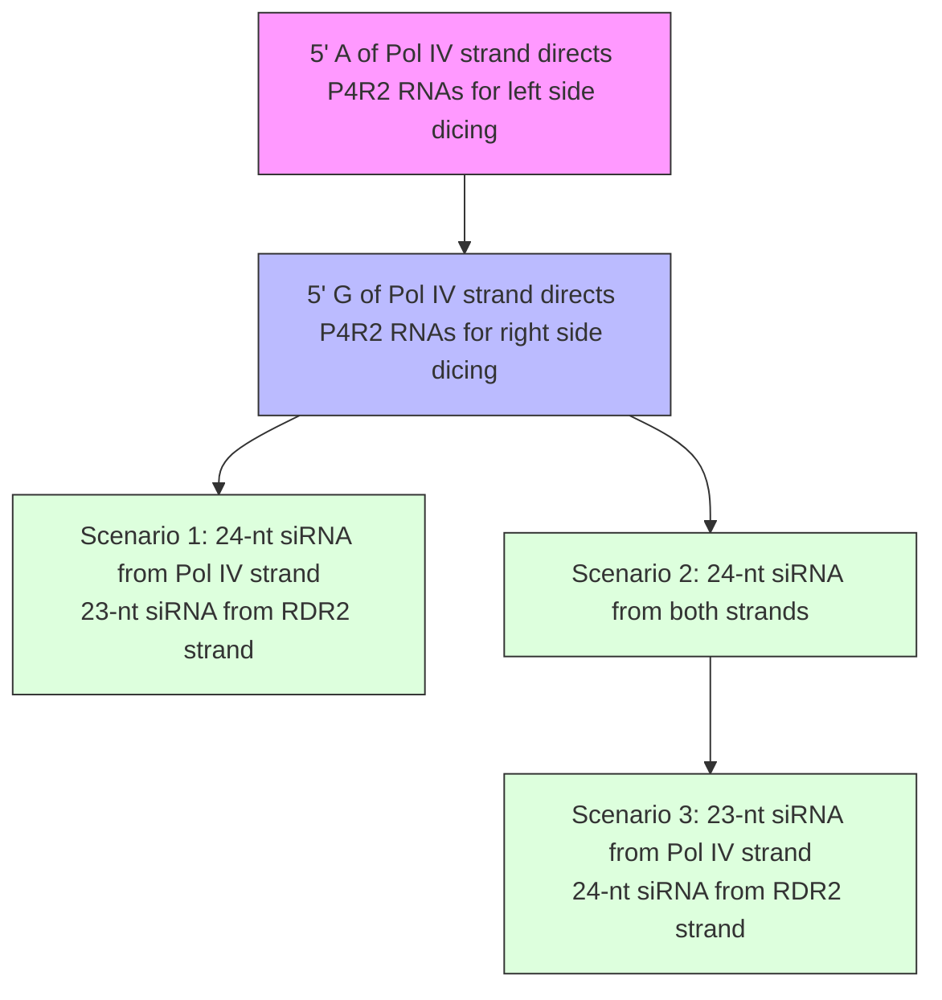
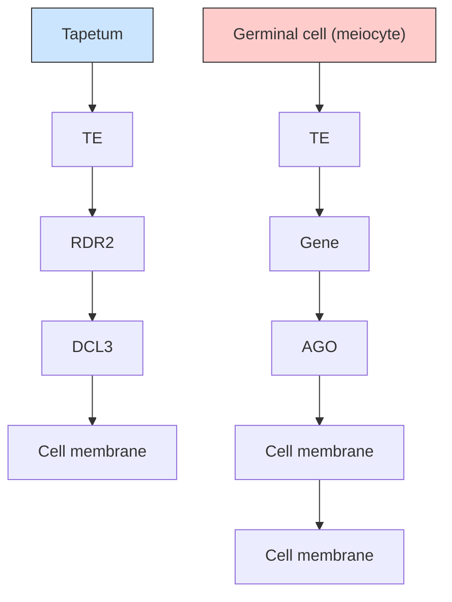

# Annual Review of Plant Biology

# Plant Small RNAs: Their Biogenesis, Regulatory Roles, and Functions

Junpeng Zhan1 and Blake C. Meyers1,2

1Donald Danforth Plant Science Center, St. Louis, Missouri, USA; email: bmeyers@danforthcenter.org

2Division of Plant Science & Technology, University of Missouri-Columbia, Columbia, Missouri, USA

Annu. Rev. Plant Biol. 2023. 74:21–51

First published as a Review in Advance on February 28, 2023

The Annual Review of Plant Biology is online at plant.annualreviews.org

https://doi.org/10.1146/annurev-arplant-070122- 035226

Copyright © 2023 by the author(s). This work is licensed under a Creative Commons Attribution 4.0 International License, which permits unrestricted use, distribution, and reproduction in any medium, provided the original author and source are credited. See credit lines of images or other third-party material in this article for license information.

# ANNUAL CONNECT R RVIEWS

# www.annualreviews.org

Download figures   
Navigate cited references   
Keyword search   
Explore related articles   
Share via email or social media

# Keywords

miRNA, siRNA, phasiRNA, mobile siRNA, plant development

# Abstract

Plant cells accumulate small RNA molecules that regulate plant development, genome stability, and environmental responses. These small RNAs fall into three major classes based on their function and mechanisms of biogenesis—microRNAs, heterochromatic small interfering RNAs, and secondary small interfering RNAs—plus several other less well-characterized categories. Biogenesis of each small RNA class requires a pathway of factors, some specific to each pathway and others involved in multiple pathways. Diverse sequenced plant genomes, along with rapid developments in sequencing, imaging, and genetic transformation techniques, have enabled significant progress in understanding the biogenesis, functions, and evolution of plant small RNAs, including those that had been poorly characterized because they were absent or had low representation in Arabidopsis (Arabidopsis thaliana). Here, we review recent findings about plant small RNAs and discuss our current understanding of their biogenesis mechanisms, targets, modes of action, mobility, and functions in Arabidopsis and other plant species, including economically important crops.

# Contents

1. INTRODUCTION 22   
2. SMALL RNA BIOGENESIS AND REGULATION. 22

2.1. MicroRNA Biogenesis and Modification 22   
2.2. Biogenesis of 24-Nucleotide Small Interfering RNAs . 26   
2.3. Secondary Small Interfering RNA Biogenesis . 27   
2.4. Biogenesis of Other Plant Small RNAs . 31

3. SMALL RNA EFFECTORS, TARGETS, AND REGULATORY ACTIVITIES . 32

3.1. Small RNA Sorting and Loading Onto Argonaute Proteins . . . . . 32   
3.2. MicroRNAs . 33   
3.3. Heterochromatic Small Interfering RNAs . 34   
3.4. Phased Secondary Small Interfering RNAs . 35   
3.5. Transfer RNA Fragments . 36

4. SMALL RNA MOBILITY AND DELIVERY 37

4.1. Long-Distance and Cell-to-Cell Movement of Small RNAs in Plants . . . . . . . . 3 7   
4.2. Regulatory and Functional Roles of Endogenous Mobile Small RNAs . . . . . . . . 37   
4.3. Intraspecies, Interspecies, and Interkingdom Delivery of Small RNAs . . . . . . . . 38   
4.4. Delivery and Applications of Artificial and Exogenous Small RNAs . . . . . . . . 38

5. CONCLUSIONS AND FUTURE PERSPECTIVES. 39

# 1. INTRODUCTION

Small RNAs (sRNAs) play key roles in the regulation of plant growth, reproduction, and biotic and abiotic stress responses. At the molecular level, sRNAs regulate chromatin modifications, transcript abundance, and translation through various mechanisms. Canonical plant sRNAs include microRNAs (miRNAs) and small interfering RNAs (siRNAs); the latter can be subclassified mainly as heterochromatic small interfering RNAs (hc-siRNAs) and secondary siRNAs. Several other plant sRNA types have been reported in the past few decades, but their biogenesis and functions are either controversial (e.g., naturally antisense siRNAs; see Section 2.4.1 below) or poorly understood [e.g., double-strand break–induced sRNAs and ribosomal RNA (rRNA)-derived siRNAs (203, 224)]. The biogenesis of sRNAs often involves the production of 20- to 24-nucleotide (nt) sRNA duplexes from longer RNA molecules by Dicer-like (DCL) endoribonucleases. The precursors are either hairpin-like RNA structures processed from the folding of self-complementary RNAs or double-stranded RNAs (dsRNAs) synthesized by RNA-dependent RNA polymerases (RDRs). In many cases, one strand of the DCL-generated short dsRNA molecules is loaded onto Argonaute (AGO) proteins to target endogenous or exogenous RNAs based on sequence complementarity and to mediate gene or transposon silencing.

Argonaute (AGO): a family of proteins that load sRNAs and act on sRNA targets

# 2. SMALL RNA BIOGENESIS AND REGULATION

# 2.1. MicroRNA Biogenesis and Modification

Plant miRNAs are encoded by endogenous MIRNA (MIR) genes. The majority of plant MIR genes are intergenic, noncoding loci, with only a small subset located in introns of protein-coding genes (150, 218, 219). Transcription of MIR genes by DNA-dependent RNA polymerase II (Pol II) produces primary miRNAs (pri-miRNAs), which are single-stranded, polyadenylated, and self-complementary RNA molecules that can fold into hairpin-like structures. The folded pri-miRNAs are recognized and cleaved by DCL1 to yield mature miRNA duplexes. Each duplex consists of an miRNA strand and an miRNA∗ (read miRNA star) strand. The miRNA∗ strand is usually degraded while the miRNA strand is retained on an AGO protein to form an RNA-induced silencing complex (RISC) (Figure 1). Most plant miRNAs are 21 nt in length; a smaller number of miRNAs are 20 or 22 nt, and 23- or 24-nt miRNAs are rare (8, 32, 206).

RNA-induced silencing complex (RISC): a ribonucleoprotein complex formed between an sRNA and an AGO protein

```mermaid
graph TD
    A["hs-siRNA locus"] --> B["Pol IV"]
    C["hs-siRNA target locus"] --> D["Pol V"]
    E["R/W"] --> F["D-body"]
    G["PHAS"] --> H["Pol II"]
    I["Nucleus"] --> J["AGO4/AGO6"]
    K["Cytoplasm"] --> L["AGO4/AGO6"]
    M["Repression"] --> N["m7G"]
    O["Transcription"] --> P["m7G"]
    Q["Transcription, promoter poorly defined"] --> R["m7G"]
    S["ER"] --> T["AGO1"]
    U["(A)n"] --> V["AGO1"]
    W["(A)n"] --> X["AGO1"]
    Y["(A)n"] --> Z["AGO1"]
    AA["(A)n"] --> AB["AGO1"]
    AC["(A)n"] --> AD["AGO1"]
    AE["(A)n"] --> AF["AGO1"]
    AG["(A)n"] --> AH["AGO1"]
    AI["(A)n"] --> AJ["AGO1"]
    AK["(A)n"] --> AL["AGO1"]
    AM["(A)n"] --> AN["AGO1"]
    AO["(A)n"] --> AP["AGO1"]
    AQ["(A)n"] --> AR["AGO1"]
    AS["(A)n"] --> AT["AGO1"]
    AU["(A)n"] --> AV["AGO1"]
    AW["(A)n"] --> AX["AGO1"]
    AY["(RDR2"] --> AZ["DCL3"]
    AZ --> BA["HEN1"]
    BA --> BB["AGO4/AGO6"]
    BC["(RDR6)"] --> BD["SGS3"]
    BD --> BE["DCL4/DCL5"]
    BF["(HEN1)"] --> BG["HEN1"]
    BH["(M7G)"] --> BI["(A)n"]
    BI --> BJ["(A)n"]
    BK["(DCL1"] --> BL["(HYL1)"]
    BL --> BM["HEN1"]
    BN["(SE)"] --> BO["(SE)"]
    BP["(m7G)"] --> BQ["(m7G)"]
```


<details>
<summary>flowchart</summary>


</details>

(Caption appears on following page)

Figure 1 (Figure appears on preceding page)

Biogenesis and modes of action of canonical plant sRNAs. hc-siRNAs are generated mainly through the activities of Pol IV, CLSY, RDR2, and DCL3. hc-siRNAs form RISCs with AGO4/AGO6 proteins and direct DNA methylation at Pol V–transcribed loci via DRM2. The blurry arrow for the transcriptional start of the hc-siRNAs and targets indicates the poorly characterized Pol IV/Pol V transcription start sites. miRNAs are generated through the activities of primarily Pol II, DCL1, HYL1, and SE. miRNAs form RISCs predominantly with AGO1; miRISCs can direct transcript cleavage, mediate translational repression, or trigger phasiRNA biogenesis. phasiRNAs are produced by Pol II, RDR6, and DCL4/DCL5. Other proteins involved in the biogenesis or actions are described in the main text. Figure adapted from images created with BioRender.com. Abbreviations: AGO, Argonaute; CLSY, CLASSY; D-body; nuclear dicing body; DCL, Dicer-like; DRM2, DOMAINS REARRANGED METHYLASE 2; ER, endoplasmic reticulum; hc-siRNA, heterochromatic small interfering RNA; HEN1, HUA ENHANCER 1; HYL1, HYPONASTIC LEAVES1; MIR, MIRNA; miRISC, microRNA-induced silencing complex; miRNA, microRNA; PHAS, phased secondary siRNA loci; phasiRNA, phased secondary siRNA; Pol II, RNA polymerase II; Pol IV, RNA polymerase IV; RDR, RNA-dependent RNA polymerase; RISC, RNA-induced silencing complex; SE, SERRATE; SGS3, SUPPRESSOR OF GENE SILENCING 3; SHH1, SAWADEE HOMEODOMAIN HOMOLOG1; sRNA, small RNA.

2.1.1. MIRNA transcription. Transcription of MIR genes is similar to that of protein-coding genes, requiring recruitment of Pol II and cotranscriptional 5 capping and 3 polyadenylation of primary transcripts (i.e., pri-miRNAs) (212). miRNA-focused analyses have identified many transcription factors (TFs) regulating MIR transcription. One example is the Arabidopsis SQUAMOSA PROMOTER BINDING PROTEIN-LIKE (SPL) family of TFs that regulate miR172 (204). TF-focused studies also identified several TF–MIR interactions. For instance, two MIR156 copies were identified as direct targets of FUSCA3 (FUS3) and ABSCISIC ACID INSENSITIVE 3 (ABI3) during Arabidopsis seed development (183, 193). Although the functions of the MIR genes identified in the TF-centered studies remain largely uncharacterized, they provided evidence that miRNA biogenesis is regulated at the transcriptional level by TFs active in specific tissues.

Several proteins or protein complexes associated with the Pol II machinery or chromatinmodifying processes in Arabidopsis have also been implicated in regulating MIR transcription. SMALL1 (SMA1; a DEAD-box domain spliceosomal protein), the PROTEIN PHOSPHATASE4 (PP4) complex, and the EMBRYONIC FLOWER2 (EMF2) complex [a Polycomb Repressive Complex 2 (PRC2)-type complex that mediates histone H3 lysine 27 trimethylation (H3K27me3)] directly interact with promoters of MIR genes to regulate their transcription (106, 197, 216). Two NEGATIVE ON TATA LESS2 (NOT2) proteins [NOT2a and NOT2b; putative components of the CARBON CATABOLITE REPRESSION 4 (CCR4)- NOT complex] and SAC3A and THP1 [components of the THREE PRIME REPAIR EXONUCLEASE-2 (TREX-2) complex] interact with Pol II to promote MIR transcription (194, 232). Most of the proteins associated with Pol II or chromatin-modifying processes are involved in regulating multiple MIR loci. Although characterization of some of these proteins was carried out with a focus on one or a few specific MIR loci, it is likely that many proteins are associated with the transcription of the majority of, if not all, MIR genes, especially if a regulatory protein also directly interacts with the DCL1 complex (see Section 2.1.2 below).

2.1.2. Primary microRNA processing and modifications. Plant pri-miRNAs form imperfect fold-back structures and are cleaved by DCL1 in the nucleus to produce miRNA-miRNA∗ duplexes (95, 144). This contrasts with animal systems, in which pri-miRNAs are processed by two ribonucleases, Drosha (in the nucleus) and then Dicer (in the cytoplasm) (184). The secondary structure of pri-miRNAs is a key determinant of where DCL1 cuts within the pri-miRNAs (18, 248). Some pri-miRNAs contain a 15- to 17-nt imperfect lower stem that is above one or more bulges and below the miRNA-miRNA∗ duplex region. Such structures guide the initial DCL1 cleavage distal to the loop (i.e., base-to-loop processing). Other pri-miRNAs may have an upper stem between the loop and the duplex region and are processed in a loop-to-base manner. A few other processing patterns have also been observed, with three or four cuts by DCL1, but in all cases, the two (final) cuts release an miRNA-miRNA∗ duplex (18, 248).

The dsRNA-binding protein HYPONASTIC LEAVES1 (HYL1) and the C2H2 zinc-finger protein SERRATE (SE) associate with DCL1 to form nuclear dicing bodies (D-bodies), which play a central role in miRNA biogenesis (52, 68, 111, 188, 220). Both HYL1 and SE facilitate accurate processing of pri-miRNAs by DCL1 (44, 94). Loss-of-function mutants of SE and HYL1 show pleiotropic developmental defects and a global reduction in miRNA abundance, and some of the phenotypes are similar between the two mutants (220), supporting the universal roles of HYL1 and SE in miRNA biogenesis. Recent work has shown that D-bodies are phase-separated condensates and that phase separation of SE mediates the formation of D-bodies and is critical for efficient pri-miRNA processing (211).

In addition to HYL1 and SE, many other factors also regulate pri-miRNA processing. For instance, the abovementioned SMA1 and NOT2 proteins and TREX-2 complex directly interact with DCL1/HYL1/SE to promote pri-miRNA processing (106, 194, 232). CHROMATIN REMODELING FACTOR2 [CHR2; an ATPase subunit of the Switch2/Sucrose Non-Fermentable2 (SWI2/SNF2) complex], the Elongator and TREX-2 complexes, and HASTY (HST; an ortholog of animal Exportin-5) also interact with DCL1/SE to regulate pri-miRNA processing (28, 50, 201). Notably, CHR2, the TREX-2 and Elongator complexes, and HST also facilitate MIR transcription (28, 50, 201, 232), although it is unknown whether they directly interact with the transcriptional machinery. Considered together, the observations that many proteins associated with the transcriptional machinery also interact with D-bodies suggest that pri-miRNAs are processed cotranscriptionally. Indeed, a recent study demonstrated that pri-miRNAs are processed into miRNAs while still associated with the Pol II machinery and that R loops (DNA–RNA hybrids) form at MIR loci to promote the cotranscriptional processing of pri-miRNAs (61).

Accumulation of the components of D-bodies is also tightly regulated. The nuclear protein XAP5 CIRCADIAN TIMEKEEPER (XCT) promotes DCL1 transcription and facilitates pri-miRNA processing (51). The SMA1 protein, in addition to its direct roles regulating MIR transcription and pri-miRNA processing, enhances pri-miRNA processing by facilitating the splicing of DCL1 pre-messenger RNAs (pre-mRNAs) (106). DCL1 transcripts are directly targeted by miR162, an miRNA product of DCL1 activity, demonstrating negative feedback regulation (214). The basic helix-loop-helix (bHLH) TF PHYTOCHROME-INTERACTING FACTOR4 (PIF4) interacts with DCL1 (and HYL1) and destabilizes DCL1 to inhibit pri-miRNA processing during photomorphogenesis (176). In a mutant defective in RNA DEBRANCHING ENZYME1 (DBR1), which is a protein involved in the degradation of intronic lariat RNAs, pri-miRNA processing is inhibited, likely reflecting sequestration of D-bodies by excessive lariat RNAs, demonstrating a unique mechanism by which DCL1 activity is modulated (108).

Some plant MIR genes are harbored in introns, and some MIR genes themselves contain introns (114, 178, 218). Thus, splicing mechanisms also play a role in miRNA processing. Many proteins play dual roles in splicing and pri-miRNA processing, and some splicing factors colocalize or interact with D-bodies and regulate pri-miRNA processing. For example, splicing factors STABI-LIZED1 (STA1), GLYCINE-RICH RBP7 (GRP7), ARGININE/SERINE-RICH SPLICING FACTOR40 (RS40), RS41, and SMA1 are involved in both pri-miRNA splicing and processing (13, 35, 93, 106). In addition, pre-mRNA-processing proteins PRP39b, PRP40a, PRP40b, and LETHAL UNLESS CBC 7 RL (LUC7rl) play crucial roles in the biogenesis of intronic miRNAs (90).

Pri-miRNAs also undergo 3 tailing such as uridylation and cytidylation, which facilitate primiRNA processing (168). The nucleotidyl transferase HEN1 SUPPRESSOR1 (HESO1) is a

RNA-directed DNA methylation (RdDM): a biological process in which sRNAs direct the deposition of cytosine methylation in specific sequence contexts (CG, CHG, and CHH, where H = A/C/T)

key protein mediating pri-miRNA uridylation and cytidylation, while another two nucleotidyl transferases, NTP6 and NTP7, also contribute to pri-miRNA cytidylation (168).

RNA methylation such as $N ^ { 6 }$ -methyladenosine $( \mathrm { m } ^ { 6 } \mathrm { A } )$ has recently emerged as an important mechanism of gene regulation (58). The mRNA adenosine methylase (MTA) in Arabidopsis deposits $\mathrm { m } ^ { 6 } \mathrm { A }$ on pri-miRNAs and facilitates pri-miRNA processing, with an impact on D-body assembly (15).

2.1.3. MicroRNA modification and turnover. Following pri-miRNA processing, the sRNA 2 -O-methyltransferase HUA ENHANCER 1 (HEN1) replaces SE to interact with DCL1 and HYL1 and catalyzes 2 -O-methylation at the 3 ends of miRNA duplexes to stabilize miRNAs (11, 225). Loss-of-function hen1 mutants exhibit reduced abundance of almost all miRNAs, and the remaining miRNAs are heterogeneous in size; these observations led to the discovery of $3 ^ { \prime }$ to $5 ^ { \prime }$ truncation and $3 ^ { \prime }$ uridylation of miRNAs (101, 222, 225). Three SMALL RNA–DEGRADING NUCLEASE genes—SDN1, SDN2, and SDN3—encode $3 ^ { \prime }$ to $5 ^ { \prime }$ exonucleases that function redundantly in degrading miRNAs and siRNAs in both wild-type and the hen1 mutant background (151, 226). SDN1’s exonuclease activity is partially inhibited by the $3 ^ { \prime }$ methylation of miRNAs (151), supporting the abovementioned role of $3 ^ { \prime }$ methylation in protecting miRNAs. miRNAs undergo $3 ^ { \prime }$ uridylation in hen1 mutants of Arabidopsis, rice (Oryza sativa), and maize (Zea mays), in which miRNA methylation is abolished (101, 231). In the Arabidopsis hen1 mutant, HESO1 and UTP:RNA URIDYLYLTRANSFERASE 1 (URT1) uridylate unmethylated miRNAs, leading to miRNA degradation (155, 186, 199, 242). Loss of function of HESO1 partially rescues the developmental defects of hen1 mutants, accompanied by elevated miRNA accumulation and reduced $3 ^ { \prime }$ uridylation (155, 242). These results suggest that 3 uridylation directs miRNAs for degradation to impair their regulatory functions. When AGO1-bound miR165/miR166 was uridylated by URT1 in vitro, slicer activity of the miR165/miR166-AGO1 complex was reduced (186), suggesting that 3 uridylation also regulates miRNA activities, in addition to miRNA stability. Combined, the current data suggest a crucial role of HEN1 in the regulation of miRNA turnover and functions; it methylates miRNAs to prevent uridylation, which causes miRNA degradation and impairs miRNA functions.

# 2.2. Biogenesis of 24-Nucleotide Small Interfering RNAs

hc-siRNAs, derived from transposons in heterochromatic genomic regions, are 24 nt in length and function in RNA-directed DNA methylation (RdDM). They are the most abundant siRNAs in plants, accounting for >90% of the siRNA population in Arabidopsis (137, 237). hc-siRNA biogenesis begins with transcription by Pol IV, a plant-specific DNA-dependent RNA polymerase (72, 142), followed by a second RNA strand synthesis by RDR2 (213). The dsRNAs are then diced by DCL3 into hc-siRNA duplexes and methylated, and a single strand is loaded onto AGO4, AGO6, or AGO9 to form RISCs (69, 101, 249) (Figure 1).

Pol IV transcription initiates at Pol II–like transcription start sites; that is, the nucleotide immediately upstream of the first nucleotide of the transcribed region is highly biased to pyrimidines (Y), whereas the first nucleotide of the transcribed region is biased to purines (R), indicating conservation in transcription start site preferences between Pol II and Pol IV, although they act on distinct genomic regions (16, 228). Pol IV can initiate transcription at multiple positions with the YR sequences to produce multiple short (typically 26- to 45-nt) transcripts from a single locus (16, 228). The SNF2 domain–containing chromatin-remodeling factors CLASSY1 (CLSY1)– CLSY4 (167, 245) and the homeodomain DNA-binding protein SAWADEE HOMEODOMAIN HOMOLOG1 (SHH1)/DNA-BINDING TRANSCRIPTION FACTOR1 (DTF1) (97, 98) recruit Pol IV to enable transcription of hc-siRNA loci.

Biochemical analyses discovered that Pol IV physically interacts with RDR2 to form a dual-RNA-polymerase complex (67, 98). Recent structural studies demonstrated that the activities of Pol IV and RDR2 are tightly coupled in that (a) Pol IV transcripts are channeled directly to RDR2, and (b) Pol IV backtracking enables RDR2 to synthesize the second strand of hc-siRNA precursors [aka Pol IV–RDR2 (P4R2) RNAs] (59, 74) (Figure 2a). The double-stranded P4R2 RNAs are diced by DCL3 to yield one hc-siRNA per precursor (16, 228). Biogenesis of hc-siRNAs can be recapitulated in vitro by co-incubating Pol IV, RDR2, and DCL3 with a DNA template and ribonucleotide triphosphates, indicating that the three enzymes are sufficient for hc-siRNA biogenesis (165). Dicing of P4R2 RNAs yields not only 24-nt hc-siRNAs but also 23-nt siRNAs (86, 237). However, AGO4 immunoprecipitates almost exclusively with 24-nt siRNAs (69, 130, 149), suggesting that the 23-nt siRNAs are passenger strands of hc-siRNA duplexes (165). A recent biochemical study of P4R2 RNA processing by DCL3 demonstrated that which precursor end is diced, and whether 24- and/or 23-nt siRNAs are produced, depends on the first nucleotide of the Pol IV strand of P4R2 RNAs and the position of RDR2’s initiation within Pol IV transcript ends (112) (Figure 2b). In another recent study, Wang et al. (196) carried out a structural analysis of a DCL3-P4R2 RNA complex. The results demonstrated that the Piwi/Argonaute/Zwille (PAZ) and RNase IIIb domains of DCL3 measure a 24-nt distance between the 5 -terminal nucleotide and the RNase IIIb domain cleavage site for only one strand of the P4R2 RNA. The RNase IIIb domain cuts the measured strand to produce 24-nt siRNAs, while the RNase IIIa domain cuts the nonmeasured strand to produce 23-nt siRNAs (196). The structural data support dicing scenario 1 described by Loffer et al. (112) (Figure 2b). Whether the Pol IV strand or the RDR2 strand of each hc-siRNA duplex is incorporated into RISCs under each dicing scenario has yet to be determined.

A few research groups have described a set of 24-nt siRNAs named siRNAs in endosperm (aka sirens), which are generated from a relatively small number of loci but are highly abundant in ovules and seeds (25, 63, 100, 157, 244). Sirens that accumulate in endosperm are maternally biased and have been suggested to move from the seed coat into filial tissues (the endosperm and embryo/zygote) to mediate DNA methylation of protein-coding genes in trans (25, 63). Sirens are distinct from hc-siRNAs in that they are derived from a much smaller number of loci that are located close to protein-coding genes rather than transposons. However, the biogenesis of sirens seems to resemble that of hc-siRNAs in their dependence on Pol IV and RDR2 (25, 63). Moreover, the CLSY1–CLSY4 genes (mentioned above) are differentially expressed across Arabidopsis tissues to coordinately regulate hc-siRNA and siren accumulation and, consequently, DNA methylation patterns. Siren accumulation is highly enriched in the ovules and mainly dependent on CLSY3 and, to a lesser extent, CLSY4 (244, 245). Therefore, sirens appear to mediate RdDM specifically in ovule and seed tissues, while hc-siRNAs are responsible for RdDM in other tissues. Sirens have so far only been reported in Arabidopsis, Brassica rapa, and rice (63, 100, 157, 244), so the extent of conservation of these 24-nt siRNAs in the angiosperms needs further investigation.

# 2.3. Secondary Small Interfering RNA Biogenesis

Secondary siRNAs are those whose biogenesis is triggered by other miRNAs or siRNAs. Phased secondary siRNAs (phasiRNAs) are generated from long RNA precursors, yielding siRNAs that map to the precursors in a precise head-to-tail arrangement (i.e., phasing). This arrangement is the result of their biogenesis: Precursors are first cleaved by a RISC at a specific target site, made double stranded, and then diced by a DCL protein in a sequential manner (Figure 1). The genomic loci that yield phasiRNAs—called PHAS loci—can be classified into protein-coding loci and noncoding loci based on the coding potential of each locus (110). PHAS precursors, either

a   
2 Pol IV elongation   
1 Pol IV initiation   


<details>
<summary>chemical</summary>

Diagram of Pol IV and RDR2 protein interactions in DNA helix, showing nucleotide base pairing and transcriptional changes
</details>

6 RDR2 termination and P4R2 RNA release   


<details>
<summary>chemical</summary>

Diagram of Pol IV and RDR2 protein interacting with a DNA double helix structure, showing secondary structural elements.
</details>

5 Pol IV termination and RDR2 elongation   


<details>
<summary>text_image</summary>

Pol IV
5'
3'
5'
3'
RDR2
5'
3'
</details>

3 Pol IV backtracking and RDR2 initiation   


<details>
<summary>chemical</summary>

Diagram of Pol IV and RDR2 protein complex with DNA helix structure showing key domains and binding sites
</details>

4 Pol IV backtracking and RDR2 elongation   


<details>
<summary>chemical</summary>

Diagram of Pol IV protein complex with RDR2 domain, showing helical structure and secondary structure
</details>

b   
P4R2 RNAs   


<details>
<summary>flowchart</summary>


</details>

Figure 2 (Figure appears on preceding page)

Mechanisms of hc-siRNA biogenesis. (a) Generation of hc-siRNA precursors by the Pol IV-RDR2 complex. As a Pol IV strand is being generated, Pol IV backtracks and hands the single-strand transcript to RDR2, which synthesizes the second (i.e., the RDR2) strand. Activity of RDR2 pulls the Pol IV transcript out of Pol IV, causing the termination of Pol IV transcription. Once the RDR2 strand is synthesized, the P4R2 RNA is released from RDR2 to serve as a substrate for DCL3. (b) Dicing code of DCL3. Depending on the starting nucleotide of the Pol IV strand and the length of the 3 overhang of the Pol IV strand, P4R2 RNAs are diced by DCL3 at different positions, releasing hc-siRNA duplexes from either end of the precursors. Panel a was adapted from Reference 74 with permission from the American Association for the Advancement of Science, and panel b was adapted from Reference 112 (CC BY 4.0). Figure adapted from images created with BioRender.com. Abbreviations: DCL3, Dicer-like 3; hc-siRNA, heterochromatic small interfering RNA; Pol IV, RNA polymerase IV; P4R2, Pol IV–RDR2; RDR2, RNA-dependent RNA polymerase 2; siRNA, small interfering RNA.

mRNAs or long noncoding RNAs, are Pol II products. Protein-coding genes that give rise to phasiRNAs include those from diverse families; phasiRNA biogenesis from these genes generally follows the one-hit model but with different miRNA triggers (reviewed in 53, 110). The bestcharacterized phasiRNAs derived from noncoding loci are (a) the so-called trans-acting siRNAs (tasiRNAs) and (b) the reproductive phasiRNAs.

The Arabidopsis genome contains eight known tasiRNA-producing loci (i.e., TAS loci), belonging to four families, TAS1–TAS4 (2, 150). The biogenesis of tasiRNA is well described and occurs by two pathways (reviewed in 110), both of which begin with cleavage of a TAS precursor mediated by an miRNA. One fragment of the cleaved precursor is converted to a dsRNA by RDR6 and iteratively cleaved by DCL4 [assisted by DOUBLE-STRANDED RNA–BINDING PROTEIN 4 (DRB4)] to produce 21-nt phasiRNA duplexes, which are then sorted and loaded onto AGO proteins. Beyond these similarities, the two pathways differ in several aspects. The more prevalent one-hit pathway begins with cleavage of a TAS precursor by a 22-nt miRNA trigger with a 5 U, which preferentially directs miRNA loading to AGO1 (33). The 22-nt length appears to be key to the ability of miRNAs to trigger secondary siRNAs (33, 54, 231), although other hypotheses have been proposed (119). The 3 fragment resulting from AGO1-miRNA cleavage is the substrate for dsRNA synthesis and subsequent tasiRNA production (2). In the less common two-hit pathway, a precursor is targeted by an AGO7-miR390 complex at two sites: The 3 -proximal target site is cleaved, while the 5 -proximal target site is not cleaved. Upon cleavage, the 5 fragment serves as the RDR6 substrate (7). These pathways/models of tasiRNA biogenesis are mostly based on the characterization of Arabidopsis tasiRNAs. Yet, analyses of species beyond Arabidopsis have detected substantial variations in the pathways, including the lengths of miRNA triggers and pairing between triggers and TAS precursors (209, 229). Therefore, the generalized pathways described here should be considered guidelines rather than rules, as additional data have yet to be obtained from a broader range of plants.

Initially characterized in grass species and then in other angiosperms, reproductive phasiRNAs, which are enriched in anthers, are classified into two sizes, namely the 21-nt and 24-nt phasiRNAs. In rice and maize, these two size classes preferentially accumulate at the premeiotic and meiotic stages of anther development, respectively (83, 230) (Figure 3a). Biogenesis of reproductive phasiRNAs follows the one-hit model, with the miR2118 family triggering 21-nt phasiRNAs, and miR2275 triggering 24-nt phasiRNAs. In maize, the homeodomain-leucine zipper IV (HD-ZIP IV) family TF OUTER CELL LAYER4 (OCL4) may be a key transcriptional regulator of 21-nt phasiRNAs (217, 230), while three bHLH family TFs—MALE STERILE23 (MS23), MS32, and bHLH122—play critical roles in regulating 24-nt phasiRNA biogenesis (138); however, whether OCL4 and the bHLHs directly activate the reproductive PHAS loci remains unclear. Several variations of the reproductive phasiRNA biogenesis pathways have recently been reported, including 24-nt phasiRNAs derived from hairpin-like structures that do not require RDR6 (85) and a group of 24-nt phasiRNAs whose precursors lack target sites of known miRNAs (148, 207).

Trans-acting siRNAs (tasiRNAs): a class of phased siRNAs derived from noncoding loci (TAS loci) and that act on target RNAs in trans on transcripts from loci other than the one from which the siRNAs are produced

Reproductive phasiRNAs: a class of phased siRNAs enriched in reproductive organs (mainly anthers); they include two size classes (21 and 24 nt) and are usually derived from noncoding loci

Secondary siRNAs can also be produced without phasing, for example, the epigenetically activated siRNAs (easiRNAs), a class of 21- or 22-nt siRNAs enriched in pollen vegetative cells (126, 141, 166). Creasey et al. (37) demonstrated that easiRNAs are derived from activated transposons and triggered by DCL1-dependent miRNAs. Loss of DCL1, DCL4, or RDR6 results in loss of 21-nt easiRNAs, suggesting that DCL4 and RDR6 are involved in easiRNA as well as tasiRNA biogenesis (37). Other studies documented that DCL2, AGO1, AGO2, AGO6, and Pol IV are also involved in the biogenesis or activities of easiRNAs (19, 123, 126, 127, 141) and that easiRNA biogenesis initiates during or after meiosis (200). However, the easiRNA biogenesis pathway remains largely unclear, as does its prevalence outside of Arabidopsis. Recent studies discovered that

a   


<details>
<summary>text_image</summary>

Premieiotic
Meiotic
Epidermis
Endothecium
Secondary parietal layer (SPL)
Middle layer (SPL-derived)
Tapetum (SPL-derived)
Germinal cell
</details>

b   


<details>
<summary>flowchart</summary>


</details>


<details>
<summary>flowchart</summary>


</details>

d   


<details>
<summary>flowchart</summary>

```mermaid
graph LR
    A["Epidermis"] --> B["Endothecium"]
    B --> C["Middle layer"]
    C --> D["Tapetum"]
    D --> E["Germinal cell (meiocyte)"]
    
    subgraph Epidermis
        F1["Epidermis"] --> F2["Epidermis"]
        F3["Epidermis"] --> F4["Epidermis"]
        F5["Epidermis"] --> F6["Epidermis"]
    end
    
    subgraph Endothecium
        G1["Endothecium"] --> G2["Endothecium"]
        G3["Endothecium"] --> G4["Endothecium"]
        G5["Endothecium"] --> G6["Endothecium"]
    end
    
    subgraph Middle layer
        H1["Middle layer"] --> H2["Middle layer"]
        H3["Middle layer"] --> H4["Middle layer"]
        H4["Middle layer"] --> H5["Middle layer"]
    end
    
    subgraph Tapetum
        I1["Tapetum"] --> J1["24-PHAS"]
        J1 --> K1["Pol II"]
        K1 --> L1["miR2275-AGO?"]
        L1 --> M1["DCL5"]
        M1 --> N1["Targeted"]
        N1 --> O1["AGO"]
        O1 --> P1["AGO"]
    end
    
    subgraph Germinal cell (meiocyte)
        Q1[" Germinal cell (meiocyte) "] --> R1["AGO"]
        R1 --> S1["AGO"]
        S1 --> T1["Targeted"]
        T1 --> U1["AGO"]
    end
    
    style Epidermis fill:#f9f,stroke:#333
    style Endothecium fill:#f9f,stroke:#333
    style Middle layer fill:#f9f,stroke:#333
    style Tapetum fill:#ccf,stroke:#333
    style Germinal cell fill:#cfc,stroke:#333
```
</details>

(Caption appears on following page)

Figure 3 (Figure appears on preceding page)

Current models of mobile siRNA biogenesis and activities in Arabidopsis and grass anthers. (a) Schematic diagrams of transverse sections of premeiotic and meiotic anther cell layers. Only one of four lobes is shown for premeiotic (∼0.4 mm long) and meiotic (∼2 mm) maize anthers. Colors indicate different cell types as marked at the bottom and are utilized again in panels $b , c ,$ and d. (b) The Arabidopsis tapetum-produced 24-nt siRNAs move to meiocytes to mediate DNA methylation at both transposon loci (in cis) and protein-coding genes (in trans) (113). (c) Premeiotic, 21-nt phasiRNAs in rice and maize are produced in the anther epidermis and mobilized to the germinal cells to mediate transcript cleavage (82, 230, 240). AGO loading and targeting of 21-nt phasiRNAs may also occur in epidermal cells. (d) Meiotic 24-nt phasiRNAs in maize are produced in the tapetum and move to other anther cell layers, concentrating mainly in the tapetum and meiocytes (246). Their molecular functions are unknown apart from mediating CHH methylation in cis (235). AGO loading and targeting of 24-nt phasiRNAs may also occur in tapetal cells. Panels $b , c ,$ , and d adapted from images created with BioRender.com. Abbreviations: AGO, Argonaute; bHLH, basic helix-loop-helix; DCL, Dicer-like; nt, nucleotide; OCL4, OUTER CELL LAYER4; phasiRNA, phased secondary small interfering RNA; Pol II, RNA polymerase II; Pol IV, RNA polymerase IV; RDR, RNA-dependent RNA polymerase; siRNA, small interfering RNA; SPL, secondary parietal layer; TE, transposable element (aka transposon).

paternal loss of Pol IV inhibits easiRNA biogenesis and bypasses seed abortion triggered by paternal genome excess (19, 48, 123). These findings suggest that easiRNAs regulate genome dosage balance.

# 2.4. Biogenesis of Other Plant Small RNAs

Several other types of plant sRNAs have been reported in the past two decades but have remained poorly characterized or even controversial. Here, we highlight only a few classes of these sRNAs, including the naturally antisense transcript siRNAs, 22-nt siRNAs, and transfer RNA fragments.

2.4.1. Naturally Antisense Transcript siRNAs. Endogenous transcripts with complementarity are thought to anneal, creating dsRNA for processing by a DCL protein to yield naturally antisense transcript siRNAs (natsiRNAs) that mediate gene silencing (153). No functional roles of individual trans-natsiRNAs (of which the precursor transcripts are derived from nonoverlapping loci) have been characterized in plants, although a few computational predictions of such loci have been reported (133, 189). Thus, here we focus on cis-natsiRNAs, which are derived from transcripts that are transcribed from the same locus but in opposite directions. The biogenesis pathways for the reported cis-natsiRNAs appear to be diverse, with one being dependent on Pol IV, RDR2, and DCL3 (177), similar to hc-siRNAs, and several depending on DCL1, DCL2, and/or DCL3, among other sRNA biogenesis proteins (20, 87, 158, 239).

A few genes in Arabidopsis are silenced by cis-natsiRNAs. Salt stress induces SRO5, a transcript antisense to P5CDH (encoding a --pyrroline-5-carboxylate dehydrogenase). The two transcripts form dsRNA, which is processed by DCL2 to produce a 24-nt siRNA, which in turn triggers production of DCL1-dependent 21-nt phasiRNAs from P5CDH transcripts and downregulation of P5CDH expression (20). The bacterial pathogen Pseudomonas syringae induces a 22-nt natsiRNA derived from the overlapping ATGB2 (encoding a Rab2-like small GTP-binding protein) and PPRL [encoding a pentatricopeptide repeat (PPR)-like protein] transcripts; the natsiRNA silences PPRL transcripts to contribute to disease resistance (87). In Arabidopsis pollen, the transcripts of the overlapping KOKOPELLI (KPL) and ARIADNE14 (ARI14) genes give rise to a sperm-specific natsiRNA that silences ARI14 to enable successful fertilization (158). In these studies, the natsiRNAs appeared to silence the target mRNA by cleavage, whereas in several other studies, natsiRNAs have been implicated in mediating DNA and/or histone methylation (177, 192).

Together, the biogenesis mechanisms and molecular activities of cis-natsiRNAs appear to be divergent and complex. Moreover, the number of cis naturally antisense mRNA pairs producing appreciable levels of siRNAs is small (239), and the density of siRNAs mapped to these regions is low (71). Therefore, as suggested a decade ago (6), the published data do not seem to support the classification of natsiRNAs as a uniform sRNA type.

2.4.2. 22-nucleotide small interfering RNAs. DCL2-dependent, endogenous 22-nt siRNAs accumulate at very low abundance in wild-type Arabidopsis, and dcl2 mutants do not show an obvious phenotype (70), making the 22-nt siRNAs a poorly characterized size class. The Arabidopsis DCL2 is known mainly as a Dicer protein that processes viral-derived siRNAs, but it also produces endogenous 22-nt siRNAs when other DCLs are absent (60). Strong accumulation of 22-nt siRNAs has recently been observed in Arabidopsis mutants that are deficient in cytoplasmic RNA decay and DCL4 activity, causing developmental defects such as reduced leaf expansion and pigmentation (205). These defects can be rescued by dcl2 or rdr6 mutations, suggesting that they were caused by ectopic accumulation of DCL2- and RDR6-dependent 22-nt siRNAs. Further transcriptome and translatome analysis demonstrated that the 22-nt siRNAs produced from the NIA1/NIA2 genes (encoding nitrate reductases), which account for nearly half of the 22-nt siRNAs and are loaded by AGO1, repress the translation of their cognate mRNAs, as well as other mRNAs, to inhibit plant growth and enhance response to nitrogen deficiency (205). Another recent study has documented that wild-type soybean (Glycine max) accumulates abundant DCL2- dependent 22-nt siRNAs (81). The soybean DCL2 proteins use Pol II transcripts with long inverted repeats as their substrate, resembling the reproductive 24-PHAS precursors described in asparagus and lily (85), suggesting that the biogenesis of 22-nt siRNAs in soybean may not require RDR6. DCL2-dependent 22-nt siRNAs regulate seed color in soybean by triggering secondary siRNAs from chalcone synthase transcripts (81). Together, these recent studies suggest that plant endogenous 22-nt siRNAs might not be conserved in terms of biogenesis (RDR6-dependent or not), molecular activities, and developmental functions. The 22-nt siRNAs are also abundant in maize, cassava (Manihot esculenta), and several asterid species (115). Clearly, more work across diverse plant species is needed to understand the divergence of 22-nt siRNAs.

2.4.3. Transfer RNA fragments. Transfer RNA fragments (tRFs) have recently emerged as a new class of sRNAs regulating gene expression. In the canonical transfer RNA (tRNA) biogenesis pathway, tRNA precursors (pre-tRNAs) are transcribed by RNA polymerase III (Pol III) and undergo a series of maturation events, including the removal of 5 leader and 3 trailer, intron splicing, the addition of 3 -terminal CCA residues, and covalent modifications (89). Mature tRNAs are exported from the nucleus to cytoplasm to function in translation (89, 147). Recent studies in animals, yeast, and plants have demonstrated that mature tRNAs can be cleaved by endonucleases to produce tRFs (reviewed in 173). tRFs exist in several major forms (tRF-5, tRF-3, 5 tRNA half, and 3 tRNA half ), depending on where within the tRNA molecules they originate. tRF-5 and tRF-3 RNAs are derived from tRNA 5 and 3 ends, respectively, and are approximately 13–30 nt long. They are generated by cleavage of the D and TC loops of tRNAs by an RNase T2 family endonuclease (173). The Arabidopsis RNase T2 family members RNS1 and RNS3 are necessary for tRF-5 biogenesis (128). DCL1 has also been implicated in tRF-5 biogenesis in Arabidopsis pollen (121). However, two more recent studies suggest that DCL1 does not play a major role in tRF biogenesis, although different tissues were examined in these studies (3, 128). Thus, current evidence suggests a key role of RNase T2 enzymes and an arguable role of DCLs in tRF biogenesis in plants.

# 3. SMALL RNA EFFECTORS, TARGETS, AND REGULATORY ACTIVITIES

# 3.1. Small RNA Sorting and Loading Onto Argonaute Proteins

sRNAs are loaded onto AGOs—the sRNA effector proteins—to form RISCs and act on their targets. The AGO protein family is highly diversified in seed plants, forming three major phylogenetic clades referred to as AGO1/AGO5/AGO10, AGO2/AGO3/AGO7, and AGO4/AGO6/

AGO8/AGO9 (based on naming of Arabidopsis proteins) (234), and sorting of sRNAs onto AGOs is finely regulated. A few early studies in Arabidopsis established that the $5 ^ { \prime }$ nucleotide of sRNAs is one of the key determinants for sRNA sorting and loading; AGO1 preferentially associates with sRNAs with a 5 U; AGO2, AGO4, AGO6, AGO7, and AGO9 prefer a 5 A; while AGO5 prefers a 5 C (69, 130, 135, 179). It is noteworthy that these patterns of sRNA–AGO associations are more like trends than rules, as exceptions occur.

A structural analysis of Arabidopsis AGO1, AGO2, and AGO5 demonstrated that the MID domain of the AGO proteins senses the 5 -end nucleotide of sRNAs to sort them (57). Using biochemical experiments, another study demonstrated that a loop in the central cleft of AGO10 is crucial for selective loading of miR165/miR166 (210). sRNA length is another key determinant in sorting for AGO loading, with 21- and 22-nt sRNAs associating predominantly with members of the AGO1/AGO5/AGO10 and AGO2/AGO3/AGO7 clades and 24-nt sRNAs associating with AGO4/AGO6/AGO9 (69, 130, 135, 247). The secondary structure of the sRNA duplex also influences sRNA sorting onto AGOs. miR165/miR166 has a 5 U and can be loaded onto AGO1, but AGO10 has a higher affinity for this miRNA than AGO1 has because of a mismatch at position 12 and two adjacent matches (at positions 10 and 11) within the mature duplex (247). Similarly, a mismatch at position 11 of the miRNA duplex contributes to the specific interaction between miR390 and AGO7 (47, 135), and base-pairing at position 15 of the miRNA duplex is important for miRNA sorting between AGO1 and AGO2 (238). Other than miRNAs, a recent analysis of 21-nt reproductive phasiRNAs in rice and maize detected strong enrichments for U and G at positions 14 and 19, respectively, implying that these nucleotide positions, along with the 5 -end nucleotide, influence phasiRNA loading onto AGO proteins (146).

During miRISC formation, the strand with lower 5 -end thermodynamic stability is preferentially selected as the guide strand, and several proteins, including the abovementioned HYL1, RS40, and RS41, are known to be involved in the process (39, 46, 75, 76, 118, 198). miRNA loading onto AGO1 occurs in the nucleus, and AGO1 (and thus miRISCs) can shuttle between the nucleus and the cytoplasm (17). The shuttling is enabled by a nuclear localization signal and a nuclear export signal in the AGO1 protein sequence and by Exportin-1. By contrast, phasiRNAs and hc-siRNAs are loaded onto AGO proteins in the cytoplasm (17, 223).

# 3.2. MicroRNAs

In plants, miRNAs silence gene expression mainly through cleavage of target transcripts, with a secondary activity of translational repression, and, in some rare reports, even directing DNA methylation. These different modes of action are largely determined by the miRNAs and the AGO proteins that load them. Transcript cleavage is dependent on the slicer activity of the miRNAdirected $\mathrm { A G O s } ;$ in Arabidopsis, slicer activities have been documented for AGO1, AGO2, AGO4, AGO7, and AGO10 (12, 29, 80, 135, 149). A catalytic triad of amino acids in the P-elementinduced wimpy testis (PIWI) domain of AGO proteins cleaves target transcripts for which an miRNA has full or nearly full complementarity (12, 29). Upon cleavage, the uncapped 3 fragment is degraded by the $5 ^ { \prime }$ to $3 ^ { \prime }$ endoribonuclease XRN4 (171). The $5 ^ { \prime }$ fragment is uridylated by HESO1 (156) and degraded by RISC-INTERACTING CLEARING 3 -5 EXORIBONUCLE-ASE1 (RICE1) and RICE2 (241). It is noteworthy that although most of the transcripts cleaved by miRISCs are destined for degradation, a subset of the cleaved fragments can be converted by RDR6 to dsRNAs and processed by a DCL protein via phasiRNA biogenesis pathways, as discussed above (Section 2.3).

In translational repression by miRNAs, targeting of different regions of a transcript by an miRISC has different consequences; targeting of the $5 ^ { \prime }$ untranslated region (UTR) of a transcript blocks ribosome recruitment and translational initiation, whereas targeting of the open reading

Nuclear localization signal: a short amino acid sequence in a protein that acts as a signal directing the transport of the protein from the cytoplasm to the nucleus

Nuclear export signal: a short amino acid sequence in a protein that acts as a signal directing the transport of the protein from the nucleus to the cytoplasm

Catalytic triad: a set of three amino acids in AGO proteins that is critical for cleavage of target RNAs

Retrotransposon: a type of transposon that copies and pastes itself to move between genomic locations

frame blocks translational elongation (78). In both scenarios, ribosomal activities are likely blocked by miRISCs via steric hindrance. Targeting the 3 UTR by an miRISC also represses translational initiation but seems to be a rare activity of miRNAs as it requires multiple target sites in the 3 UTR for efficient repression (78). Translational repression by miRISCs occurs on the endoplasmic reticulum and requires proteins associated with microtubule dynamics or miRNA decapping (21, 104, 221). Furthermore, DRB2 is necessary for translational repression by miRNAs, suggesting that whether an miRNA directs transcript cleavage or translational repression is determined by the activities of the DCL1-interacting proteins HYL1 (aka DRB1) and DRB2 (152).

In rare cases, miRNAs direct DNA methylation rather than transcript cleavage or translational repression. The Arabidopsis miR165/miR166 mediates DNA methylation of the HD-ZIP III family TF gene PHABULOSA (PHB), likely through base-pairing with the nascent PHB transcript (10). In rice, 24-nt miRNAs are analogous to hc-siRNAs in that they are generated by DCL3 rather than DCL1 and are loaded onto AGO4 to direct DNA methylation (206). The rarity of miRNAs directing DNA methylation suggests that DNA methylation might be an unusual role for them that is needed in specific developmental contexts and demonstrates that sRNAs not generated by Pol IV can target RdDM.

miRNAs target predominantly TF-encoding mRNAs, in addition to smaller numbers of mRNAs encoding nucleotide-binding, leucine-rich repeat (NB-LRR) or other families of proteins (to trigger phasiRNAs) and long noncoding RNAs (181). Through the regulation of TF genes, miRNAs act as key regulators of plant development and responses to abiotic or biotic stresses. These miRNA functions and modes of action have been comprehensively reviewed in several prior review articles (40, 55, 169).

# 3.3. Heterochromatic Small Interfering RNAs

Pol IV–dependent hc-siRNAs function through the RdDM pathway to regulate plant genome stability and gene expression. In the canonical RdDM pathway, hc-siRNA target loci are transcribed by RNA polymerase V (Pol V), another plant-specific RNA polymerase, generating noncoding transcripts. While a Pol V transcript is still attached to its genomic locus, the hcsiRNA–AGO4/AGO6 complex targets the transcript via sequence complementarity and recruits the DNA methyltransferase DOMAINS REARRANGED METHYLASE 2 (DRM2), mediating de novo DNA methylation of the Pol V–transcribed loci in all sequence contexts (CG, CHG, and CHH, where H = A/C/T) (38, 124) (Figure 1). In addition to the canonical pathway that involves hc-siRNA production by Pol IV, RDR2, and DCL3, there are several noncanonical RdDM pathways that are entered via different points by siRNAs produced through other mechanisms (38). The best-characterized biological function of RdDM is the silencing of transposons. Recent studies in diverse plant species have uncovered new roles of hc-siRNAs in the regulation of reproductive development. Here, we review these canonical or new roles of hc-siRNAs; readers are referred to previous review articles (38, 124) for other roles of hc-siRNAs.

Transposons are fragments of genomic DNA that can move between chromosomal locations through copy-and-paste or cut-and-paste mechanisms (56). These transpositions can disrupt genes or gene regulatory regions, and thus plants have evolved mechanisms to silence transposons (45). Transposons are the most prevalent targets of hc-siRNAs, suggesting that maintaining genome integrity through transposon silencing is the major role of hc-siRNAs (124). The retrotransposon EVADÉ (EVD) was one of the first transposons known to be silenced by 24-nt hc-siRNAs (131). A later analysis of EVD uncovered a key mechanism of transition from posttranscriptional gene silencing to RdDM-mediated transcriptional gene silencing that involves switching from the production of 21- or 22-nt siRNAs to production of 24-nt siRNAs (120).

However, RdDM is not the only mechanism of transposon silencing, and only a small number of transposons are mobilized in RdDM-defective mutants in Arabidopsis (77). A study of RdDM mutants in maize suggested that RdDM activities near genes are important for maintaining boundaries between chromatin regions that are actively transcribed and adjacent transposons (102).

RdDM pathway mutants in Arabidopsis lack visible phenotypes, and thus the developmental roles of RdDM had remained poorly understood until recent studies in other plant species. Early studies in Arabidopsis documented that RdDM-mediated repression of SINE-related direct repeats in the promoter region of the FLOWERING WAGENINGEN (FWA) gene, encoding a homeodomain TF, is crucial to the proper timing of flowering (88, 170). Several recent studies of RdDM mutants in other plant species, including tomato (Solanum lycopersicum) (62), B. rapa (64), Capsella rubella (200), and rice (31, 202, 215, 243) have uncovered critical roles of RdDM in the regulation of vegetative (e.g., leaf ) and/or reproductive (e.g., microspore, pollen, and seed) development. As mentioned above, sirens are also Pol IV–dependent 24-nt siRNAs (similar to hc-siRNAs). Since sirens can direct DNA methylation in reproductive tissues (25, 64, 244), whether the reproductive defects in the Pol IV/Pol V mutants are due to loss of functions of hc-siRNAs or sirens is not yet clear. Finally, RdDM has also been implicated in the regulation of genomic imprinting and interploidy hybridization barriers (48, 123, 160, 191).

# 3.4. Phased Secondary Small Interfering RNAs

The targets and functions of phasiRNAs derived from protein-coding loci have been reviewed previously (53); here, we focus on phasiRNAs derived from noncoding loci, that is, tasiRNAs and reproductive phasiRNAs. tasiRNAs mediate transcript cleavage of a diverse set of genes to regulate plant development or stress responses. In Arabidopsis, TAS1 siRNAs target the heat-responsive genes HEAT-INDUCED TAS1 TARGET1 (HTT1) and HTT2 to repress heat tolerance (103). tasiRNAs derived from a subset of TAS1 and TAS2 loci can target PPR transcripts to trigger tertiary phasiRNAs, which are involved in responses to fungal pathogens (73, 208). TAS3 siRNAs target auxin response factor (ARF) family TFs to regulate auxin signaling associated with many aspects of plant development and responses, such as leaf development and juvenile-to-adult transition (1, 49). TAS4 siRNAs target the mRNAs of MYB family TFs to regulate anthocyanin biosynthesis (116) and trichome development (66). While TAS1 and TAS2 have only been described in Arabidopsis, TAS3 has been found broadly in land plants, and TAS4 is conserved in eudicots (reviewed in 110). A few additional TAS loci or families (TAS5 to TAS10) exist outside Arabidopsis (42); however, these poorly characterized loci show limited conservation in plants. More work is needed to fully understand the variable conservation patterns and biological roles of these TAS families.

The 21-nt reproductive phasiRNAs can mediate cleavage of trans-target mRNAs (in rice) or their own precursors (in rice and maize) (82, 180, 240). Recent studies of OCL4 (the putative TF regulator of the 21-nt phasiRNA pathway), miR2118 (the trigger of 21-nt phasiRNAs), and AGO5 homologs (effectors of 21-nt phasiRNAs) in maize and/or rice have shed light on the developmental functions of 21-nt phasiRNAs. The maize ocl4 mutants lack 21-nt phasiRNAs and show temperature-sensitive male sterility (217, 230). Knocking out a subset of MIR2118 copies in rice resulted in male sterility and reduced 21-nt phasiRNA abundance (4). Notably, the partial mir2118 mutant also showed female sterility, suggesting a role of miR2118 and potentially 21-nt phasiRNAs in regulating female germline development (4). The AGO5c/MEIOSIS ARRESTED AT LEPTOTENE1 (MEL1) protein loads a subset of 21-nt reproductive phasiRNAs in rice, and disrupting the AGO5c gene causes male sterility (92). In maize, a recent study demonstrated that AGO5b/MALE-ASSOCIATED ARGONAUTE-1 (MAGO1) and AGO5c/MAGO2 play

Genomic imprinting: an epigenetic phenomenon in which one allele of a gene is expressed at a higher level than the other, depending on which allele is inherited from the mother or the father

redundant roles in regulating male fertility, as only the double-knockout or knockdown mutants showed male sterility (99), while another study showed that AGO5c—the causal gene of the classic maize mutant male sterile 28 (ms28)—alone is necessary for male fertility (107). Lee et al. (99) also documented that AGO5b and AGO5c load heat-induced 21-nt phasiRNAs to regulate the activities of retrotransposons in male germinal cells and that an ago5b;ago5c knockdown mutant showed temperature-sensitive male sterility (99).

Molecular functions of the 24-nt reproductive phasiRNAs remain poorly characterized; they may mediate CHH methylation at their own loci, but that seems unlikely to be their only function (235). Several loss-of-function mutant alleles of the maize DCL5, which functions specifically in 24-nt reproductive phasiRNA biogenesis, lack 24-nt phasiRNAs and demonstrate a temperaturesensitive male sterile phenotype (182). DCL5 is a duplicate of DCL3 and originated before the diversification of the grasses (145). The specialized role of DCL5 in 24-nt phasiRNA biogenesis has been attributed to the divergence in the PAZ domains of DCL3 and DCL5, which exhibit distinct preferences for 5 phosphates and 3 overhangs of substrate siRNA precursors (34). Single mutants of MS23, MS32, and bHLH122, the putative TF regulators of 24-nt phasiRNA biogenesis, are completely male sterile, and the abundance of 24-nt phasiRNAs is reduced substantially in these mutants (138).

Several mutants of the 21-nt or 24-nt phasiRNA pathways in maize showed a specific reduction in abundance of one size class or the other, indicating that the two pathways are genetically separable (182, 217, 230). On the other hand, two recent studies in rice demonstrated that both the 21- and 24-nt phasiRNA pathways utilize AGO1d as an effector of miRNA triggers, and loss of function of AGO1d causes reduction in abundances of both classes of phasiRNAs and confers temperature-sensitive male sterility (162, 164), suggesting that the two phasiRNA pathways might be interconnected. The 21-nt phasiRNA pathway is present in all characterized monocots, while the 24-nt phasiRNAs are more broadly, though not ubiquitously, present in angiosperms (110). Therefore, the published data suggest that the 21-nt and 24-nt phasiRNAs play important and conserved roles in regulating male fertility.

# 3.5. Transfer RNA Fragments

In Arabidopsis pollen, 19-nt tRFs are loaded by AGO1 and can mediate cleavage of the Gypsy family of retrotransposons (121), and there is also evidence that tRFs silence gene expression at the translational level. A study in pumpkin (Cucurbita maxima) demonstrated that phloem sap RNA molecules can inhibit translation in a nonspecific manner and tRFs likely play a major role (236). A group of tRNA halves and other tRFs of Arabidopsis can inhibit translation in vitro (96). However, the mechanism of translational inhibition via tRFs is largely unclear. For example, do tRFs target the mRNAs or tRNAs? Does the process require an AGO?

The cleavage of Gypsy transposons by tRF-AGO1 RISCs suggests that tRFs are involved in regulating genome stability (121). Moreover, tRFs are frequently induced by abiotic and biotic stresses, such as oxidative stress, ultraviolet radiation, cold, heat, low phosphate, and pathogen infection (reviewed in 117). A recent study showed that a 5 tRF forms a RISC with AGO1 to repress pathogen defense when not infected (65). However, repressing defense responses is likely not a universal role of tRFs, as they are more frequently induced, rather than inhibited, by pathogen infection (5, 175), suggesting that tRFs are more likely to function as activators of pathogen defense. Therefore, many questions remain to be addressed about the functions of tRF; for example, what target RNAs are directly regulated by tRFs in stress responses, and how are they regulated (e.g., RNA cleavage or translation inhibition)? Given the similar regulatory roles of tRFs and miRNAs, why use tRFs when miRNAs, which are longer than tRF-5 and tRF-3 RNAs, would presumably provide more specificity?

# 4. SMALL RNA MOBILITY AND DELIVERY

# 4.1. Long-Distance and Cell-to-Cell Movement of Small RNAs in Plants

Endogenous miRNAs and siRNAs can move through phloem (long-distance movement) or plasmodesmata (cell-to-cell movement) to mediate gene silencing (129). Early studies of systemic silencing using grafting experiments uncovered mobile siRNAs acting as a silencing signal in plants (134, 190). All major size classes of endogenous sRNAs (21, 22, and 24 nt) can move through phloem, and predominantly from shoot to root, consistent with the movement of photoassimilates (105, 134). sRNA duplexes rather than precursors are known to move from cell to cell through plasmodesmata (22, 43). Accordingly, cell-to-cell spread of RNA interference (RNAi; aka sRNA-mediated gene silencing) is regulated by two plasmodesmata-localized receptor-like kinases, BARELY ANY MERISTEM1 (BAM1) and BAM2 (159).

# 4.2. Regulatory and Functional Roles of Endogenous Mobile Small RNAs

Endogenous mobile sRNAs are broadly involved in the regulation of plant development and environmental responses. Here, we highlight a few biological processes in which the mobility of miRNAs and siRNAs plays a key role.

4.2.1. Roles of mobile microRNAs. miRNAs that travel over long distances through phloem are frequently linked to systemic responses to biotic or abiotic stresses. In Arabidopsis, miR399 travels from shoot to root to target transcripts of the PHO2 gene (encoding a ubiquitin-conjugating E2 enzyme) in response to phosphate deficiency and acts as a signal to enhance phosphate uptake by root (109, 143). Also in Arabidopsis, miR395 travels from shoot to root and silences its targets, including transcripts of the adenosine triphosphate (ATP) sulfurylase genes APS1 and APS4 and the low-affinity sulfate transporter gene SULTR2;1 (23). The abundance of miR395, miR398, and miR399 increases in the phloem of B. rapa in response to sulfate, copper, and phosphate deprivation, respectively (24). In Lotus japonicus, miR2111 travels from shoot to root to mediate posttranscriptional silencing of the symbiosis repressor TOO MUCH LOVE (TML, encoding a Kelch repeat–containing F-box protein) and facilitate rhizobial infection (185).

Short-distance movement of miRNAs (and siRNAs; see below) is often associated with the regulation of plant development. For instance, miR165/miR166 movement has been observed in multiple plant organs to regulate cell patterning. In leaves, miR165/miR166 forms a gradient of abundance between the abaxial and adaxial epidermis (139) to regulate the spatial expression pattern of PHB, a HD-ZIP III family TF that determines adaxial identity (125). In roots, miR165/miR166 abundance also forms a gradient, decreasing from the endodermis to the innermost cells, determining the identities of root cell layers; this also occurs via regulation of PHB (30).

4.2.2. Roles of mobile small interfering RNAs. Early work on systemic silencing discovered that Arabidopsis 24-nt siRNAs can move from shoot to root and direct DNA methylation (129, 134). PhasiRNAs that travel long distances in Arabidopsis, including TAS3a tasiRNAs (163) and other phasiRNAs (105), also mediate cleavage of transcripts in recipient cells; the TAS3a tasiRNAs target ARF transcripts to trigger systemic acquired resistance to P. syringae (163). Arabidopsis TAS3 tasiRNAs that target ARF transcripts (tasiR-ARFs hereafter) also move from cell to cell to regulate cell patterning. In leaves, tasiR-ARFs are produced in adaxial layers and are translocated to the abaxial side, forming a gradient that negatively correlates with the expression of ARF3, which specifies abaxial identity (36). In ovules, tasiR-ARFs produced in the apical epidermal layer of ovules move to internal cells to target ARF3 mRNAs and repress ectopic megaspore mother cells (172, 174). Thus, one common consequence of cell-to-cell movement of miRNAs and tasiRNAs is an sRNA concentration gradient regulating cell patterning.

RNA interference (RNAi): a biological process in which sRNAs silence gene expression in a sequence-specific manner

Biogenesis of 21-nt reproductive phasiRNAs in maize likely occurs in the anther epidermis based on the epidermis-specific expression of OCL4 and accumulation of miR2118. However, 21-nt phasiRNAs are detected in almost all internal anther cell layers and germinal cells (230). Similarly, 24-nt phasiRNA precursors and DCL5 transcripts are detected predominantly in the anther tapetum layer, whereas 24-nt phasiRNAs are detected in all anther cell layers (and enriched in the germinal cells and tapetum) (230, 246), suggesting that both size classes of reproductive phasiRNAs can move across anther cell layers (Figure 3a,c,d). A group of 24-nt siRNAs produced from transposons in the Arabidopsis tapetum move to meiocytes to mediate DNA methylation (113) (Figure 3b). Since 24-nt reproductive phasiRNAs are absent in Arabidopsis and other Brassicaceae species (110), the Arabidopsis tapetal siRNAs might be a potential substitute for the phasiRNAs in regulating male reproduction (136). In addition, the pollen-enriched easiRNAs and ovule/seedenriched sirens might also move within reproductive organs to regulate DNA methylation (63, 122, 166). The discoveries of diverse mobile siRNAs in reproductive tissues reinforce the notion that siRNAs and their movement play crucial roles in plant reproductive development.

# 4.3. Intraspecies, Interspecies, and Interkingdom Delivery of Small RNAs

A recent study in Arabidopsis discovered that miR156 and miR399 are secreted to growth medium and taken up by neighboring plants to silence mRNAs of PHO2 and SPL9, respectively, demonstrating that miRNAs can act as signaling molecules between plants of the same species (14). In one example of interspecies delivery of sRNAs, the parasitic plant Cuscuta campestris delivers 22-nt miRNAs to host plants (Arabidopsis and Nicotiana benthamiana) to target host mRNAs for cleavage and phasiRNA production; one of the target transcripts, SIEVE-ELEMENT-OCCLUSION-RELATED1 (SEOR1), encoding a protein enriched in phloem, was suggested to facilitate nutrient uptake by the host plants and nutrient supply to Cuscuta (161). Several Cuscuta species encode miRNAs and siRNAs to target conserved sites of host mRNAs, including SEOR1 (84).

Many studies have uncovered interkingdom delivery of miRNAs, siRNAs, or tRFs, either between plants and symbiotic bacteria or between plants and pathogens. These studies have been reviewed elsewhere (26, 91). Here, we present a few examples that shed light on new mechanisms of plant–microbe interactions. One recent study reported that Bradyrhizobium japonicum delivers tRFs to host plants (soybean) to target transcripts of root hair or nodulation-associated genes to facilitate nodule formation (154). Several other studies provide evidence that plants can deliver sRNAs to pathogens via extracellular vesicles to induce gene silencing. Arabidopsis cells infected by Botrytis cinerea secrete extracellular vesicles containing tasiRNAs, hc-siRNAs, and miRNAs at infection sites. The sRNAs within the vesicles are then taken up by the fungus to induce silencing of fungal genes essential for pathogenicity (27). Infection of Arabidopsis by Phytophthora capsici leads to enhanced accumulation of PPR-siRNAs in extracellular vesicles, and the siRNAs are delivered to Phytophthora to silence transcripts and inhibit infection (73). Arabidopsis extracellular vesicles are enriched for 10- to 17-nt tiny RNAs, which are presumptive degradation products of longer RNAs (9). However, the majority of apoplastic siRNAs and miRNAs, as well as AGO2, an sRNA effector, are located outside extracellular vesicles. These sRNAs (and other extracellular noncoding RNAs) are more likely than the tiny RNAs to mediate silencing of pathogen genes (227). How silencing RNAs are delivered from plants to pathogens is a matter of active investigation.

# 4.4. Delivery and Applications of Artificial and Exogenous Small RNAs

Naturally occurring, interkingdom RNAi has informed successful uses of artificially designed siRNAs to mediate gene silencing in pathogens to protect crops. For instance, transgenic barley (Hordeum vulgare) and wheat (Triticum aestivum) producing artificial siRNAs that target the effector gene Avra10 of the powdery mildew fungus Blumeria graminis effectively inhibit its growth, conferring disease resistance in the crops (140). The approach requires the generation of transgenic plants, which is often costly and time-consuming. As an alternative strategy, direct application of sRNAs or dsRNA precursors onto host plants (aka environmental RNAi) has been developed and proven effective. B. cinerea is a fungal pathogen that uses sRNAs as effectors to cause gray mold disease. B. cinerea can take up (from the medium) exogenous sRNAs and dsRNAs that target DCL1/DCL2 genes in the fungus and thus inhibit gray mold disease. Spraying the sRNAs or dsRNAs on plant surfaces also inhibits the disease, demonstrating the effectiveness of environmental RNAi for disease resistance (195). However, the sRNAs and dsRNAs can protect plants for only up to 10 days after spray, likely due to the instability of naked RNA molecules (195). To increase the duration of environmental RNAi, Mitter et al. (132) developed layered, double hydroxide clay nanosheets (BioClay), which can carry dsRNAs that mediate antiviral RNA silencing. BioClay can protect Nicotiana tabacum plants against virus for at least 20 days after spray (132). Foliar application of BioClay is more effective than naked dsRNAs in protecting cotton against whitefly (79). Efforts are ongoing to develop other methods and materials for exogenous delivery of sRNAs into plants (41, 187, 233).

# 5. CONCLUSIONS AND FUTURE PERSPECTIVES

The past two decades of research into plant sRNAs have brought tremendous advances. Early work was highly descriptive, focused on discovering and cataloging miRNAs and other classes of sRNAs. Subsequent research dissected their biogenesis pathways—work that continues today—as more specialized pathway components are identified through genetics or as interacting partners. With the development of tools and resources that make diverse plant species more accessible and amenable to genetic alterations, as well as more advanced sequencing methods, these analyses have expanded and moved from Arabidopsis to a broad array of crops and nonmodel species and have provided insights into the evolution of plant sRNAs and their biogenesis pathways. One example is the reproductive phasiRNAs that are found broadly in angiosperms but not in Arabidopsis. The coming decade promises to yield more discoveries of sRNA dynamics (perhaps with single-cell resolution), provide more insights into sRNA biogenesis (including within subcellular compartments and foci), and decode the molecular functions of sRNAs that are as yet poorly characterized. These advances will be enabled by improved methods for sequencing, imaging, tracking, sensing, and delivering sRNAs in plant cells and tissues.

# SUMMARY POINTS

1. The biogenesis of microRNAs involves transcription of MIR loci by polymerase II (Pol II), cotranscriptional processing of primary microRNAs (pri-miRNAs) by nuclear dicing bodies (D-bodies), pri-miRNA tailing and methylation, and miRNA modifications.   
2. Precursors of heterochromatic small interfering RNAs (hc-siRNAs) are short (∼26- to 45-nt) transcripts produced by the Pol IV–RDR2 dual-polymerase complex and processed by DCL3 to yield one hc-siRNA per precursor.   
3. Two generalized pathways (a one-hit and a two-hit pathway) exist for the biogenesis of phasiRNAs, and they should be considered guidelines rather than rules.   
4. miRNAs silence genes mainly through cleavage of target transcripts, with a secondary activity of translational repression, and, in rare cases, directing DNA methylation.

5. hc-siRNAs function via the RNA-directed DNA methylation (RdDM) pathway to regulate plant genome stability and gene expression. A few recent studies have shed light on the developmental roles of RdDM.   
6. Trans-acting small interfering RNAs (tasiRNAs) mediate transcript cleavage of diverse genes to regulate plant development and stress responses. Reproductive phased secondary small interfering RNAs (phasiRNAs) play important and conserved roles in regulating male fertility via mechanisms yet to be fully described.   
7. A common consequence of cell-to-cell movement of miRNAs and tasiRNAs is a small RNA (sRNA) concentration gradient that directs cell patterning.   
8. Naturally occurring, interkingdom RNA interference has informed successful uses of artificially designed siRNAs that silence pathogen genes to protect crops.

# FUTURE ISSUES

1. How are the various steps of the diverse sRNA pathways spatially organized within a plant cell? Is phase separation a common mechanism that is involved?   
2. Which strand of a DCL-produced sRNA duplex (e.g., the Pol IV strand or the RDR2 strand of each hc-siRNA duplex) is incorporated into RNA-induced silencing complexes (RISCs)? Does the other strand have a molecular function other than being degraded like canonical miRNA∗ strands?   
3. Are siRNAs in endosperm (sirens) conserved in the angiosperms in terms of genomic origin, spatiotemporal patterns of accumulation, and molecular function?   
4. Is there a conserved or related role of 22-nt siRNAs in diverse plant species?   
5. What are the key biogenesis factors and pathways that give rise to the various types of transfer RNA fragments (tRFs)?   
6. What are the endogenous targets of the 24-nt reproductive phasiRNAs that are abundant and broadly present in angiosperms?   
7. How do plants deliver silencing RNAs to pathogens? What are the implications for applications of artificial sRNAs?

# DISCLOSURE STATEMENT

The authors are not aware of any affiliations, memberships, funding, or financial holdings that might be perceived as affecting the objectivity of this review.

# ACKNOWLEDGMENTS

Small RNA research in the Meyers lab is currently supported by grants from the US National Science Foundation (awards 1754097 and 2141970). We thank Rebecca A. Mosher, R. Keith Slotkin, Virginia Walbot, and Joanna Friesner for critical reading and editing of the manuscript. We apologize to colleagues whose publications were not cited due to space limitations.

# LITERATURE CITED

1. Adenot X, Elmayan T, Lauressergues D, Boutet S, Bouche N, et al. 2006. DRB4-dependent TAS3 transacting siRNAs control leaf morphology through AGO7. Curr. Biol. 16(9):927–32   
2. Allen E, Xie Z, Gustafson AM, Carrington JC. 2005. microRNA-directed phasing during trans-acting siRNA biogenesis in plants. Cell 121(2):207–21   
3. Alves CS, Vicentini R, Duarte GT, Pinoti VF, Vincentz M, Nogueira FTS. 2017. Genome-wide identification and characterization of tRNA-derived RNA fragments in land plants. Plant Mol. Biol. 93(1–2):35–48   
4. Araki S, Le NT, Koizumi K, Villar-Briones A, Nonomura K-I, et al. 2020. miR2118-dependent U-rich phasiRNA production in rice anther wall development. Nat. Commun. 11(1):3115   
5. Asha S, Soniya EV. 2016. Transfer RNA derived small RNAs targeting defense responsive genes are induced during Phytophthora capsici infection in black pepper (Piper nigrum L.). Front. Plant Sci. 7:767   
6. Axtell MJ. 2013. Classification and comparison of small RNAs from plants. Annu. Rev. Plant Biol. 64:137– 59   
7. Axtell MJ, Jan C, Rajagopalan R, Bartel DP. 2006. A two-hit trigger for siRNA biogenesis in plants. Cell 127(3):565–77   
8. Axtell MJ, Meyers BC. 2018. Revisiting criteria for plant microRNA annotation in the era of big data. Plant Cell 30(2):272–84   
9. Baldrich P, Rutter BD, Zand Karimi H, Podicheti R, Meyers BC, Innes RW. 2019. Plant extracellular vesicles contain diverse small RNA species and are enriched in 10- to 17-nucleotide “tiny” RNAs. Plant Cell 31(2):315–24   
10. Bao N, Lye K-W, Barton MK. 2004. MicroRNA binding sites in Arabidopsis class III HD-ZIP mRNAs are required for methylation of the template chromosome. Dev. Cell 7(5):653–62   
11. Baranauske S, Mickut ˙ e M, Plotnikova A, Finke A, Venclovas ˙ C, et al. 2015. Functional mapping of ˇ the plant small RNA methyltransferase: HEN1 physically interacts with HYL1 and DICER-LIKE 1 proteins. Nucleic Acids Res. 43(5):2802–12   
12. Baumberger N, Baulcombe DC. 2005. Arabidopsis ARGONAUTE1 is an RNA Slicer that selectively recruits microRNAs and short interfering RNAs. PNAS 102(33):11928–33   
13. Ben Chaabane S, Liu R, Chinnusamy V, Kwon Y, Park J-H, et al. 2013. STA1, an Arabidopsis pre-mRNA processing factor 6 homolog, is a new player involved in miRNA biogenesis. Nucleic Acids Res. 41(3):1984– 97   
14. Betti F, Ladera-Carmona MJ, Weits DA, Ferri G, Iacopino S, et al. 2021. Exogenous miRNAs induce post-transcriptional gene silencing in plants. Nat. Plants 7(10):1379–88   
15. Bhat SS, Bielewicz D, Gulanicz T, Bodi Z, Yu X, et al. 2020. mRNA adenosine methylase (MTA) deposits m6A on pri-miRNAs to modulate miRNA biogenesis in Arabidopsis thaliana. PNAS 117(35):21785–95   
16. Blevins T, Podicheti R, Mishra V, Marasco M, Wang J, et al. 2015. Identification of Pol IV and RDR2- dependent precursors of 24 nt siRNAs guiding de novo DNA methylation in Arabidopsis. eLife 4:e09591   
17. Bologna NG, Iselin R, Abriata LA, Sarazin A, Pumplin N, et al. 2018. Nucleo-cytosolic shuttling of ARGONAUTE1 prompts a revised model of the plant microRNA pathway. Mol. Cell 69(4):709–19.e5   
18. Bologna NG, Schapire AL, Zhai J, Chorostecki U, Boisbouvier J, et al. 2013. Multiple RNA recognition patterns during microRNA biogenesis in plants. Genome Res. 23(10):1675–89   
19. Borges F, Parent JS, van Ex F, Wolff P, Martinez G, et al. 2018. Transposon-derived small RNAs triggered by miR845 mediate genome dosage response in Arabidopsis. Nat. Genet. 50(2):186–92   
20. Borsani O, Zhu J, Verslues PE, Sunkar R, Zhu J-K. 2005. Endogenous siRNAs derived from a pair of natural cis-antisense transcripts regulate salt tolerance in Arabidopsis. Cell 123(7):1279–91   
21. Brodersen P, Sakvarelidze-Achard L, Bruun-Rasmussen M, Dunoyer P, Yamamoto YY, et al. 2008. Widespread translational inhibition by plant miRNAs and siRNAs. Science 320(5880):1185–90   
22. Brosnan CA, Sarazin A, Lim P, Bologna NG, Hirsch-Hoffmann M, Voinnet O. 2019. Genome-scale, single-cell-type resolution of microRNA activities within a whole plant organ. EMBO J. 38(13):e100754   
23. Buhtz A, Pieritz J, Springer F, Kehr J. 2010. Phloem small RNAs, nutrient stress responses, and systemic mobility. BMC Plant Biol. 10:64

27. Shows that Arabidopsis secretes extracellular vesicles to deliver sRNAs to a fungal pathogen and silence virulence genes.

24. Buhtz A, Springer F, Chappell L, Baulcombe DC, Kehr J. 2008. Identification and characterization of small RNAs from the phloem of Brassica napus. Plant J. 53(5):739–49   
25. Burgess D, Chow HT, Grover JW, Freeling M, Mosher RA. 2022. Ovule siRNAs methylate proteincoding genes in trans. Plant Cell 34(10):3647–64   
26. Cai Q, He B, Kogel K-H, Jin H. 2018. Cross-kingdom RNA trafficking and environmental RNAi— nature’s blueprint for modern crop protection strategies. Curr. Opin. Microbiol. 46:58–64   
27. Cai Q, Qiao L, Wang M, He B, Lin F-M, et al. 2018. Plants send small RNAs in extracellular vesicles to fungal pathogen to silence virulence genes. Science 360(6393):1126–29   
28. Cambiagno DA, Giudicatti AJ, Arce AL, Gagliardi D, Li L, et al. 2021. HASTY modulates miRNA biogenesis by linking pri-miRNA transcription and processing. Mol. Plant 14(3):426–39   
29. Carbonell A, Fahlgren N, Garcia-Ruiz H, Gilbert KB, Montgomery TA, et al. 2012. Functional analysis of three Arabidopsis ARGONAUTES using slicer-defective mutants. Plant Cell 24(9):3613–29   
30. Carlsbecker A, Lee JY, Roberts CJ, Dettmer J, Lehesranta S, et al. 2010. Cell signalling by microRNA165/6 directs gene dose-dependent root cell fate. Nature 465(7296):316–21   
31. Chakraborty T, Trujillo JT, Kendall T, Mosher RA. 2022. A null allele of the pol IV second subunit impacts stature and reproductive development in Oryza sativa. Plant J. 111(3):748–55   
32. Chávez Montes RA, de Fátima Rosas-Cárdenas F, De Paoli E, Accerbi M, Rymarquis LA, et al. 2014. Sample sequencing of vascular plants demonstrates widespread conservation and divergence of microRNAs. Nat. Commun. 5(1):3722   
33. Chen H-M, Chen L-T, Patel K, Li Y-H, Baulcombe DC, Wu S-H. 2010. 22-Nucleotide RNAs trigger secondary siRNA biogenesis in plants. PNAS 107(34):15269–74   
34. Chen S, Liu W, Naganuma M, Tomari Y, Iwakawa H-O. 2022. Functional specialization of monocot DCL3 and DCL5 proteins through the evolution of the PAZ domain. Nucleic Acids Res. 50(8):4669–84   
35. Chen T, Cui P, Xiong L. 2015. The RNA-binding protein HOS5 and serine/arginine-rich proteins RS40 and RS41 participate in miRNA biogenesis in Arabidopsis. Nucleic Acids Res. 43(17):8283–98   
36. Chitwood DH, Nogueira FT, Howell MD, Montgomery TA, Carrington JC, Timmermans MC. 2009. Pattern formation via small RNA mobility. Genes Dev. 23(5):549–54   
37. Creasey KM, Zhai J, Borges F, Van Ex F, Regulski M, et al. 2014. miRNAs trigger widespread epigenetically activated siRNAs from transposons in Arabidopsis. Nature 508(7496):411–15   
38. Cuerda-Gil D, Slotkin RK. 2016. Non-canonical RNA-directed DNA methylation. Nat. Plants 2(11):16163   
39. Cui Y, Fang X, Qi Y. 2016. TRANSPORTIN1 promotes the association of MicroRNA with ARGONAUTE1 in Arabidopsis. Plant Cell 28(10):2576–85   
40. D’Ario M, Griffiths-Jones S, Kim M. 2017. Small RNAs: big impact on plant development. Trends Plant Sci. 22(12):1056–68   
41. Demirer GS, Zhang H, Goh NS, Pinals RL, Chang R, Landry MP. 2020. Carbon nanocarriers deliver siRNA to intact plant cells for efficient gene knockdown. Sci. Adv. 6(26):eaaz0495   
42. Deng P, Muhammad S, Cao M, Wu L. 2018. Biogenesis and regulatory hierarchy of phased small interfering RNAs in plants. Plant Biotechnol. J. 16(5):965–75   
43. Devers EA, Brosnan CA, Sarazin A, Albertini D, Amsler AC, et al. 2020. Movement and differential consumption of short interfering RNA duplexes underlie mobile RNA interference. Nat. Plants 6(7):789– 99   
44. Dong Z, Han M-H, Fedoroff N. 2008. The RNA-binding proteins HYL1 and SE promote accurate in vitro processing of pri-miRNA by DCL1. PNAS 105(29):9970–75   
45. Dubin MJ, Mittelsten Scheid O, Becker C. 2018. Transposons: a blessing curse. Curr. Opin. Plant Biol. 42:23–29   
46. Eamens AL, Smith NA, Curtin SJ, Wang M-B, Waterhouse PM. 2009. The Arabidopsis thaliana doublestranded RNA binding protein DRB1 directs guide strand selection from microRNA duplexes. RNA 15(12):2219–35   
47. Endo Y, Iwakawa H-O, Tomari Y. 2013. Arabidopsis ARGONAUTE7 selects miR390 through multiple checkpoints during RISC assembly. EMBO Rep. 14(7):652–58   
48. Erdmann RM, Satyaki PRV, Klosinska M, Gehring M. 2017. A small RNA pathway mediates allelic dosage in endosperm. Cell Rep. 21(12):3364–72

49. Fahlgren N, Montgomery TA, Howell MD, Allen E, Dvorak SK, et al. 2006. Regulation of AUXIN RESPONSE FACTOR3 by TAS3 ta-siRNA affects developmental timing and patterning in Arabidopsis. Curr. Biol. 16(9):939–44   
50. Fang X, Cui Y, Li Y, Qi Y. 2015. Transcription and processing of primary microRNAs are coupled by Elongator complex in Arabidopsis. Nat. Plants 1:15075   
51. Fang X, Shi Y, Lu X, Chen Z, Qi Y. 2015. CMA33/XCT regulates small RNA production through modulating the transcription of Dicer-like genes in Arabidopsis. Mol. Plant 8(8):1227–36   
52. Fang Y, Spector DL. 2007. Identification of nuclear dicing bodies containing proteins for microRNA biogenesis in living Arabidopsis plants. Curr. Biol. 17(9):818–23   
53. Fei Q, Xia R, Meyers BC. 2013. Phased, secondary, small interfering RNAs in posttranscriptional regulatory networks. Plant Cell 25(7):2400–15   
54. Fei Q, Yu Y, Liu L, Zhang Y, Baldrich P, et al. 2018. Biogenesis of a 22-nt microRNA in Phaseoleae species by precursor-programmed uridylation. PNAS 115(31):8037–42   
55. Fei Q, Zhang Y, Xia R, Meyers BC. 2016. Small RNAs add zing to the zig-zag-zig model of plant defenses. Mol. Plant Microbe Interact. 29(3):165–69   
56. Feschotte C, Jiang N, Wessler SR. 2002. Plant transposable elements: where genetics meets genomics. Nat. Rev. Genet. 3(5):329–41   
57. Frank F, Hauver J, Sonenberg N, Nagar B. 2012. Arabidopsis Argonaute MID domains use their nucleotide specificity loop to sort small RNAs. EMBO J. 31(17):3588–95   
58. Frye M, Harada BT, Behm M, He C. 2018. RNA modifications modulate gene expression during development. Science 361(6409):1346–49   
59. Fukudome A, Singh J, Mishra V, Reddem E, Martinez-Marquez F, et al. 2021. Structure and RNA template requirements of Arabidopsis RNA-DEPENDENT RNA POLYMERASE 2. PNAS 118(51):e2115899118   
60. Gasciolli V, Mallory AC, Bartel DP, Vaucheret H. 2005. Partially redundant functions of Arabidopsis DICER-like enzymes and a role for DCL4 in producing trans-acting siRNAs. Curr. Biol. 15(16):1494– 500   
61. Gonzalo L, Tossolini I, Gulanicz T, Cambiagno DA, Kasprowicz-Maluski A, et al. 2022. R-loops at microRNA encoding loci promote co-transcriptional processing of pri-miRNAs in plants. Nat. Plants 8(4):402–18   
62. Gouil Q, Baulcombe DC. 2016. DNA methylation signatures of the plant chromomethyltransferases. PLOS Genet. 12(12):e1006526   
63. Grover JW, Burgess D, Kendall T, Baten A, Pokhrel S, et al. 2020. Abundant expression of maternal siRNAs is a conserved feature of seed development. PNAS 117(26):15305–15   
64. Grover JW, Kendall T, Baten A, Burgess D, Freeling M, et al. 2018. Maternal components of RNAdirected DNA methylation are required for seed development in Brassica rapa. Plant J. 94(4):575–82   
65. Gu H, Lian B, Yuan Y, Kong C, Li Y, et al. 2022. A 5 tRNA-Ala-derived small RNA regulates anti-fungal defense in plants. Sci. China Life Sci. 65(1):1–15   
66. Guan X, Pang M, Nah G, Shi X, Ye W, et al. 2014. miR828 and miR858 regulate homoeologous MYB2 gene functions in Arabidopsis trichome and cotton fibre development. Nat. Commun. 5:3050   
67. Haag JR, Ream TS, Marasco M, Nicora CD, Norbeck AD, et al. 2012. In vitro transcription activities of Pol IV, Pol V, and RDR2 reveal coupling of Pol IV and RDR2 for dsRNA synthesis in plant RNA silencing. Mol. Cell 48(5):811–18   
68. Han M-H, Goud S, Song L, Fedoroff N. 2004. The Arabidopsis double-stranded RNA-binding protein HYL1 plays a role in microRNA-mediated gene regulation. PNAS 101(4):1093–98   
69. Havecker ER, Wallbridge LM, Hardcastle TJ, Bush MS, Kelly KA, et al. 2010. The Arabidopsis RNAdirected DNA methylation Argonautes functionally diverge based on their expression and interaction with target loci. Plant Cell 22(2):321–34   
70. Henderson IR, Zhang X, Lu C, Johnson L, Meyers BC, et al. 2006. Dissecting Arabidopsis thaliana DICER function in small RNA processing, gene silencing and DNA methylation patterning. Nat. Genet. 38(6):721–25   
71. Henz SR, Cumbie JS, Kasschau KD, Lohmann JU, Carrington JC, et al. 2007. Distinct expression patterns of natural antisense transcripts in Arabidopsis. Plant Physiol. 144(3):1247–55

61. Demonstrates that R loops form at MIR loci to promote cotranscriptional processing of pri-miRNAs by D-bodies.

74. Reports the structure of Pol IV and RDR2, which form a two-polymerase complex that produces dsRNA precursors of hc-siRNAs.

72. Herr AJ, Jensen MB, Dalmay T, Baulcombe DC. 2005. RNA polymerase IV directs silencing of endogenous DNA. Science 308(5718):118–20   
73. Hou Y, Zhai Y, Feng L, Karimi HZ, Rutter BD, et al. 2019. A Phytophthora effector suppresses transkingdom RNAi to promote disease susceptibility. Cell Host Microbe 25(1):153–65.e5   
74. Huang K, Wu X-X, Fang C-L, Xu Z-G, Zhang H-W, et al. 2021. Pol IV and RDR2: A two-RNApolymerase machine that produces double-stranded RNA. Science 374(6575):1579–86   
75. Iki T, Yoshikawa M, Meshi T, Ishikawa M. 2012. Cyclophilin 40 facilitates HSP90-mediated RISC assembly in plants. EMBO J. 31(2):267–78   
76. Iki T, Yoshikawa M, Nishikiori M, Jaudal MC, Matsumoto-Yokoyama E, et al. 2010. In vitro assembly of plant RNA-induced silencing complexes facilitated by molecular chaperone HSP90. Mol. Cell 39(2):282– 91   
77. Ito H, Gaubert H, Bucher E, Mirouze M, Vaillant I, Paszkowski J. 2011. An siRNA pathway prevents transgenerational retrotransposition in plants subjected to stress. Nature 472(7341):115–19   
78. Iwakawa HO, Tomari Y. 2013. Molecular insights into microRNA-mediated translational repression in plants. Mol. Cell 52(4):591–601   
79. Jain RG, Fletcher SJ, Manzie N, Robinson KE, Li P, et al. 2022. Foliar application of clay-delivered RNA interference for whitefly control. Nat. Plants 8(5):535–48   
80. Ji L, Liu X, Yan J, Wang W, Yumul RE, et al. 2011. ARGONAUTE10 and ARGONAUTE1 regulate the termination of floral stem cells through two microRNAs in Arabidopsis. PLOS Genet. 7(3):e1001358   
81. Jia J, Ji R, Li Z, Yu Y, Nakano M, et al. 2020. Soybean DICER-LIKE2 regulates seed coat color via production of primary 22-nucleotide small interfering RNAs from long inverted repeats. Plant Cell 32(12):3662–73   
82. Jiang P, Lian B, Liu C, Fu Z, Shen Y, et al. 2020. 21-nt phasiRNAs direct target mRNA cleavage in rice male germ cells. Nat. Commun. 11(1):5191   
83. Johnson C, Kasprzewska A, Tennessen K, Fernandes J, Nan GL, et al. 2009. Clusters and superclusters of phased small RNAs in the developing inflorescence of rice. Genome Res. 19(8):1429–40   
84. Johnson NR, dePamphilis CW, Axtell MJ. 2019. Compensatory sequence variation between transspecies small RNAs and their target sites. eLife 8:e49750   
85. Kakrana A, Mathioni SM, Huang K, Hammond R, Vandivier L, et al. 2018. Plant 24-nt reproductive phasiRNAs from intramolecular duplex mRNAs in diverse monocots. Genome Res. 28(9):1333–44   
86. Kasschau KD, Fahlgren N, Chapman EJ, Sullivan CM, Cumbie JS, et al. 2007. Genome-wide profiling and analysis of Arabidopsis siRNAs. PLOS Biol. 5(3):e57   
87. Katiyar-Agarwal S, Morgan R, Dahlbeck D, Borsani O, Villegas A Jr., et al. 2006. A pathogen-inducible endogenous siRNA in plant immunity. PNAS 103(47):18002–7   
88. Kinoshita Y, Saze H, Kinoshita T, Miura A, Soppe WJJ, et al. 2007. Control of FWA gene silencing in Arabidopsis thaliana by SINE-related direct repeats. Plant J. 49(1):38–45   
89. Kirchner S, Ignatova Z. 2015. Emerging roles of tRNA in adaptive translation, signalling dynamics and disease. Nat. Rev. Genet. 16(2):98–112   
90. Knop K, Stepien A, Barciszewska-Pacak M, Taube M, Bielewicz D, et al. 2016. Active 5 splice sites regulate the biogenesis efficiency of Arabidopsis microRNAs derived from intron-containing genes. Nucleic Acids Res. 45(5):2757–75   
91. Koch A, Wassenegger M. 2021. Host-induced gene silencing—mechanisms and applications. New Phytol. 231(1):54–59   
92. Komiya R, Ohyanagi H, Niihama M, Watanabe T, Nakano M, et al. 2014. Rice germline-specific Argonaute MEL1 protein binds to phasiRNAs generated from more than 700 lincRNAs. Plant J. 78(3):385–97   
93. Köster T, Meyer K, Weinholdt C, Smith LM, Lummer M, et al. 2014. Regulation of pri-miRNA processing by the hnRNP-like protein AtGRP7 in Arabidopsis. Nucleic Acids Res. 42(15):9925–36   
94. Kurihara Y, Takashi Y, Watanabe Y. 2006. The interaction between DCL1 and HYL1 is important for efficient and precise processing of pri-miRNA in plant microRNA biogenesis. RNA 12(2):206–12   
95. Kurihara Y, Watanabe Y. 2004. Arabidopsis micro-RNA biogenesis through Dicer-like 1 protein functions. PNAS 101(34):12753–58

96. Lalande S, Merret R, Salinas-Giegé T, Drouard L. 2020. Arabidopsis tRNA-derived fragments as potential modulators of translation. RNA Biol. 17(8):1137–48   
97. Law JA, Du J, Hale CJ, Feng S, Krajewski K, et al. 2013. Polymerase IV occupancy at RNA-directed DNA methylation sites requires SHH1. Nature 498(7454):385–89   
98. Law JA, Vashisht AA, Wohlschlegel JA, Jacobsen SE. 2011. SHH1, a homeodomain protein required for DNA methylation, as well as RDR2, RDM4, and chromatin remodeling factors, associate with RNA polymerase IV. PLOS Genet. 7(7):e1002195   
99. Lee Y-S, Maple R, Dürr J, Dawson A, Tamim S, et al. 2021. A transposon surveillance mechanism that safeguards plant male fertility during stress. Nat. Plants 7(1):34–41   
100. Li C, Gent JI, Xu H, Fu H, Russell SD, Sundaresan V. 2022. Resetting of the 24-nt siRNA landscape in rice zygotes. Genome Res. 32(2):309–23   
101. Li J, Yang Z, Yu B, Liu J, Chen X. 2005. Methylation protects miRNAs and siRNAs from a 3 -end uridylation activity in Arabidopsis. Curr. Biol. 15(16):1501–7   
102. Li Q, Gent JI, Zynda G, Song J, Makarevitch I, et al. 2015. RNA-directed DNA methylation enforces boundaries between heterochromatin and euchromatin in the maize genome. PNAS 112(47):14728–33   
103. Li S, Liu J, Liu Z, Li X, Wu F, He Y. 2014. HEAT-INDUCED TAS1 TARGET1 mediates thermotolerance via HEAT STRESS TRANSCRIPTION FACTOR A1a–directed pathways in Arabidopsis. Plant Cell 26(4):1764–80   
104. Li S, Liu L, Zhuang X, Yu Y, Liu X, et al. 2013. MicroRNAs inhibit the translation of target mRNAs on the endoplasmic reticulum in Arabidopsis. Cell 153(3):562–74   
105. Li S, Wang X, Xu W, Liu T, Cai C, et al. 2021. Unidirectional movement of small RNAs from shoots to roots in interspecific heterografts. Nat. Plants 7(1):50–59   
106. Li S, Xu R, Li A, Liu K, Gu L, et al. 2018. SMA1, a homolog of the splicing factor Prp28, has a multifaceted role in miRNA biogenesis in Arabidopsis. Nucleic Acids Res. 46(17):9148–59   
107. Li Y, Huang Y, Pan L, Zhao Y, Huang W, Jin W. 2021. Male sterile 28 encodes an ARGONAUTE family protein essential for male fertility in maize. Chromosome Res. 29(2):189–201   
108. Li Z, Wang S, Cheng J, Su C, Zhong S, et al. 2016. Intron lariat RNA inhibits microRNA biogenesis by sequestering the dicing complex in Arabidopsis. PLOS Genet. 12(11):e1006422   
109. Lin S-I, Chiang S-F, Lin W-Y, Chen J-W, Tseng C-Y, et al. 2008. Regulatory network of microRNA399 and PHO2 by systemic signaling. Plant Physiol. 147(2):732–46   
110. Liu Y, Teng C, Xia R, Meyers BC. 2020. PhasiRNAs in plants: their biogenesis, genic sources, and roles in stress responses, development, and reproduction. Plant Cell 32(10):3059–80   
111. Lobbes D, Rallapalli G, Schmidt DD, Martin C, Clarke J. 2006. SERRATE: a new player on the plant microRNA scene. EMBO Rep. 7(10):1052–58   
112. Loffer A, Singh J, Fukudome A, Mishra V, Wang F, Pikaard CS. 2022. A DCL3 dicing code within Pol IV-RDR2 transcripts diversifies the siRNA pool guiding RNA-directed DNA methylation. eLife 11:e73260   
113. Long J, Walker J, She W, Aldridge B, Gao H, et al. 2021. Nurse cell–derived small RNAs define paternal epigenetic inheritance in Arabidopsis. Science 373(6550):eabh0556   
114. Lu C, Jeong D-H, Kulkarni K, Pillay M, Nobuta K, et al. 2008. Genome-wide analysis for discovery of rice microRNAs reveals natural antisense microRNAs (nat-miRNAs). PNAS 105(12):4951–56   
115. Lunardon A, Johnson NR, Hagerott E, Phifer T, Polydore S, et al. 2020. Integrated annotations and analyses of small RNA–producing loci from 47 diverse plants. Genome Res. 30(3):497–513   
116. Luo Q-J, Mittal A, Jia F, Rock CD. 2012. An autoregulatory feedback loop involving PAP1 and TAS4 in response to sugars in Arabidopsis. Plant Mol. Biol. 80(1):117–29   
117. Ma X, Liu C, Cao X. 2021. Plant transfer RNA-derived fragments: biogenesis and functions. J. Integr. Plant Biol. 63(8):1399–1409   
118. Manavella PA, Hagmann J, Ott F, Laubinger S, Franz M, et al. 2012. Fast-forward genetics identifies plant CPL phosphatases as regulators of miRNA processing factor HYL1. Cell 151(4):859–70   
119. Manavella PA, Koenig D, Weigel D. 2012. Plant secondary siRNA production determined by microRNA-duplex structure. PNAS 109(7):2461–66   
120. Marí-Ordóñez A, Marchais A, Etcheverry M, Martin A, Colot V, Voinnet O. 2013. Reconstructing de novo silencing of an active plant retrotransposon. Nat. Genet. 45(9):1029–39

112. Discovers patterns of P4R2 RNA dicing by DCL3 that diversify hc-siRNAs.

113. Demonstrates that tapetum-derived 24-nt siRNAs move to meiocytes to mediate DNA methylation.

121. Martinez G, Choudury SG, Slotkin RK. 2017. tRNA-derived small RNAs target transposable element transcripts. Nucleic Acids Res. 45(9):5142–52   
122. Martínez G, Panda K, Köhler C, Slotkin RK. 2016. Silencing in sperm cells is directed by RNA movement from the surrounding nurse cell. Nat. Plants 2:16030   
123. Martinez G, Wolff P, Wang Z, Moreno-Romero J, Santos-González J, et al. 2018. Paternal easiRNAs regulate parental genome dosage in Arabidopsis. Nat. Genet. 50(2):193–98   
124. Matzke MA, Mosher RA. 2014. RNA-directed DNA methylation: an epigenetic pathway of increasing complexity. Nat. Rev. Genet. 15(6):394–408   
125. McConnell JR, Emery J, Eshed Y, Bao N, Bowman J, Barton MK. 2001. Role of PHABULOSA and PHAVOLUTA in determining radial patterning in shoots. Nature 411(6838):709–13   
126. McCue AD, Nuthikattu S, Reeder SH, Slotkin RK. 2012. Gene expression and stress response mediated by the epigenetic regulation of a transposable element small RNA. PLOS Genet. 8(2):e1002474   
127. McCue AD, Panda K, Nuthikattu S, Choudury SG, Thomas EN, Slotkin RK. 2015. ARGONAUTE 6 bridges transposable element mRNA-derived siRNAs to the establishment of DNA methylation. EMBO J. 34(1):20–35   
128. Megel C, Hummel G, Lalande S, Ubrig E, Cognat V, et al. 2019. Plant RNases T2, but not Dicer-like proteins, are major players of tRNA-derived fragments biogenesis. Nucleic Acids Res. 47(2):941–52   
129. Melnyk CW, Molnar A, Baulcombe DC. 2011. Intercellular and systemic movement of RNA silencing signals. EMBO J. 30(17):3553–63   
130. Mi S, Cai T, Hu Y, Chen Y, Hodges E, et al. 2008. Sorting of small RNAs into Arabidopsis Argonaute complexes is directed by the 5 terminal nucleotide. Cell 133(1):116–27   
131. Mirouze M, Reinders J, Bucher E, Nishimura T, Schneeberger K, et al. 2009. Selective epigenetic control of retrotransposition in Arabidopsis. Nature 461(7262):427–30   
132. Mitter N, Worrall EA, Robinson KE, Li P, Jain RG, et al. 2017. Clay nanosheets for topical delivery of RNAi for sustained protection against plant viruses. Nat. Plants 3:16207   
133. Moldovan D, Spriggs A, Dennis ES, Wilson IW. 2010. The hunt for hypoxia responsive natural antisense short interfering RNAs. Plant Signal. Behav. 5:247–51   
134. Molnar A, Melnyk CW, Bassett A, Hardcastle TJ, Dunn R, Baulcombe DC. 2010. Small silencing RNAs in plants are mobile and direct epigenetic modification in recipient cells. Science 328(5980):872–75   
135. Montgomery TA, Howell MD, Cuperus JT, Li D, Hansen JE, et al. 2008. Specificity of ARGONAUTE7-miR390 interaction and dual functionality in TAS3 trans-acting siRNA formation. Cell 133(1):128–41   
136. Mosher RA. 2021. Small RNAs on the move in male germ cells. Science 373:26–27   
137. Mosher RA, Schwach F, Studholme D, Baulcombe DC. 2008. PolIVb influences RNA-directed DNA methylation independently of its role in siRNA biogenesis. PNAS 105(8):3145–50   
138. Nan G-L, Teng C, Fernandes J, O’Connor L, Meyers BC, Walbot V. 2022. A cascade of bHLH-regulated pathways programs maize anther development. Plant Cell 34(4):1207–25   
139. Nogueira FT, Madi S, Chitwood DH, Juarez MT, Timmermans MC. 2007. Two small regulatory RNAs establish opposing fates of a developmental axis. Genes Dev. 21(7):750–55   
140. Nowara D, Gay A, Lacomme C, Shaw J, Ridout C, et al. 2010. HIGS: host-induced gene silencing in the obligate biotrophic fungal pathogen Blumeria graminis. Plant Cell 22(9):3130–41   
141. Nuthikattu S, McCue AD, Panda K, Fultz D, DeFraia C, et al. 2013. The initiation of epigenetic silencing of active transposable elements is triggered by RDR6 and 21–22 nucleotide small interfering RNAs. Plant Physiol. 162(1):116–31   
142. Onodera Y, Haag JR, Ream T, Nunes PC, Pontes O, Pikaard CS. 2005. Plant nuclear RNA polymerase IV mediates siRNA and DNA methylation-dependent heterochromatin formation. Cell 120(5):613–22   
143. Pant BD, Buhtz A, Kehr J, Scheible W-R. 2008. MicroRNA399 is a long-distance signal for the regulation of plant phosphate homeostasis. Plant J. 53(5):731–38   
144. Park MY, Wu G, Gonzalez-Sulser A, Vaucheret H, Poethig RS. 2005. Nuclear processing and export of microRNAs in Arabidopsis. PNAS 102(10):3691–96   
145. Patel P, Mathioni SM, Hammond R, Harkess AE, Kakrana A, et al. 2021. Reproductive phasiRNA loci and DICER-LIKE5, but not microRNA loci, diversified in monocotyledonous plants. Plant Physiol. 185(4):1764–82

146. Patel P, Mathioni SM, Kakrana A, Shatkay H, Meyers BC. 2018. Reproductive phasiRNAs in grasses are compositionally distinct from other classes of small RNAs. New Phytol. 220(3):851–64   
147. Phizicky EM, Hopper AK. 2015. tRNA processing, modification, and subcellular dynamics: past, present, and future. RNA 21(4):483–85   
148. Pokhrel S, Meyers BC. 2022. Heat-responsive microRNAs and phased small interfering RNAs in reproductive development of flax. Plant Direct 6(2):e385   
149. Qi Y, He X, Wang XJ, Kohany O, Jurka J, Hannon GJ. 2006. Distinct catalytic and non-catalytic roles of ARGONAUTE4 in RNA-directed DNA methylation. Nature 443(7114):1008–12   
150. Rajagopalan R, Vaucheret H, Trejo J, Bartel DP. 2006. A diverse and evolutionarily fluid set of microRNAs in Arabidopsis thaliana. Genes Dev. 20(24):3407–25   
151. Ramachandran V, Chen X. 2008. Degradation of microRNAs by a family of exoribonucleases in Arabidopsis. Science 321(5895):1490–92   
152. Reis RS, Hart-Smith G, Eamens AL, Wilkins MR, Waterhouse PM. 2015. Gene regulation by translational inhibition is determined by Dicer partnering proteins. Nat. Plants 1:14027   
153. Reis RS, Poirier Y. 2021. Making sense of the natural antisense transcript puzzle. Trends Plant Sci. 26(11):1104–15   
154. Ren B, Wang X, Duan J, Ma J. 2019. Rhizobial tRNA-derived small RNAs are signal molecules regulating plant nodulation. Science 365(6456):919–22   
155. Ren G, Chen X, Yu B. 2012. Uridylation of miRNAs by HEN1 SUPPRESSOR1 in Arabidopsis. Curr. Biol. 22(8):695–700   
156. Ren G, Xie M, Zhang S, Vinovskis C, Chen X, Yu B. 2014. Methylation protects microRNAs from an AGO1-associated activity that uridylates 5 RNA fragments generated by AGO1 cleavage. PNAS 111(17):6365–70   
157. Rodrigues JA, Ruan R, Nishimura T, Sharma MK, Sharma R, et al. 2013. Imprinted expression of genes and small RNA is associated with localized hypomethylation of the maternal genome in rice endosperm. PNAS 110(19):7934–39   
158. Ron M, Alandete Saez M, Eshed Williams L, Fletcher JC, McCormick S. 2010. Proper regulation of a sperm-specific cis-nat-siRNA is essential for double fertilization in Arabidopsis. Genes Dev. 24(10):1010– 21   
159. Rosas-Diaz T, Zhang D, Fan P, Wang L, Ding X, et al. 2018. A virus-targeted plant receptor-like kinase promotes cell-to-cell spread of RNAi. PNAS 115(6):1388–93   
160. Satyaki PRV, Gehring M. 2019. Paternally acting canonical RNA-directed DNA methylation pathway genes sensitize Arabidopsis endosperm to paternal genome dosage. Plant Cell 31(7):1563–78   
161. Shahid S, Kim G, Johnson NR, Wafula E, Wang F, et al. 2018. MicroRNAs from the parasitic plant Cuscuta campestris target host messenger RNAs. Nature 553(7686):82–85   
162. Shi C, Zhang J, Wu B, Jouni R, Yu C, et al. 2022. Temperature-sensitive male sterility in rice determined by the roles of AGO1d in reproductive phasiRNA biogenesis and function. New Phytol. 236:1529–1544   
163. Shine MB, Zhang K, Liu H, Lim G-H, Xia F, et al. 2022. Phased small RNA-mediated systemic signaling in plants. Sci. Adv. 8:eabm8791   
164. Si F, Luo H, Yang C, Gong J, Yan B, et al. 2023. Mobile ARGONAUTE 1d binds 22-nt miRNAs to generate phasiRNAs important for low-temperature male fertility in rice. Sci. China Life Sci. 66:197–208. https://doi.org/10.1007/s11427-022-2204-y   
165. Singh J, Mishra V, Wang F, Huang H-Y, Pikaard CS. 2019. Reaction mechanisms of Pol IV, RDR2, and DCL3 drive RNA channeling in the siRNA-directed DNA methylation pathway. Mol. Cell 75(3):576– 89.e5   
166. Slotkin RK, Vaughn M, Borges F, Tanurdzic M, Becker JD, et al. 2009. Epigenetic reprogramming and small RNA silencing of transposable elements in pollen. Cell 136(3):461–72   
167. Smith LM, Pontes O, Searle I, Yelina N, Yousafzai FK, et al. 2007. An SNF2 protein associated with nuclear RNA silencing and the spread of a silencing signal between cells in Arabidopsis. Plant Cell 19(5):1507–21   
168. Song J, Wang X, Song B, Gao L, Mo X, et al. 2019. Prevalent cytidylation and uridylation of precursor miRNAs in Arabidopsis. Nat. Plants 5(12):1260–72

154. Shows that Rhizobium delivers tRFs to soybean to regulate nodulation.

185. Demonstrates that the Lotus japonicus miR2111 travels from shoot to root to silence an endogenous symbiosis repressor gene and facilitate rhizobial infection.

169. Song X, Li Y, Cao X, Qi Y. 2019. MicroRNAs and their regulatory roles in plant–environment interactions. Annu. Rev. Plant Biol. 70:489–525   
170. Soppe WJ, Jacobsen SE, Alonso-Blanco C, Jackson JP, Kakutani T, et al. 2000. The late flowering phenotype of fwa mutants is caused by gain-of-function epigenetic alleles of a homeodomain gene. Mol. Cell 6(4):791–802   
171. Souret FF, Kastenmayer JP, Green PJ. 2004. AtXRN4 degrades mRNA in Arabidopsis and its substrates include selected miRNA targets. Mol. Cell 15(2):173–83   
172. Su Z, Wang N, Hou Z, Li B, Li D, et al. 2020. Regulation of female germline specification via small RNA mobility in Arabidopsis. Plant Cell 32(9):2842–54   
173. Su Z, Wilson B, Kumar P, Dutta A. 2020. Noncanonical roles of tRNAs: tRNA fragments and beyond. Annu. Rev. Genet. 54:47–69   
174. Su Z, Zhao L, Zhao Y, Li S, Won S, et al. 2017. The THO complex non-cell-autonomously represses female germline specification through the TAS3-ARF3 module. Curr. Biol. 27(11):1597–609.e2   
175. Sun Z, Hu Y, Zhou Y, Jiang N, Hu S, et al. 2022. tRNA-derived fragments from wheat are potentially involved in susceptibility to Fusarium head blight. BMC Plant Biol. 22(1):3   
176. Sun Z, Li M, Zhou Y, Guo T, Liu Y, et al. 2018. Coordinated regulation of Arabidopsis microRNA biogenesis and red light signaling through Dicer-like 1 and phytochrome-interacting factor 4. PLOS Genet. 14(3):e1007247   
177. Swiezewski S, Crevillen P, Liu F, Ecker JR, Jerzmanowski A, Dean C. 2007. Small RNA-mediated chromatin silencing directed to the 3 region of the Arabidopsis gene encoding the developmental regulator, FLC. PNAS 104:3633–38   
178. Szarzynska B, Sobkowiak L, Pant BD, Balazadeh S, Scheible W-R, et al. 2009. Gene structures and processing of Arabidopsis thaliana HYL1-dependent pri-miRNAs. Nucleic Acids Res. 37(9):3083–93   
179. Takeda A, Iwasaki S, Watanabe T, Utsumi M, Watanabe Y. 2008. The mechanism selecting the guide strand from small RNA duplexes is different among Argonaute proteins. Plant Cell Physiol. 49(4):493–500   
180. Tamim S, Cai Z, Mathioni SM, Zhai J, Teng C, et al. 2018. Cis-directed cleavage and nonstoichiometric abundances of 21-nucleotide reproductive phased small interfering RNAs in grasses. New Phytol. 220:865–877   
181. Tang J, Chu C. 2017. MicroRNAs in crop improvement: fine-tuners for complex traits. Nat. Plants 3:17077   
182. Teng C, Zhang H, Hammond R, Huang K, Meyers BC, Walbot V. 2020. Dicer-like 5 deficiency confers temperature-sensitive male sterility in maize. Nat. Commun. 11(1):2912   
183. Tian R, Wang F, Zheng Q, Niza VMAGE, Downie AB, Perry SE. 2020. Direct and indirect targets of the arabidopsis seed transcription factor ABSCISIC ACID INSENSITIVE3. Plant J. 103(5):1679–94   
184. Treiber T, Treiber N, Meister G. 2019. Regulation of microRNA biogenesis and its crosstalk with other cellular pathways. Nat. Rev. Mol. Cell Biol. 20(1):5–20   
185. Tsikou D, Yan Z, Holt DB, Abel NB, Reid DE, et al. 2018. Systemic control of legume susceptibility to rhizobial infection by a mobile microRNA. Science 362(6411):233–36   
186. Tu B, Liu L, Xu C, Zhai J, Li S, et al. 2015. Distinct and cooperative activities of HESO1 and URT1 nucleotidyl transferases in microRNA turnover in Arabidopsis. PLOS Genet. 11(4):e1005119   
187. Uslu VV, Dalakouras A, Steffens VA, Krczal G, Wassenegger M. 2022. High-pressure sprayed siRNAs influence the efficiency but not the profile of transitive silencing. Plant J. 109(5):1199–1212   
188. Vazquez F, Gasciolli V, Crete P, Vaucheret H. 2004. The nuclear dsRNA binding protein HYL1 is required for microRNA accumulation and plant development, but not posttranscriptional transgene silencing. Curr. Biol. 14(4):346–51   
189. Vivek AT, Kumar S. 2021. Computational methods for annotation of plant regulatory non-coding RNAs using RNA-seq. Brief. Bioinform. 22(4):bbaa322   
190. Voinnet O, Baulcombe DC. 1997. Systemic signalling in gene silencing. Nature 389(6651):553   
191. Vu TM, Nakamura M, Calarco JP, Susaki D, Lim PQ, et al. 2013. RNA-directed DNA methylation regulates parental genomic imprinting at several loci in Arabidopsis. Development 140(14):2953–60   
192. Wan Q, Guan X, Yang N, Wu H, Pan M, et al. 2016. Small interfering RNAs from bidirectional transcripts of GhMML3\_A12 regulate cotton fiber development. New Phytol. 210(4):1298–310

193. Wang FF, Perry SE. 2013. Identification of direct targets of FUSCA3, a key regulator of Arabidopsis seed development. Plant Physiol. 161(3):1251–64

194. Wang L, Song X, Gu L, Li X, Cao S, et al. 2013. NOT2 proteins promote polymerase II-dependent transcription and interact with multiple microRNA biogenesis factors in Arabidopsis. Plant Cell 25(2):715– 27

195. Wang M, Weiberg A, Lin F-M, Thomma BPHJ, Huang H-D, Jin H. 2016. Bidirectional cross-kingdom RNAi and fungal uptake of external RNAs confer plant protection. Nat. Plants 2:16151

196. Wang Q, Xue Y, Zhang L, Zhong Z, Feng S, et al. 2021. Mechanism of siRNA production by a plant Dicer-RNA complex in dicing-competent conformation. Science 374(6571):1152–57

197. Wang S, Quan L, Li S, You C, Zhang Y, et al. 2019. The PROTEIN PHOSPHATASE4 complex promotes transcription and processing of primary microRNAs in Arabidopsis. Plant Cell 31(2):486–501

198. Wang W, Ye R, Xin Y, Fang X, Li C, et al. 2011. An importin β protein negatively regulates microRNA activity in Arabidopsis. Plant Cell 23(10):3565–76

199. Wang X, Zhang S, Dou Y, Zhang C, Chen X, et al. 2015. Synergistic and independent actions of multiple terminal nucleotidyl transferases in the 3 tailing of small RNAs in Arabidopsis. PLOS Genet. 11(4):e1005091

200. Wang Z, Butel N, Santos-González J, Borges F, Yi J, et al. 2020. Polymerase IV plays a crucial role in pollen development in Capsella. Plant Cell 32(4):950–66

201. Wang Z, Ma Z, Castillo-González C, Sun D, Li Y, et al. 2018. SWI2/SNF2 ATPase CHR2 remodels pri-miRNAs via Serrate to impede miRNA production. Nature 557(7706):516–21

202. Wei L, Gu L, Song X, Cui X, Lu Z, et al. 2014. Dicer-like 3 produces transposable element-associated 24-nt siRNAs that control agricultural traits in rice. PNAS 111(10):3877–82

203. Wei W, Ba Z, Gao M, Wu Y, Ma Y, et al. 2012. A role for small RNAs in DNA double-strand break repair. Cell 149(1):101–12

204. Wu G, Park MY, Conway SR, Wang JW, Weigel D, Poethig RS. 2009. The sequential action of miR156 and miR172 regulates developmental timing in Arabidopsis. Cell 138(4):750–59

205. Wu H, Li B, Iwakawa H-O, Pan Y, Tang X, et al. 2020. Plant 22-nt siRNAs mediate translational repression and stress adaptation. Nature 581(7806):89–93

206. Wu L, Zhou H, Zhang Q, Zhang J, Ni F, et al. 2010. DNA methylation mediated by a microRNA pathway. Mol. Cell 38(3):465–75

207. Xia R, Chen C, Pokhrel S, Ma W, Huang K, et al. 2019. 24-nt reproductive phasiRNAs are broadly present in angiosperms. Nat. Commun. 10(1):627

208. Xia R, Meyers BC, Liu Z, Beers EP, Ye S. 2013. MicroRNA superfamilies descended from miR390 and their roles in secondary small interfering RNA biogenesis in eudicots. Plant Cell 25(5):1555–72

209. Xia R, Xu J, Meyers BC. 2017. The emergence, evolution, and diversification of the miR390-TAS3-ARF pathway in land plants. Plant Cell 29(6):1232–47

210. Xiao Y, MacRae IJ. 2022. The molecular mechanism of microRNA duplex selectivity of Arabidopsis ARGONAUTE10. Nucleic Acids Res. 50(17):10041–52

211. Xie D, Chen M, Niu J, Wang L, Li Y, et al. 2021. Phase separation of SERRATE drives dicing body assembly and promotes miRNA processing in Arabidopsis. Nat. Cell Biol. 23(1):32–39

212. Xie Z, Allen E, Fahlgren N, Calamar A, Givan SA, Carrington JC. 2005. Expression of Arabidopsis MIRNA genes. Plant Physiol. 138(4):2145–54

213. Xie Z, Johansen LK, Gustafson AM, Kasschau KD, Lellis AD, et al. 2004. Genetic and functional diversification of small RNA pathways in plants. PLOS Biol. 2(5):E104

214. Xie Z, Kasschau KD, Carrington JC. 2003. Negative feedback regulation of Dicer-Like1 in Arabidopsis by microRNA-guided mRNA degradation. Curr. Biol. 13(9):784–89

215. Xu L, Yuan K, Yuan M, Meng X, Chen M, et al. 2020. Regulation of rice tillering by RNA-directed DNA methylation at miniature inverted-repeat transposable elements. Mol. Plant 13(6):851–63

216. Xu M, Hu T, Smith MR, Poethig RS. 2016. Epigenetic regulation of vegetative phase change in Arabidopsis. Plant Cell 28(1):28–41

217. Yadava P, Tamim S, Zhang H, Teng C, Zhou X, et al. 2021. Transgenerational conditioned male fertility of HD-ZIP IV transcription factor mutant ocl4: impact on 21-nt phasiRNA accumulation in pre-meiotic maize anthers. Plant Reprod. 34(2):117–29

196. Uncovers a molecular mechanism of P4R2 RNA dicing by DCL3.

205. Elucidates the roles of endogenous, DCL2-generated 22-nt siRNAs in Arabidopsis.

211. Demonstrates that phase separation of SE mediates D-body assembly and promotes pri-miRNA processing.

218. Yan K, Liu P, Wu C-A, Yang G-D, Xu R, et al. 2012. Stress-induced alternative splicing provides a mechanism for the regulation of microRNA processing in Arabidopsis thaliana. Mol. Cell 48(4):521–31   
219. Yang GD, Yan K, Wu BJ, Wang YH, Gao YX, Zheng CC. 2012. Genomewide analysis of intronic microRNAs in rice and Arabidopsis. J. Genet. 91(3):313–24   
220. Yang L, Liu Z, Lu F, Dong A, Huang H. 2006. SERRATE is a novel nuclear regulator in primary microRNA processing in Arabidopsis. Plant J. 47(6):841–50   
221. Yang L, Wu G, Poethig RS. 2012. Mutations in the GW-repeat protein SUO reveal a developmental function for microRNA-mediated translational repression in Arabidopsis. PNAS 109(1):315–20   
222. Yang Z, Ebright YW, Yu B, Chen X. 2006. HEN1 recognizes 21–24 nt small RNA duplexes and deposits a methyl group onto the 2 OH of the 3 terminal nucleotide. Nucleic Acids Res. 34(2):667–75   
223. Ye R, Wang W, Iki T, Liu C, Wu Y, et al. 2012. Cytoplasmic assembly and selective nuclear import of Arabidopsis Argonaute4/siRNA complexes. Mol. Cell 46(6):859–70   
224. You C, He W, Hang R, Zhang C, Cao X, et al. 2019. FIERY1 promotes microRNA accumulation by suppressing rRNA-derived small interfering RNAs in Arabidopsis. Nat. Commun. 10(1):4424   
225. Yu B, Yang Z, Li J, Minakhina S, Yang M, et al. 2005. Methylation as a crucial step in plant microRNA biogenesis. Science 307(5711):932–35   
226. Yu Y, Ji L, Le BH, Zhai J, Chen J, et al. 2017. ARGONAUTE10 promotes the degradation of miR165/6 through the SDN1 and SDN2 exonucleases in Arabidopsis. PLOS Biol. 15(2):e2001272   
227. Zand Karimi H, Baldrich P, Rutter BD, Borniego L, Zajt KK, et al. 2022. Arabidopsis apoplastic fluid contains sRNA- and circular RNA–protein complexes that are located outside extracellular vesicles. Plant Cell 34(5):1863–81   
228. Zhai J, Bischof S, Wang H, Feng S, Lee T-F, et al. 2015. A one precursor one siRNA model for Pol IV-dependent siRNA biogenesis. Cell 163(2):445–55   
229. Zhai J, Jeong DH, De Paoli E, Park S, Rosen BD, et al. 2011. MicroRNAs as master regulators of the plant NB-LRR defense gene family via the production of phased, trans-acting siRNAs. Genes Dev. 25(23):2540–53   
230. Zhai J, Zhang H, Arikit S, Huang K, Nan G-L, et al. 2015. Spatiotemporally dynamic, cell-typedependent premeiotic and meiotic phasiRNAs in maize anthers. PNAS 112(10):3146–51   
231. Zhai J, Zhao Y, Simon SA, Huang S, Petsch K, et al. 2013. Plant microRNAs display differential 3 truncation and tailing modifications that are ARGONAUTE1 dependent and conserved across species. Plant Cell 25(7):2417–28   
232. Zhang B, You C, Zhang Y, Zeng L, Hu J, et al. 2020. Linking key steps of microRNA biogenesis by TREX-2 and the nuclear pore complex in Arabidopsis. Nat. Plants 6(8):957–69   
233. Zhang H, Demirer GS, Zhang H, Ye T, Goh NS, et al. 2019. DNA nanostructures coordinate gene silencing in mature plants. PNAS 116(15):7543–48   
234. Zhang H, Xia R, Meyers BC, Walbot V. 2015. Evolution, functions, and mysteries of plant ARGONAUTE proteins. Curr. Opin. Plant Biol. 27:84–90   
235. Zhang M, Ma X, Wang C, Li Q, Meyers BC, et al. 2021. CHH DNA methylation increases at 24-PHAS loci depend on 24-nt phased small interfering RNAs in maize meiotic anthers. New Phytol. 229(5):2984– 97   
236. Zhang S, Sun L, Kragler F. 2009. The phloem-delivered RNA pool contains small noncoding RNAs and interferes with translation. Plant Physiol. 150(1):378–87   
237. Zhang X, Henderson IR, Lu C, Green PJ, Jacobsen SE. 2007. Role of RNA polymerase IV in plant small RNA metabolism. PNAS 104(11):4536–41   
238. Zhang X, Niu D, Carbonell A, Wang A, Lee A, et al. 2014. ARGONAUTE PIWI domain and microRNA duplex structure regulate small RNA sorting in Arabidopsis. Nat. Commun. 5:5468   
239. Zhang X, Xia J, Lii YE, Barrera-Figueroa BE, Zhou X, et al. 2012. Genome-wide analysis of plant natsiRNAs reveals insights into their distribution, biogenesis and function. Genome Biol. 13(3):R20   
240. Zhang YC, Lei MQ, Zhou YF, Yang YW, Lian JP, et al. 2020. Reproductive phasiRNAs regulate reprogramming of gene expression and meiotic progression in rice. Nat. Commun. 11(1):6031   
241. Zhang Z, Hu F, Sung MW, Shu C, Castillo-González C. 2017. RISC-interacting clearing 3 -5 exoribonucleases (RICEs) degrade uridylated cleavage fragments to maintain functional RISC in Arabidopsis thaliana. eLife 6:e24466

242. Zhao Y, Yu Y, Zhai J, Ramachandran V, Dinh TT, et al. 2012. The Arabidopsis nucleotidyl transferase HESO1 uridylates unmethylated small RNAs to trigger their degradation. Curr. Biol. 22(8):689–94   
243. Zheng K, Wang L, Zeng L, Xu D, Guo Z, et al. 2021. The effect of RNA polymerase V on 24-nt siRNA accumulation depends on DNA methylation contexts and histone modifications in rice. PNAS 118(30):e2100709118   
244. Zhou M, Coruh C, Xu G, Martins LM, Bourbousse C, et al. 2022. The CLASSY family controls tissuespecific DNA methylation patterns in Arabidopsis. Nat. Commun. 13(1):244   
245. Zhou M, Palanca AMS, Law JA. 2018. Locus-specific control of the de novo DNA methylation pathway in Arabidopsis by the CLASSY family. Nat. Genet. 50(6):865–73   
246. Zhou X, Huang K, Teng C, Abdelgawad A, Batish M, et al. 2022. 24-nt phasiRNAs move from tapetal to meiotic cells in maize anthers. New Phytol. 235(2):488–501   
247. Zhu H, Hu F, Wang R, Zhou X, Sze SH, et al. 2011. Arabidopsis Argonaute10 specifically sequesters miR166/165 to regulate shoot apical meristem development. Cell 145(2):242–56   
248. Zhu H, Zhou Y, Castillo-González C, Lu A, Ge C, et al. 2013. Bidirectional processing of pri-miRNAs with branched terminal loops by Arabidopsis Dicer-like1. Nat. Struct. Mol. Biol. 20(9):1106–15   
249. Zilberman D, Cao X, Jacobsen SE. 2003. ARGONAUTE4 control of locus-specific siRNA accumulation and DNA and histone methylation. Science 299(5607):716–19